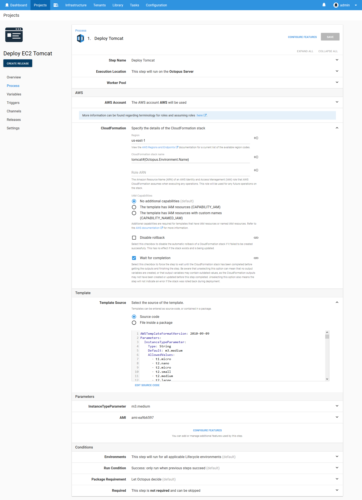
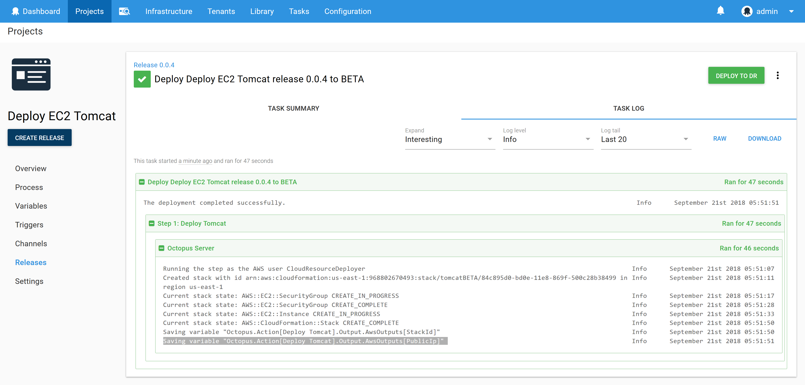
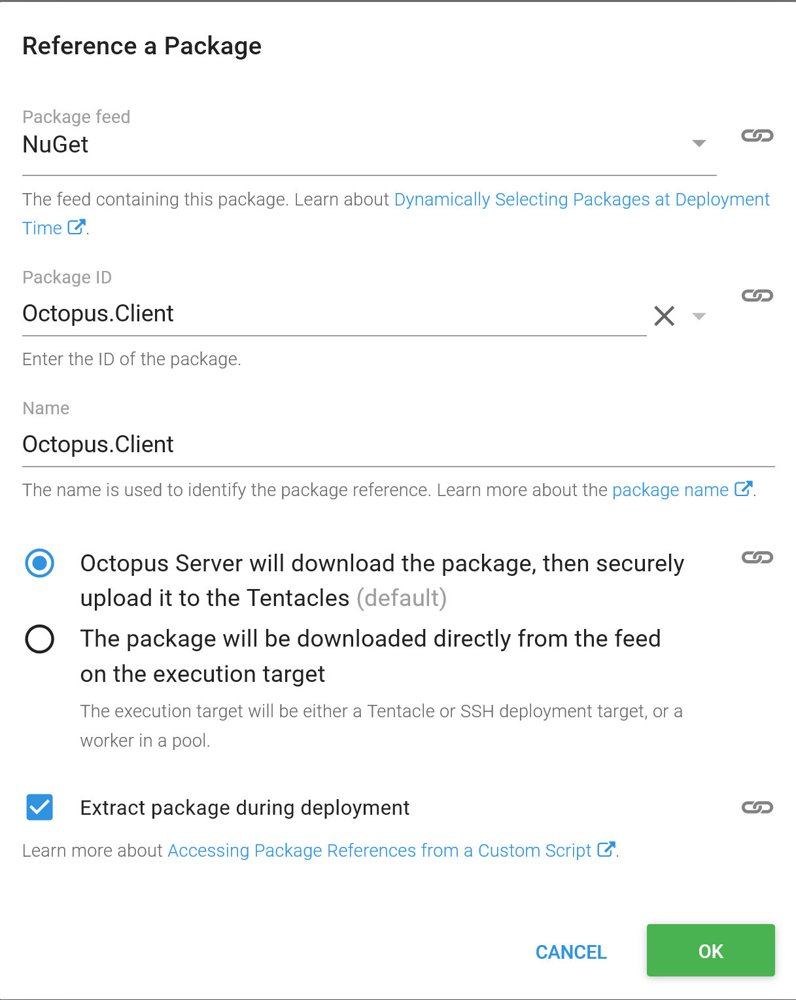
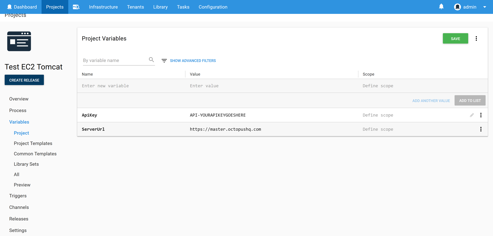
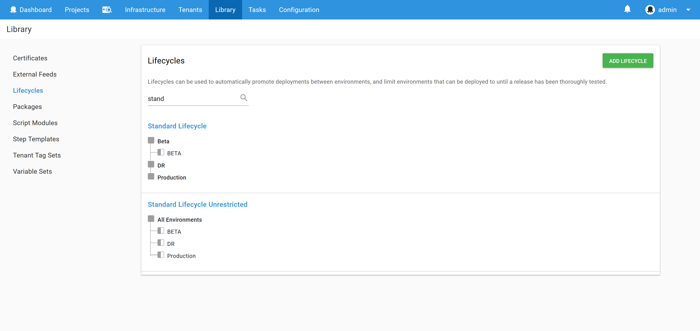
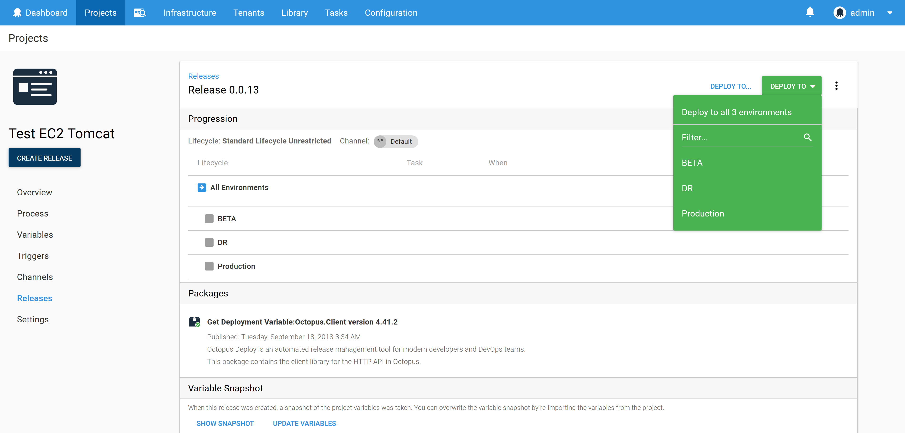
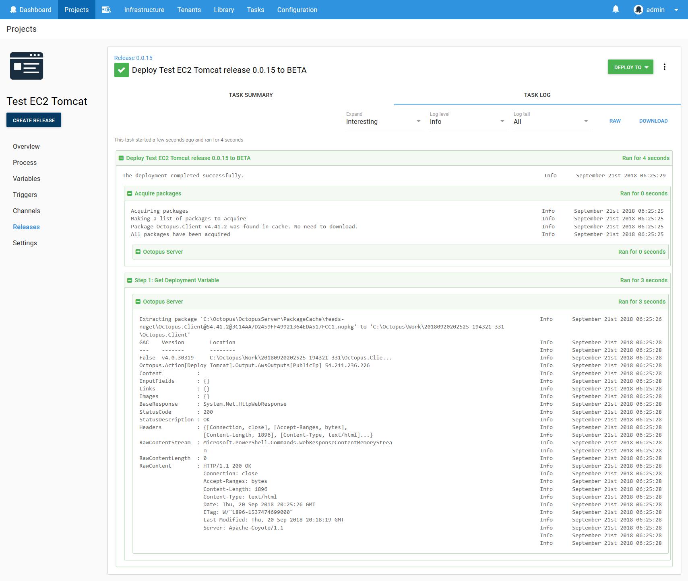

A question that came up during the NDC conference in Sydney this year was how to run UI tests against previous deployments to various environments. The tests were not necessarily part of the deployment process, but could be run manually or on a separate schedule. Despite not being a deployment as such, it would be convenient to run tests from Octopus as Octopus has all the information about where applications have been deployed.

So at a high level the problem was this:
1. Deploy an application to an environment.
2. The deployment results in a URL.
3. At some other point after the deployment has completed, start a UI test against the last deployment.

To demonstrate this use case, we'll start by deploying a CloudFormation template to AWS which creates an EC2 instance with a public IP address. The EC2 instance will run Tomcat to simulate a web server that can be tested.

The following YAML file can be used with the `Deploy an AWS CloudFormation template` step to spin up an Ubuntu instance with Tomcat 8 installed.

```yaml
AWSTemplateFormatVersion: 2010-09-09
Parameters:
  InstanceTypeParameter:
    Type: String
    Default: m3.medium
    AllowedValues:
      - t1.micro
      - t2.nano
      - t2.micro
      - t2.small
      - t2.medium
      - t2.large
      - m1.small
      - m1.medium
      - m1.large
      - m1.xlarge
      - m2.xlarge
      - m2.2xlarge
      - m2.4xlarge
      - m3.medium
      - m3.large
      - m3.xlarge
      - m3.2xlarge
      - m4.large
      - m4.xlarge
      - m4.2xlarge
      - m4.4xlarge
      - m4.10xlarge
      - c1.medium
      - c1.xlarge
      - c3.large
      - c3.xlarge
      - c3.2xlarge
      - c3.4xlarge
      - c3.8xlarge
      - c4.large
      - c4.xlarge
      - c4.2xlarge
      - c4.4xlarge
      - c4.8xlarge
      - g2.2xlarge
      - g2.8xlarge
      - r3.large
      - r3.xlarge
      - r3.2xlarge
      - r3.4xlarge
      - r3.8xlarge
      - i2.xlarge
      - i2.2xlarge
      - i2.4xlarge
      - i2.8xlarge
      - d2.xlarge
      - d2.2xlarge
      - d2.4xlarge
      - d2.8xlarge
      - hi1.4xlarge
      - hs1.8xlarge
      - cr1.8xlarge
      - cc2.8xlarge
      - cg1.4xlarge
    Description: Enter instance size. Default is m3.medium.
  AMI:
    Type: String
    Default: ami-ea9b6597
    Description: AMI Image
Resources:
  InstanceSecurityGroup:
    Type: AWS::EC2::SecurityGroup
    Properties:
      GroupDescription: Enable SSH access via port 22, and open web port 8080
      SecurityGroupIngress:
      - IpProtocol: tcp
        FromPort: '22'
        ToPort: '22'
        CidrIp: '0.0.0.0/0'
      - IpProtocol: tcp
        FromPort: '8080'
        ToPort: '8080'
        CidrIp: '0.0.0.0/0'
  Ubuntu:
    Type: 'AWS::EC2::Instance'
    Properties:
      ImageId: !Ref AMI
      InstanceType:
        Ref: InstanceTypeParameter
      KeyName: DukeLegion
      SecurityGroups:
        - Ref: InstanceSecurityGroup
      Tags:
        -
          Key: Name
          Value: Ubuntu with Tomcat
      UserData:
        Fn::Base64: |
          #cloud-boothook
          #!/bin/bash
          sudo apt-get update
          sudo apt-get install -y tomcat8
          sudo service tomcat8 start
Outputs:
  PublicIp:
    Value:
      Fn::GetAtt:
      - Ubuntu
      - PublicIp
    Description: Server's PublicIp Address
```

Here is a screenshot of the step in Octopus.



Running this step results in the public IP of the new EC2 instance being saved as a variable. In the log output generated by the step you can see the text `Saving variable "Octopus.Action[Deploy Tomcat].Output.AwsOutputs[PublicIp]"`, which documents how this variable can be accessed.



Such variables are quite trivial to consume in subsequent steps. But in this use case we want to access these variables at a later time, not as part of the current deployment.

To demonstrate running a test using a URL generated from a previous deployment, we'll create a second Octopus project. This project will contain a single script step with the following Powershell. This script takes advantage of the Octopus client library to interrogate the details of a deployment.

Although this code is being run in Octopus in this example, it could also be run externally if need. Just be sure to provide alternatives to the `$ServerUrl`, `$ApiKey` and `$OctopusParameters["Octopus.Environment.Name"]` variables, as these are provided by Octopus.

```PowerShell
[Reflection.Assembly]::LoadFrom("Octopus.Client\lib\net45\Octopus.Client.dll")

$endpoint = new-object Octopus.Client.OctopusServerEndpoint($ServerUrl, $ApiKey)
$repository = new-object Octopus.Client.OctopusRepository($endpoint)

$project = $repository.Projects.FindByName("Deploy EC2 Tomcat");
$env = $repository.Environments.FindByName($OctopusParameters["Octopus.Environment.Name"]);
$progression = $repository.Projects.GetProgression($project);
$item = $progression.Releases |
	% { $_.Deployments.Values } |
    % { $_ } |
    ? { $_.EnvironmentId -eq $env.Id } |
    Sort-Object -Property CompletedTime -Descending |
    Select-Object -first 1

$deployment = $repository.Deployments.Get($item.DeploymentId);
$variables = $repository.VariableSets.Get($deployment.ManifestVariableSetId);
$publicIp = $variables.Variables |
	? {$_.Name.Contains("Octopus.Action[Deploy Tomcat].Output.AwsOutputs[PublicIp]")}  |
    Select-Object -first 1

Write-Host "$($publicIp.Name) $($publicIp.Value)"

invoke-webrequest "http://$($publicIp.Value):8080" -DisableKeepAlive -UseBasicParsing -Method head
```

Notice that we have loaded the Octopus client library with the code `[Reflection.Assembly]::LoadFrom("Octopus.Client\lib\net45\Octopus.Client.dll")`. This dll file has been exposed by a new feature in Octopus 2018.8 that [allows additional packages to be included in a script step](https://octopus.com/blog/script-step-packages). We take advantage of this to download the `Octopus.Client` package and extract it so our Powershell code can load the dll.



The `$ServerUrl` and `$ApiKey` variables are defined in the project. You can find more information on generating API keys from the [documentation](https://octopus.com/docs/api-and-integration/api/how-to-create-an-api-key).



For convenience you may want to be able to run this script against any environment at any time. A typical Octopus lifecycle involves deployments through testing and internal environments before getting to production. When running a test though you may want to run it in production directly.

To enable this we create a lifecycle with a single phase that contains all environments. This means that the deployment process can target any environment in any order.

In the screenshot below we have the application deployment lifecycle called `Standard Lifecycle`, and the testing lifecycle called `Standard Lifecycle Unrestricted`. Notice that the unrestricted lifecycle has all environments in a single phase.

You can find more information about lifecycles in the [documentation](https://octopus.com/docs/deployment-process/lifecycles).



The effect of this unrestricted lifecycle is that you get a drop down list of environments to deploy to.



At this point we can deploy the test script against any environment at any time we wish. The Powershell code will interrogate the last deployment to find the IP address of the EC2 instance, and use that as the target for the test.



This was a simple example of how to get the details of a previous deployment to run a trivial network test. But there is so much more you could do. Some examples might be:
* Use a [worker pool](https://octopus.com/docs/infrastructure/workers/worker-pools) with workers in different regions to simulate connections tests from international customers.
* Use [scheduled triggers](https://octopus.com/docs/deployment-process/project-triggers/scheduled-project-trigger) to run automated tests overnight.
* Use [step conditions](https://octopus.com/docs/deployment-process/conditions#run-condition) to generate Slack or email notifications to report any errors with the test.
