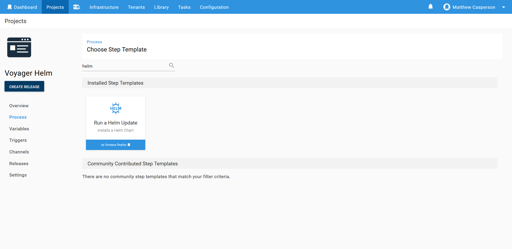
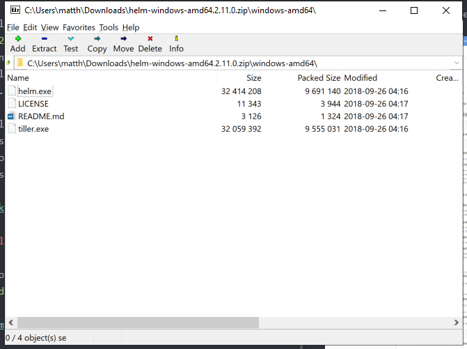
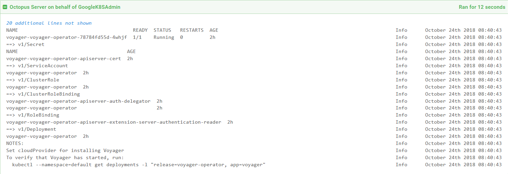
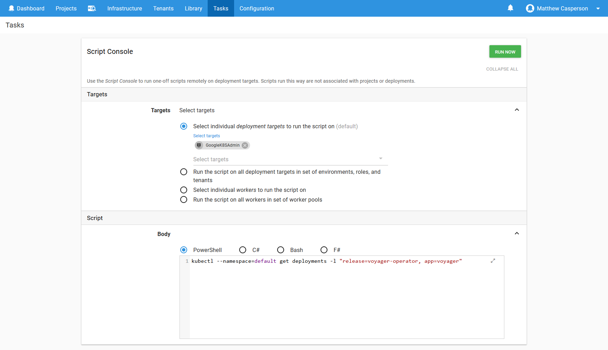
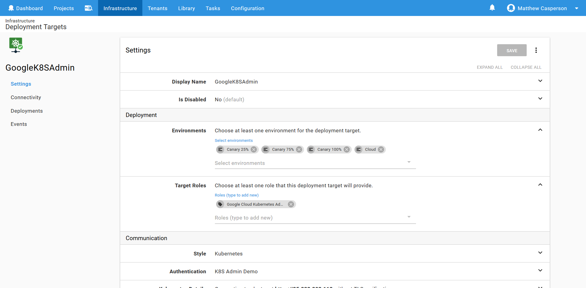
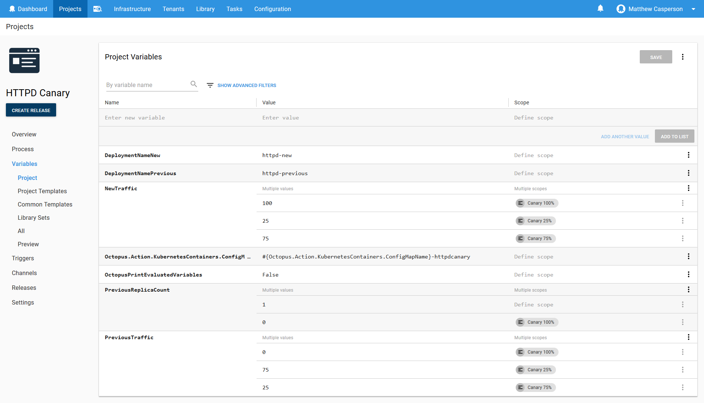

When rolling out new versions of an application it can be useful to direct a small amount of traffic to the new version and watch for any errors. This strategy, known as a canary deployment, means that any errors that may be present in the new version can only affect a small number of users. Incrementally increasing the amount of traffic to the new version provides an increasing degree of confidence that there are no issues, and the deployment can be rolled back to the previous version if any issues arise.

Kubernetes is particularly well suited to canary deployments thanks to the flexibility it provides for managing deployments and directing traffic. In this blog post we'll look at how canary deployments can be achieved using the [Voyager ingress controller](https://appscode.com/products/voyager) and Octopus.

## Prerequisites

To follow along with this blog post you will need to have a Kubernetes cluster, and a Kubernetes target in Octopus configured with administrative credentials. I'll be using a Google Cloud Kubernetes cluster, and an admin Kubernetes target with the `Google Cloud Kubernetes Admin` role.

The Kubernetes cluster will also need to have Helm installed. Google offers [these instructions](https://cloud.google.com/community/tutorials/nginx-ingress-gke#install-helm-in-cloud-shell) for installing Helm into their Kubernetes cluster.

## Installing Voyager

Before we can start deploying any application to Kubernetes, we need to install Voyager to our cluster. Voyager offers many [different installation methods](https://appscode.com/products/voyager/5.0.0/setup/), but I find Helm to be the most convenient for situations like this.

Well make use of the Helm step in Octopus itself to deploy the Voyager Helm chart.

### The External Feed

The first step is to create an external feed pointing to the [AppsCode Charts Repository](https://github.com/appscode/charts). External feeds can be found under Library -> External Feeds.

### The Helm Executable

Helm is quite strict on what versions of the client can work with a particular version on the server. So unlike a tool like `kubectl`, you are often forced to use exactly the same client version of the `helm` executable as is installed on the server.

To accommodate this need for exact matches, the Helm step in Octopus allows an executable from a package to be used when deploying the chart.

To get a packaged version of the `helm` executable, head over to the [Helm GitHub releases page](https://github.com/helm/helm/releases) and download the binary for your platform. Unless you are using workers, your platform is probably Windows.

This will download a file called something like `helm-v2.11.0-windows-amd64.zip`. Rename it to something like `helm-windows-amd64.2.11.0.zip`, as this file format works better with the Octopus built in feed.

Then upload the file to the build in feed, which can be accessed via Library -> Packages. In the screenshot below you can see that I have uploaded the `helm` binaries for both Windows and Linux.

### Deploying the Helm Chart

To deploy the Voyager Helm chart, we use the `Run a Helm Update` step in Octopus.

The screenshot below shows the populated step.

There are a few settings of interest in this step. The first is the `Helm Client Tool` configuration. I've used the `Custom packaged helm client tool` option, and pointed it to the Helm binary package we uploaded to the built in feed earlier. The `Helm executable location` of `windows-amd64/helm.exe` refers to the `helm.exe` file in the archive. In the screenshot below you can see the directory structure of the archive.

We also set two values on the Helm chart in the `Explicit Key Values` section. The `cloudProvider` setting is set to `gce` because I am deploying to the Google Cloud environment. Other options are:

* acs
* aws
* azure
* baremetal
* gce
* gke
* minikube
* openstack

The `rbac.create` value is set to `true` because my Kubernetes cluster has RBAC enabled.

The logs from the deployment helpfully gives us a command we can run to verify the installation. In my case the command is `kubectl --namespace=default get deployments -l "release=voyager-operator, app=voyager" `.

We can run these ad-hoc commands through the Octopus Script Console, which can be access via Task -> Script Console.

Here I have run the command against the Kubernetes administrative target called `GoogleK8SAdmin`.

The results show that Voyager is installed and ready.

:::success
Running ad-hoc scripts via Octopus has a number of advantages, such as being able to run commands against different targets without the hassle of configuring the context locally, as well as providing a history of the scripts that have been run.
:::

### The Canary Environments

We'll model the progression of the canary deployments as Octopus environments. Doing so has a number of advantages, such as displaying the current progression on the dashboard, and allowing easy rollbacks to previous states.

Environments can be found under Infrastructure -> Environments.

For this blog we'll have three environments: `Canary 25%`, `Canary 75%` and `Canary 100%`. Each represents the increasing amount of traffic that will directed to the canary deployment.

It is important that these environments allow `Dynamic Infrastructure`, as we'll take advantage of this to create our restricted Kubernetes targets rather than using the administrative one for all deployments.

To progress our application through these environments, we'll create a Lifecycle with three phases, one for each of the canary environments.

Lifecycles can be found under Library -> Lifecycles.

Finally, ensure the Kubernetes administrative target can access the canary environments by adding them to the `Environments` field.

### The Deployment Project

We now have all the infrastructure in place to start deploying our application. So the next step is to create a new deployment project to push an application container to Kubernetes.

For this example we'll use the HTTPD image, which is a web server that we'll configure to display a custom web page showing the version of the image that was deployed. By displaying the version as a web page, we can observe web traffic being directed to the canary release in increasing percentages.

We'll start by defining some variables that we will be used by the deployment process.

| Variable | Purpose | Value |
|-|-|-|
| DeploymentNameNew  | The name of the new (or canary) Deployment resource | httpd-new |
| DeploymentNamePrevious  | The name of the previous Deployment resource   | httpd-previous |
| NewTraffic  | The traffic to be directed to the new Deployment resource  |  100 (scoped to the `Canary 100%` environment), 75 (scoped to the `Canary 75%` environment), 25 (scoped to the `Canary 25%` environment) |
| PreviousTraffic   |  The opposite of NewTraffic |  0 (scoped to the `Canary 100%` environment), 25 (scoped to the `Canary 75%` environment), 75 (scoped to the `Canary 25%` environment) |
| Octopus.Action.KubernetesContainers.ConfigMapNameTemplate  | A custom template to generate the name of ConfigMap resources created with a Deployment resource  |  #{Octopus.Action.KubernetesContainers.ConfigMapName}-httpdcanary  |
|PreviousReplicaCount   | The pod count for the previous deployment  |  1, 0 (scoped to the `Canary 100%` environment) |
|OctopusPrintEvaluatedVariables   | Allows variables to be displayed in the logs   | False (but can be set to True if additional debugging is required)   |

