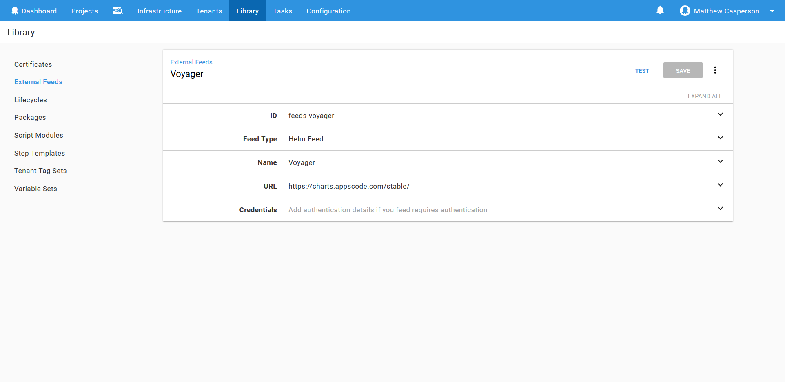
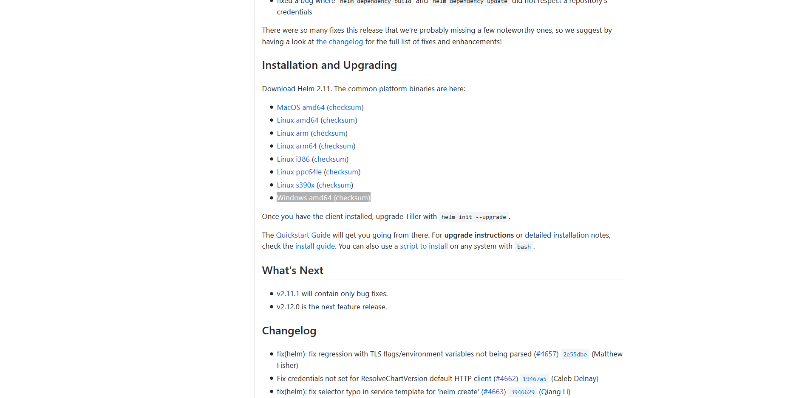
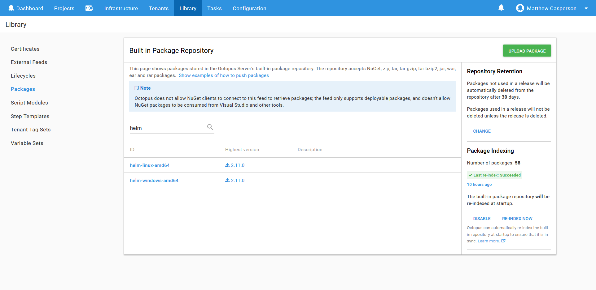
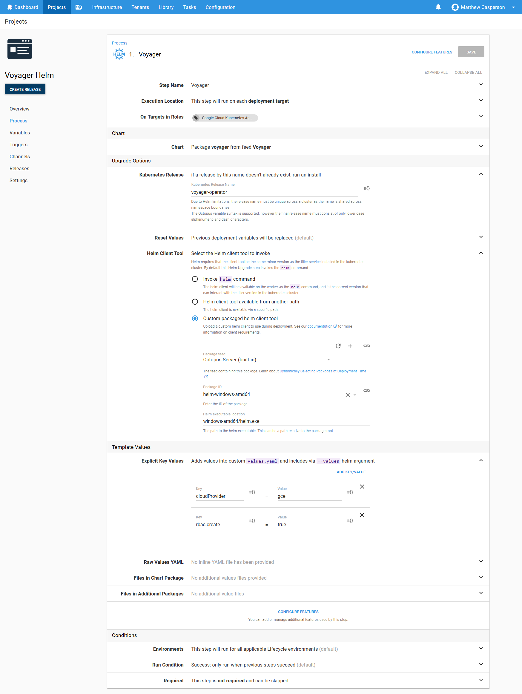
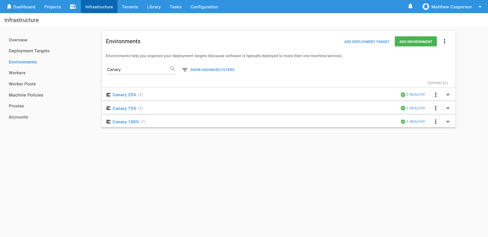
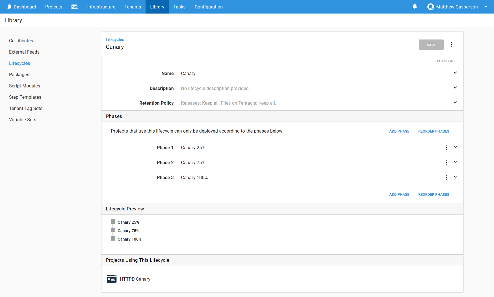
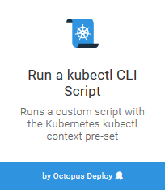

When rolling out new versions of an application it can be useful to direct a small amount of traffic to the new version and watch for any errors. This strategy, known as a canary deployment, means that any errors that may be present in the new version can only affect a small number of users. Incrementally increasing the amount of traffic to the new version provides an increasing degree of confidence that there are no issues, and the deployment can be rolled back to the previous version if any issues arise.

Kubernetes is particularly well suited to canary deployments thanks to the flexibility it provides for managing deployments and directing traffic. In this blog post we'll look at how canary deployments can be achieved using the [Voyager ingress controller](https://appscode.com/products/voyager) and Octopus.

## Prerequisites

To follow along with this blog post you will need to have a Kubernetes cluster, and a Kubernetes target in Octopus configured with administrative credentials. I'll be using a Google Cloud Kubernetes cluster, and an admin Kubernetes target with the `Google Cloud Kubernetes Admin` role.

The Kubernetes cluster will also need to have Helm installed. Google offers [these instructions](https://cloud.google.com/community/tutorials/nginx-ingress-gke#install-helm-in-cloud-shell) for installing Helm into their Kubernetes cluster.

## Installing Voyager

Before we can start deploying any application to Kubernetes, we need to install Voyager to our cluster. Voyager offers many [different installation methods](https://appscode.com/products/voyager/5.0.0/setup/), but I find Helm to be the most convenient for situations like this.

Well make use of the Helm step in Octopus itself to deploy the Voyager Helm chart.

### The External Feed

The first step is to create an external feed pointing to the [AppsCode Charts Repository](https://github.com/appscode/charts). External feeds can be found under Library -> External Feeds.



### The Helm Executable

Helm is quite strict on what versions of the client can work with a particular version on the server. So unlike a tool like `kubectl`, you are often forced to use exactly the same client version of the `helm` executable as is installed on the server.

To accommodate this need for exact matches, the Helm step in Octopus allows an executable from a package to be used when deploying the chart.

To get a packaged version of the `helm` executable, head over to the [Helm GitHub releases page](https://github.com/helm/helm/releases) and download the binary for your platform. Unless you are using workers, your platform is probably Windows.



This will download a file called something like `helm-v2.11.0-windows-amd64.zip`. Rename it to something like `helm-windows-amd64.2.11.0.zip`, as this file format works better with the Octopus built in feed.

Then upload the file to the build in feed, which can be accessed via Library -> Packages. In the screenshot below you can see that I have uploaded the `helm` binaries for both Windows and Linux.



### Deploying the Helm Chart

To deploy the Voyager Helm chart, we use the `Run a Helm Update` step in Octopus.


The screenshot below shows the populated step.



There are a few settings of interest in this step. The first is the `Helm Client Tool` configuration. I've used the `Custom packaged helm client tool` option, and pointed it to the Helm binary package we uploaded to the built in feed earlier. The `Helm executable location` of `windows-amd64/helm.exe` refers to the `helm.exe` file in the archive. In the screenshot below you can see the directory structure of the archive.


We also set two values on the Helm chart in the `Explicit Key Values` section. The `cloudProvider` setting is set to `gce` because I am deploying to the Google Cloud environment. Other options are:

* acs
* aws
* azure
* baremetal
* gce
* gke
* minikube
* openstack

The `rbac.create` value is set to `true` because my Kubernetes cluster has RBAC enabled.

The logs from the deployment helpfully gives us a command we can run to verify the installation. In my case the command is `kubectl --namespace=default get deployments -l "release=voyager-operator, app=voyager" `.


We can run these ad-hoc commands through the Octopus Script Console, which can be access via Task -> Script Console.

Here I have run the command against the Kubernetes administrative target called `GoogleK8SAdmin`.


The results show that Voyager is installed and ready.


:::success
Running ad-hoc scripts via Octopus has a number of advantages, such as being able to run commands against different targets without the hassle of configuring the context locally, as well as providing a history of the scripts that have been run.
:::

### The Canary Environments

We'll model the progression of the canary deployments as Octopus environments. Doing so has a number of advantages, such as displaying the current progression on the dashboard, and allowing easy rollbacks to previous states.

Environments can be found under Infrastructure -> Environments.

For this blog we'll have three environments: `Canary 25%`, `Canary 75%` and `Canary 100%`. Each represents the increasing amount of traffic that will directed to the canary deployment.



It is important that these environments allow `Dynamic Infrastructure`, as we'll take advantage of this to create our restricted Kubernetes targets rather than using the administrative one for all deployments.


To progress our application through these environments, we'll create a Lifecycle with three phases, one for each of the canary environments.

Lifecycles can be found under Library -> Lifecycles.



Finally, ensure the Kubernetes administrative target can access the canary environments by adding them to the `Environments` field.


### The Deployment Project

We now have all the infrastructure in place to start deploying our application. So the next step is to create a new deployment project to push an application container to Kubernetes.

For this example we'll use the HTTPD image, which is a web server that we'll configure to display a custom web page showing the version of the image that was deployed. By displaying the version as a web page, we can observe web traffic being directed to the canary release in increasing percentages.

#### The Variables

We'll start by defining some variables that we will be used by the deployment process.

| Variable | Purpose | Value |
|-|-|-|
| DeploymentNameNew  | The name of the new (or canary) Deployment resource | httpd-new |
| DeploymentNamePrevious  | The name of the previous Deployment resource   | httpd-previous |
| NewTraffic  | The traffic to be directed to the new Deployment resource  |  100 (scoped to the `Canary 100%` environment), 75 (scoped to the `Canary 75%` environment), 25 (scoped to the `Canary 25%` environment) |
| PreviousTraffic   |  The opposite of NewTraffic |  0 (scoped to the `Canary 100%` environment), 25 (scoped to the `Canary 75%` environment), 75 (scoped to the `Canary 25%` environment) |
| Octopus.Action.KubernetesContainers.ConfigMapNameTemplate  | A custom template to generate the name of ConfigMap resources created with a Deployment resource  |  #{Octopus.Action.KubernetesContainers.ConfigMapName}-httpdcanary  |
|PreviousReplicaCount   | The pod count for the previous deployment  |  1, 0 (scoped to the `Canary 100%` environment) |
|OctopusPrintEvaluatedVariables   | Allows variables to be displayed in the logs   | False (but can be set to True if additional debugging is required)   |


#### Create the Target

The first step in the process is a `Run a kubectl CLI Script` step.



The purpose of this step is to create a Kubernetes target with permissions limited to a single namespace. We'll use this new Kubernetes target to deploy the various resources that make up our application, as opposed to always deploying resources using a administrative account. Using a limited account gives us a degree of security and limits the potential damage that a misconfigured step can cause in our cluster.

Having said that, this step is run with the administrative Kubernetes target, because we have to start somewhere.

The PowerShell code below is used to create the Kubernetes service account, extract the token that is created with the account, use the token to create an Octopus token account, and use the token account to create a Kubernetes target.

```
# The account name is the project and tenant
$projectNameSafe = $($OctopusParameters["Octopus.Project.Name"] -replace "[^A-Za-z0-9]","")
$accountName = if (![string]::IsNullOrEmpty($OctopusParameters["Octopus.Deployment.Tenant.Id"])) {
    $projectNameSafe + "-" + `
    $($OctopusParameters["Octopus.Deployment.Tenant.Name"] -replace "[^A-Za-z0-9]","")
} else {
    $projectNameSafe
}

# The namespace is the acocunt name, but lowercase
$namespace = $accountName.ToLower()
# The project name is used for a number of k8s names, which must be lowercase
$projectNameSafeLower = $projectNameSafe.ToLower()
#Save the namespace for other steps
Set-OctopusVariable -name "Namespace" -value $namespace
Set-OctopusVariable -name "AccountName" -value $accountName

Set-Content -Path serviceaccount.yml -Value @"
---
kind: Namespace
apiVersion: v1
metadata:
  name: $namespace
---
apiVersion: v1
kind: ServiceAccount
metadata:
  name: $projectNameSafeLower-deployer
  namespace: $namespace
---
kind: Role
apiVersion: rbac.authorization.k8s.io/v1
metadata:
  namespace: $namespace
  name: $projectNameSafeLower-deployer-role
rules:
- apiGroups: ["", "extensions", "apps"]
  resources: ["deployments", "replicasets", "pods", "services", "ingresses", "secrets", "configmaps", "namespaces"]
  verbs: ["get", "list", "watch", "create", "update", "patch", "delete"]
- apiGroups: ["voyager.appscode.com"]
  resources: ["ingresses"]
  verbs: ["get", "list", "watch", "create", "update", "patch", "delete"]
---
kind: RoleBinding
apiVersion: rbac.authorization.k8s.io/v1
metadata:
  name: $projectNameSafeLower-deployer-binding
  namespace: $namespace
subjects:
- kind: ServiceAccount
  name: $projectNameSafeLower-deployer
  apiGroup: ""
roleRef:
  kind: Role
  name: $projectNameSafeLower-deployer-role
  apiGroup: ""
"@

kubectl apply -f serviceaccount.yml

$data = kubectl get secret $(kubectl get serviceaccount "$projectNameSafeLower-deployer" -o jsonpath="{.secrets[0].name}" --namespace=$namespace) -o jsonpath="{.data.token}" --namespace=$namespace
$Token = [System.Text.Encoding]::ASCII.GetString([System.Convert]::FromBase64String($data))

New-OctopusTokenAccount `
    -name $accountName `
    -token $Token `
    -updateIfExisting

New-OctopusKubernetesTarget `
    -name $accountName `
    -clusterUrl #{Octopus.Action.Kubernetes.ClusterUrl} `
    -octopusRoles "HTTPD" `
    -octopusAccountIdOrName $accountName `
    -namespace $namespace `
    -updateIfExisting `
    -skipTlsVerification True
```

The end result of running the script is a new Kubernetes target called `HTTPDCanary` (after the name of the project) with a role of `HTTPD` targetting the Kubernetes namespace `httpdcanary` (also after the name of the project, but lowercase because Kubernetes only allows lowercase characters in its names).


:::success
The PowerShell function `New-OctopusKubernetesTarget` only works if the environment in which it is run allows dynamic targets, which is why our `Canary ##%` environments were configured to allow that.
:::

#### Create the Previous Deployment Resource

The second step is a `Deploy Kubernetes containers` step.


We'll use this step to deploy the "stable" version of the application. This is the version that the canary version will eventually replace.

This step will run on behalf of any target with the role `HTTPD`, which as you recall from the previous step is the role that we assigned to the new Kubernetes target. By performing the deployment in the context of the limited Kubernetes target, we can be sure that our deployment step will not be able to delete or modify anything outside of the namespace `httpdcanary`.


The `Deployment` section configures some high level details out the Deployment resource.

The `Deployment name` field references the `DeploymentNamePrevious` variable we configured earlier.

The `Replica` field references the `PreviousReplicaCount` variable. The `PreviousReplicaCount` variable is set to 1 by default, and 0 when deploying to the `Canary 100%` environment. This is because the `Canary 100%` environment will direct all traffic to the new version of the application, and the previous version no longer needs any Pod resources, as they will not receive any traffic.

We also define a label with a key of `app` and a value of `httpd`. The labels defined here will be applied to the Deployment resource and the Pod resources that the Deployment resource created. These labels will be used later on to select the pods from a Service resource.


The `Deployment strategy` section has been left with the default option of `Recreate deployments`.

In reality the selection of deployment strategy doesn't play a role in our deployments, because instead of updating a Deployment resource in place we are deploying two resources side by side. We are implementing the canary deployment pattern ourselves, not using the standard patterns provided by Kubernetes.


In the `Volumes` section we need to map an item from the ConfigMap we'll create later on called `index` to a file called `index.html`. The ConfigMap will hold some custom content that is exposed to our container as a file called `index.html`, which in turn will be presented by HTTPD.


Next is the `Containers` section, where we add a single container.

The container and the image deploys are both called `httpd`.


Being a web server, HTTPD exposed port 80.


Inside the container we mount the volume defined earlier to the path `/usr/local/apache2/htdocs`. That path is where HTTPD looks for content to serve up. And because we exposed the ConfigMap item called `index` as a file called `index.html`, we end up with a file called `/usr/local/apache2/htdocs/index.html` mounted in our container.


With those values set, we will see a container summary like the following.


In the `Pod Annotations` section we define an annotation called `ingress.appscode.com/backend-weight` with the value from the variable `PreviousTraffic`. The `PreviousTraffic` variable is either `0`, `25` or `75` depending on the environment we are deploying to.

The annotation is a [recognized by the Voyager ingress controller](https://appscode.com/products/voyager/5.0.0/guides/ingress/http/blue-green-deployment/) as defining the amount of traffic to send to the Pod resource.

So, when deploying to the `Canary 25%` environment, `PreviousTraffic` is set to `75`, meaning the previous deployment will receive 75% of the traffic.


In the ConfigMap feature we build up the ConfigMap resource that will ultimately provide the content for the `index.html` file.

The name of the ConfigMap is set to `#{DeploymentNamePrevious}-configmap`, and we add a single item called `index` with the value `#{Octopus.Action[HTTPD Old].Package[httpd].PackageVersion}`.

The variable `Octopus.Action[HTTPD Old].Package[httpd].PackageVersion` will hold the version of the httpd image that this container is deploying. So what we will see if that HTTPD is serving up a file that contains the version of the Docker image. This [blog](https://octopus.com/blog/octopus-release-2018.8) post has more information on these variables.


#### ConfigMap Name Templates

If you look back at the variables we added to this project, you will notice that we defined one called `Octopus.Action.KubernetesContainers.ConfigMapNameTemplate`. This variable impacts how this ConfigMap is managed during a deployment.

Normally Octopus environments are separate, and used to represent a distinct progression from testing to production. Which is to say that deploying to a testing environment does not impact a production environment, and vis versa.

We have used environments a little differently here. Instead of a distinct and separate environments, our environments represent the gradual change in the amount of traffic being directed to a new, or canary, version.

This is a subtle but significant distinction, because it means that the `Canary 25%` environment is the same logical environment as the `Canary 75%` environment. This means that the deployment to the `Canary 75%` environment overwrites the deployment to the `Canary 25%` environment.

However, the Kubernetes steps are configured with an assumption that environments are distinct. One implication of this assumption is that when we deploy a ConfigMap resource as part of the container step to the `Canary 25%` environment, it will have a unique name that will not be overwritten when we deploy the ConfigMap again to the `Canary 75%` environment. Not overwriting resources makes sense normally as you move from testing to production, but in our case we do want resources to be overwritten.

Overwriting the ConfigMap resource is prevented by giving it a unique name with each deployment. By default, this unique name is generated by appending the Octopus deployment ID to the end of the name.

For example, we gave the ConfigMap a name of `#{DeploymentNamePrevious}-configmap`, which will resolve to a name of `http-previous-configmap`. During deployment this name is combined with the deployment id to produce a unqiue name like `http-previous-configmap-deployment-1234`.

However, we do not want unique names. We want names that will be the same between our canary environments, so they resources will be overwritten.

This is why we set the `Octopus.Action.KubernetesContainers.ConfigMapNameTemplate` variable to `#{Octopus.Action.KubernetesContainers.ConfigMapName}-httpdcanary`. This overrides the default behaviour of appending the deployment ID, and instead appends the fixed string `httpdcanary`.

This means our canary environments will deploy a ConfigMap resource called `http-previous-configmap-httpdcanary` every time. And because the name is no longer unique, it will be overwritten in each environment.

We do all of this to prevent old unused ConfigMap resources from filling our namespace. By using a common name between environments, we end up with one ConfigMap per Deployment resource.

#### Create the Canary Deployment Resource

The third step is almost an exact copy of the second. It is here that we deploy the Deployment resource that represents the canary version.

Since this step is so similar to the last one, I'll highlight the differences here.

The `Deployment name` is set to `#{DeploymentNameNew}`, and the `Replicas` is set to a fixed value of `1`.


The `Pod Annotations` value is set to `#{NewTraffic}`.


The ConfigMap name is set to `#{DeploymentNameNew}-configmap`, and the item value is set to `#{Octopus.Action[HTTPD New].Package[httpd].PackageVersion}`.


Otherwise the configuration of the containers, volumes and deployment strategies is the same as the previous step.

#### The Service

The fourth step is to create a Service resource with the `Deploy Kubernetes service resource` step.


Like the container steps before it, this step is deployed in the context of a target with the `HTTPD` role.


We give the service a name of `httpd-service`.


The `Service Type` is set to `Cluster IP`.


The service accepts traffic and directs traffic to port 80.


The service selects the Pod resources it directs traffic to by setting the `Service Selector Labels` to a name of `app` and value of `httpd`. These are the same labels we defined in the previous container steps.


#### The Voyager Ingress Resource

The fifth and final step is to define a Voyager Ingress resource. This resource is a not a standard Kubernetes resource, so we can't use the standard Ingress step in Octopus to deploy it. Instead we use the `Run a kubectl CLI Script` step again to save a YAML file and apply it with the `kubectl` command.

```PowerShell
Set-Content -Path "ingress.yaml" -Value @"
apiVersion: voyager.appscode.com/v1beta1
kind: Ingress
metadata:
  name: httpd-ingress
spec:
  backend:
    serviceName: httpd-service
    servicePort: "80"
"@

kubectl apply -f ingress.yaml
```

## Deploying the Project

Lets create a deployment of this project. As part of the deployment we have the opportunity to select the versions of the Docker images that will be deployed as part of the Deployment resource.

Here I have set the old or previous version to `2.4.18`. In this example, this version represents that last stable version that was deployed.

I then set the new or canary version to `2.4.20`. This represents the new version of the application that I want to incrementally roll out to check for any possible issues.


We'll then deploy this to the `Canary 25%` environment.

## What Have we Just Deployed?

Just configuring these steps, it can be difficult to understand what exactly we are deploying. Once we have deployed this project to the `Canary 25%` environment, we will end up with this:


The Voyager Ingress resource directs traffic to the Service resource, which in turn directs traffic to the two Deployment resources (or technically the Pod resources created by the Deployment resources).

Because of the `ingress.appscode.com/backend-weight` annotations on the Pod resources, Voyager knows to direct 25% of traffic to the canary Pod resources, and 75% to the previous Pod resources.

Once deployed, each Voyager Ingress resource creates an associated Load Balancer Service resource. This load balancer has a public IP address which we can access from a browser. In my case the public IP is 35.194.2.130.


Opening this page in a browser shows the version of HTTPD which is serving the page.

My first page view shows version `2.4.20`. This means I was directed to the canary Pod resources.


After a refresh, I am shown version `2.4.18`. This means I was directed to the previous Pod resources.


As I refresh the page over and over I am presented with version `2.4.18` more often than I am presented with `2.4.20`. This confirms that the majority of the traffic is being directed to the previous version of HTTPD, and only 25% is being directed to the canary pods.

As you would expect, promoting the deployment to the `Canary 75%` environment reverses the traffic proportions. Now 75% of the traffic is being directed to the canary Pod resources.

Promoting to the `Canary 100%` environment then completes our deployment. All traffic is being sent to the canary Pods, and the previous Pod resources have been removed because the `Replicas` value is 0 in the `Canary 100%` environment.

## Reverting a Deployment

The nice thing about representing canary deployments as Octopus environments is that we can revert back to a previous state. Say for example that after deploying to the `Canary 75%` environment, you begin to see network dropouts that were not present when you deployed to the `Canary 25%` environment.

To roll back to the `Canary 25%` environment, open the deployment in Octopus and select the `Deploy to` option from the vertical menu.


Select the `Canary 25%` environment, and click the `Deploy` button.


Octopus will then rerun the deployment, which in turn will restore the canary deployment to a state where 25% of traffic is directed to the new version.

## Starting the Next Canary Deployment

Once we have deployed to the `Canary 100%` environment, our Kubernetes cluster looks like this:


100% of the traffic is being sent to the canary Pod resources, and the previous Pod resources have been scaled down to 0.

Let's start deploying a new version. Now our old or previous version is the last canary version of `2.4.20`. The new or canary version is `2.4.23`.


This new deployment will then:

1. Deploy the previous Deployment resource (currently scaled down to 0) with version `2.4.20`. The annotations configure this deployment to receive 75% of the traffic.
2. Deploy the canary Deployment resource, which is currently configured with version `2.4.20`, with the new version of `2.4.23`. The annotations configure this deployment to receive 25% of the traffic.
3. The Service and Voyager Ingress resources remain unchanged at this point.

The nice thing about this second deployment is that there is little down time. While the deployment from step 1 is taking place, the old canary deployment is still serving traffic. While the deployment for step 2 is taking place, the deployment from step 1 is serving traffic. And after step 3, all traffic is being routed according to the assigned percentages.

## Summary

In this post we looked at how Octopus and the Voyager Ingress Controller con be configured to provide canary deployments in Kubernetes.

By modelling the progression of the canary rollout as environments, we created a solution that could incrementally increase the amount of traffic to a canary version, while providing the possibility of rolling back to a previous state.
