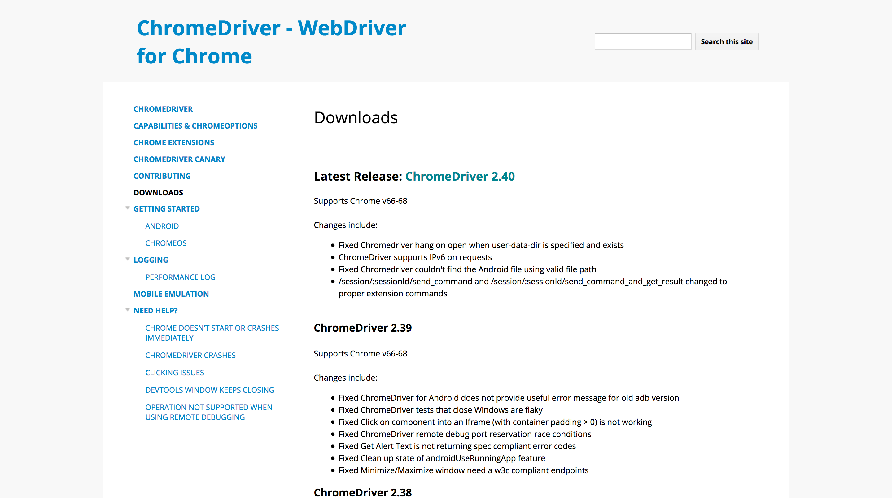
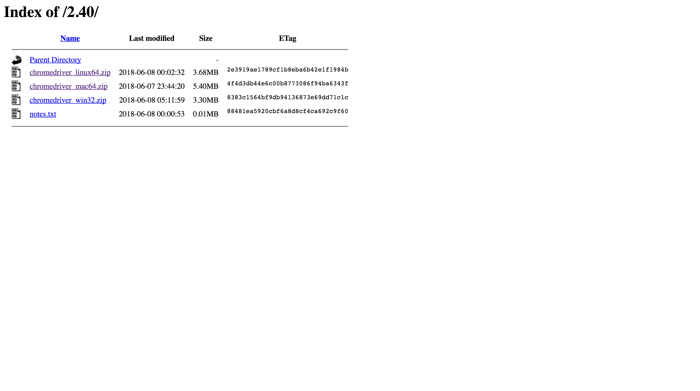
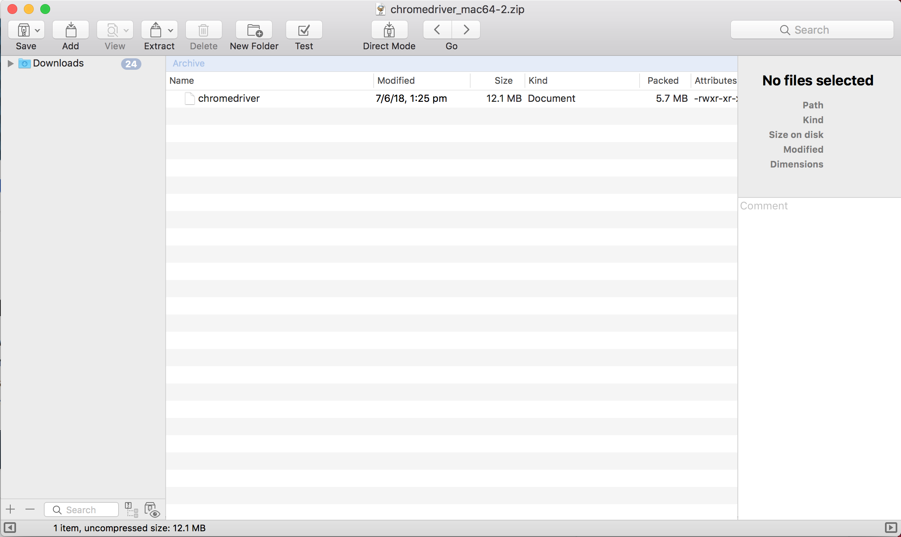
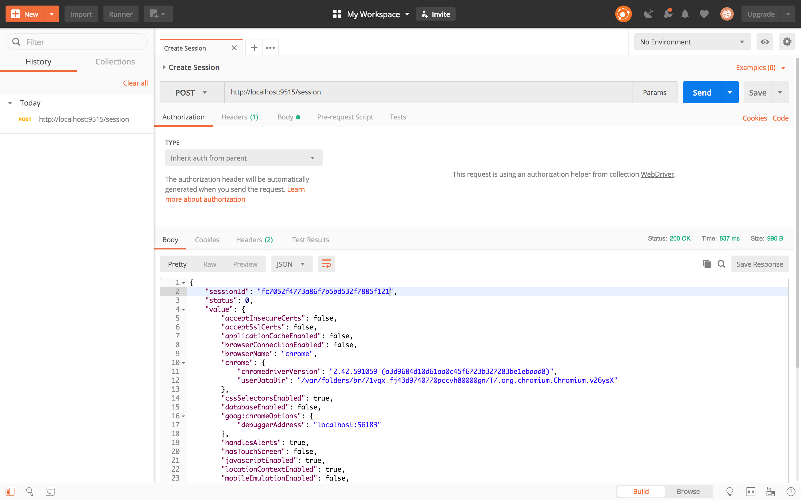
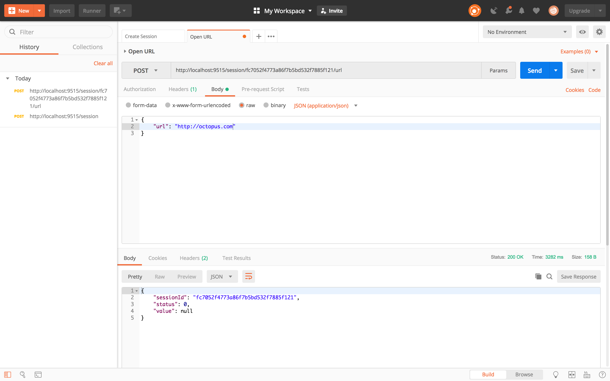
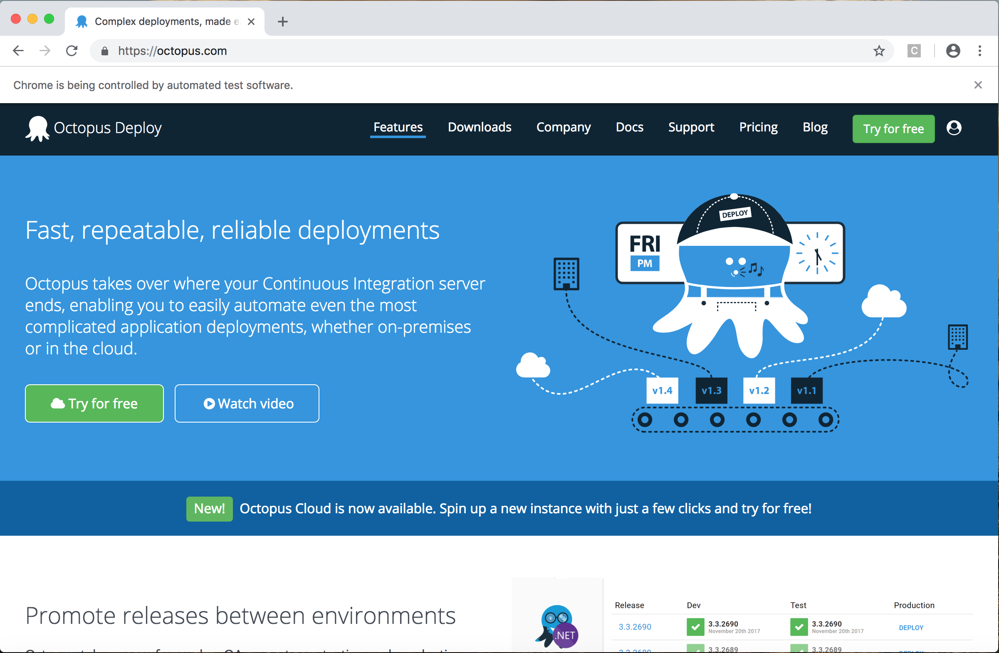
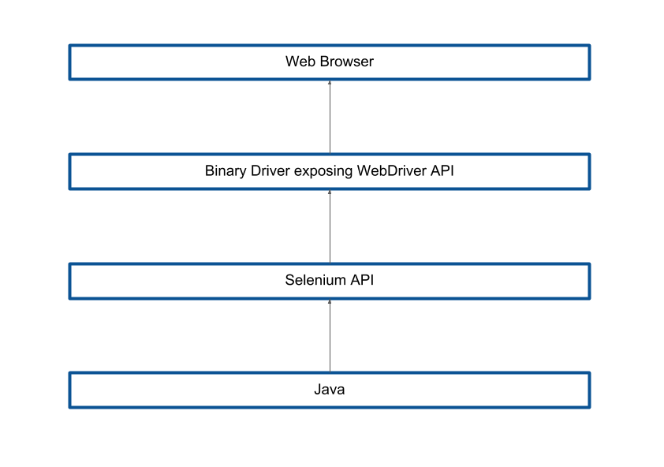

What is WebDriver and Selenium?
===============================

When it comes to testing web applications, you have probably heard of WebDriver and Selenium. Often the two terms are used interchangeably or even combined to refer to the platform on which a developer can write code to interact with a web browser. However, these two terms refer to slightly different things.

Technically, WebDriver is a standard, HTTP based API for interacting with a web browser. The standard is provided by W3C at <https://www.w3.org/TR/webdriver1/>, and is freely available for anyone to implement.

Most browser vendors implement the WebDriver API through an additional executable that is shipped separate to the browser itself. The list below shows where the major browsers provide this binary driver:

-   Chrome: <https://sites.google.com/a/chromium.org/chromedriver/downloads>
-   Firefox: <https://github.com/mozilla/geckodriver/releases>
-   Opera: <https://github.com/operasoftware/operachromiumdriver/releases>
-   IE: <http://selenium-release.storage.googleapis.com/index.html>
-   Edge: <https://developer.microsoft.com/en-us/microsoft-edge/tools/webdriver/>

To see the WebDriver API in action we'll download and run the Chrome binary driver. Open up [https://sites.google.com/a/chromium.org/chromedriver/downloads,](https://sites.google.com/a/chromium.org/chromedriver/downloads) and click the link for the latest release.



Then download the driver for your local operating system.



In my case I am using a Mac, so I download `chromedriver_mac64.zip`. Inside this archive is the driver executable called `chromedriver`. The Windows version is called `chromedriver.exe`.



Extract this file and run it. You will be given the port on which the WebDriver API is exposed.

```
$ ./chromedriver

Starting ChromeDriver 2.40.565386
(45a059dc425e08165f9a10324bd1380cc13ca363) on port 9515

Only local connections are allowed.
```

To interact with the API we need a tool that allows us to make HTTP requests. Here I have used Postman, which is available from <https://www.getpostman.com/>.

The first step is to open the browser. This is done by creating a new
session.

To create a new session via the WebDriver API, we make a HTTP POST request to the `/session` endpoint. In addition we need to define the type of browser that we wish to open, which in this case is chrome. This information is sent in a JSON object in the POST body. In this example we'll open Chrome.

```json
{
	"desiredCapabilities": {
		"browserName": "chrome"
	}
}
```

The response from this request includes a `sessionId`. We can use this to perform additional operation on the browser window we just opened.



The next logical step is to open a URL in the browser. This is done with a HTTP POST request to `/session/<session id>/url`, with the POST body including the URL that is to be opened.

```json
{
	"url": "http://octopus.com"
}
```



This call results in the requested URL being opened in the browser.



At this point you might be feeling somewhat overwhelmed. HTTP calls made by tools like Postman with JSON bodies against a REST API... This is a lot of moving parts, and the process of opening a browser and browsing to a URL was far from simple.

But don't worry. As developers we never need to use the WebDriver API directly, and indeed this will be the first and last time that we look at the WebDriver API directly during this blog series.

From this point on, all the code we write will make use of the Selenium API. Selenium is a library provided by a 3rd party that wraps up all of the WebDriver API HTTP calls that need to be made when interacting with a browser. By exposing the functionality of the WebDriver API through Java classes and interfaces, the Selenium API makes it much easier to write Java applications that interact with a browser.

The diagram below shows the relationship between the browser, the binary driver, the Selenium API and the Java code we will be writing.



Selenium is synonymous with WebDriver because it is by far the most popular way to take advantage of the WebDriver API. I have personally never seen a case in the real world where code was written against the WebDriver API directly. Because of this, the terms WebDriver, Selenium and Selenium WebDriver are used interchangeably to refer to the Selenium API rather than the lower level WebDriver API.

The key take away from this blog is this:

-   The WebDriver API is a low level HTTP interface based on an open standard.

-   The Selenium API is a collection of classes and interfaces that call the WebDriver API.

-   Because it is impractical to use the WebDriver API directly, everyone uses the Selenium API.

-   The terms WebDriver, Selenium and Selenium WebDriver are used interchangeably, and usual refer to the Selenium API.

Now that we know the differences between the WebDriver and Selenium APIs, we can for all practical purposes treat them as one and the same thing. All the code we will write from this point forward will use the Selenium API while discussing how to write WebDriver tests. So while you now know that the WebDriver and Selenium APIs are not *technically* the same thing, we typically refer to "Selenium WebDriver" as the platform through which we interact with a browser.
