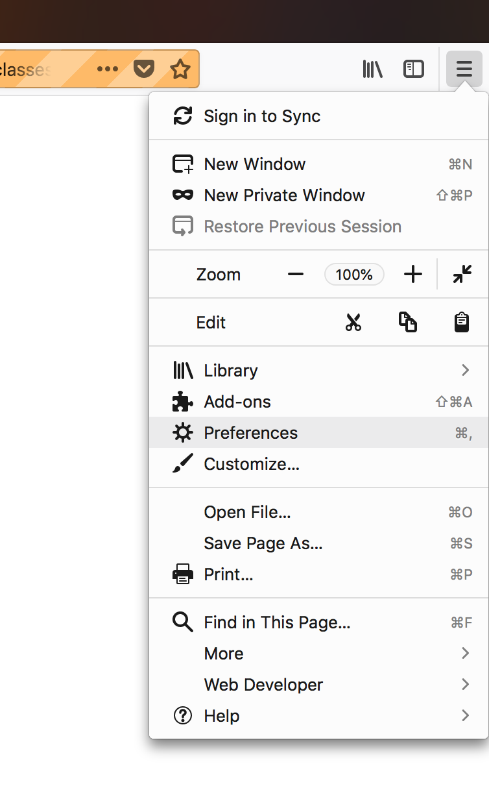
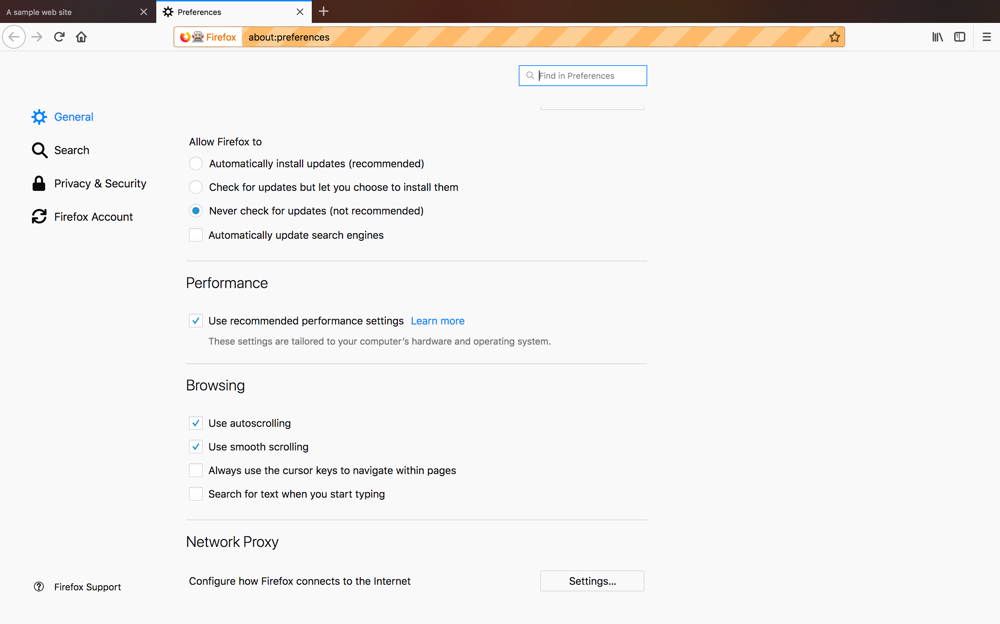
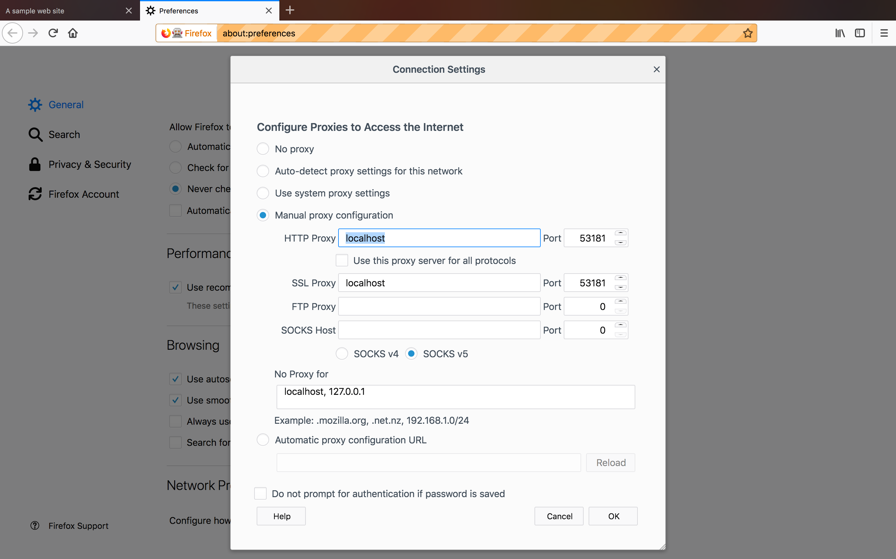

Return to the [table of contents](../0-toc/webdriver-toc.md).

In this post, we will add support for the BrowserMob proxy, which is a free and open source Java proxy server. We will then use BrowserMob to save a report containing all the network requests made during a test and intercept some of the network requests.

To take advantage of the BrowserMob library, we need to add it as a dependency to the Maven `pom.xml` file: 

```xml
<project xmlns="http://maven.apache.org/POM/4.0.0"
xmlns:xsi="http://www.w3.org/2001/XMLSchema-instance"
xsi:schemaLocation="http://maven.apache.org/POM/4.0.0
http://maven.apache.org/xsd/maven-4.0.0.xsd">

  <!-- ... -->

  <properties>
    <!-- ... -->
    <browsermob.version>2.1.5</browsermob.version>
  </properties>

  <dependencies>
    <!-- ... -->

    <dependency>
      <groupId>net.lightbody.bmp</groupId>
      <artifactId>browsermob-core</artifactId>
      <version>${browsermob.version}</version>
    </dependency>
  </dependencies>
</project>
```

An instance of the BrowserMob proxy will then be created and destroyed by a new decorator called `BrowserMobDecorator`:

```java
package com.octopus.decorators;

import com.octopus.AutomatedBrowser;
import com.octopus.decoratorbase.AutomatedBrowserBase;
import net.lightbody.bmp.BrowserMobProxy;
import net.lightbody.bmp.BrowserMobProxyServer;
import org.openqa.selenium.Proxy;
import org.openqa.selenium.remote.CapabilityType;
import org.openqa.selenium.remote.DesiredCapabilities;

public class BrowserMobDecorator extends AutomatedBrowserBase {

    private BrowserMobProxy proxy;

    public BrowserMobDecorator(final AutomatedBrowser automatedBrowser) {
        super(automatedBrowser);
    }

    @Override
    public DesiredCapabilities getDesiredCapabilities() {
        proxy = new BrowserMobProxyServer();
        proxy.start(0);

        final DesiredCapabilities desiredCapabilities =
                getAutomatedBrowser().getDesiredCapabilities();

        final Proxy seleniumProxy = new Proxy();
        final String proxyStr = "localhost:" + proxy.getPort();

        seleniumProxy.setHttpProxy(proxyStr);
        seleniumProxy.setSslProxy(proxyStr);
        desiredCapabilities.setCapability(CapabilityType.PROXY, seleniumProxy);
        return desiredCapabilities;
    }

    @Override
    public void destroy() {
        getAutomatedBrowser().destroy();
        if (proxy != null) {
            proxy.stop();
        }
    }
}
```

Let’s break the code in this class down.

Inside the `getDesiredCapabilities()` method, we create an instance of the `BrowserMobProxyServer` class and call its `start()` method. By passing `0` to the `start()` method we are exposing the proxy on any available port:

```java
proxy = new BrowserMobProxyServer();
proxy.start(0);
```

WebDriver proxy configuration information is saved in an instance of the `Proxy` class:

```java
final Proxy seleniumProxy = new Proxy();
```

We then need to build a string that represents the network address of the proxy. Because the proxy will be run locally, the hostname will always be `localhost`.

The port that the proxy is exposed on can change each time the test is run because we called the `start()` method with `0`, indicating that the BrowserMob proxy should take one of the available ports. We can get the port that was taken by calling the `getPort()` method on the `proxy`.

These two strings combine to create a string like `localhost:57470`:

```java
final String proxyStr = "localhost:" + proxy.getPort();
```

We then configure the `Proxy` object to direct HTTP and HTTPS traffic to the local proxy:

```java
seleniumProxy.setHttpProxy(proxyStr);
seleniumProxy.setSslProxy(proxyStr);
```

Next, we get a copy of the `DesiredCapabilities` object. If you remember from the last post, this object is used to configure settings that can be applied to any browser launched by WebDriver:

```java
final DesiredCapabilities desiredCapabilities =
  getAutomatedBrowser().getDesiredCapabilities();
```

The `DesiredCapabilities` instance is then configured with the `Proxy` instance.

In the previous posts we noted that the `DesiredCapabilities` class is essentially a key/value store. You can see this in practice now as we save the `Proxy` instance against the `CapabilityType.PROXY` value.

`CapabilityType.PROXY` is a string constant set to `proxy`, and this value is recognized by all browsers as containing proxy configuration settings:

```java
desiredCapabilities.setCapability(CapabilityType.PROXY, seleniumProxy);
```

The `DesiredCapabilities` instance is then returned so other decorators can add to it, or use it to build a browser driver:

```java
return desiredCapabilities;
```

The `AutomatedBrowserFactory` class is updated to create new instances of the `BrowserMobDecorator` class:

```java
private AutomatedBrowser getChromeBrowser(final boolean headless) {
  return new ChromeDecorator(headless,
    new ImplicitWaitDecorator(10,
      new BrowserMobDecorator(
        new WebDriverDecorator()
      )
    )
  );
}

private AutomatedBrowser getFirefoxBrowser(final boolean headless) {
  return new FirefoxDecorator(headless,
    new ImplicitWaitDecorator(10,
      new BrowserMobDecorator(
        new WebDriverDecorator()
      )
    )
  );
}

private AutomatedBrowser getChromeBrowserNoImplicitWait() {
  return new ChromeDecorator(
    new BrowserMobDecorator(
      new WebDriverDecorator()
    )
  );
}

private AutomatedBrowser getFirefoxBrowserNoImplicitWait() {
  return new FirefoxDecorator(
    new BrowserMobDecorator(
      new WebDriverDecorator()
    )
  );
}
```

Now our `AutomatedBrowserFactory` is configuring browsers to pass traffic to our instance of the BrowserMob proxy. This won’t change how the tests are run just yet; proxies are designed to be largely invisible to the end user, and so our tests will run like they did before. However, we now have the means to monitor and intercept network requests if we wish to do so.

We can confirm that the BrowserMob proxy is being created by leaving the browser window open after a test has run. Firefox in particular makes it easy to see the proxy settings, so in the following test method we leave the browser window open after the test has completed by commenting out the call to `automatedBrowser.destroy()` in the `finally` block:

```java
@Test
public void formTestByIDFirefox() throws URISyntaxException {

  final AutomatedBrowser automatedBrowser =
    AUTOMATED_BROWSER_FACTORY.getAutomatedBrowser("Firefox");

  try {
    automatedBrowser.init();

    automatedBrowser.goTo(FormTest.class.getResource("/form.html").toURI().toString());

    automatedBrowser.clickElementWithId("button_element");
    assertEquals("Button Clicked", automatedBrowser.getTextFromElementWithId("message"));

    automatedBrowser.populateElementWithId("text_element", "test text");
    assertEquals("Text Input Changed", automatedBrowser.getTextFromElementWithId("message"));

    automatedBrowser.populateElementWithId("textarea_element", "test text");
    assertEquals("Text Area Changed", automatedBrowser.getTextFromElementWithId("message"));

    automatedBrowser.selectOptionByTextFromSelectWithId("Option 2.1", "select_element");
    assertEquals("Select Changed", automatedBrowser.getTextFromElementWithId("message"));

    automatedBrowser.clickElementWithId("radio3_element");
    assertEquals("Radio Button Changed", automatedBrowser.getTextFromElementWithId("message"));

    automatedBrowser.clickElementWithId("checkbox2_element");
    assertEquals("Checkbox Changed", automatedBrowser.getTextFromElementWithId("message"));

    automatedBrowser.clickElementWithId("image_element");
    assertEquals("Image Clicked", automatedBrowser.getTextFromElementWithId("message"));

    automatedBrowser.clickElementWithId("div_element");
    assertEquals("Div Clicked", automatedBrowser.getTextFromElementWithId("message"));
  } finally {
    //automatedBrowser.destroy();
  }
}
```

After the test has completed, the Firefox browser that it launched will still be displayed. Then from the menu, we can select the `Preferences` option.



At the bottom of the preferences page is the `Network Proxy` section. Click the `Settings...` button.



Here we can see the proxy settings that we defined in code. This is confirmation that our proxy has been configured via WebDriver.



Configuring a proxy server gives us the ability to observe and interact with the network requests being made during a test in ways that are not possible using WebDriver alone. The next step is to expose the features of the BrowserMob proxy that are useful to us. But before we do that, we’ll take a look at a common misconfiguration that can arise when configuring proxies, and learn how to debug the errors that are displayed.

Return to the [table of contents](../0-toc/webdriver-toc.md).
