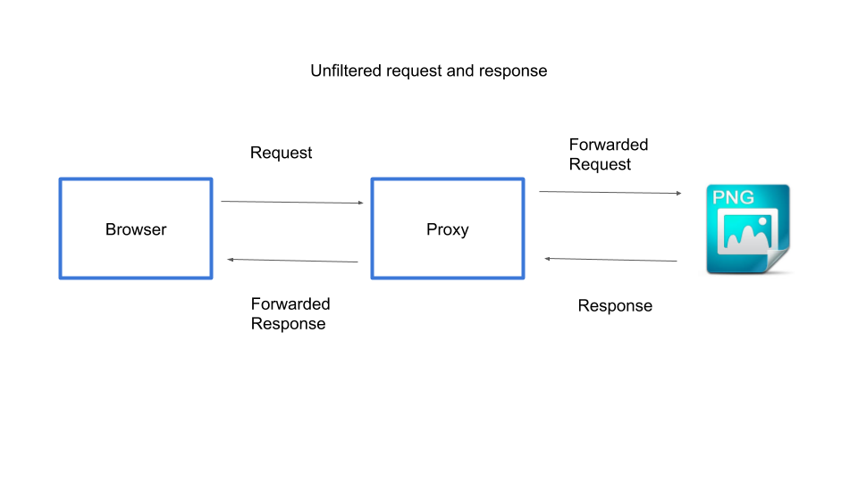
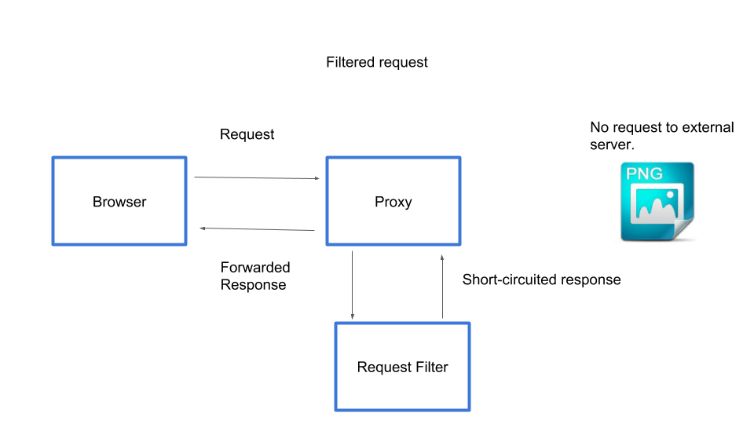
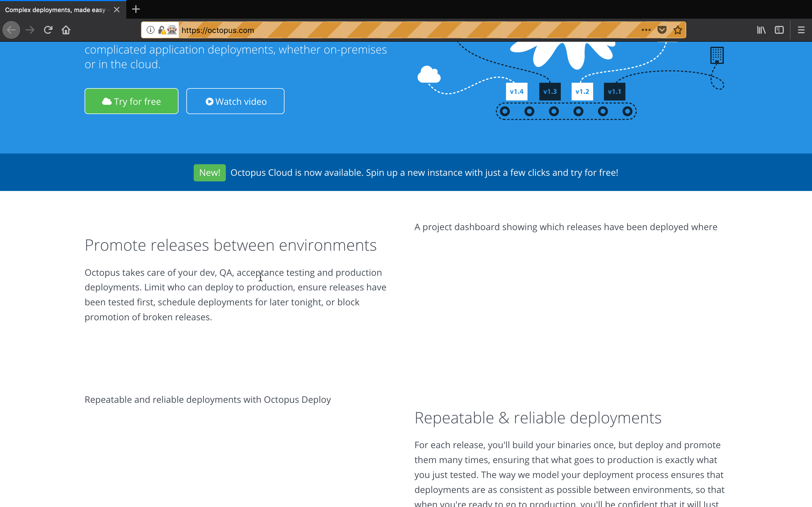
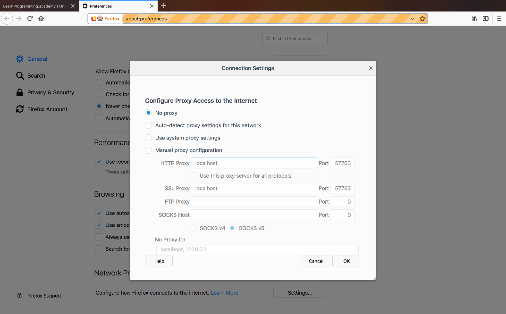
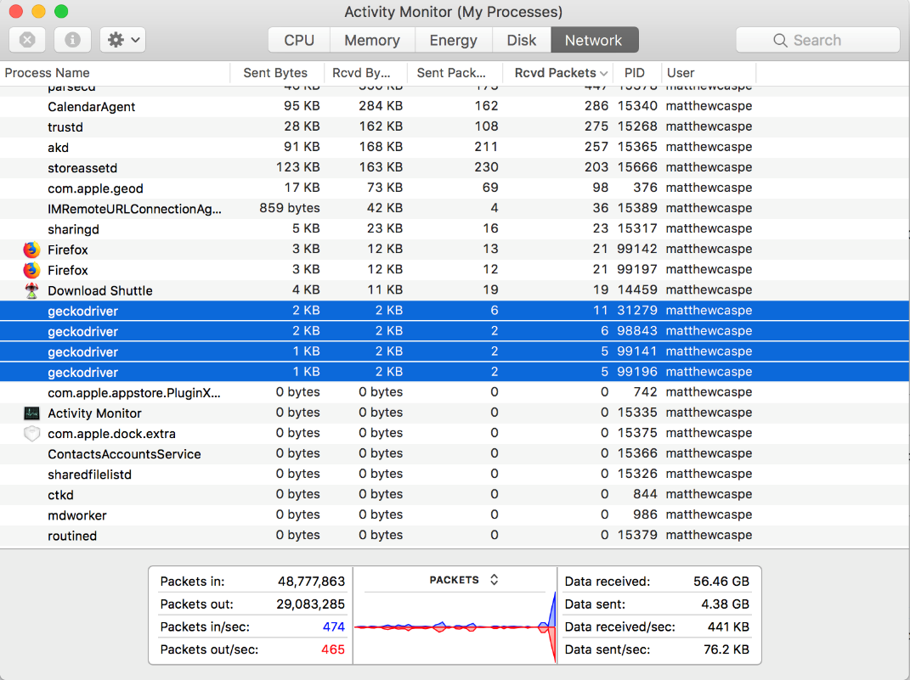

Return to the [table of contents](../0-toc/webdriver-toc.md).

In addition to capturing network traffic, BrowserMob also gives us the ability to modify the network requests made by the browser. There are a number of cases where modifying requests can prove useful when running tests, including: 

- Simulating the failure of external services.
- Preventing assets like images from being loaded, which can improve the performance of tests.
- Blocking third party services during testing, like social media services.

A typical network request through a proxy looks like this. The proxy sits between the browser and external resources, and passes requests back and forth.



The diagram below shows the request and response that we are trying to achieve.

1.  A request is made by the browser to the URL of a resource like a PNG image.
2.  The request is directed to the proxy.
3.  The proxy uses a request filter to inspect the request.
4.  The request is short-circuited with an empty response. The external URL is never contacted.
5.  The empty response is sent back to the browser.



To support modifying requests we add a new method to the `AutomatedBrowser` interface:

```java
void blockRequestTo(String url, int responseCode);
```

This method takes a URL of a request to modify,  and the HTTP response code that should be returned when this URL is requested.

We add the default method to the `AutomatedBrowserBase` class:

```java
@Override
public void blockRequestTo(final String url, final int responseCode) {
  if (getAutomatedBrowser() != null) {
    getAutomatedBrowser().blockRequestTo(url, responseCode);
  }
}
```

And then the method is implemented in the `BrowserMobDecorator` class:

```java
@Override
public void blockRequestTo(String url, int responseCode) {
  proxy.addRequestFilter((request, contents, messageInfo) -> {
    if (Pattern.compile(url).matcher(messageInfo.getOriginalUrl()).matches()) {
      final HttpResponse response = new DefaultHttpResponse(
        request.getProtocolVersion(),
        HttpResponseStatus.valueOf(responseCode));

      response.headers().add(HttpHeaders.CONNECTION, "Close");

      return response;
    }

    return null;

  });

  getAutomatedBrowser().blockRequestTo(url, responseCode);
}
```

Let's break this method down.

We start by adding a request filter to the BrowserMob proxy object. The request filter is supplied as a lambda that takes three arguments:

- `request`, which contains the details of the HTTP request such as the URL, HTTP method type (GET, POST etc), headers and more.
- `contents`, which contains the body of the request.
- `messageInfo`, which contains some additional information about the request, such as the original request details without any modifications from filters.

```java
proxy.addRequestFilter((request, contents, messageInfo) -> {
```

In the lambda we check to see if the URL that was passed in to the `alterRequestTo()` method matches the URL of the request. We treat the URL as a regular expression to give us some more flexibility in the URLs that we match:

```java
if (Pattern.compile(url).matcher(messageInfo.getOriginalUrl()).matches()) {
```

If the URL does match, we return an instance of `DefaultHttpResponse`, which represents a HTTP response. This response takes two parameters.

The first is the HTTP protocol version, which we set to the same version as the request.

The second is the HTTP response code, which we set to the value passed into the `alterRequestTo()` method:

```java
final HttpResponse response = new DefaultHttpResponse(
  request.getProtocolVersion(),
  HttpResponseStatus.valueOf(responseCode));
```

We then need to indicate that this request should not utilize the HTTP keep alive functionality. This is done by setting the HTTP header `Connection` to `Close`.

If we did not set this header, the browser would attempt to keep the connection open (or keep it alive), and you would see the page appear to be loading for a very long time:

```java
response.headers().add(HttpHeaders.CONNECTION, "Close");
```

Returning this object means that the request will be short circuited. The request is no longer passed through to the URL, and is instead handled directly by BrowserMob, in this case with an empty response and the supplied HTTP response code:

```java
return response;
```

If the URL does not match the request, we return `null`, which indicates that this filter does nothing, and the request will go through to the remote server like normal:

```java
return null;
```

The final step is to modify some requests as part of a test:

```java
@Test
public void modifyRequests() {
  final AutomatedBrowser automatedBrowser =
  AUTOMATED_BROWSER_FACTORY.getAutomatedBrowser("Firefox");

  automatedBrowser.init();
  automatedBrowser.blockRequestTo(".*?\\.png", 201);
  automatedBrowser.blockRequestTo("https://.*?twitter\\.com/", 500);
  automatedBrowser.goTo("https://octopus.com/");
}
```

This call to `blockRequestTo()` will return an empty response for any request to PNG images. We use a HTTP return code of `201` to indicate that the response was successful but empty. This is an example of where we speed up a test by blocking images from being downloaded:

```java
automatedBrowser.blockRequestTo(".*?\\.png", 201);
```

The next line block requests to services provided by Twitter. Because we return a HTTP response code of `500`, which is used to indicate a server side error processing the request, we could use these altered requests as a way of simulating the failure of the these external services. You may also find that blocking optional services like these can speed up your tests by removing more network traffic that is not required to test the web application:

```java
automatedBrowser.blockRequestTo("https://.*?twitter\\.com/", 500);
```

You will note that we have not called `automatedBrowser.destory()` here. This is to allow us to view the web page that results from the network requests being altered. As you can see, the images that were usually presented are now no longer displayed because these requests were intercepted and returned as empty responses.



An important thing to note here is that it is no longer possible to interact with the web page in any meaningful way once the test has completed. This is because BrowserMob has been closed, meaning the proxy that the browser was configured with is no longer available, so all future network requests will fail.

To interact with the web page, you will need to manually remove the proxy settings from the browsers settings. The screenshot below shows the Firefox proxy settings we saw in the last post. Selecting the `No proxy` option will allow the browser to be used after BrowserMob has been shut down.



Remember that by not calling the `destory()` method, we are now responsible for manually closing the driver binaries launched by the test.



Blocking network requests to things like images can speed up WebDriver tests, and is especially useful when running tests against headless browsers, because there is no one watching the tests being run so there is little benefit to downloading images that will never be seen.

Return to the [table of contents](../0-toc/webdriver-toc.md).
