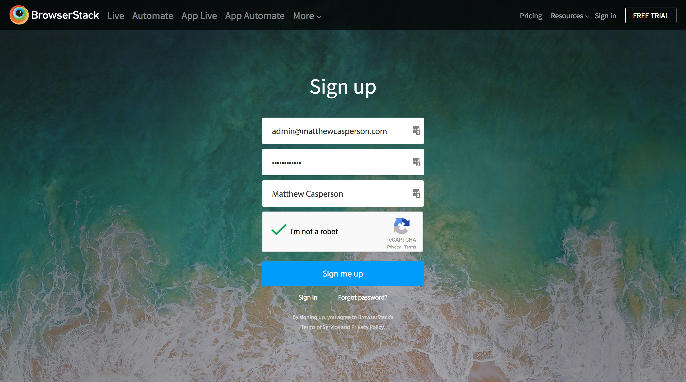
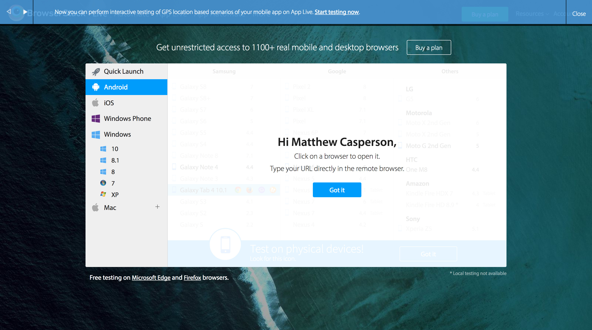
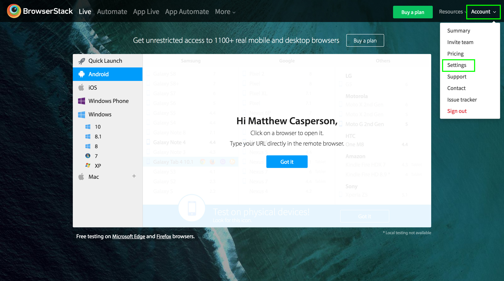
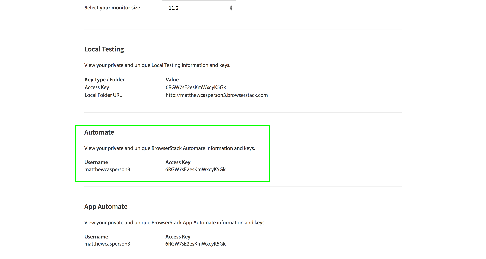
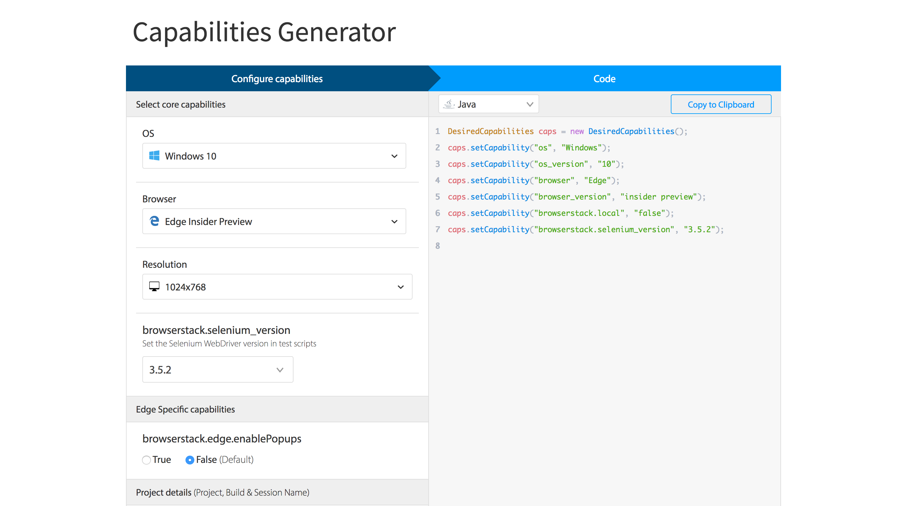
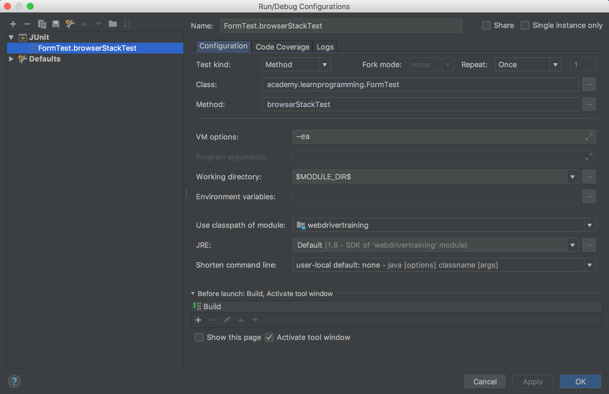
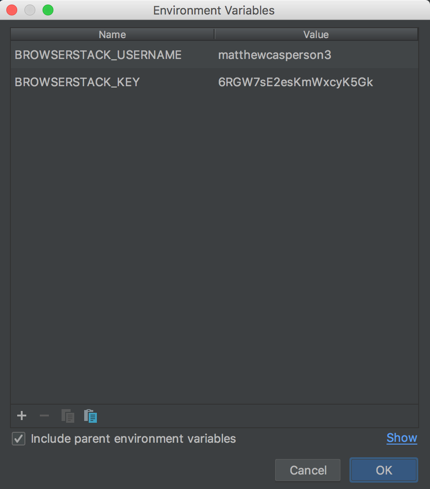

Our testing so far has been limited to desktop browsers like Chrome and Firefox. Depending on the operating system you are running, you may also be able to test browsers like Safari, Internet Explorer, and Edge. But regardless of which operating system you are running, there is no easy way to run tests against all popular browsers. Safari is not supported on Windows, Internet Explorer and Edge are not supported on MacOS, and none of these browsers are supported in Linux. And while it is possible to emulate mobile browsers in a desktop or server environment, doing so is difficult to configure and maintain.

To address these issues, services like BrowserStack offer the ability to run WebDriver tests against a huge range of browsers, both desktop and mobile. By managing the various operating systems, browsers and mobile devices, services like BrowserStack make it quite easy to do large-scale cross-browser testing.

BrowserStack is not a free service, and to take advantage of most of its features you will need to pay for an account. But fortunately both Mozilla and Microsoft have teamed up with BrowserStack to offer free testing against the [Edge](https://www.browserstack.com/test-on-microsoft-edge-browser) and [Firefox](https://blog.mozilla.org/blog/2017/03/03/mozilla-browserstack-partner-drive-mobile-testing-real-devices/) browsers. We will take advantage of this service to build some remote tests that can be run without any cost. The good news is that once you have a test running against a browser like Edge or Firefox, it is quite trivial to reuse that code to run tests against any other browser offered by BrowserStack.

To create a BrowserStack account, go to [https://www.browserstack.com](https://www.browserstack.com). You will see links to sign up for a free trial, either on the main page, or in the top menu.

Enter your email address, password and name, and continue to the next page.



And that's it. You now have a BrowserStack account.



In order to connect to BrowserStack, we need to get the Access Key. This can be found by clicking the `Account` menu, and selecting `Settings`.



You will find the Access Key under the Automate heading. Make a note of the `Username` and `Access Key`, as we will need these values later.



To run tests remotely against BrowserStack we need to create an instance of the `RemoteDriver` class. Unlike `ChromeDriver` or `FirefoxDiver`, `RemoteDriver` is designed to control a browser hosted on a remote server. This means we need to give the `RemoteDriver` a URL to send commands to, along with the credentials.

The BrowserStack documentation at [https://www.browserstack.com/automate/java](https://www.browserstack.com/automate/java) shows the URL that we need to connect to. It is in the format `https://<username>:<password>@hub-cloud.browserstack.com/wd/hub`. The username and password are embedded into the URL.

To enable tests to be run against BrowserStack we will create a new decorator called `BrowserStackDecorator`:

```java
package com.octopus.decorators;

import com.octopus.AutomatedBrowser;
import com.octopus.decoratorbase.AutomatedBrowserBase;
import com.octopus.exceptions.ConfigurationException;
import org.openqa.selenium.WebDriver;
import org.openqa.selenium.remote.RemoteWebDriver;
import java.net.MalformedURLException;

import java.net.URL;

public class BrowserStackDecorator extends AutomatedBrowserBase {

  private static final String USERNAME_ENV = "BROWSERSTACK_USERNAME";
  private static final String AUTOMATE_KEY_ENV = "BROWSERSTACK_KEY";

  public BrowserStackDecorator(final AutomatedBrowser automatedBrowser) {
    super(automatedBrowser);
  }

  @Override
  public void init() {
    try {
      final String url = "https://" +
        System.getenv(USERNAME_ENV) + ":" +
        System.getenv(AUTOMATE_KEY_ENV) +
        "@hub-cloud.browserstack.com/wd/hub";
      final WebDriver webDriver = new RemoteWebDriver(new URL(url), getDesiredCapabilities());
      getAutomatedBrowser().setWebDriver(webDriver);
      getAutomatedBrowser().init();
    } catch (MalformedURLException ex) {
      throw new ConfigurationException(ex);
    }
  }
}
```

Because it is considered bad practice to embed passwords into applications, we'll get the username and password from environment variables. The username will be found in the `BROWSERSTACK_USERNAME` environment variable, while the password will be found in the `BROWSERSTACK_KEY` environment variable. We will create constants for these strings so we can access them later on in the code:

```java
private static final String USERNAME_ENV = "BROWSERSTACK_USERNAME";
private static final String AUTOMATE_KEY_ENV = "BROWSERSTACK_KEY";
```

Next we construct the URL that will allow the `RemoteDriver` to contact the BrowserStack service. We use calls to `System.getenv()` to get the username and password from environment variables:

```java
final String url = "https://" +
  System.getenv(USERNAME_ENV) + ":" +
  System.getenv(AUTOMATE_KEY_ENV) +
  "@hub-cloud.browserstack.com/wd/hub";
```

There are only minor difference between the construction of the `RemoteDriver` class and a class like `ChromeDriver`.

The `RemoteDriver()` constructor takes the URL of the service to connect to, and the desired capabilities.

There is no equivalent to a class like `ChromeOptions` for the `RemoteDriver` class; it uses the `DesiredCapabilities` object directly:

```java
final WebDriver webDriver = new RemoteWebDriver(new URL(url), getDesiredCapabilities());
```

If the URL we constructed was not valid, a `MalformedURLException` is thrown. We catch this exception and wrap it in an unchecked exception called `ConfigurationException`:

```java
catch (MalformedURLException ex) {
  throw new ConfigurationException(ex);
}
```

The `ConfigurationException` class is used to indicate that the required environment variables have not been configured:

```java
package com.octopus.exceptions;

public class ConfigurationException extends RuntimeException {
  public ConfigurationException() {

  }

  public ConfigurationException(final String message) {
    super(message);
  }

  public ConfigurationException(final String message, final Throwable ex)
  {
    super(message, ex);
  }

  public ConfigurationException(final Exception ex) {
    super(ex);
  }
}
```

Constructing the `RemoteDriver` is only half the story though. Because `RemoteDriver` is a generic interface to any browser exposed by the remote service, we define the details of the browser that we wish to test against as values in the desired capabilities object. BrowserStack has an online tool for generating these desired capabilities settings at [https://www.browserstack.com/automate/capabilities](https://www.browserstack.com/automate/capabilities). You select the desired operating system, device or browser and some other settings like screen resolution, and the tool will generate the code that can be used to populate a `DesiredCapabilities` object.

We will start by testing against the Edge browser, which is available in Windows 10.



These desired capability settings will be defined in a new decorator called `BrowserStackEdgeDecorator`:

```java
package com.octopus.decorators;

import com.octopus.AutomatedBrowser;
import com.octopus.decoratorbase.AutomatedBrowserBase;
import org.openqa.selenium.remote.DesiredCapabilities;

public class BrowserStackEdgeDecorator extends AutomatedBrowserBase {

    public BrowserStackEdgeDecorator(final AutomatedBrowser  automatedBrowser) {
        super(automatedBrowser);
    }

    @Override
    public DesiredCapabilities getDesiredCapabilities() {
        final DesiredCapabilities caps = getAutomatedBrowser().getDesiredCapabilities();

        caps.setCapability("os", "Windows");
        caps.setCapability("os_version", "10");
        caps.setCapability("browser", "Edge");
        caps.setCapability("browser_version", "insider preview");
        caps.setCapability("browserstack.local", "false");
        caps.setCapability("browserstack.selenium_version", "3.7.0");
        return caps;
    }
}
```

To tie these two new decorators together we will create a new type of browser in our factory.

Note that we do not use the `BrowserMobDecorator` class when constructing `AutomatedBrowser` instances to run tests in BrowserStack. BrowserMob is only available to browsers running on the local machine, because it was bound to a port on the localhost interface, meaning it is not exposed to outside browsers like those running on the BrowserStack platform. So to avoid configuring the remote browsers with a local proxy that they do not have access to, we leave the `BrowserMobDecorator` class out of the decorator chain.

The order in which we nest the decorators is important here. The `BrowserStackDecorator` expects the desired capabilities to be set in a nested decorator, which is `BrowserStackEdgeDecorator` in this case. This means that `BrowserStackDecorator` has to have `BrowserStackEdgeDecorator` passed to its constructor, and not the other way around:

```java
package com.octopus;

import com.octopus.decorators.*;

public class AutomatedBrowserFactory {

  public AutomatedBrowser getAutomatedBrowser(String browser) {

    // ...

    if ("BrowserStackEdge".equalsIgnoreCase(browser)) {
      return getBrowserStackEdge();
    }

    if ("BrowserStackEdgeNoImplicitWait".equalsIgnoreCase(browser)) {
      return getBrowserStackEdgeNoImplicitWait();
    }

    throw new IllegalArgumentException("Unknown browser " + browser);

  }

  // ...

  private AutomatedBrowser getBrowserStackEdge() {
    return new BrowserStackDecorator(
      new BrowserStackEdgeDecorator(
        new ImplicitWaitDecorator(10,
          new WebDriverDecorator()
        )
      )
    );
  }

  private AutomatedBrowser getBrowserStackEdgeNoImplicitWait() {
    return new BrowserStackDecorator(
      new BrowserStackEdgeDecorator(
        new WebDriverDecorator()
      )
    );
  }
}
```

Now we can use this new browser in a test. Note that instead of accessing the HTML file from the local disk, we instead open the URL [https://s3.amazonaws.com/webdriver-testing-website/form.html](https://s3.amazonaws.com/webdriver-testing-website/form.html), which is the URL to the files we uploaded in S3 in a previous post.

Had we tried to run the test against the local file, it would have failed. This is because the URL that the remote browser attempted to open would have looked something like `file:///Users/username/javaproject/src/test/resources/form.html` (depending on your local operating system). This file does not exist on the operating system running the remote browser, because the remote browser is running on an operating system managed by BrowserStack any attempt to load the file would have failed:

```java
@Test
public void browserStackTest() {

    final AutomatedBrowser automatedBrowser =
            AUTOMATED_BROWSER_FACTORY.getAutomatedBrowser("BrowserStackEdge");

    final String formButtonLocator = "button_element";
    final String formTextBoxLocator = "text_element";
    final String formTextAreaLocator = "textarea_element";
    final String formDropDownListLocator = "[name=select_element]";
    final String formCheckboxLocator = "//*[@name=\"checkbox1_element\"]";

    final String messageLocator = "message";

    try {
        automatedBrowser.init();

        automatedBrowser.goTo("https://s3.amazonaws.com/webdriver-testing-website/form.html");

        automatedBrowser.clickElement(formButtonLocator);
        assertEquals("Button Clicked", automatedBrowser.getTextFromElement(messageLocator));

        automatedBrowser.populateElement(formTextBoxLocator, "test text");
        assertEquals("Text Input Changed", automatedBrowser.getTextFromElement(messageLocator));

        automatedBrowser.populateElement(formTextAreaLocator, "test text");
        assertEquals("Text Area Changed", automatedBrowser.getTextFromElement(messageLocator));

        automatedBrowser.selectOptionByTextFromSelect("Option 2.1", formDropDownListLocator);
        assertEquals("Select Changed",  automatedBrowser.getTextFromElement(messageLocator));

        automatedBrowser.clickElement(formCheckboxLocator);
        assertEquals("Checkbox Changed",  automatedBrowser.getTextFromElement(messageLocator));

    } finally {
        automatedBrowser.destroy();
    }
}
```

Running this test will generate an exception like the following:

```
org.openqa.selenium.WebDriverException: Invalid username or password
(WARNING: The server did not provide any stacktrace information) Command
duration or timeout: 1.81 seconds Build info: version: '3.11.0',
revision: 'e59cfb3', time: '2018-03-11T20:26:55.152Z' System info:
host: 'Christinas-MBP', ip: '192.168.1.84', os.name: 'Mac OS X',
os.arch: 'x86_64', os.version: '10.13.4', java.version:
'1.8.0_144' Driver info: driver.version: RemoteWebDriver at
sun.reflect.NativeConstructorAccessorImpl.newInstance0(Native Method) at
sun.reflect.NativeConstructorAccessorImpl.newInstance(NativeConstructorAccessorImpl.java:62)
at
sun.reflect.DelegatingConstructorAccessorImpl.newInstance(DelegatingConstructorAccessorImpl.java:45)
at java.lang.reflect.Constructor.newInstance(Constructor.java:423) at
org.openqa.selenium.remote.ErrorHandler.createThrowable(ErrorHandler.java:214)
at
org.openqa.selenium.remote.ErrorHandler.throwIfResponseFailed(ErrorHandler.java:166)
```

This is because we haven't setup the environment variables with the BrowserStack username and password. To add these environment variables to the test, click the drop down list in IntelliJ that contains the configurations, and click `Edit Configurations...`


Under the Configuration tab you will see a field called `Environment
Variables`. Click the button to the right of this field.



Enter the environment variables in the dialog, and save the changes. Click the `OK` button twice to save the changes.



This time the test will run successfully. You can view the test running by logging into BrowserStack and clicking the {{Products,Automate}} link. By default, the last test is shown. The screen to the right will show you the test being run live against the remote browser, or if the test has completed will provide a recorded video of the test.

You typically get 100 free minutes with a trail BrowserStack account, but thanks to the partnership between BrowserStack and Microsoft, those minutes will not be consumed by tests run against Edge.

Now that we have the ability to run tests against the Edge browser, it is quite trivial to start running tests against any other browser provided by BrowserStack. We'll see this in the next post when we run our tests against a mobile device provided as part of the BrowserStack service.
