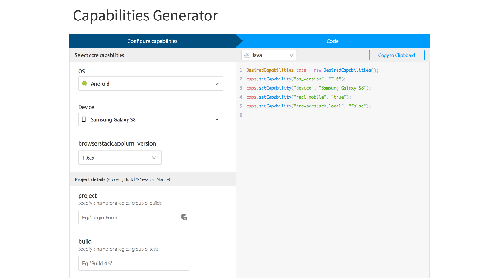
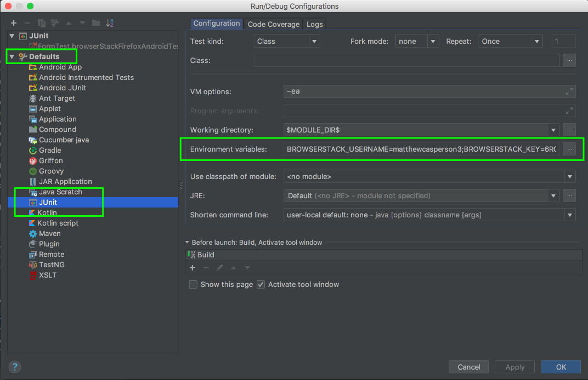
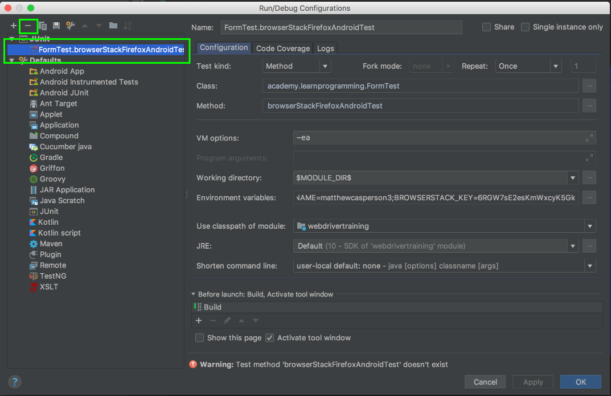
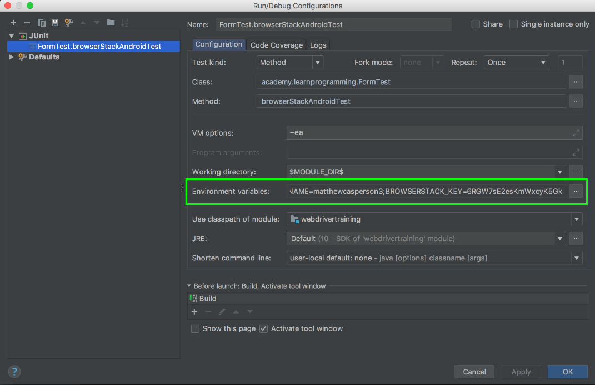

So far we have limited our testing to desktop browsers, but no testing strategy would be complete without a way to also test mobile browsers. Mobile browser testing is one of the major features of a service like BrowserStack. It is quite easy to run tests against a huge variety of mobile browsers using the same code we have been developing and running against desktop browsers.

Let's take a look at how we can test against Chrome on the Samsung Galaxy Note 8 mobile device.

First we need to build the desired capabilities object to instruct BrowserStack to run the tests against the Samsung device. As before we can get these details through the form available at
[https://www.browserstack.com/automate/capabilities](https://www.browserstack.com/automate/capabilities).



We then take these settings and use them to build a new decorator class called `BrowserStackAndroidDecorator`.

```java
package com.octopus.decorators;

import com.octopus.AutomatedBrowser;
import com.octopus.decoratorbase.AutomatedBrowserBase;
import org.openqa.selenium.remote.DesiredCapabilities;

public class BrowserStackAndroidDecorator extends AutomatedBrowserBase {
  public BrowserStackAndroidDecorator(final AutomatedBrowser automatedBrowser) {

  super(automatedBrowser);

  }

  @Override
  public DesiredCapabilities getDesiredCapabilities() {

    final DesiredCapabilities caps = getAutomatedBrowser().getDesiredCapabilities();

    caps.setCapability("os_version", "7.1");
    caps.setCapability("device", "Samsung Galaxy Note 8");
    caps.setCapability("real_mobile", "true");
    caps.setCapability("browserstack.local", "false");

    return caps;
  }
}
```

Then we make use of this class in our `AutomatedBrowserFactory`.

```java
package com.octopus;

import com.octopus.decorators.*;

public class AutomatedBrowserFactory {

  public AutomatedBrowser getAutomatedBrowser(String browser) {

  // ...

  if ("BrowserStackAndroid".equalsIgnoreCase(browser)) {
      return getBrowserStackAndroid();
  }

  if ("BrowserStackAndroidNoImplicitWait".equalsIgnoreCase(browser)) {
      return getBrowserStackAndroidNoImplicitWait();
  }

  throw new IllegalArgumentException("Unknown browser " + browser);

  }

  // ...

  private AutomatedBrowser getBrowserStackAndroid() {
    return new BrowserStackDecorator(
      new BrowserStackAndroidDecorator(
        new ImplicitWaitDecorator(10,
          new WebDriverDecorator()
        )
      )
    );
  }

  private AutomatedBrowser getBrowserStackAndroidNoImplicitWait() {
    return new BrowserStackDecorator(
      new BrowserStackAndroidDecorator(
        new WebDriverDecorator()
      )
    );
  }
}
```

We can then make use of this new `AutomatedBrowser` instance in our tests.

```java
@Test
public void browserStackAndroidTest() {

  final AutomatedBrowser automatedBrowser =
    AUTOMATED_BROWSER_FACTORY.getAutomatedBrowser("BrowserStackAndroid");

  final String formButtonLocator = "button_element";
  final String formTextBoxLocator = "text_element";
  final String formTextAreaLocator = "textarea_element";
  final String formDropDownListLocator = "[name=select_element]";
  final String formCheckboxLocator = "//*[@name=\"checkbox1_element\"]";
  final String messageLocator = "message";

  try {
    automatedBrowser.init();

    automatedBrowser.goTo("https://s3.amazonaws.com/webdriver-testing-website/form.html");

    automatedBrowser.clickElement(formButtonLocator);
    assertEquals("Button Clicked", automatedBrowser.getTextFromElement(messageLocator));

    automatedBrowser.populateElement(formTextBoxLocator, "test text");
    assertEquals("Text Input Changed", automatedBrowser.getTextFromElement(messageLocator));

    automatedBrowser.populateElement(formTextAreaLocator, "test text");
    assertEquals("Text Area Changed", automatedBrowser.getTextFromElement(messageLocator));

    automatedBrowser.selectOptionByTextFromSelect("Option 2.1",
    formDropDownListLocator);
    assertEquals("Select Changed", automatedBrowser.getTextFromElement(messageLocator));

    automatedBrowser.clickElement(formCheckboxLocator);
    assertEquals("Checkbox Changed", automatedBrowser.getTextFromElement(messageLocator));
  } finally {
    automatedBrowser.destroy();
  }
}
```

If we run this test, an exception may once again be generated about invalid credentials. If you recall we previously defined the BrowserStack credentials as environment variables, but we did so against a single test only. It can get tedious adding these variables to each
new test configuration, so to add these environment variables to all tests, we need to configure the default settings for all JUnit tests run by IntelliJ.

Click the drop down list of configurations, and select `Edit Configurations...`


This time instead of adding the environment variables to the
configuration of an individual test, we add them as the defaults of any JUnit configuration.

Expand the `Defaults` menu on the left hand side, select the `JUnit` option, and add `BROWSERSTACK_USERNAME` and `BROWSERSTACK_KEY` to the `Environment variables`.



You may need to delete the JUnit configuration that was created when you ran the test. This will be found under the `JUnit` option in the left hand menu. Select the configuration, and click the minus button.



When you run the unit test again, IntelliJ will create a new JUnit configuration, and this will have the environment variables populated with the default values.



Running the test again it will create a new BrowserStack session, which again can be viewed by clicking `Products` → `Automate` in BrowserStack. The test will be run on a Samsung mobile device.

The ability to run our tests across a huge range of devices shows just how flexible WebDriver is. With a few simple decorators we can configure our tests to run on the hundreds of devices supported by BrowserStack. But there are still some edge cases that we'll need to be mindful of when writing tests that work across desktop and mobile browsers, and in the next post we'll see and example where we need to work around some of the differences between environments.
