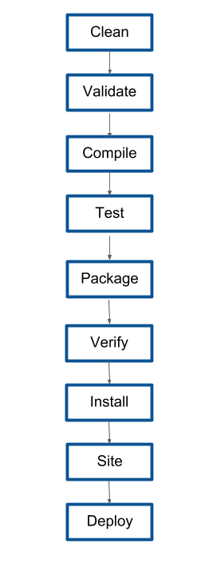
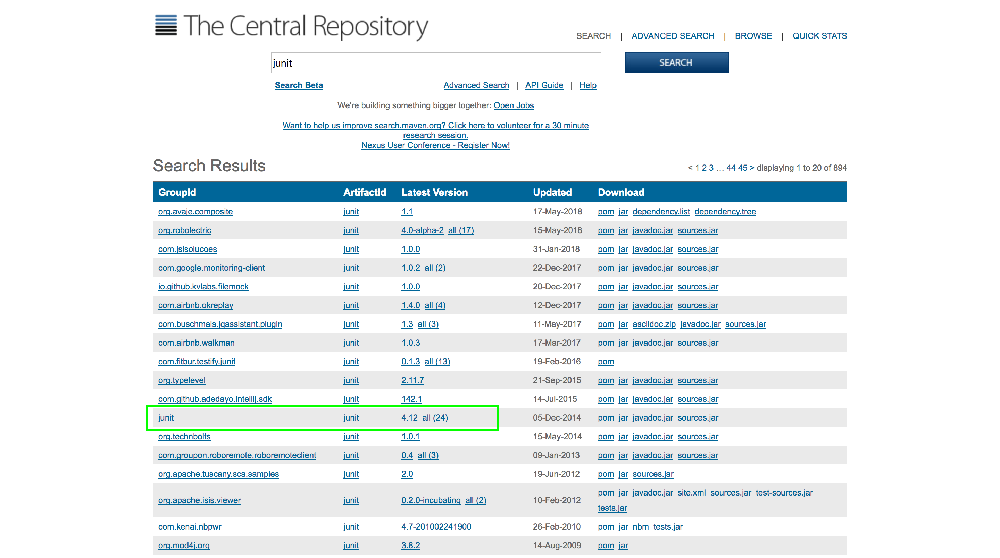
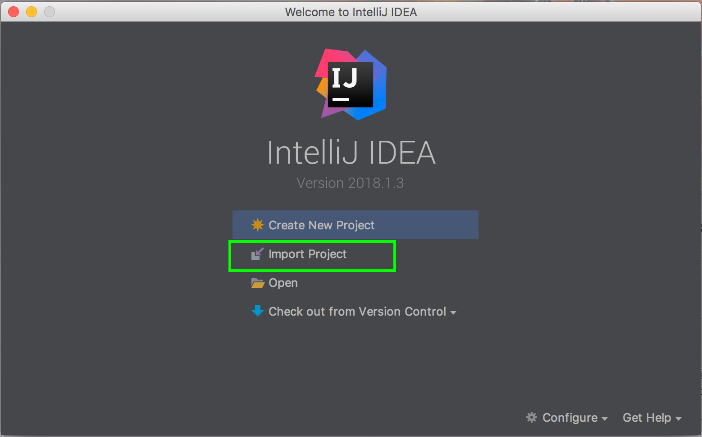
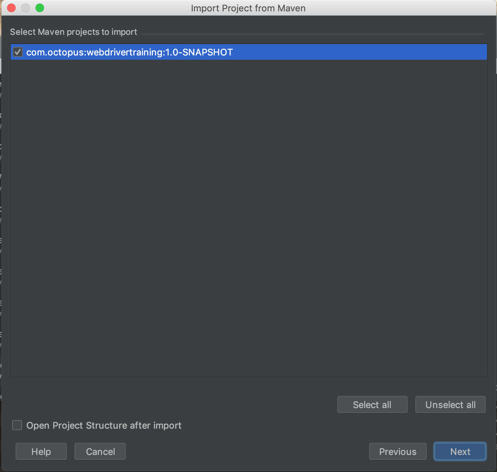
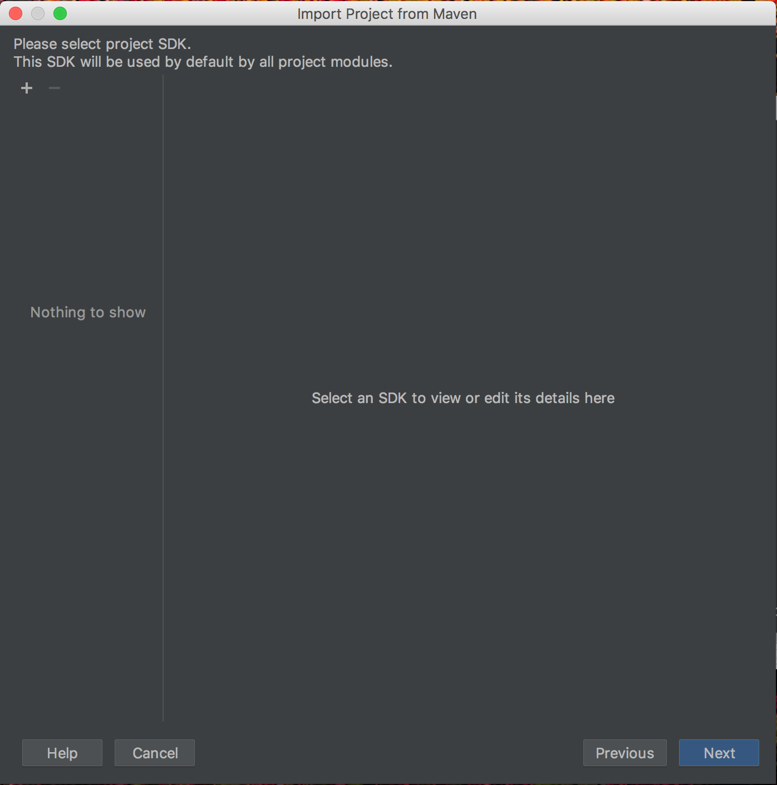
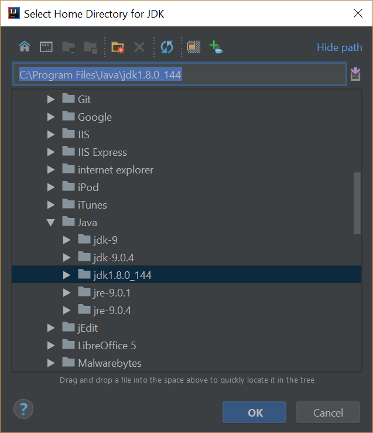
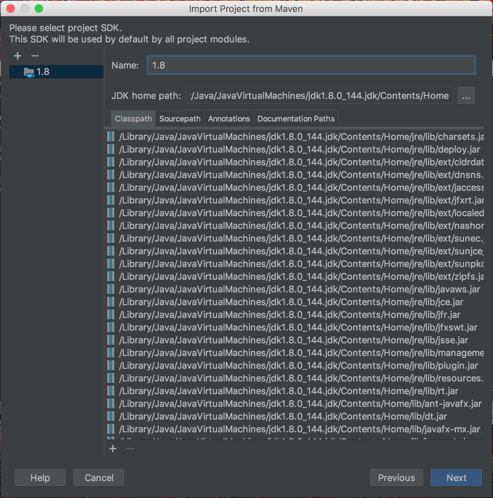
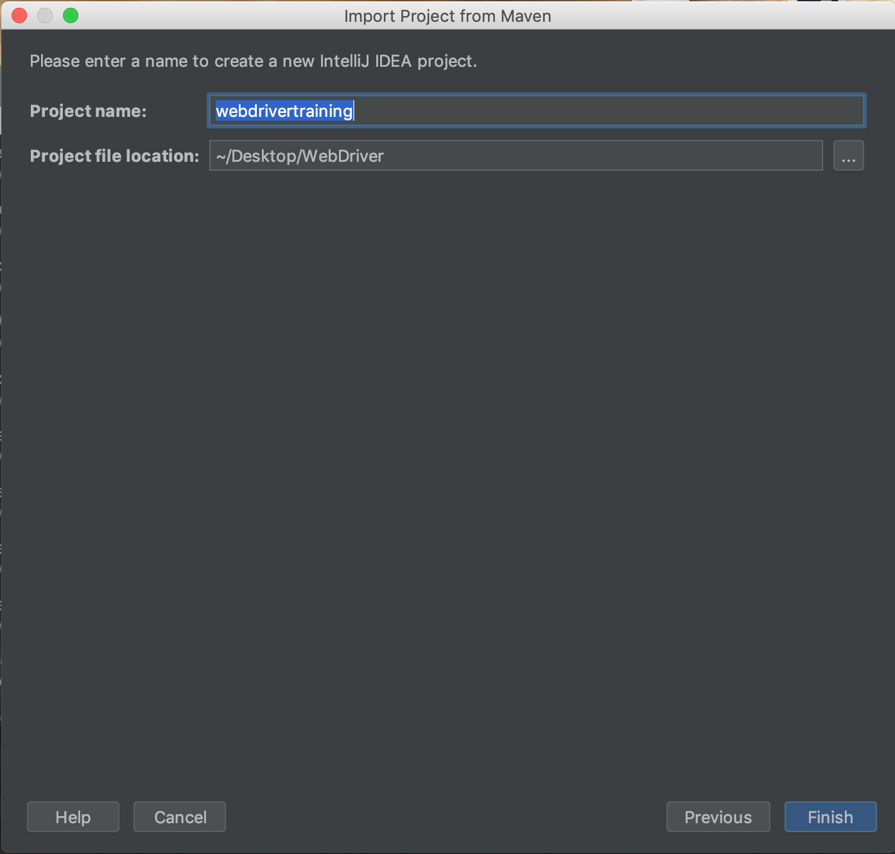
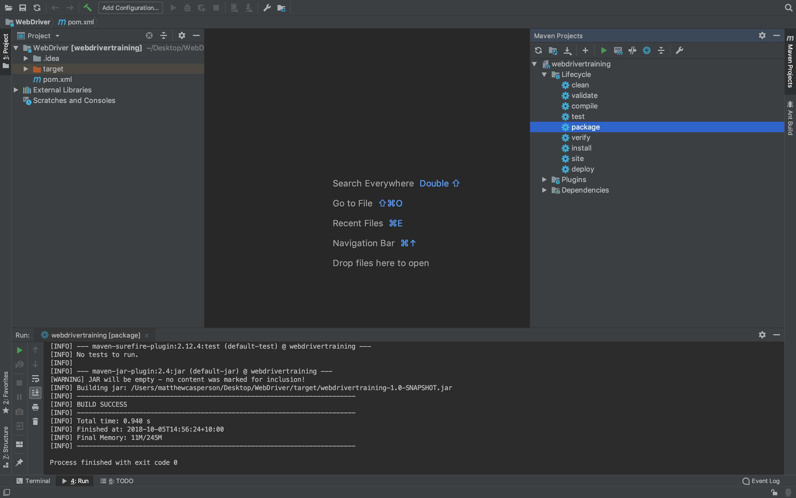
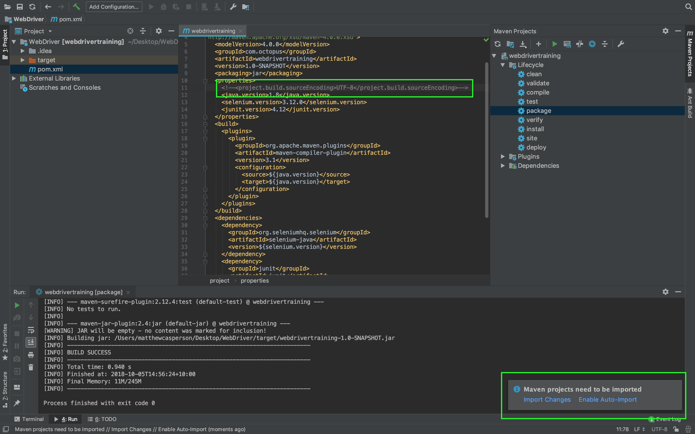

Return to the [table of contents](../0-toc/webdriver-toc.md).

The first step in establishing our Java project is the creation of a Maven Project Object Model (POM) file. This is an XML document that defines how our code will be built, what additional dependencies it has access to, and how tests are run.

We start with the POM file shown below:

```xml
<project xmlns="http://maven.apache.org/POM/4.0.0"
xmlns:xsi="http://www.w3.org/2001/XMLSchema-instance"
xsi:schemaLocation="http://maven.apache.org/POM/4.0.0
http://maven.apache.org/xsd/maven-4.0.0.xsd">
  <modelVersion>4.0.0</modelVersion>
  <groupId>com.octopus</groupId>
  <artifactId>webdrivertraining</artifactId>
  <version>1.0-SNAPSHOT</version>
  <packaging>jar</packaging>
  <properties>
    <project.build.sourceEncoding>UTF-8</project.build.sourceEncoding>
    <java.version>1.8</java.version>
    <selenium.version>3.14.0</selenium.version>
    <junit.version>4.12</junit.version>
  </properties>
  <build>
    <plugins>
      <plugin>
        <groupId>org.apache.maven.plugins</groupId>
        <artifactId>maven-compiler-plugin</artifactId>
        <version>3.1</version>
        <configuration>
          <source>${java.version}</source>
          <target>${java.version}</target>
        </configuration>
      </plugin>
    </plugins>
  </build>
  <dependencies>
    <dependency>
      <groupId>org.seleniumhq.selenium</groupId>
      <artifactId>selenium-java</artifactId>
      <version>${selenium.version}</version>
    </dependency>
    <dependency>
      <groupId>junit</groupId>
      <artifactId>junit</artifactId>
      <version>${junit.version}</version>
      <scope>test</scope>
    </dependency>
  </dependencies>
</project>
```

Lets break this POM file down to understand the individual components.

## Project element

At the top level is the `<project>` element:

```xml
<project xmlns="http://maven.apache.org/POM/4.0.0"
xmlns:xsi="http://www.w3.org/2001/XMLSchema-instance"
xsi:schemaLocation="http://maven.apache.org/POM/4.0.0
http://maven.apache.org/xsd/maven-4.0.0.xsd">
  <modelVersion>4.0.0</modelVersion>
  <!-- ... -->
</project>
```

All Maven POM files have a `<project>` element as the root element, and the attributes define the XML namespace and details of the Maven XML schema.

The `<modelVersion>` element defines the POM version. The only supported value for this element is `4.0.0`.

[https://maven.apache.org/pom.html#Quick_Overview](https://maven.apache.org/pom.html#Quick_Overview) has details on the elements that make up the POM file.

## Group, artifact, and version

The `<groupId>`, `<artifactId>` and `<version>` elements define the identity of the Maven artifact produced by this project. These values are sometimes combined and abbreviated to the acronym GAV.

The `groupId` usually takes the form of a reversed domain name, although this is just a convention and not a strict requirement. We have used the value `com.octopus`, which is the reverse of the domain name in the URL [http://octopus.com/](http://octopus.com/).

The combination of the `groupId` and `artifactId` must be unique, and since many projects may share the `groupId`, it is the `artifactId` that describes this project.

As you would expect, the `version` element defines the version of this library. The value of `1.0-SNAPSHOT` means this code is working towards a 1.0 release, but has not reached stability yet:

```xml
<groupId>com.octopus</groupId>
<artifactId>webdrivertraining</artifactId>
<version>1.0-SNAPSHOT</version>
```

## Packaging

The `<packaging>` element defines the type of artifact that Maven will produce. In our case, we are producing a JAR file:

```xml
<packaging>jar</packaging>
```

## Properties

The `<properties>` element defines values for properties that are either recognized directly by Maven or that can be referenced later on in the POM file as a way of sharing common values.

Here we've set the `project.build.sourceEncoding` property, which is a setting recognized by Maven that defines the versions for the dependencies that our code relies on, and defines the version of Java that our code will be compiled against in the `java.version` property:

```xml
<properties>
  <project.build.sourceEncoding>UTF-8</project.build.sourceEncoding>
  <java.version>1.8</java.version>
  <selenium.version>3.12.0</selenium.version>
  <junit.version>4.12</junit.version>
</properties>
```

The property `project.build.sourceEncoding` is set to `UTF-8` to specify a consistent encoding of the Java source files across operating systems. If this value is not set, different operating systems assume that the Java files have different encodings, which can cause issues when the code is compiled by different people or services. In later posts we'll configure an external service based on Linux to build our code for us, and setting this property means our builds will work as expected regardless of what OS we develop the code with locally.

## Plugins

The next settings configure certain aspects of the Maven build process. Maven projects have a well known default lifecycle that has the following default phases, as shown in this image.



-   clean - remove all files generated by the previous build.
-   validate - validate the project is correct and all necessary information is available.
-   compile - compile the source code of the project.
-   test - test the compiled source code using a suitable unit testing framework. These tests should not require the code be packaged or deployed.
-   package - take the compiled code and package it in its distributable format, such as a JAR.
-   verify - run any checks on results of integration tests to ensure quality criteria are met.
-   install - install the package into the local repository for use as a dependency in other projects locally deployed.
-   site - generate the project's site documentation.
-   deploy - done in an integration or release environment, copies the final package to the remote repository for sharing with other developers and projects.


See
[https://maven.apache.org/guides/introduction/introduction-to-the-lifecycle.html#Lifecycle_Reference](https://maven.apache.org/guides/introduction/introduction-to-the-lifecycle.html#Lifecycle_Reference) for a complete list of the phases for the Maven lifecycles.

Each phase is executed by what is known as a goal exposed by a plugin, and each plugin can be configured within a `<plugin>` element, nested under the `<build><plugins>` elements.

For our project, we need to configure the `maven-compiler-plugin`, which is used to compile our Java code during the compile phase, to instruct it to build artifacts that are compatible with Java 1.8.

The configuration of the Java version is done with the `<source>` and `<target>` elements. The value of these elements are both set to `${java.version}`, which is how we reference the value of the custom property called `java.version` defined in the `<properties>` element earlier:

```xml
<build>
  <plugins>
    <plugin>
      <groupId>org.apache.maven.plugins</groupId>
      <artifactId>maven-compiler-plugin</artifactId>
      <version>3.1</version>
      <configuration>
        <source>${java.version}</source>
        <target>${java.version}</target>
      </configuration>
    </plugin>
  </plugins>
</build>
```

## Dependencies

Finally we have the `<dependencies>` element. This element defines the additional libraries that our application relies on.

The details of the dependencies are usually found through one of the many Maven repository search engines, such as [https://search.maven.org/](https://search.maven.org/). The screenshot below shows a search for the JUnit library:


The results include artifacts with a number of different GroupIDs, but the one we want has the `GroupID` and `ArtifactID` of `junit`. The results also tell us what the latest version is.



Clicking on the version number (the 4.12 link in the example above) takes you to the following page which provides the XML that you can add to a `pom.xml` file to include this dependency.


JUnit is a popular unit testing library, and we will use it extensively when writing WebDriver tests. In addition, we add a dependency on the `selenium-java` library, which provides an implementation of the WebDriver API.

Note the `<scope>` element is set to `test` for the `junit` dependency. This indicates that this dependency is only required for the testing phase of the Maven lifecycle and will not be packaged up when building release artifacts.

:::hint
We are using JUnit 4 here instead of the more recent JUnit 5 because some of the libraries that we'll be using later on in the course have not been updated to work with JUnit 5 yet.
:::

```xml
<dependencies>
  <dependency>
    <groupId>org.seleniumhq.selenium</groupId>
    <artifactId>selenium-java</artifactId>
    <version>${selenium.version}</version>
  </dependency>
  <dependency>
    <groupId>junit</groupId>
    <artifactId>junit</artifactId>
    <version>${junit.version}</version>
    <scope>test</scope>
  </dependency>
</dependencies>
```

Save the `pom.xml` file to a location on your local PC. Once the file is saved we can import it into IntelliJ, from which we will continue writing our Java code.

When you first open IntelliJ you have the option to import a project from the initial dialog box. Click the Import Project link.



Then select the `pom.xml` file.


IntelliJ recognizes that the pom.xml file is a Maven project, and begins the process of importing the project from Maven.

The defaults in this dialog are fine, so click the `Next` button.


The `com.octopus:webdrivertraining:1.0-SNAPSHOT` (this is the
Group, Artifact and Version, or GAV, representation of the artifact) project is detected automatically.

Click the `Next` button.



This dialog allows you to select the JDK to use for building the project. If you are setting up IntelliJ for the first time, this list will be empty.



If you do not see the Java 1.8 SDK as an option, click the plus icon and select JDK from the `Add New SDK` menu.


Select the directory where the Java 1.8 JDK has been installed and click the `Open` or `OK` button.

On a MacOS system, the Oracle JDK is usually found under a directory like `/Library/Java/JavaVirtualMachines/jdk1.8.0_144.jdk/Contents/Home`.


On a Windows system you'll typically find the JDK under a directory
like `C:\Program Files\Java\jdk1.8.0_144`.



On a Linux system like Ubuntu, the JDK can be found under a directory like `/usr/lib/jvm/java-8-openjdk-amd64`.


This will add the JDK to the list. Click the `Next` button.



The default name for the IntelliJ project is the same as the Maven ArtifactID. This default is fine, so click the `Finish` button.



IntelliJ then creates an empty project linked to the Maven project.

On the right hand side of the IDE you will see a button called `Maven Projects`. If you do not see this button, the window can be opened by clicking {{View,Tool Windows,Maven Projects}}.


Opening this menu, either using the `View` menu or the button, will display the `Maven Projects` window. Under the `Lifecycle` menu item you can see the Maven phases that make up the default lifecycle.


Double clicking on the phases executes them with Maven. Here we have executed the `package` phase. This won't achieve much at the moment because we have no code to compile or package, but the fact that the operation was a success (which we can see from the `BUILD SUCCESS` message in the output) means that we have a valid `pom.xml` file.



Before we wrap this post up, I want to demonstrate the effect of setting the `project.build.sourceEncoding` property. Comment this line out of the `pom.xml` file and save the changes.

IntelliJ will detect that the file has been modified and give you the option to auto-import any future changes. This is generally a good idea, so click the `Enable Auto-Import` link in the notification popup.



Double click the package phase again from the `Maven Projects` tool window.

Notice that when the `project.build.sourceEncoding` property is not set, when building the project, Maven displays the following warning:

```
[WARNING] Using platform encoding (UTF-8 actually) to copy filtered resources, i.e. build is platform dependent!
```

Revert the change and package the project again, and you will notice that the warning disappears.


And with that we have a minimal Maven project imported into IntelliJ. In the next post we will start writing some Java to implement our very first WebDriver test.

Return to the [table of contents](../0-toc/webdriver-toc.md).
