Now that we have our code in a public GitHub repository, we can link it with Travis CI to allow check-ins to trigger the building and testing of our code.

Start by opening [https://travis-ci.com/](https://travis-ci.com/) and clicking the `Sign in with GitHub` button.

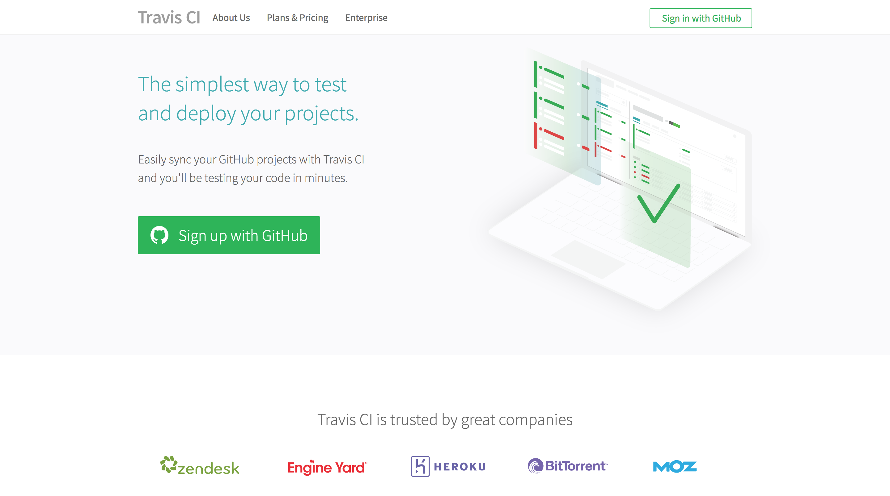

GitHub will ask you to authorize Travis CI. Click the `Authorize travis-pro` button.

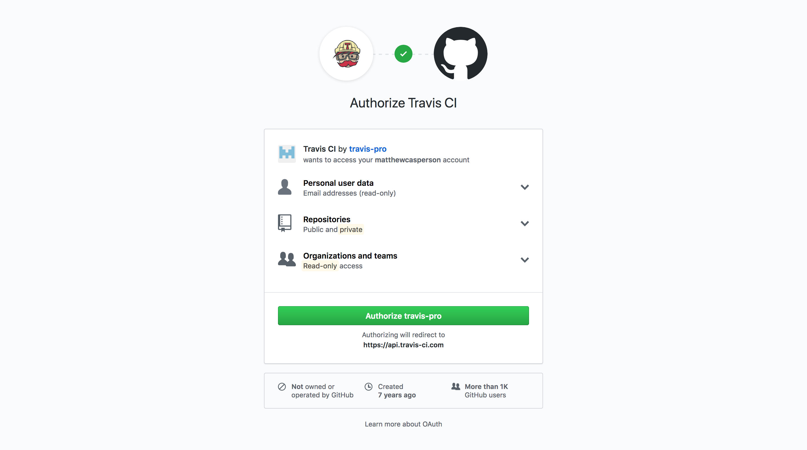

You will have to reenter your GitHub password and click the `Confirm password` button.

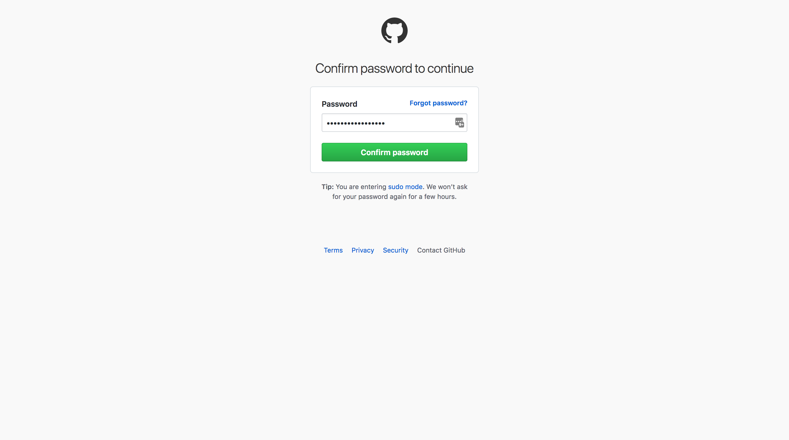

After a few seconds you will be taken to a screen where you can active the GitHub integration. Click the `Active` button.

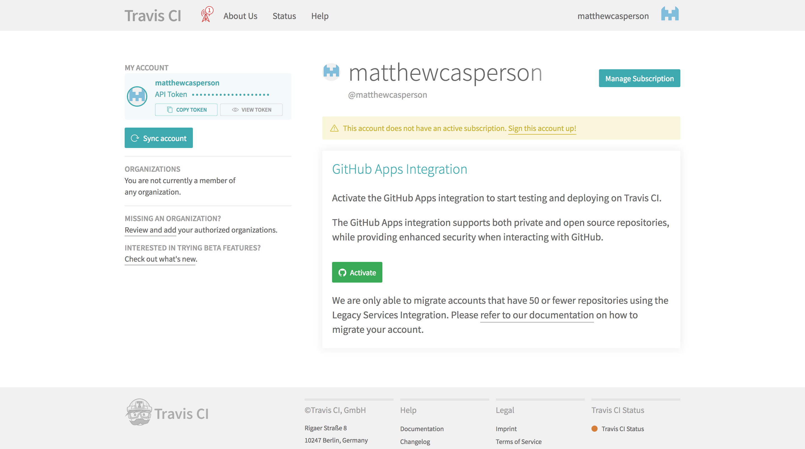

Select the `All repositories` option, and click the `Approve & Install` button.

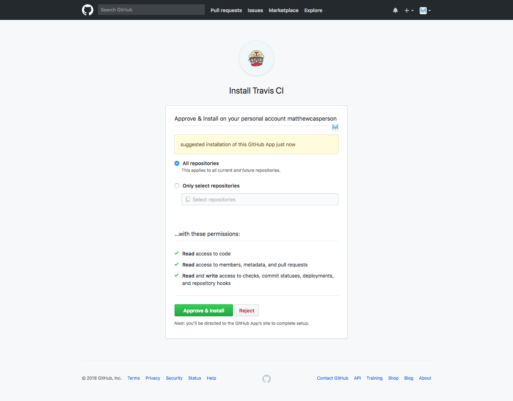

After a few seconds you will see the public GitHub repository created earlier.

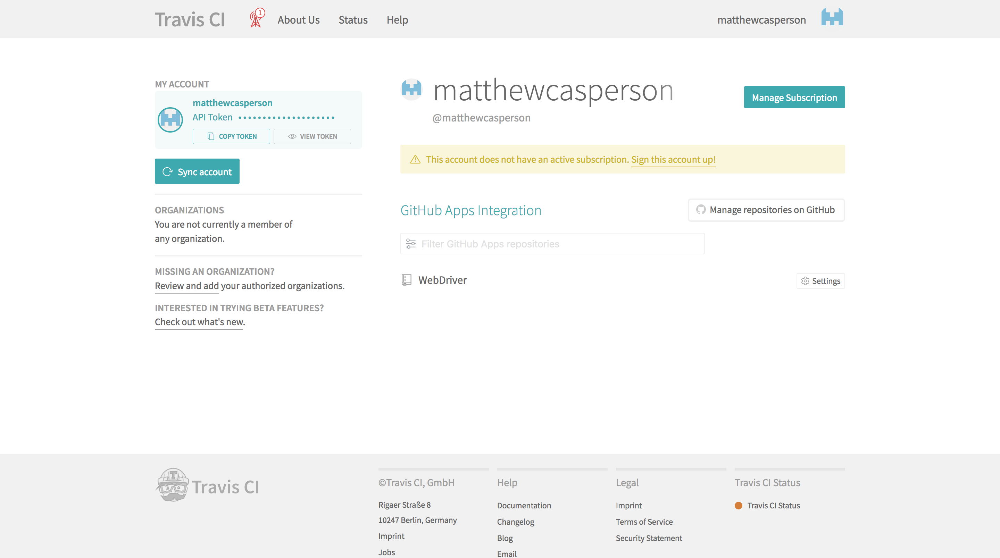

Click on the repository to be take to the list of builds. This list will be empty, because we have not added the required configuration file to the repository to allow Travis CI to build it. However we have now successfully linked Travis CI and GitHub together, which means that Travis CI will monitor the GitHub repository for changes. This is the first step in creating the Continuous Integration pipeline.

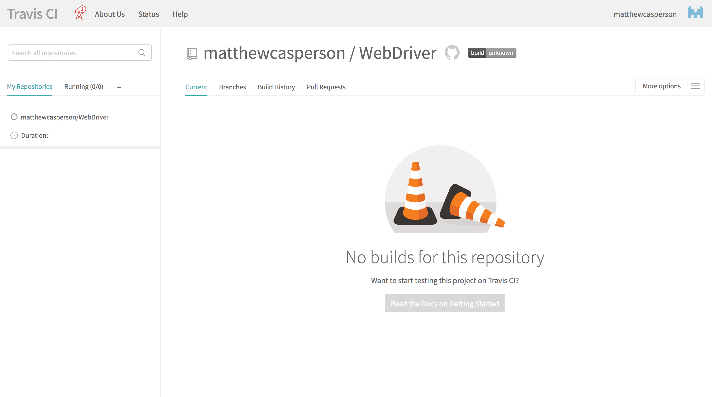

Travis CI and GitHub are now linked together, and the repository holding our Java application is being monitored by Travis CI for any check-ins. A check-in will trigger Travis CI to build our code and run our tests, but for Travis CI to know how to build our project we need to add a
special file to our repository called `.travis.yml`.

The `.travis.yml` file is a configuration file that Travis CI looks for in any repository it is motoring. This file contains the configuration required for Travis CI to build the code and run the tests.

Travis CI performs the builds on either a Linux or MacOS instance. We'll use Linux to do the builds, as Linux has a number useful tools we can take advantage of for our tests.

:::hint
Windows support is coming, but not available yet. See
[https://github.com/travis-ci/travis-ci/issues/2104](https://github.com/travis-ci/travis-ci/issues/2104) for more information on Windows support in Travis CI.
:::

Let's take a look at the complete `.travis.yml` file.

```yaml
sudo: required
dist: trusty
language: java
jdk:
- oraclejdk8
addons:
  firefox: "60.0"
before_install:
- sudo apt-get update
- sudo apt-get install dbus-x11
- export DISPLAY=:99.0
- sh -e /etc/init.d/xvfb start
- export CHROME_BIN=/usr/bin/google-chrome
- sudo apt-get install -y libappindicator1 fonts-liberation
- wget https://dl.google.com/linux/direct/google-chrome-stable_current_amd64.deb
- sudo dpkg -i google-chrome*.deb
- wget https://chromedriver.storage.googleapis.com/2.38/chromedriver_linux64.zip
- unzip chromedriver_linux64.zip
- sudo cp chromedriver /usr/bin
- wget https://github.com/mozilla/geckodriver/releases/download/v0.20.1/geckodriver-v0.20.1-linux64.tar.gz
- tar -xzf geckodriver-v0.20.1-linux64.tar.gz
- sudo cp geckodriver /usr/bin
```

Now let's break this file down.

The `sudo` option is used to indicate that the build should be done in an environment where the `sudo` command can be run or not. By setting this option to `required`, we have indicated that we need to have the ability to run `sudo` command, which means that Travis CI will run this build inside a virtual machine. If we had set this option to `false`, Travis CI would have created a container to run the build.

Containers are faster than virtual machines, but because we need to install some additional software into the build environment to support running WebDriver tests, we have to use the virtual machine option.

```yaml
sudo: required
```

The `dist` option configures the version of Ubuntu that our build will be run from. Ubuntu versions have alliterated names like "Precise Pangolin" and "Trusty Tahr". The `dist` option accepts a shorthand for these versions, and here we have indicates that we wish to use the Trusty Tahr version of Ubunutu (which is also known as version 14.04).

```yaml
dist: trusty
```

The `language` option defines the programming language of the code in the repository. We are writing out code in Java, so we set this option to `java`.

```yaml
language: java
```

The `jdk` option configures the JDK that is used to build the code. You have the option of using OpenJDK, which is the open source implementation of Java, or Oracle JDK, which is the Java distribution provided by Oracle. Either option is fine for our code, but we will go with the Oracle JDK.

:::hint
The issue at [https://github.com/travis-ci/travis-ci/issues/9368](https://github.com/travis-ci/travis-ci/issues/9368) is
tracking the addition of new versions of Java in Travis CI.
:::

```yaml
jdk:
- oraclejdk8
```

Travis CI offers a number of common applications that can be included in the build environment with the `addons` option, and Firefox is one of the applications provided. Here we have configured Firefox 60 to be installed.

```yaml
addons:
  firefox: "60.0"
```

The `before_install` option provides us with the ability to run raw scripting commands to customize our build environment even further before our code is built. Each item under this option is run as a separate command, much like a script file.

```yaml
before_install:
```

The `apt-get` command is how packages are installed in Ubuntu. Most Linux distributions maintain huge libraries of software that can be installed with package managers, and Ubuntu is no exception. The ability to download, install and update software with a single command like this is one of the reasons why Linux is so popular with developers.

Before we install any additional packages, we use the `update` command to refresh the list of available packages. This ensures that we install the latest versions of any applications when we call `apt-get` later on.

```yaml
- sudo apt-get update
```

When running Firefox from a Travis CI environment, a number of warnings like `(firefox:9067): GConf-WARNING **: Client failed to connect to the D-BUS daemon: are added to the log file.` These can be ignored, but are annoying. The solution, as indicated in the issue [https://github.com/travis-ci/travis-ci/issues/8520,](https://github.com/travis-ci/travis-ci/issues/8520) is to install the `dbus-x11` package.

```yaml
- sudo apt-get install dbus-x11
```

The next two commands configure and start Xvfb.

In previous posts we talked about how some systems are headless, which simply means that they do not have a monitor attached to them. The build environments used by Travis CI are an example of headless environments.

However there are situations, like when running automated tests against web browsers, when it is useful to have an environment that can run desktop applications, even without a monitor. Xvfb, which is short for X Virtual Frame Buffer, allows such desktop applications to run in headless environments. Xvfb creates a virtual monitor in memory, and desktop applications "draw" themselves to this virtual monitor.

:::hint
The X in Xvfb comes from the name X Window System, which is the windowing system used by the versions of Linux that can be run in Travis CI.
:::

By using Xvfb we can test browsers that don't have native support for running in headless environments, or run older versions of browsers like Chrome and Firefox that only recently gained native headless support.

Exporting the `DISPLAY` environment variable configures applications to draw themselves to screen `99`, which is the screen that Xvfb provides by default.

```yaml
- export DISPLAY=:99.0
```

We then manually start the `xvbf` service.

```yaml
- sh -e /etc/init.d/xvfb start
```

Exporting the `CHROME_BIN` environment variable ensures that the Chrome binary driver can locate and start Chrome as part of a test.

```yaml
- export CHROME_BIN=/usr/bin/google-chrome
```

These two commands commands install some dependencies required by Chrome.

```yaml
- sudo apt-get install -y libappindicator1 fonts-liberation
```

Unlike Firefox, Chrome is not available as an addon in Travis CI, so we have to manually install it ourselves. Here we download the Chrome package for Ubuntu using wget (which is a tool for downloading files in Linux), and install it with `dpkg`.

```yaml
- wget https://dl.google.com/linux/direct/google-chrome-stable_current_amd64.deb
- sudo dpkg -i google-chrome*.deb
```

Just as we installed the Chrome binary drivers to a directory on the `PATH` locally, we do the same for the Travis CI build environment. Here we download the Chrome binary driver, unzip it, and copy the executable to the `/usr/bin` directory. The `/usr/bin` directory is on the `PATH` already, which means that any executable copied there are available for our code to run.

```yaml
- wget
https://chromedriver.storage.googleapis.com/2.38/chromedriver_linux64.zip
- unzip chromedriver_linux64.zip
- sudo cp chromedriver /usr/bin
```

We do the same for the Firefox binary driver.

```yaml
- wget https://github.com/mozilla/geckodriver/releases/download/v0.20.1/geckodriver-v0.20.1-linux64.tar.gz
- tar -xzf geckodriver-v0.20.1-linux64.tar.gz
- sudo cp geckodriver /usr/bin
```

To create the `.travis.yml` file, right click on the project root folder and select `New` → `File`.


Enter the filename and click the `OK` button.

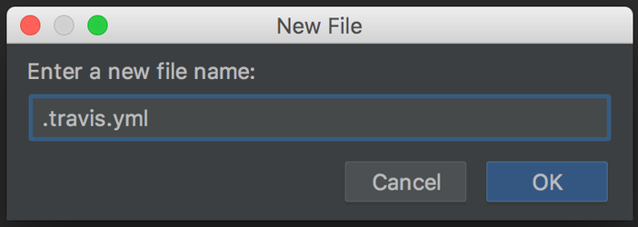

Populate the `.travis.yml` file and save the changes.

We need to push, or check-in, the changes to the remote repository. To do this right click on the project root directory and select `Git` → `Commit Directory`.

Enter a Commit Message, click the drop down arrow next to the `Commit` button, and click `Commit and Push`.

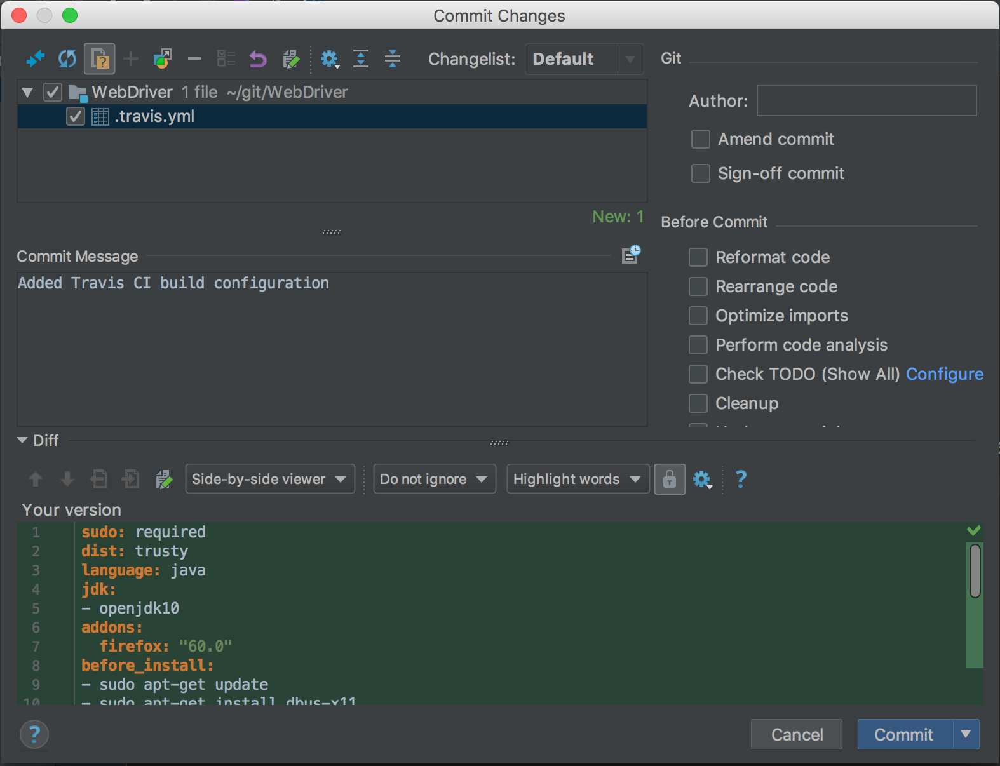

Click the Push button to check the changes into the remote repository.

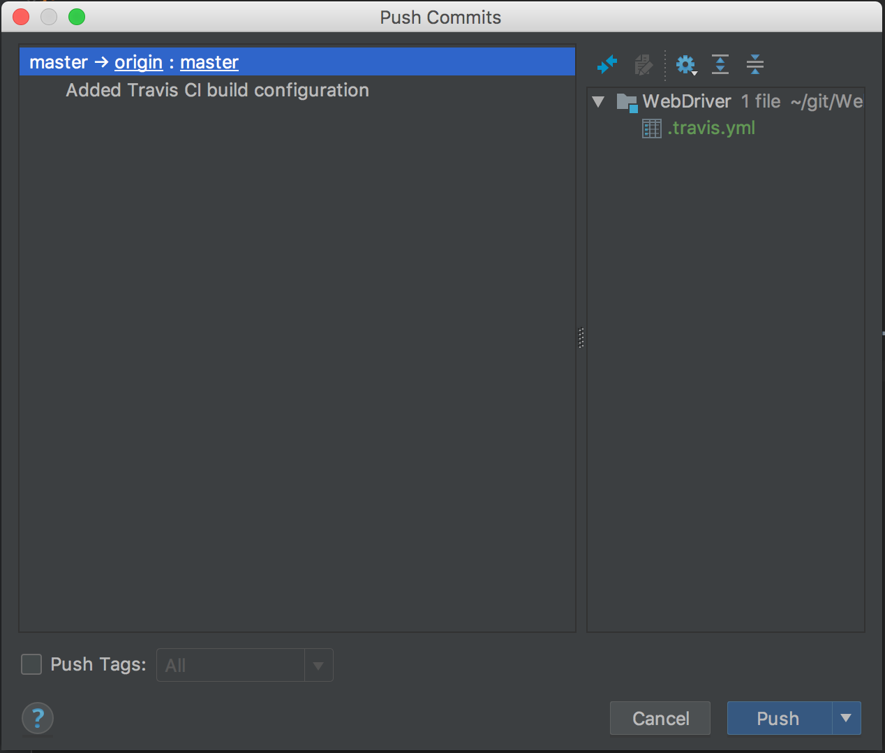

Once the push has completed the new file will be shown in the GitHub repository.

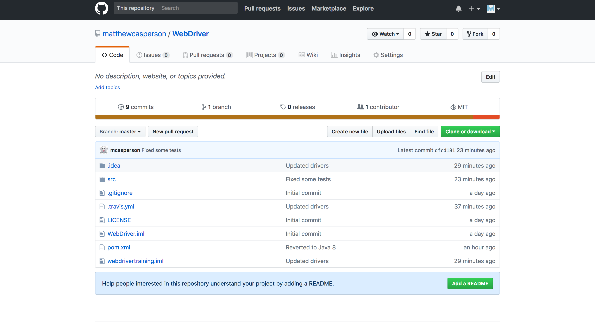

More importantly, Travis CI has detected the push to the GitHub repository and used the configuration in the `.travis.yml` file to build the project.

Travis CI recognizes that our project is build using Maven [because of the presence of the pom.xml file](https://docs.travis-ci.com/user/languages/java/#Projects-Using-Maven). It will then automatically install the Maven dependencies by running the command:

```
mvn install -DskipTests=true -Dmaven.javadoc.skip=true -B -V
```

And then run the tests by running the command:

```
mvn test -B
```

This all happens automatically for us without any additional
configuration. This means that when our code is checked-in to GitHub, Travis CI will get a copy of the code and run all the tests we have written.

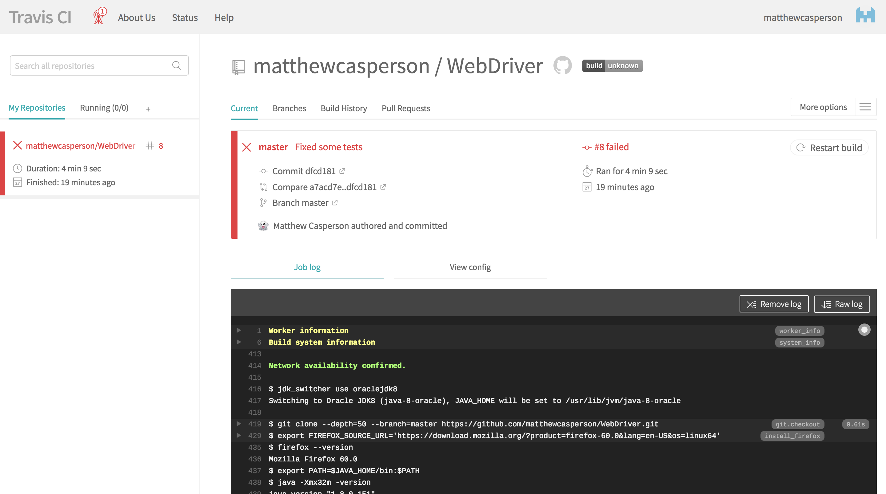

However there is a problem. If we look at the end of the log file we will see that some tests failed.

```
Results :

Tests in error:

browserStackAndroidTest(academy.learnprogramming.FormTest): Invalid
username or password (WARNING: The server did not provide any stacktrace
information)(..)

browserStackEdgeTest(academy.learnprogramming.FormTest): Invalid
username or password (WARNING: The server did not provide any stacktrace
information)(..)

Tests run: 19, Failures: 0, Errors: 2, Skipped: 1
```

These tests failed because the BrowserStack tests require that the username and password be stored in environment variables. Fortunately Travis CI provides an easy way to define environment variables for a build.

Click the `More Options` menu, and select the `Settings` option.


Under the Environment Variables add values for `BROWSERSTACK_USERNAME` and `BROWSERSTACK_KEY`. You can leave the `Display value` in build log disabled, which means that these values will be hidden from the logs generated by Travis CI. This is a useful way of keeping secret values from leaking into the log files.

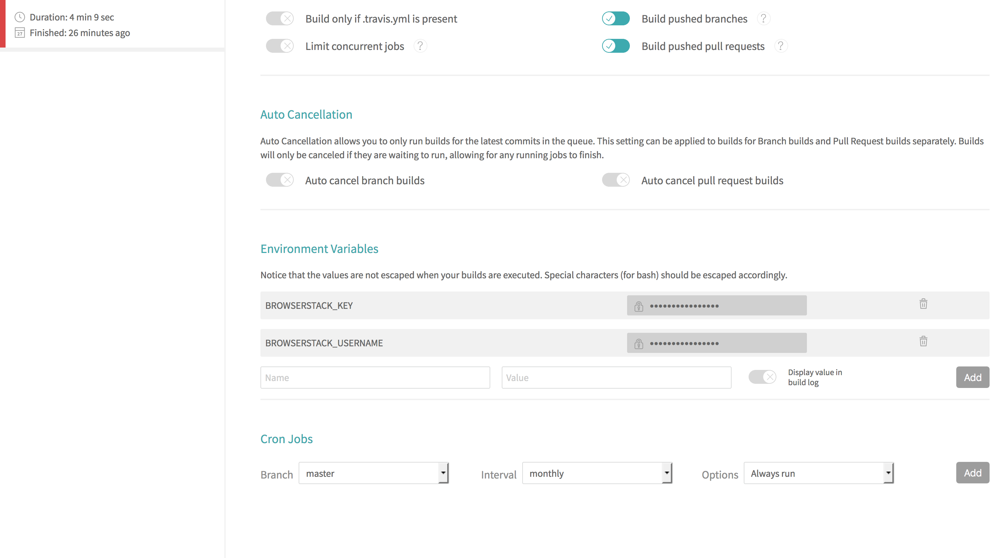

Click the build in the left hand menu, and then click `Restart build`. This will rebuild the code, but this time with the new environment variables.


This time the build, and the associated tests, completes successfully.

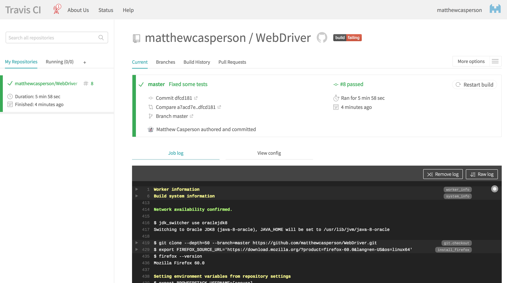

You may see log messages like these:

```
GLib-GObject-CRITICAL **: g_object_ref: assertion
'object-&gt;ref_count &gt; 0' failed
```

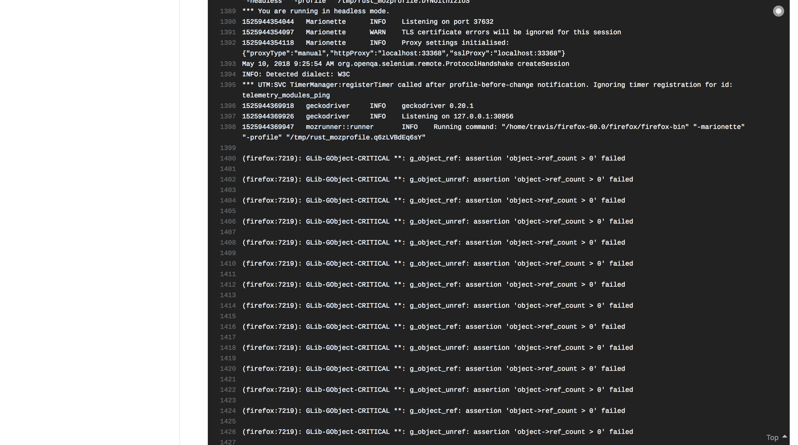

These can be ignored, as they don't affect the outcome of the tests.

We have now successfully checked-in code to a central Git repository hosted in GitHub, and Travis CI has detected the new code and automatically built it and run all the tests. This is the central idea to continuous integration, and it means that every time new code is checked-in it is automatically validated by our tests.

You can view the Travis CI build for the same project [here](https://travis-ci.org/OctopusDeploy/WebDriverTraining).
