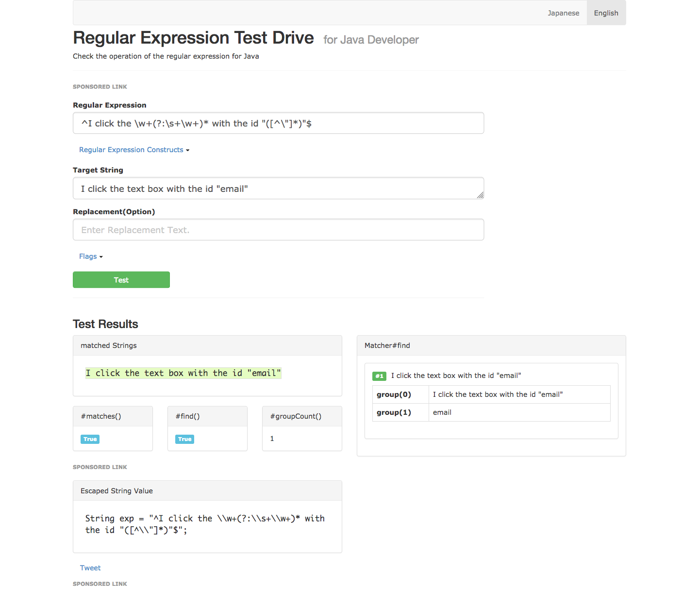
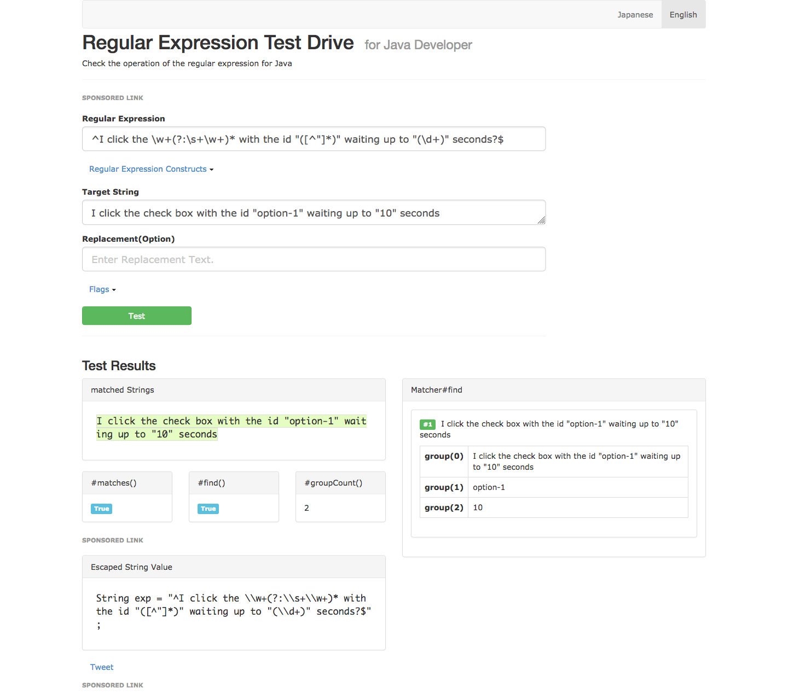
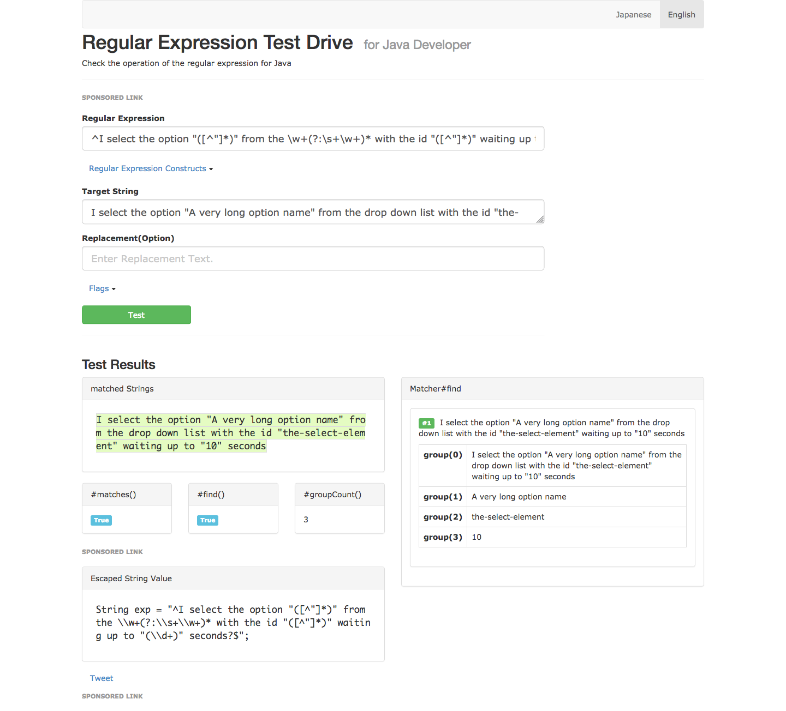

Now that we have the basics in place to integrate the `AutomatedBrowserBase` class with Cucumber, it is time to start fleshing out the Gherkin dialect that we can use to write WebDriver tests.

The next step in most tests after opening the browser is to open a URL. We can expose this by annotating the `goTo()` method.

We will use the regular expression `^I open the URL "([^\"]*)"$` to capture the URL that we wish to open and pass it to the `url` parameter. This regular expression follows the familiar pattern of using the caret and dollar signs to match the start and end of the string, some plain text that must be literally matched, and a single group inside quotes.

```java
@And("^I open the URL \"([^\"]*)\"$")
@Override
public void goTo(String url) {
  // ...
}
```

Now we need to expose some methods to interact with the web page. Here we have annotated the `clickElementWithId()` method.

```java
@And("^I click the \\w+(?:\\s+\\w+)* with the id \"([^\"]*)\"$")
@Override
public void clickElementWithId(String id) {
  // ...
}
```

The regular expression we use to expose this method as a step involves a few new concepts.

We have used some character classes to match common types of characters. A character class is a backslash followed by a character the defines the class.

The `\w` character class matches any word character, which means it matches any lowercase character, any uppercase character, and any number.

The `\s` character class matches any white space character, like a space or a tab.

You can find more information about regular expression character classes in the  [Oracle documentation](https://docs.oracle.com/javase/tutorial/essential/regex/pre_char_classes.html).

We also use a non-capture group in this regular expression. A non-capture group starts with `(?:` and ends with `)`. Non-capture groups are useful because they define matches that we can make optional or repeat, while not being captured as a distinct group when the pattern is matched to a string. This is important for the integration with Cucumber, because non-capture groups are not passed as parameters to the associated method.

The pattern `\\w+(?:\\s+\\w+)*` matches zero or more words separated by spaces. So the following strings will all match this pattern:

-   text box
-   drop down list
-   textarea
-   radio button
-   checkbox

We have used this pattern to allow the element being interacted with to
be described in what ever way is most natural. Because this pattern uses
a non-capture group, Cucumber will not pass the matching text as a
parameter to the method.

The table below is a breaks down the regular expression into its
individual components.

| Pattern	| Meaning |
|-|-|
| `^`	| Match the start of the string |
| `I click the` |	Match the literal string `I click the`  |
| `\\w+` |	Match one or more word characters  |
| `(?:`	| Start a non-capture group  |
| `\\s+` |	Match one or more white space characters  |
| `\\w+` | Match one or more word characters  |
| `)*` |	End the non-capture group, and match it zero or more times  |
| `with the id \"` |	Match the literal string `with the id "`  |
| `(`	| Start a capture group  |
| `[^"]*`	| Match any character except the double quote zero or more times  |
| `)`	| End the capture group  |
| `\"` |	Match the literal string `"`  |
| `$`	| Match the end of the string  |


To understand the kind of steps that will match this regular expression, enter it into [http://regex-testdrive.com/en/dotest](http://regex-testdrive.com/en/dotest) and test the following examples:

-   I click the text box with the id "email"
-   I click the check box with the id "option-1"
-   I click the big red button with the id "submit"



Notice that there are only ever two groups captured: group 0 being the entire string, and group 1 being the ID of the element we want to click. Group 1 is what is then passed as the first parameter to the method.

Next we expose the overloaded version of `clickElementWithId()` that implements explicit waits. This method has a second parameter called `waitTime` that takes an `int`.

```java
@And("^I click the \\w+(?:\\s+\\w+)* with the id \"([^\"]*)\" waiting up to \"(\\d+)\" seconds?$")
@Override
public void clickElementWithId(String id, int waitTime) {
  // ...
}
```

The regular expression for this method is similar to the previous one, but with an additional capture group to capture the amount of time to wait for the element to be clickable.

This regular expression uses a new character class of `\d`, which matches any number.

The table below is a breaks down the regular expression into its individual components.

| Pattern |	Meaning |
|-|-|
| `^`	| Match the start of the string |
| `I click the` |	Match the literal string `I click the` |
| `\\w+`	| Match one or more word characters |
| `(?:`	| Start a non-capture group |
| `\\s+`	| Match one or more white space characters |
| `\\w+`	| Match one or more word characters |
| `)*`	|End the non-capture group, and match it zero or more times |
with the id \"	| Match the literal string `with the id "` |
| `(`	|Start a capture group |
| `[^"]*`	|Match any character except the double quote zero or more times |
| `)`	|End the capture group |
| `\" waiting up to \"` |	Match the literal string `" waiting up to "` |
| `(`	| Start a capture group |
| `\\d+`	| Match one or more number characters |
| `)`	| End the capture group |
| `\" second`	| Match the literal string `" second` |
| `s?`	| Match zero or one instance of the `s` character |
| `$`	| Match the end of the string |


To understand the kind of steps that will match this regular expression, enter it into [http://regex-testdrive.com/en/dotest](http://regex-testdrive.com/en/dotest) and test the following examples:

-   I click the text box with the id "email" waiting up to "1" second
-   I click the check box with the id "option-1" waiting up to "10" seconds
-   I click the big red button with the id "submit" waiting up to "5" seconds



This regular expression has three capture groups. Again group 0 is the
entire string. As was the case with the previous regular expression,
group 1 is the ID of the element to click, and Cucumber passes this as
the first parameter to the method. The new group 2 captures the explicit
wait time, and Cucumber passes this as the second parameter to the
method.

Let's look at what will be one of the most complicated regular
expressions we'll use to define a step. The
`selectOptionByTextFromSelectWithId()` method takes the name of the option
in a drop down list to select, the ID of the drop down list, and the
time to wait for the drop down list to be clickable. This regular
expression therefor needs to have 3 capture groups.

```java
@And("^I select the option \"([^\"]*)\" from the \\w+(?:\\s+\\w+)* with the id \"([^\"]*)\" waiting up to \"(\\d+)\" seconds?$")
@Override
public void selectOptionByTextFromSelectWithId(String optionText, String
id, int waitTime) {
// ...
}
```

The table below is a breaks down the regular expression into its
individual components.

| Pattern	| Meaning |
|-|-|
| `^` |	Match the start of the string |
| `I select the option \"`	| Match the literal string `I select the option "` |
| `(`	| Start a capture group |
| `[^"]*` |	Match any character except the double quote zero or more times |
| `)` |	End the capture group |
| `\"` | from the	Match the literal string `" from the` |
| `\\w+` |	Match one or more word characters |
| `(?:` |	Start a non-capture group |
| `\\s+` |	Match one or more white space characters |
| `\\w+` |	Match one or more word characters |
| `)*` |	End the non-capture group, and match it zero or more times |
| `with the id \"` |	Match the literal string `with the id "` |
| `(` |	Start a capture group |
| `[^"]*` |	Match any character except the double quote zero or more times |
| `)` |	End a capture group |
| `\" waiting up to \"` |	Match the literal string `" waiting up to "` |
| `(` |	Start a capture group |
| `\\d+` |	Match one or more number characters |
| `)` |	End a capture group |
| `\"` | second	Match the literal string `" second` |
| `s?` |	Match zero or one instance of the `s` character |
| `$` |	Match the end of the string |


To understand the kind of steps that will match this regular expression,
enter it into [http://regex-testdrive.com/en/dotest](http://regex-testdrive.com/en/dotest) and test the
following examples:

-   I select the option "Option One" from the drop down list with the
    id "dropdownlist" waiting up to "1" second
-   I select the option "A very long option name" from the drop down
    list with the id "the-select-element" waiting up to "10" seconds
-   I select the option "This is also a long name" from the list of
    options with the id "alongid" waiting up to "5" seconds



Now we have 4 capture groups. As always group 0 is the entire string,
then the first capture group is the name of the option to select, the
second is the ID of the drop down list, and the third is the amount of
time to wait for the element to be clickable.

As you can see, regular expressions are incredibly powerful, and we have
only touched on a small number of the ways regular expressions can be
used to match strings. However, these regular expressions demonstrate
all the techniques that we will use when mapping methods to Gherkin
steps. All the remaining methods will use regular expressions with the
some combination of the capture groups, non-capture groups, character
classes and special characters that we have demonstrated with the
previous methods.

Return to the [table of contents](../0-toc/webdriver-toc.md).
