When running code as an AWS Lambda we are responsible for configuring the environment every time the application is run. Although Lambda is often referred to as "serverless" computing (which inspired the name for the Serverless application we installed in the last post), there is still a server involved. The term serverless refers to the fact that the server does not need to be provided or managed by us as the end user, and for the most part we can run our code without worrying too much about the details of the server that will be hosting it.

However running WebDriver tests against a headless Chrome browser does require us to configure the environment to ensure that the resources we need are available. Namely, we need to have the Chrome browser and the binary driver available for WebDriver to use.

Despite the fact that our code will be running on a Linux server, we don't have the luxury of installing Chrome from a package manager. In fact we can't even download and run a standard distribution of Chrome, because the Linux environment that hosts Lambda functions is not quite standard enough for these official builds to work.

There is a detailed post on [Medium](https://medium.com/@marco.luethy/running-headless-chrome-on-aws-lambda-fa82ad33a9eb) that talks about how a custom build of Chrome can be compiled to run in the Lambda environment. Needless to say, the process of building Chrome for Lambda is not particularly easy. The good news is that the author of the blog post has automated the process, and offers regularly updated builds of Chrome for Lambda at [https://github.com/adieuadieu/serverless-chrome/releases](https://github.com/adieuadieu/serverless-chrome/releases). We will be using these releases for our own environment.

The second resource that we need to configure is the Chrome binary driver. As we did when running WebDriver tests locally, this binary driver needs to be downloaded, extracted and configured as part of our tests.

When running tests locally it was convenient to place this binary driver in a directory on the `PATH`. We don't have this luxury in the Lambda environment, as it is heavily restricted and we do not have permissions to place files in the locations that might normally be on the `PATH`. But this is OK, as we saw in an earlier post, we can set the `webdriver.chrome.driver` system property to point to the location of the binary driver.

Lambda also places restrictions on the size of the Lambda package. Today we are limited to a package size of 50MB. As we will see in the next post, our code already takes up a significant amount of that limit, and does not leave enough room to also package files like the Chrome distribution and the binary driver.

Lambda does allow us to download and extract additional files at run time though, and we will take advantage of this by downloading the Chrome distribution and drivers with each test. To make the process of downloading these files as fast as possible, we need to host them in S3, which can be accessed by a Lambda function over a high speed connection because both Lambda and S3 are services hosted by AWS.

First we need to download these files locally. Open up [https://github.com/adieuadieu/serverless-chrome/releases](https://github.com/adieuadieu/serverless-chrome/releases) and download version 64 of the Chrome distribution.

In my testing, versions 65, 66 and 67 did not work correctly when called from an AWS Lambda, so we have to specifically use version 64.

:::warning
The fact that some versions of Chrome don't work highlights that the code we are using here should be considered experimental.
:::

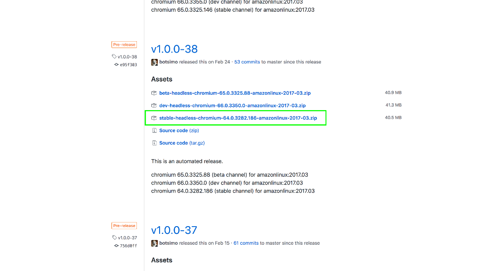

Then open [https://sites.google.com/a/chromium.org/chromedriver/downloads](https://sites.google.com/a/chromium.org/chromedriver/downloads) to find the version of the Linux binary driver that supports Chrome 64. From the list of drivers we can see that version 2.37 supports Chrome 64.

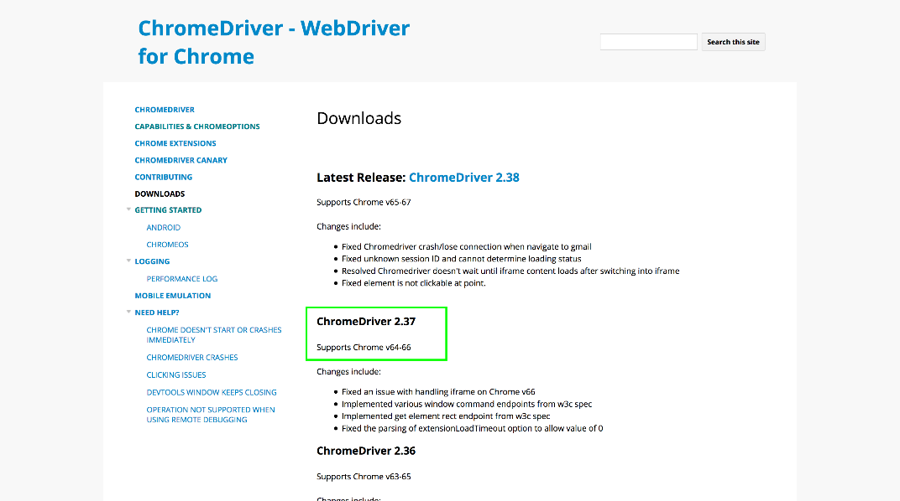

Open [https://chromedriver.storage.googleapis.com/index.html?path=2.37/](https://chromedriver.storage.googleapis.com/index.html?path=2.37/) to download the Linux binary driver.

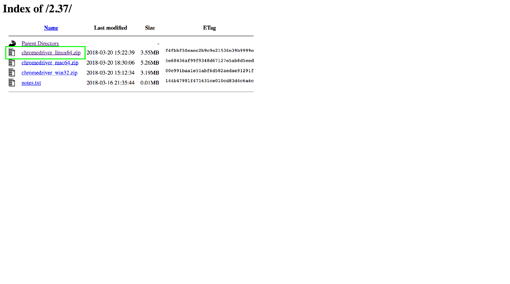

We'll then upload these files to S3 in the same way that we created our test public web site.

From the AWS console select {{Services,S3}}.

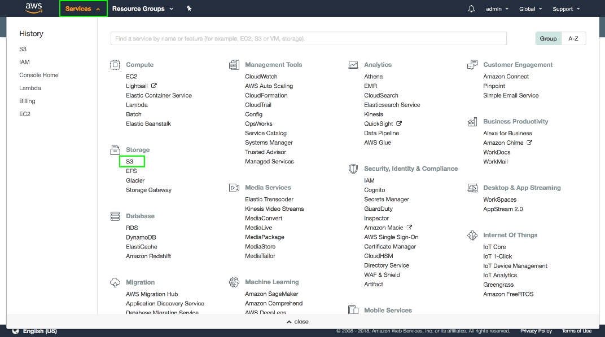

We'll create a new bucket to hold these files, so click the `Create bucket` button.

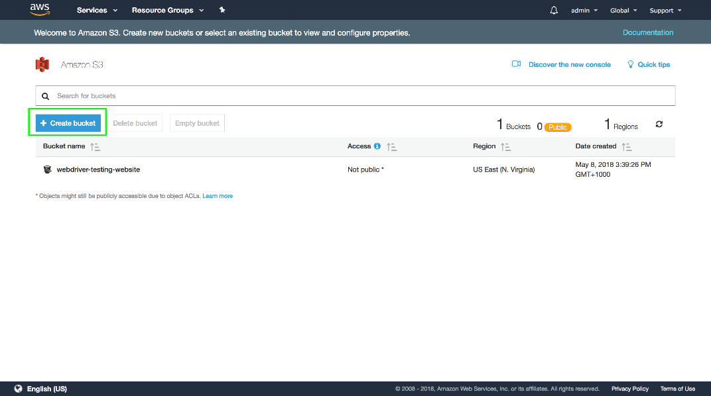

Give your bucket a name, and click the `Create` button.

:::hint
Remember that bucket names have to be globally unique, so you won't be able to use the name that is shown here.
:::

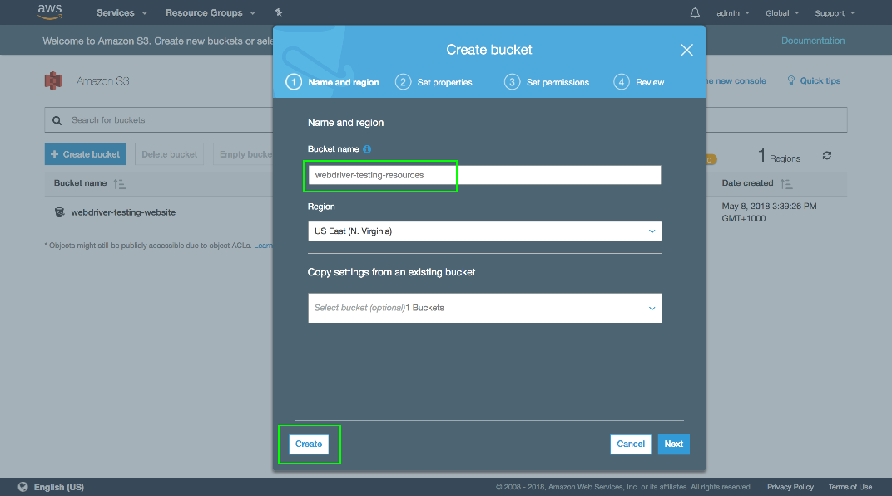

Open the newly created bucket.

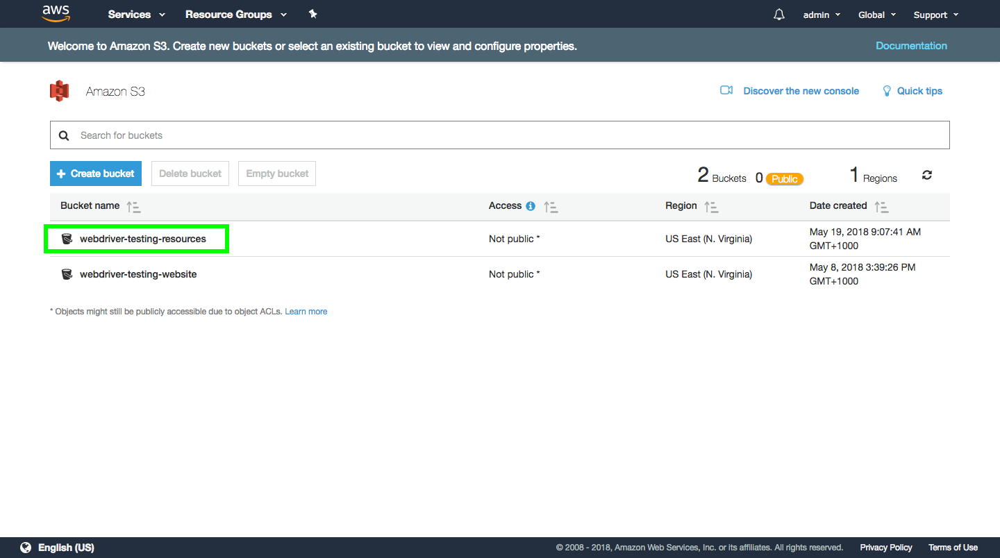

Click the `Upload` button.

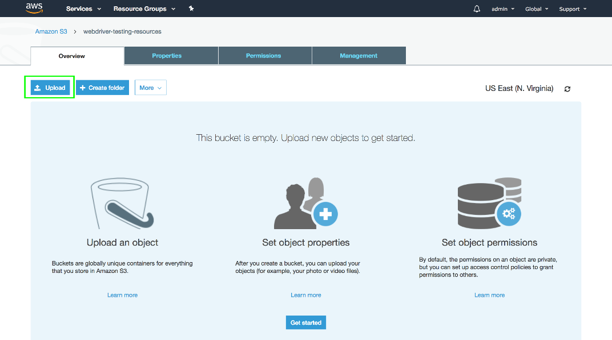

Click the `Add files` button.

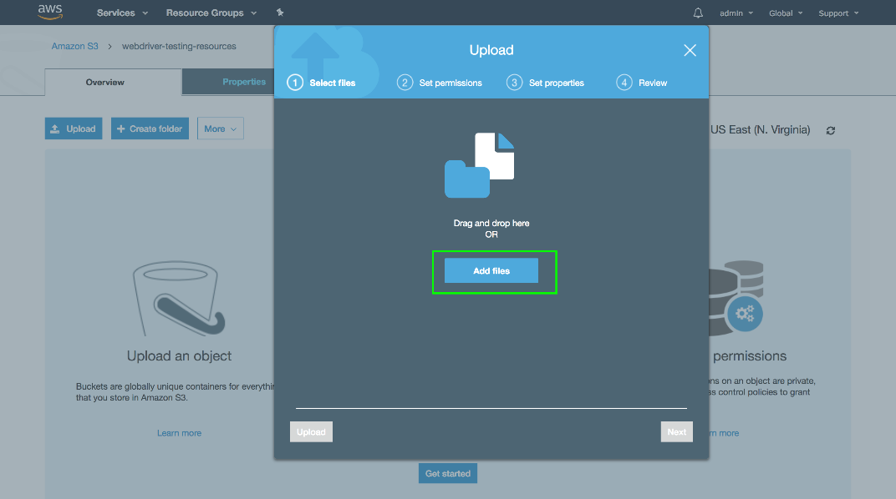

Select the two files that were downloaded earlier.

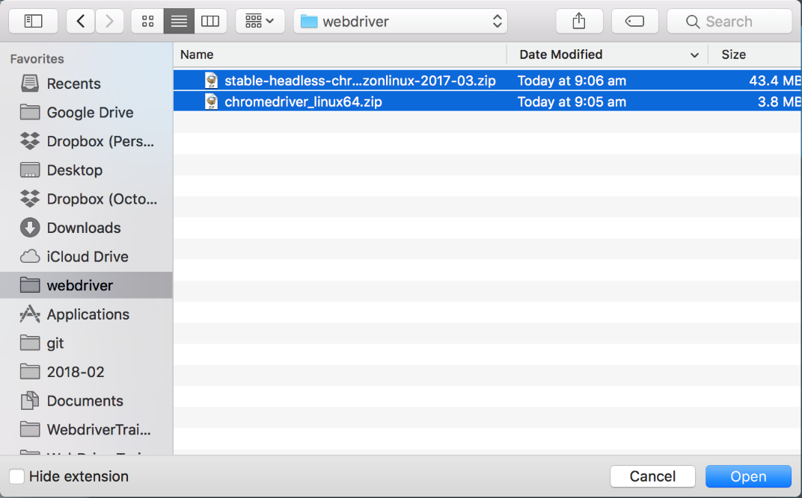

Click the `Upload` button.

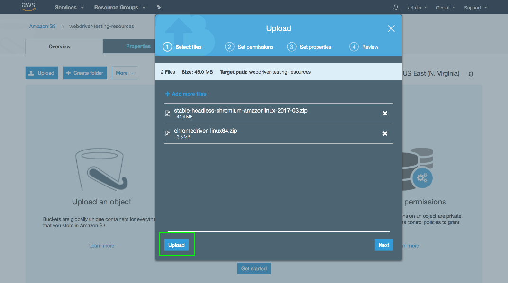

Once the files are uploaded, select them and click {{More,Make Public}}.

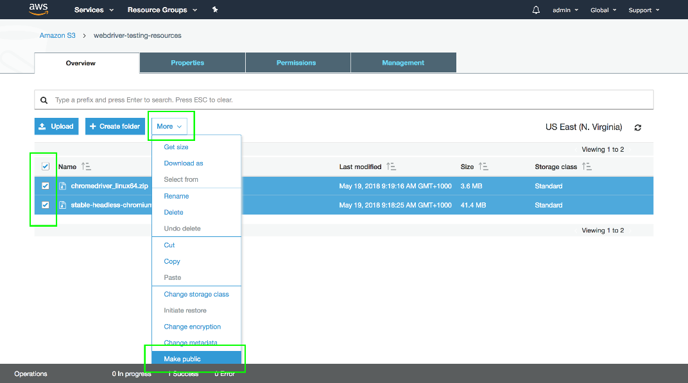

Then click the `Make public` button.

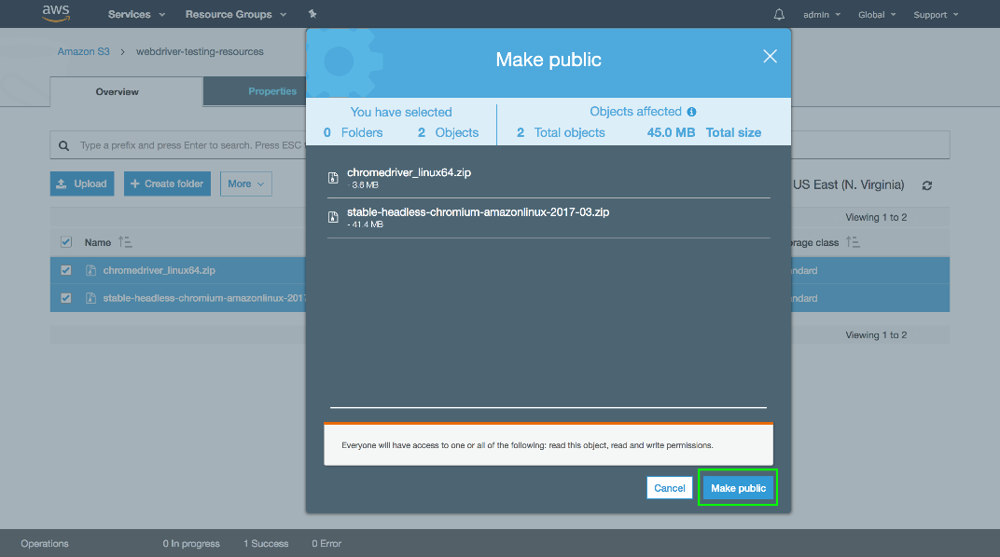

To find the URL that can be used to download these files, click the file and look at the link in the `Overview` tab. Make a note of these URLs as we will need them in later posts to download the files and prepare the Lambda environment.

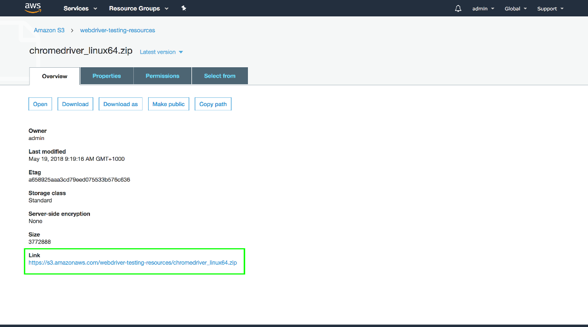

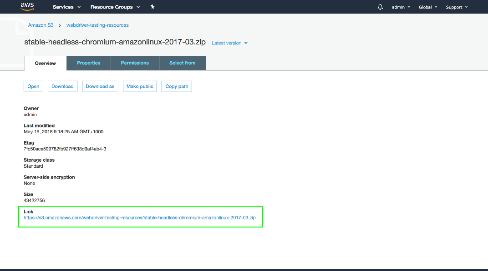

With both the custom Chrome distribution and the appropriate Chrome driver uploaded to S3, we can move on to creating a package that contains the Java code that will be executed as a Lambda function.

Return to the [table of contents](../0-toc/webdriver-toc.md).
