## The first test

Now that we have the Maven project configured and imported in IntelliJ, we can start adding some tests.

The test classes will be created in the directory `src/test/java/com/octopus`. Maven has a standard directory structure that places test classes under the `src/test/java` directory, while the test classes themselves will be in the `com.octopus` package, which maps to the `com/octopus` directory structure.

To create the new directory, right click on the top level project folder, select `New` → `Directory`.

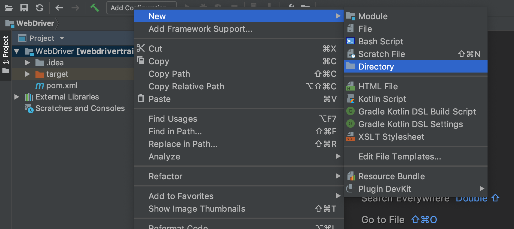

Enter `src/test/java/com/octopus` as the directory name and
click the `OK` button.


The new directory structure will be created. However IntelliJ does not yet recognize the new directories as locations where Java source files will be found. To refresh the IntelliJ project, which will result in these new directories being identified, click the `Reimport All Maven
Projects` button in the `Maven Projects` tool window.

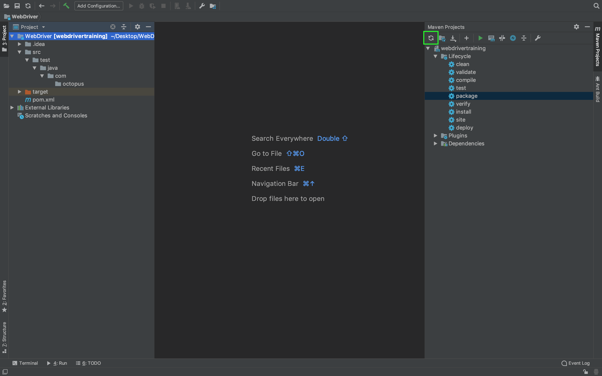

Notice now that the `java` folder has a green icon. This is an indication that IntelliJ recognizes this folder as one that contains Java source files.

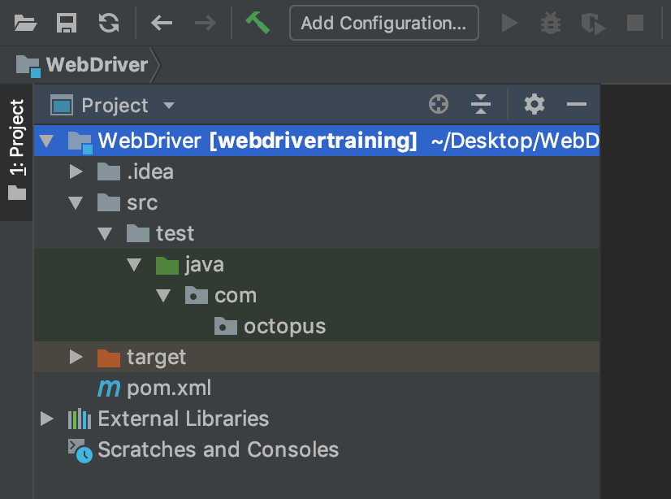

Inside `octopus` directory we will create a class called
`InitialTest`. To do this right click on the `octopus` directory and select `New` → `Java Class`.

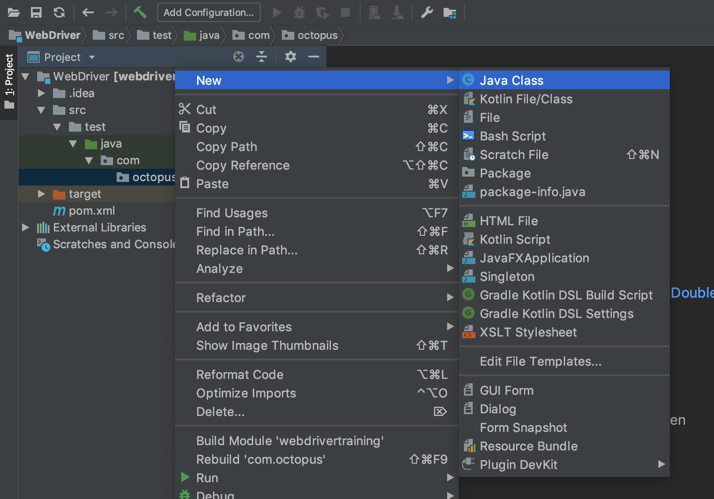

Enter `InitialTest` as the class name and click the `OK` button.

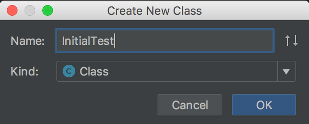

Replace the default class code with the following contents:

```java
package com.octopus;

import org.junit.Test;

import org.openqa.selenium.chrome.ChromeDriver;

public class InitialTest {
  @Test
  public void openURL() {
    final ChromeDriver chromeDriver = new ChromeDriver();
    chromeDriver.get("https://octopus.com/");
    chromeDriver.quit();
  }
}
```

Let's break this code down.

The first step is to get an instance of the driver class that matches the browser that will be under our control. In this case the browser that we wish to control is Google Chrome, whose corresponding driver class is `ChromeDriver`. This class comes from the `org.seleniumhq.selenium:selenium-java` dependency we added in the last lecture.

```java
final ChromeDriver chromeDriver = new ChromeDriver();
```

Next we use the `get()` method to open up a URL. This is equivalent to entering the URL into the address bar and hitting the enter key.

```java
chromeDriver.get("https://octopus.com/");
```

Finally we call the `quit()` method to close the browser and shutdown the driver.

```java
chromeDriver.quit();
```

To run the test in IntelliJ, click the green icon next to the `openURL` method and click `Run openURL()`.

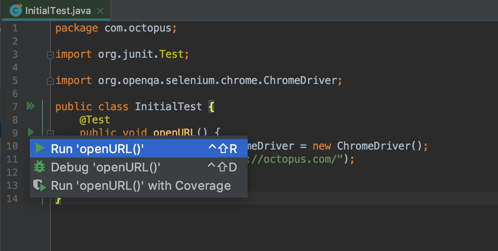

Running this test then gives us the following error:

```
java.lang.IllegalStateException: The path to the driver executable must be set by the webdriver.chrome.driver system property; for more information, see
https://github.com/SeleniumHQ/selenium/wiki/ChromeDriver. The latest version can be downloaded from
http://chromedriver.storage.googleapis.com/index.html
```

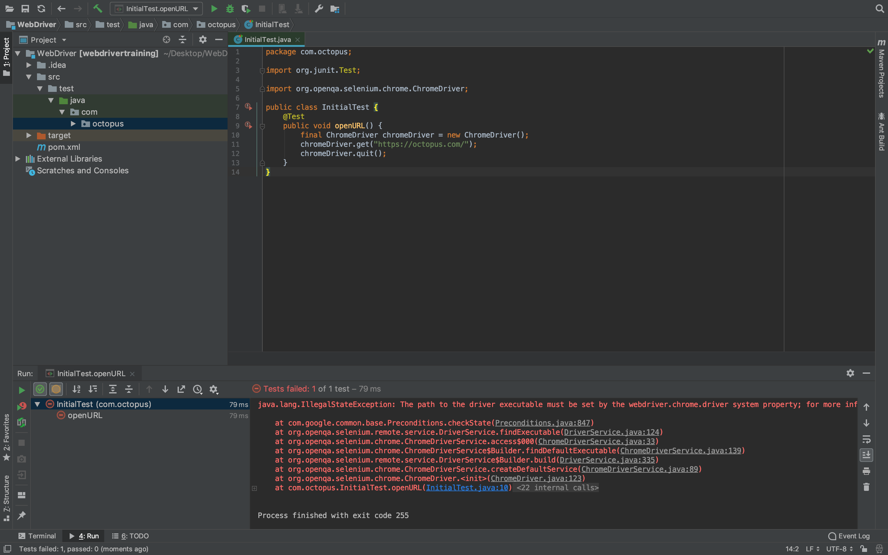

The `IllegalStateException` exception was thrown when we attempted to run the test because the driver executable could not be found. Helpfully the error points us to <http://chromedriver.storage.googleapis.com/index.html>, where the driver can be downloaded.

Opening this link reveals a number of directories that correspond to the version of the driver executable. You will almost always want to get the latest version, although the sorting applied to the list does not make the latest version apparent.

In the screenshot below you can see that the directories are sorted using a string comparison, which results in version 2.4 appearing after version 2.37. However from this list (and these versions will have changed by the time you read this) you actually want to download version 2.37, because this is the latest version available.

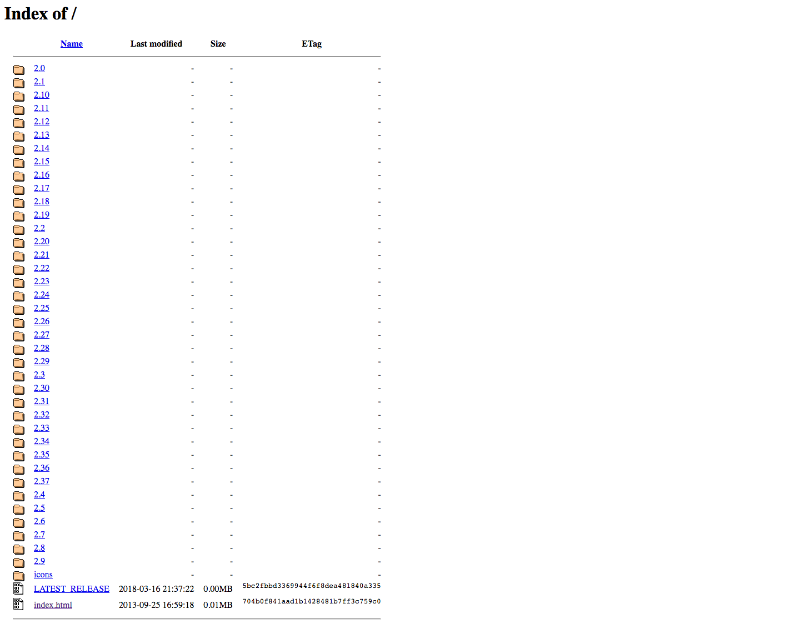

Alternatively you can visit the website at
<https://sites.google.com/a/chromium.org/chromedriver/downloads>, which will provide a direct link to the latest version.

Inside the directory you will find a number of zip files corresponding to the platform you are running the test against.


Inside these zip files is the driver executable. For Linux and Mac users, the executable is called `chromedriver`, while for Windows users it is called `chromedriver.exe`.

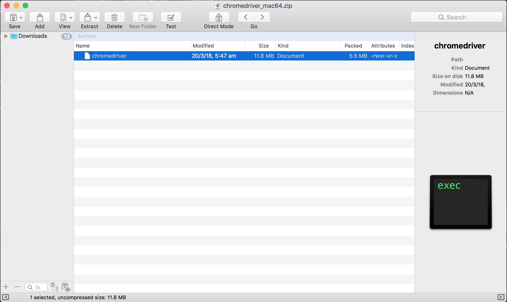

The exception message tells us that we need to set the `webdriver.chrome.driver` system property to the location of the executable we extracted from the zip file.

This is done by configuring the `maven-surefire-plugin` in the `pom.xml` file. Below is a snippet showing the new plugin configuration.

```xml
<project xmlns="http://maven.apache.org/POM/4.0.0"
xmlns:xsi="http://www.w3.org/2001/XMLSchema-instance"
xsi:schemaLocation="http://maven.apache.org/POM/4.0.0
http://maven.apache.org/xsd/maven-4.0.0.xsd">

  <!-- ... -->

  <build>
    <plugins>

    <!-- ... -->

    <!--
    This is the configuration that has been added to define the webdriver.chrome.driver system property during a test.
    -->

      <plugin>
        <groupId>org.apache.maven.plugins</groupId>
        <artifactId>maven-surefire-plugin</artifactId>
        <version>2.21.0</version>
        <configuration>
          <systemPropertyVariables>
          <!--
          This element defines the webdriver.chrome.driver
          system property.
          -->
          <webdriver.chrome.driver>/Users/Shared/tools/chromedriver</webdriver.chrome.driver>
          </systemPropertyVariables>
        </configuration>
      </plugin>
    </plugins>
  </build>
</project>
```

In this example I have extracted the driver executable to
`/Users/Shared/tools/chromedriver`.

The alternative to defining the `webdriver.chrome.driver` system property is to place the driver executable on in a directory found in the `PATH` environment variable. When the driver executable is found on the `PATH`, you do not need to configure the `<systemPropertyVariables>` element as we did above, as the file can be automatically found.

On a MacOS system, you can add new directories to the `PATH` environment variable by adding the directory to the file `/etc/paths`.

In the example below you can see from the output of the `cat` command (which prints the contents of a file to the screen) that the directory `/Users/Shared/tools` has been added to the `/etc/paths` file.

```
$ cat /etc/paths

/usr/local/bin
/usr/bin
/bin
/usr/sbin
/sbin
/Users/Shared/tools
```

You many need to log out and back in again for this change to take effect, and once it has you can confirm that the new directory is in the `PATH` environment variable by running `echo $PATH`.

```
$ echo $PATH

/opt/local/bin:/opt/local/sbin:/usr/local/bin:/usr/bin:/bin:/usr/sbin:/sbin:/Users/Shared/tools
```

In Linux distributions like Ubuntu, additional custom software is typically installed into the `/opt` directory. For example, you may save the Chrome driver executable to `/opt/tools/chromedriver`.

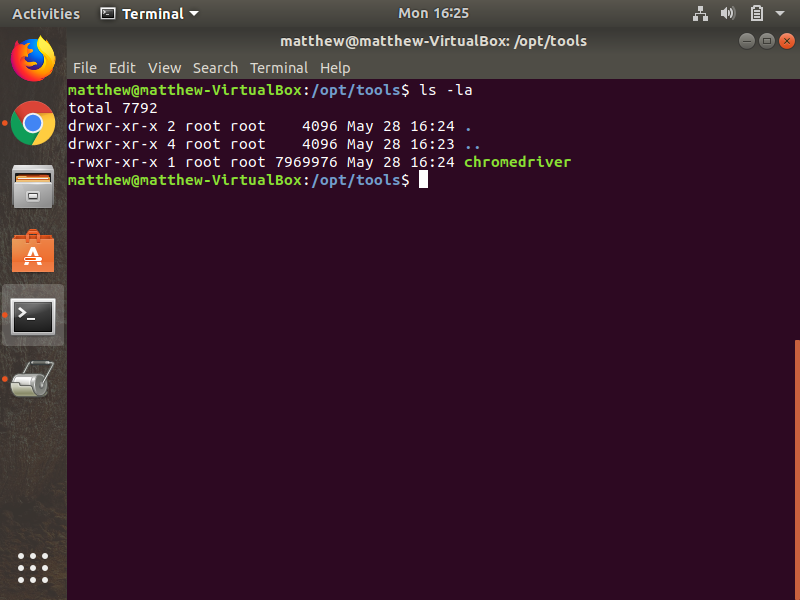

To add the `/opt/tools` directory to the `PATH`, add it to the `PATH` variable in `/etc/environment`. In the screenshot below you can see that `/opt/tools` has been added to the end of the list of directories already assigned to the `PATH` environment variable. You may need to log out and back in for the change to take effect once you edit the `/etc/environment` file.

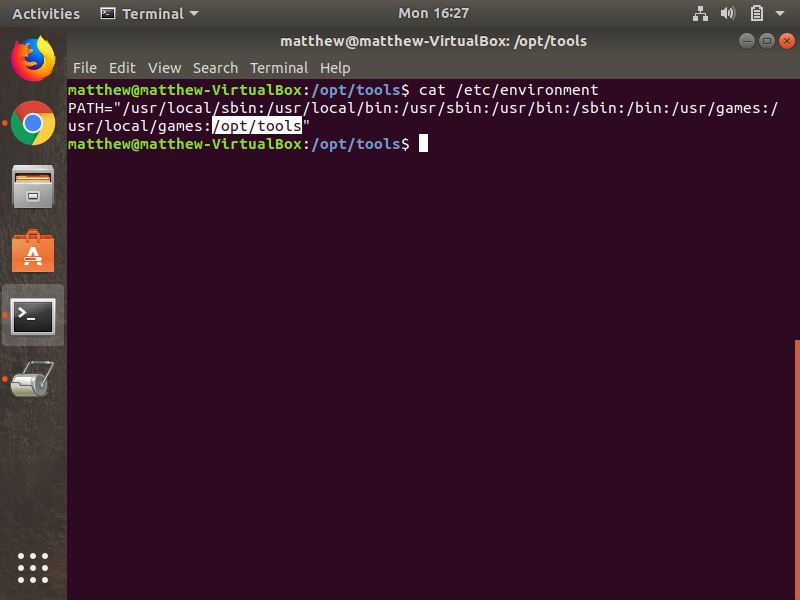

In Windows you may want to save the driver to a path like
`C:\tools\chromedriver.exe`. To add this directory to the `PATH`, we need to edit the system properties.

To see the system properties, click the Windows Key + R to open the `Run` dialog, and enter `control sysdm.cpl,,3` as the command to run. Click the `OK` button.

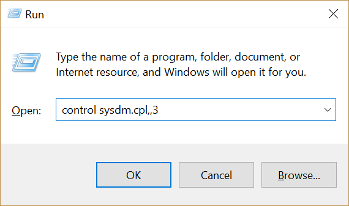

This will open the `System Properties` dialog box. Click the `Environment Variables` button.

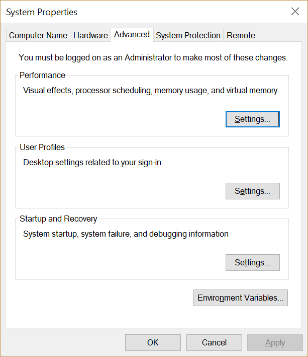

The environment variables are split between those at the top, which are specific to the current user, and those at the bottom, which are shared among all users. Both lists will have a `Path` variable. We'll edit the `System variables` to ensure the driver executables are available for all users, so double click the Path item in the `System variables` list.

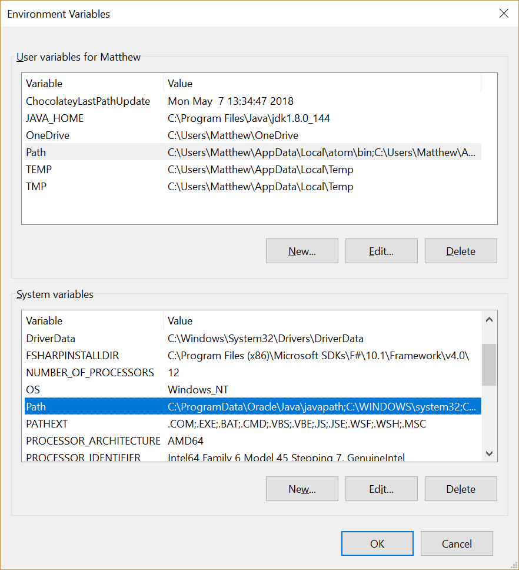

Click the `New` button to add a new path to the environment variable.

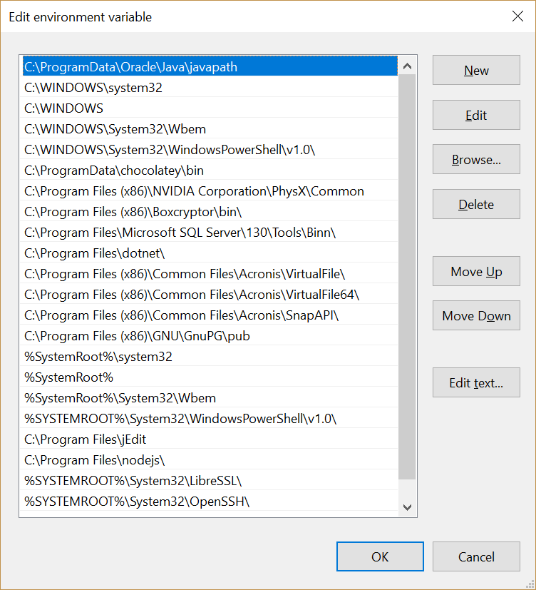

Add `C:\tools` to the list. Then click the `OK` button on all the open dialogs to save the changes.

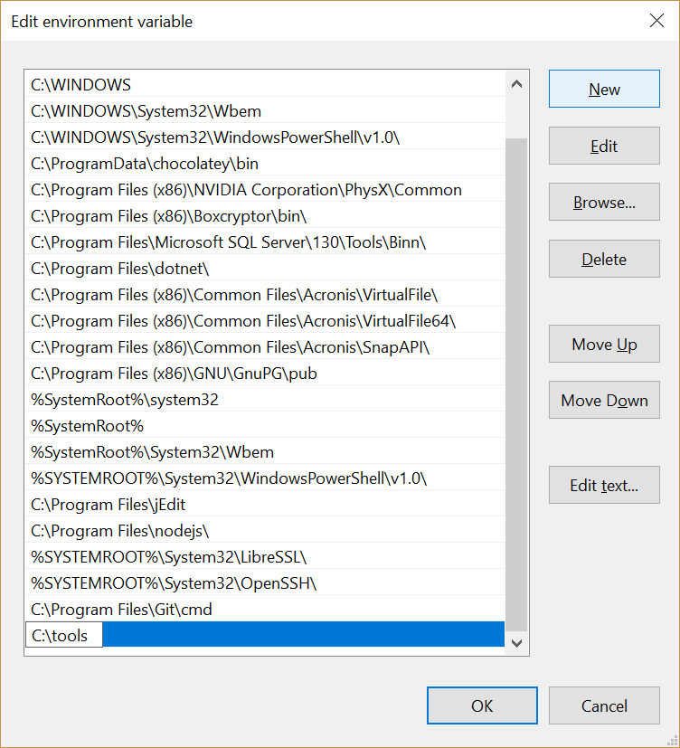

Given the option adding the driver executable to the path or setting the `webdriver.chrome.driver` system property, I usually prefer to extract the driver executables into a directory in the `PATH` environment variable. Having the driver executables for each browser saved in a common location will make it easier to switch between browsers without having to remember the specific system property to define for each, or juggle different file names depending on the operating system the test is running on.

So at this point we can now run the test without error. You will notice the Chrome browser launch, open up <https://octopus.com/>, and close again. We have now successfully run our first WebDriver test.

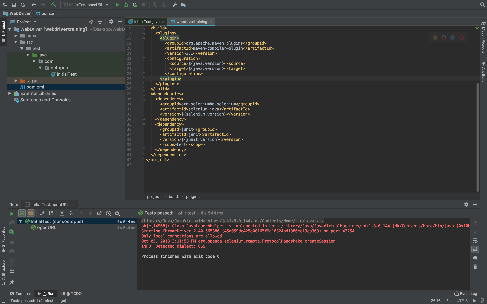

You will notice though that the browser window opened and closed quite quickly. In fact you may not have even seen the browser window at all.

Sometimes it is useful to leave the browser open after a test has run. Especially when debugging tests it is convenient to be able to interact with the browser directly after a test has failed in order to determine the reason for the test failure.

Leaving the browser open is as simple as not calling the `quit()` method on the driver object. Since it is the call to the `quit()` method that closes the browser and shuts down the driver, not making this call will leave the browser open after the test has finished.

In the code below I have commented out the call to `chromeDriver.quit()`, and so when this test is run the Chrome browser it launches will remain open on the screen.

```java
package com.octopus;

import org.junit.Test;

import org.openqa.selenium.chrome.ChromeDriver;

public class InitialTest {
  @Test
  public void openURL() {
    final ChromeDriver chromeDriver = new ChromeDriver();
    chromeDriver.get("https://octopus.com/");
    //chromeDriver.quit();
  }
}
```

A word of warning though. Not calling the `quit()` method will leave running instances of the driver executable, and it is up to you to manually end these processes.

In the screenshot below you can see a number of `chromedriver` instances that have been left running because the driver's `quit()` method was not called. These instance have to be manually stopped, otherwise they will continue to accumulate with each test run, with each instancing consuming additional system memory.

This screenshot shows the MacOS Activity Monitor, and in it we can see instances of `chromedriver` have been left running after the test has completed. These will need to be manually closed to reclaim the
resources that they consume.

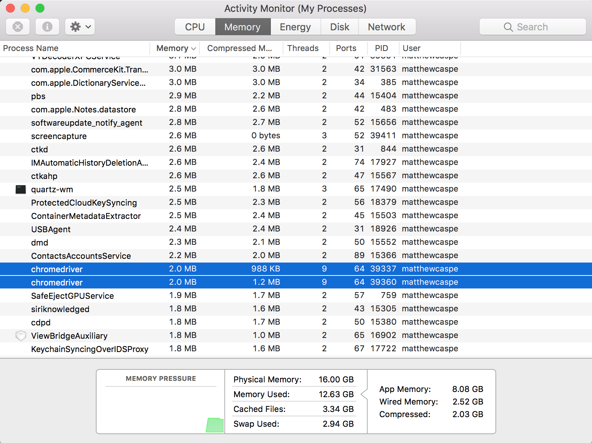

Notice that when Chrome is being controlled by WebDriver, it displays a warning message saying Chrome is being controlled by automated test software. This is a security feature in Chrome to let users know when their browser is being controlled by software written with the WebDriver API. This warning can not be closed or prevented using WebDriver, although it can be manually closed.

:::hint
It was possible in previous versions of Chrome to disable this bar using the `--disable-infobars` argument, but this option was removed because it could be misused for malicious purposes. See <https://chromium.googlesource.com/chromium/src/+/d869ab3350d8ebd95222b4a47adf87ce3d3214b1> for more details on why this option was removed.
:::

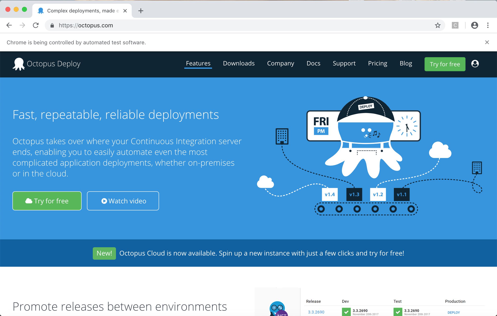

And with that we have a simple but fully functional WebDriver test controlling the Chrome web browser, giving us a foundation on which to start building some more advanced tests.

## Firefox tests

For our tests to launch Firefox, it needs to be installed. Firefox can be downloaded from https://firefox.com.

Then the `geckodriver` executable needs to be placed on the path from one of the platform specific downloads available from https://github.com/mozilla/geckodriver/releases.

The executable name for MacOS and Linux is `geckodriver`, and for Windows it is `geckodriver.exe`.

Finally an instance of the `FirefoxDriver` class is created. This class has the same `get()` method as the `ChromeDriver` class, because they both inherit from `RemoteWebDriver`.

You can see the `FirefoxDriver` class being created in the new `openURLFirefox()` method shown below.

```java
package com.octopus;

import org.junit.Test;
import org.openqa.selenium.chrome.ChromeDriver;
import org.openqa.selenium.firefox.FirefoxDriver;

public class InitialTest {
    @Test
    public void openURL() {
        final ChromeDriver chromeDriver = new ChromeDriver();
        chromeDriver.get("https://octopus.com/");
        chromeDriver.quit();
    }

    @Test
    public void openURLFirefox() {
        final FirefoxDriver firefoxDriver = new FirefoxDriver();
        firefoxDriver.get("https://octopus.com/");
        firefoxDriver.quit();
    }
}
```

Running the `openURLFirefox()` unit test will open the Firefox browser, open the page at https://octopus.com/, and then close the browser again.
