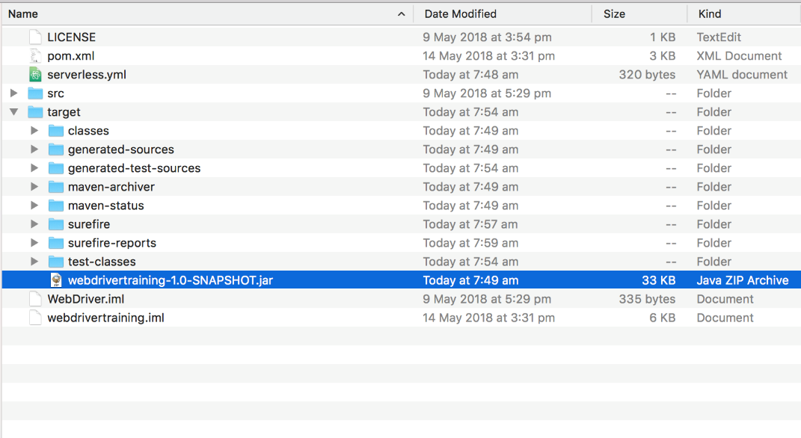
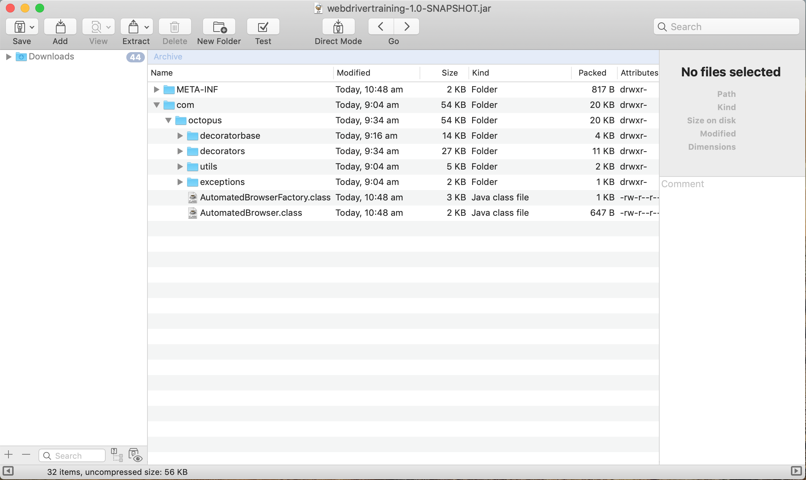
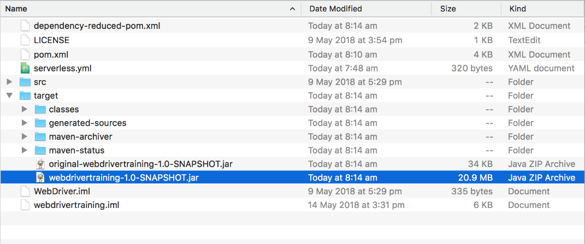
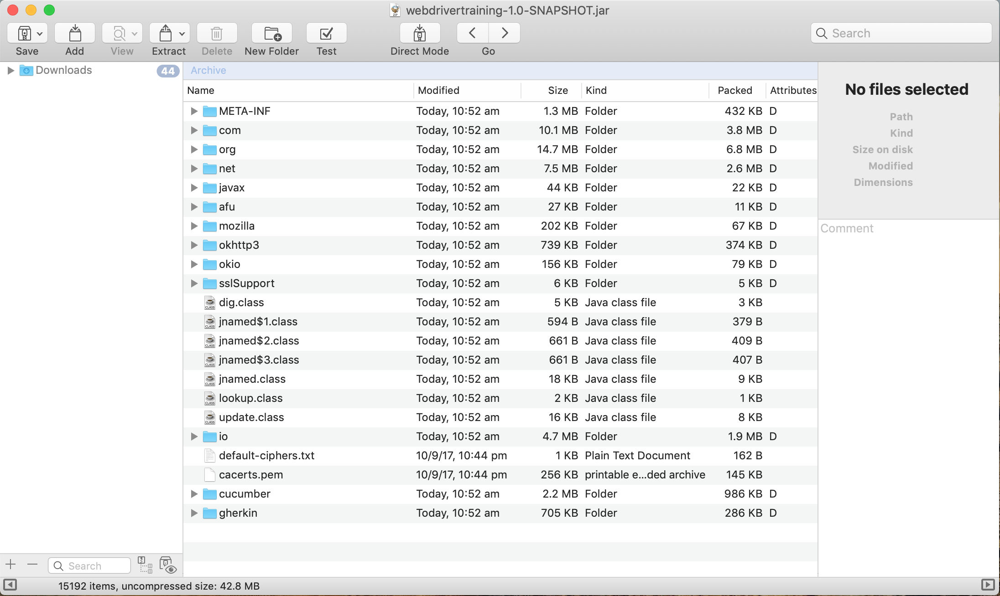
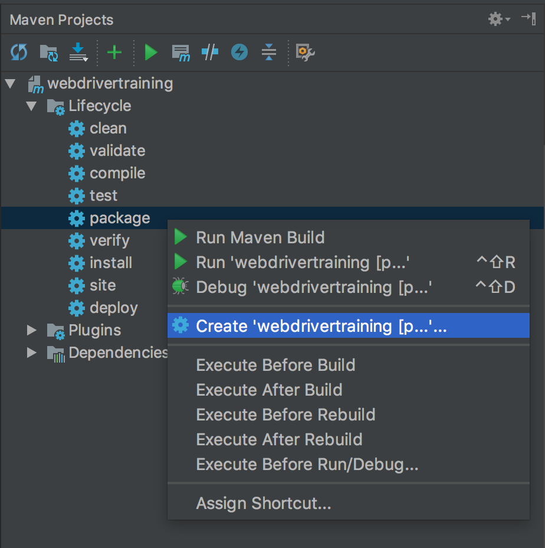
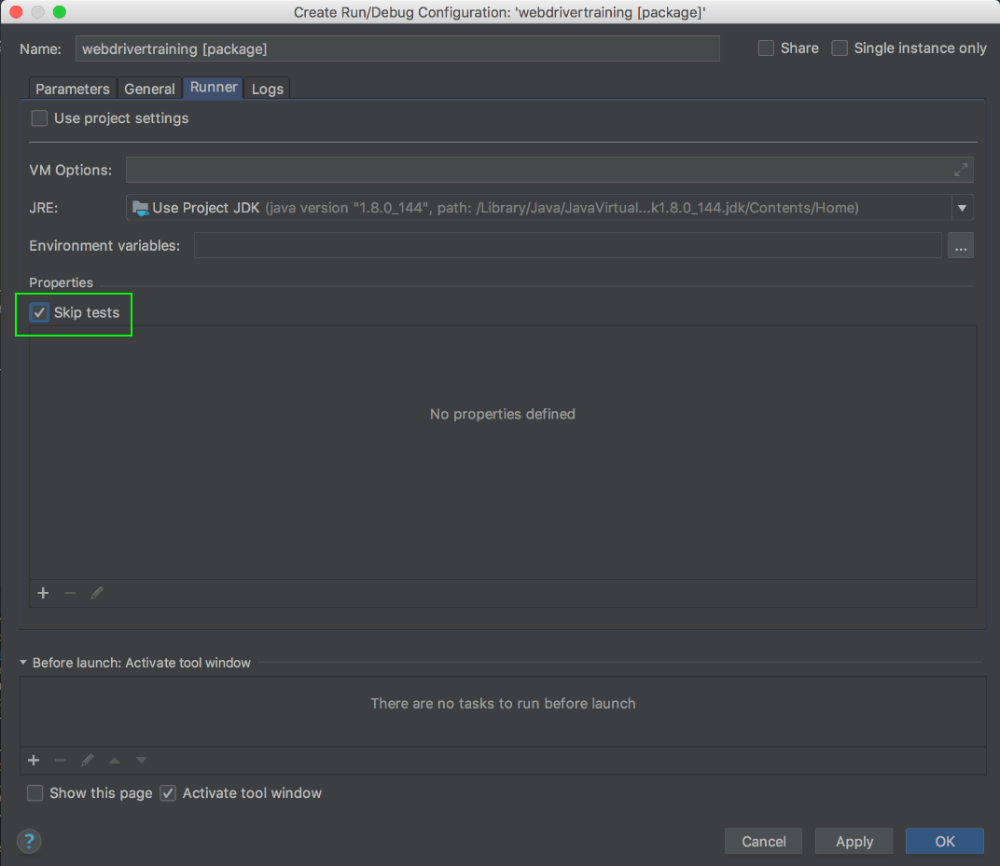
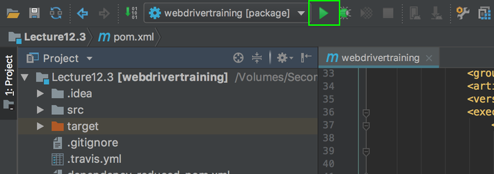

The Maven project we have used to build our code will package up our classes into a JAR file. We can create this JAR file by running the Maven package lifecycle. To do this, open the` Maven Projects` tool window, and double click the {{Lifecycle,package}} option.


Packaging the application will first run all the tests, and then build the JAR file under the `target` directory.



However this file alone is not enough to run the application, because it does not include all the additional libraries we depend on such as WebDriver and Cucumber. We can confirm this by opening the JAR file in any application that views ZIP files, since JAR files are just ZIP files with a different extension. You can see that the only classes inside this archive are those that we have written ourselves. None of the classes from the WebDriver or Cucumber libraries are present in this archive.



This presents something of a problem, as the code that makes up a Lambda function has to be packaged up into a single archive. One solution is to build a fully self contained JAR file, otherwise known as an UberJAR.

An UberJAR is JAR file that includes all the classes required to run the application, which means it includes all the classes for code we have written, as well as all the classes from the libraries our code depends on. Maven makes it easy to build and UberJAR with the [Shade](https://maven.apache.org/plugins/maven-shade-plugin/) plugin.

To configure the Shade plugin, we need to add its configuration under the `<build><plugins>` element.

This configuration specifies that the `shade` goal of the plugin should be run during the `package` phase. This means that when we package our code with Maven, the Shade plugin will be run automatically to generate the UberJAR:

```xml
<project xmlns=\"http://maven.apache.org/POM/4.0.0\"
xmlns:xsi=\"http://www.w3.org/2001/XMLSchema-instance\"
xsi:schemaLocation=\"http://maven.apache.org/POM/4.0.0
http://maven.apache.org/xsd/maven-4.0.0.xsd\">
  <modelVersion>4.0.0</modelVersion>
  <!-- ... -->
  <properties>
    <!-- ... -->
    <shade.version>3.1.0</shade.version>
    <!-- ... -->
  </properties>
    <build>
      <plugins>
      <!-- ... -->
      <plugin>
        <groupId>org.apache.maven.plugins</groupId>
        <artifactId>maven-shade-plugin</artifactId>
        <version>${shade.version}</version>
        <executions>
          <execution>
            <phase>package</phase>
            <goals>
              <goal>shade</goal>
            </goals>
          </execution>
        </executions>
      </plugin>
      <!-- ... -->
    </plugins>
  </build>
  <!-- ... -->
</project>
```

Now two JAR files are created when we package our application.

The `original-webdrivertraining-1.0-SNAPSHOT.jar` file is the regular JAR file that only contains the classes from our own code. You can see this file is quite small, being only a few kilobytes in size.

The `webdrivertraining-1.0-SNAPSHOT.jar` is the UberJAR file that contains all the classes required to run this application. It is much larger at several megabytes in size.



Looking at the contents of the UberJAR file we can see that it has significantly more classes. These classes have been sourced from all the dependencies we defined in the `pom.xml` file, and all of their dependencies.



You will have noticed that running the `package` Maven lifecycle results in all the tests being run. Given that the tests we have written involve launching web browsers, these tests can get in the way if you just want to produce the JAR file. To prevent tests from being run, right click on the package lifecycle menu item and select the `Create
'webdrivertraining...'...` option.



Then select the `Runner` tab. Unselect the `Use project settings` option, and then select the `Skip tests` option. Click the `OK` button to save the changed.



This will create a new configuration called `webdrivertraining [package]`. Clicking the green arrow with this configuration selected will run the Maven package lifecycle, but skip the tests, allowing you to build the JAR files quickly.



The resulting UberJAR file provides a convenient, self contained package that we can easily distribute and run, and is what we will be deploying as an AWS Lambda. In the next post we'll add the code required to run a WebDriver test in Lambda, and use the Serverless application to publish the UberJAR file.

Return to the [table of contents](../0-toc/webdriver-toc.md).
