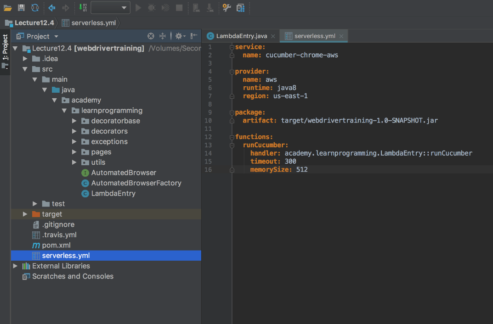
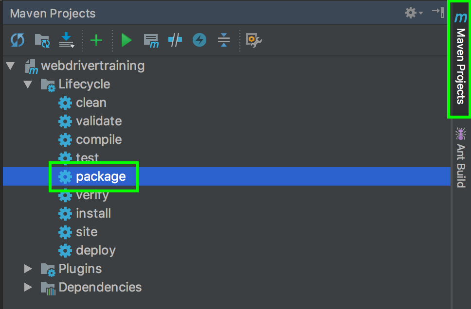
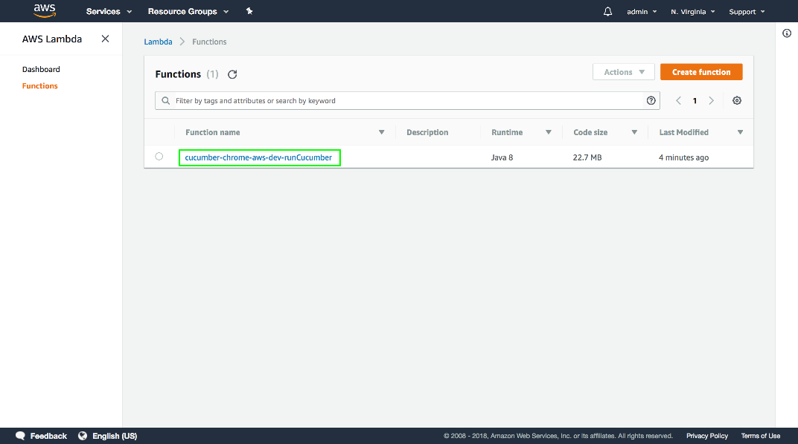
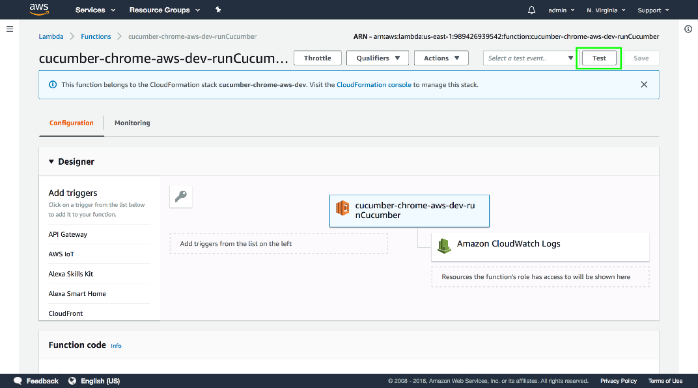
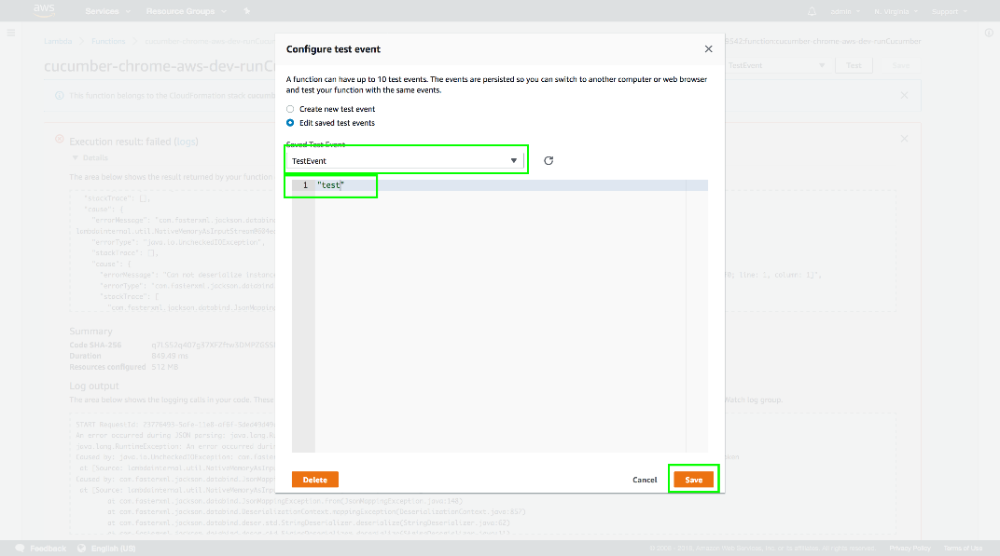
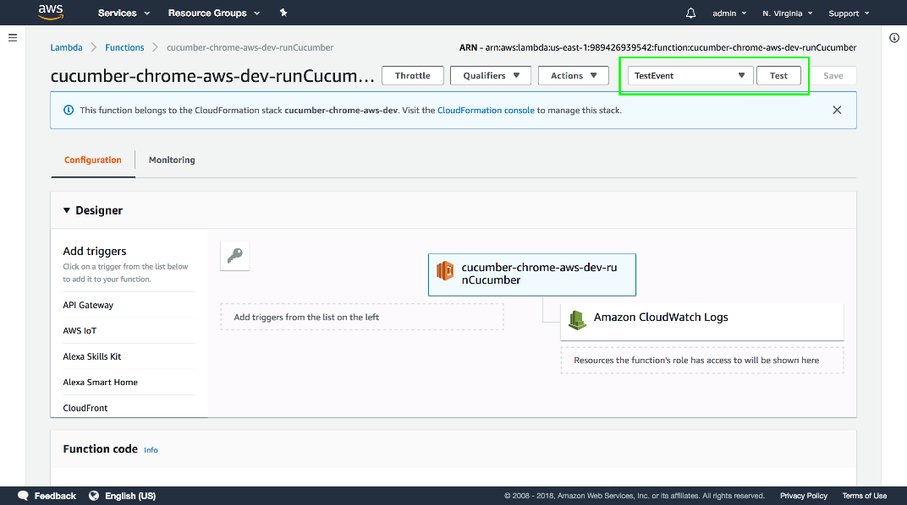
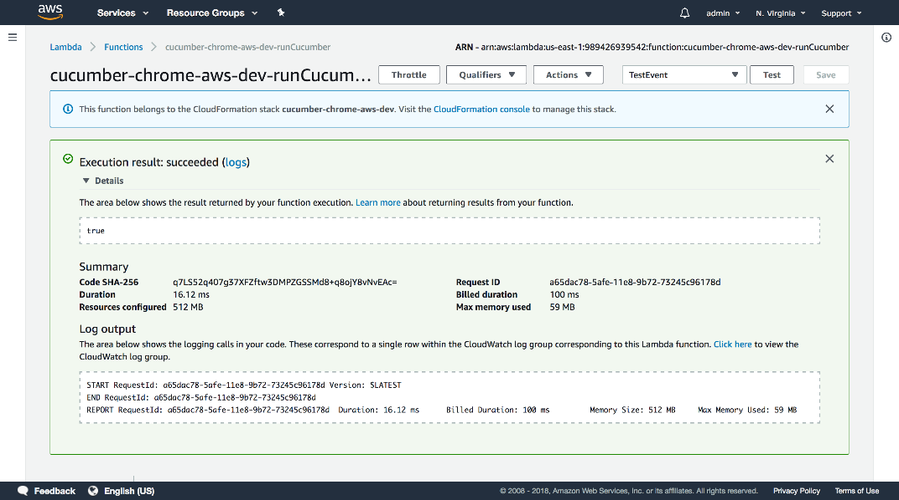

In the previous posts we configured all the prerequisites required by our Lambda function:

- An AWS account was created and the credentials configured locally.
- The Serverless application was installed.
- The Lambda Chrome distribution and binary driver were uploaded to S3.
- The Maven build now produces an UberJAR.

We are at the point now where we can start writing the Lambda code. To do this we need to add three new dependencies:

- `com.amazonaws:aws-lambda-java-core`
- `com.amazonaws:aws-java-sdk-lambda`
- `commons-io:commons-io`

The first two dependencies provide us with the libraries we need to run as an Lambda function. The third dependency provides some handy utility functions when working with files:

```xml
<project xmlns="http://maven.apache.org/POM/4.0.0"
xmlns:xsi="http://www.w3.org/2001/XMLSchema-instance"
xsi:schemaLocation="http://maven.apache.org/POM/4.0.0
http://maven.apache.org/xsd/maven-4.0.0.xsd">
  <modelVersion>4.0.0</modelVersion>
  <!-- ... -->
  <properties>
    <!-- ... -->
    <aws.lambda.version>1.2.0</aws.lambda.version>
    <aws.sdk.version>1.11.305</aws.sdk.version>
    <commons.io.version>2.6</commons.io.version>
  </properties>
  <!-- ... -->
  <dependencies>
    <!-- ... -->
    <dependency>
      <groupId>com.amazonaws</groupId>
      <artifactId>aws-lambda-java-core</artifactId>
      <version>${aws.lambda.version}</version>
    </dependency>
    <dependency>
      <groupId>com.amazonaws</groupId>
      <artifactId>aws-java-sdk-lambda</artifactId>
      <version>${aws.sdk.version}</version>
    </dependency>
    <dependency>
      <groupId>commons-io</groupId>
      <artifactId>commons-io</artifactId>
      <version>${commons.io.version}</version>
    </dependency>
  </dependencies>
</project>
```

In a traditional Java application, we start execution in a `static main()` method. Lambda functions are different. The entry point to a Lambda function can be any method with the signature:

```
returntype methodname(inputType input, Context context)
```

Or if the `Context` is not required (and it is not required for our purposes) then this signature is also valid:

```
returntype methodname(inputType input)
```

The return and input type from this method can be any type, and the method itself can have any name. Let's write one of the most simple Lambda functions we can.

The code below defines an Lambda function that returns a `boolean` type that is always `true`. This code isn't very useful, but it is enough to test that the Lambda works:

```java
package com.octopus;

import com.amazonaws.services.lambda.runtime.Context;

public class LambdaEntry {
  public boolean runCucumber(String feature) throws Throwable {
    return true;
  }
}
```

In order to deploy this Lambda, we need to create a file called `serverless.yml` in the project's root directory. This configuration file is used by the Serverless application to configure and deploy the Lambda.



```yaml
service:
  name: cucumber-chrome-aws

provider:
  name: aws
  runtime: java8
  region: us-east-1

package:
  artifact: target/webdrivertraining-1.0-SNAPSHOT.jar

functions:
  runCucumber:
    handler: com.octopus.LambdaEntry::runCucumber
    timeout: 300
    memorySize: 512
```

Let's break this file down.

We start by defining the name of the service, which will become the name of the Lambda.

```yaml
service:
  name: cucumber-chrome-aws
```

We then define the details of the cloud platform that we are deploying to. The Serverless application is cloud agnostic, and can be used to deploy to multiple cloud providers like AWS, Azure, and Google Cloud. We are using AWS, and so the providers section will configure the global properties of the AWS Lambda service.

The `name` property is the name of the cloud provider, set to `aws` in this case.

The `runtime` property defines the language that our Lambda function is written in, which is `java8`.

The `region` property defines the AWS region that we will be deploying the Lambda to. AWS has many regions around the world, and you can find a complete list of regions that support Lambda at [https://docs.aws.amazon.com/general/latest/gr/rande.html#lambda_region](https://docs.aws.amazon.com/general/latest/gr/rande.html#lambda_region). We will use the `us-east-1` region here.

```yaml
provider:
  name: aws
  runtime: java8
  region: us-east-1
```

The package section defines where the Lambda code can be found. In our case the Lambda code is in the file `target/webdrivertraining-1.0-SNAPSHOT.jar`, which we reference via the `artifact` property. Note that this file is the UberJAR, which has packaged up our entire application and its dependencies in a single file:

```yaml
package:
  artifact: target/webdrivertraining-1.0-SNAPSHOT.jar
```

The `functions` section is where we define the Lambda function.

The `runCucumber` section defines an individual function. This section can have any name, and we have used the same name as the entry point method for convenience.

The `handler` property defines the entry point method name. This method name is built from the fully qualified class name, two colons, and the method name. The value `com.octopus.LambdaEntry::runCucumber` means that this Lambda function will execute the method `runCucumber()` from the `LambdaEntry` class in the `com.octopus` package.

The `timeout` property sets the maximum amount of time this function can run. Lambda has a hard limit of 5 minutes, and we have also set the timeout to 5 minutes (expressed as 300 seconds).

The `memorySize` property defines how much memory our Lambda environment can use. We have limited ourselves to 512MB here. Note that this value include any memory used by external applications (like Chrome), as well as our own code.

Increasing the `timeout` and `memorySize` increases the cost of each Lambda execution.

```yaml
functions:
  runCucumber:
    handler: com.octopus.LambdaEntry::runCucumber
    timeout: 300
    memorySize: 512
```

Before we can deploy the Lambda function, we need to ensure that the file `target/webdrivertraining-1.0-SNAPSHOT.jar` is up to date. Serverless will not rebuild the application for us before deploying, so it is up to us to rebuild it manually. Click Maven {{Projects,package}} to rebuild the JAR file.



We can now deploy the Lambda function. Open up a terminal, command prompt or PowerShell window and change to the project root directory. Then run the command:

```
$ serverless deploy
```

You will see output like the following:

```
Serverless: Packaging service...
Serverless: Uploading CloudFormation file to S3...
Serverless: Uploading artifacts...
Serverless: Uploading service .zip file to S3 (19.78 MB)...
Serverless: Validating template...
Serverless: Updating Stack...
Serverless: Checking Stack update progress...
.....................
Serverless: Stack update finished...
Service Information
service: cucumber-chrome-aws
stage: dev
region: us-east-1
stack: cucumber-chrome-aws-dev
api keys:
  None
endpoints:
  None
functions:
  runCucumber: cucumber-chrome-aws-dev-runCucumber
```

Serverless is doing a lot of work behind the scenes to upload our JAR files as a Lambda function, which is one of the benefits of using Serverless instead of uploading our Lambda function manually.

If we return to the AWS Lambda console, we can now see the new Lambda function has been deployed. Click the function link.



This page shows us the details of the Lambda function.

To test that the function works, click the `Test` button.



Replace the test data with a string (any string will do). Because the first parameter of our Lambda function accepts a string, we need to supply a string when testing.

Lambda functions always take JSON as input, which is converted into a Java object. In this case a string is a valid JSON construct, which then gets converted into a Java string.

Lambda functions also always convert the returned object to JSON.

:::hint
The fact that Lambda functions only accept JSON as input and provide JSON as output will be important later on when we link this function up to a HTTP endpoint.
:::

Then populate the `Event` name field, and click the `Create` button.



Now that we have a test event, click the `Test` button again.



And our test Lambda function has executed successfully by returning `true`.



Although this Lambda function doesn't do anything useful, it does prove that we have written a valid Lambda function and that it can be deployed using the Serverless application. With this work done we can move onto writing a Lambda function that actually runs a WebDriver test, which we'll do in the next post.

Return to the [table of contents](../0-toc/webdriver-toc.md).
