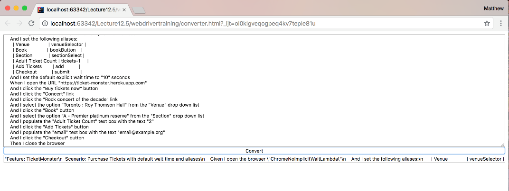
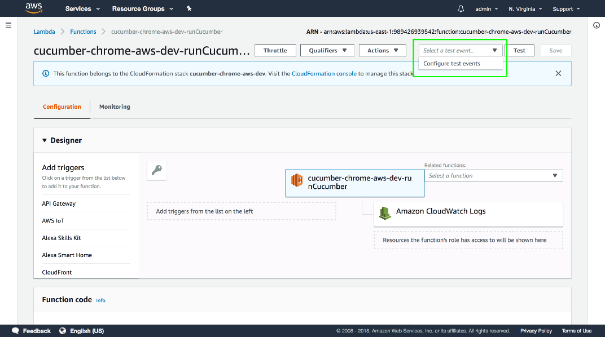
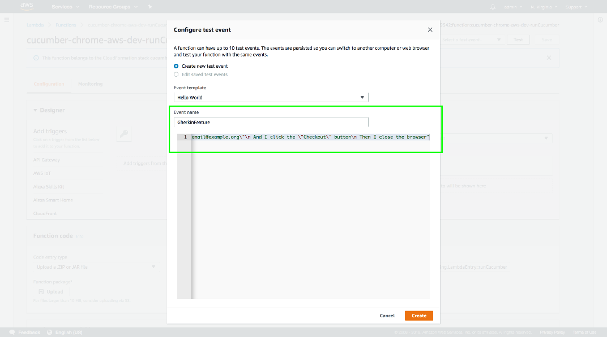
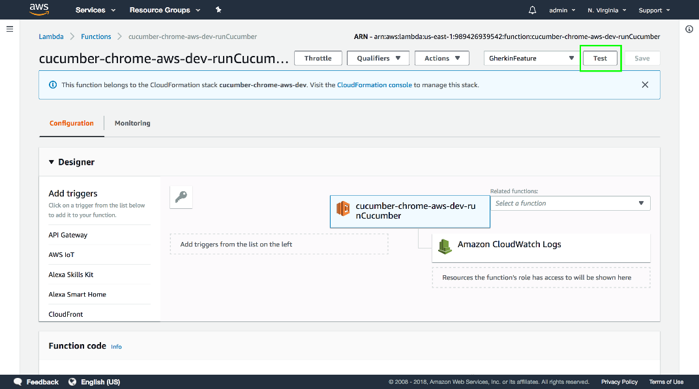
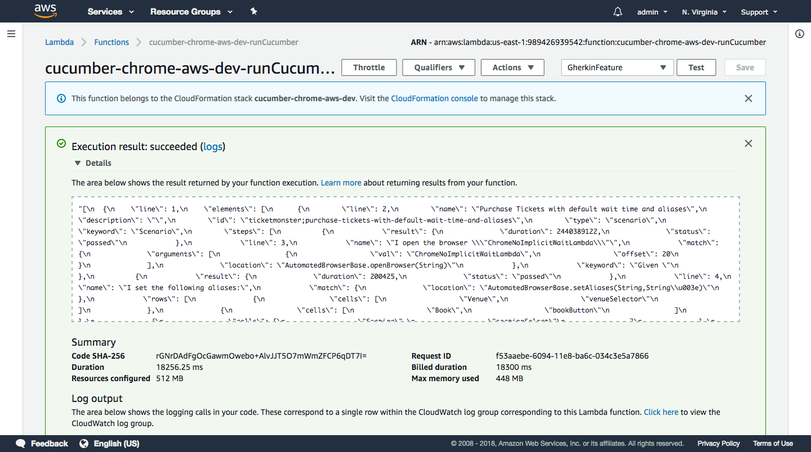

Now that we have a simple Lambda function that we can run, as well as a Serverless configuration that deploys our application, we can create a Lambda function that launches a WebDriver test.

Below is the new code for the `LambdaEntry` class that will launch a WebDriver test from a Gherkin feature file:

```java
package com.octopus;

import org.apache.commons.io.FileUtils;
import java.io.*;
import java.net.MalformedURLException;
import java.net.URL;
import java.nio.charset.Charset;
import java.nio.file.Files;
import java.util.zip.ZipEntry;
import java.util.zip.ZipInputStream;

public class LambdaEntry {
  private static final String CHROME_HEADLESS_PACKAGE =
  "https://s3.amazonaws.com/webdriver-testing-resources/stable-headless-chromium-amazonlinux-2017-03.zip";
  private static final String CHROME_DRIVER =
  "https://s3.amazonaws.com/webdriver-testing-resources/chromedriver_linux64.zip";

  public String runCucumber(final String feature) throws Throwable {

    File driverDirectory = null;
    File chromeDirectory = null;
    File outputFile = null;
    File featureFile = null;

    try {

      driverDirectory = downloadChromeDriver();
      chromeDirectory = downloadChromeHeadless();
      outputFile = Files.createTempFile("output", ".json").toFile();
      featureFile = writeFeatureToFile(feature);

      cucumber.api.cli.Main.run(
        new String[]{
          "--monochrome",
          "--glue", "com.octopus.decoratorbase",
          "--format", "json:" + outputFile.toString(),
          featureFile.getAbsolutePath()},
      Thread.currentThread().getContextClassLoader());

      return FileUtils.readFileToString(outputFile, Charset.defaultCharset());
    } finally {
      FileUtils.deleteQuietly(driverDirectory);
      FileUtils.deleteQuietly(chromeDirectory);
      FileUtils.deleteQuietly(outputFile);
      FileUtils.deleteQuietly(featureFile);
    }
  }

  private File downloadChromeDriver() throws IOException {
    final File extractedDir = downloadAndExtractFile(CHROME_DRIVER, "chrome_driver");
    final String driver = extractedDir.getAbsolutePath() + "/chromedriver";
    System.setProperty("webdriver.chrome.driver", driver);
    new File(driver).setExecutable(true);
    return extractedDir;
  }

  private File downloadChromeHeadless() throws IOException {
    final File extractedDir = downloadAndExtractFile(CHROME_HEADLESS_PACKAGE, "chrome_headless");
    final String chrome = extractedDir.getAbsolutePath() + "/headless-chromium";
    System.setProperty("chrome.binary", chrome);
    new File(chrome).setExecutable(true);
    return extractedDir;
  }

  private File downloadAndExtractFile(final String download, final String tempDirPrefix) throws IOException {
    File downloadedFile = null;
    try {
      downloadedFile = File.createTempFile("download", ".zip");
      FileUtils.copyURLToFile(new URL(download), downloadedFile);
      final File extractedDir = Files.createTempDirectory(tempDirPrefix).toFile();
      unzipFile(downloadedFile.getAbsolutePath(), extractedDir.getAbsolutePath());
      return extractedDir;
    } finally {
      FileUtils.deleteQuietly(downloadedFile);
    }

  }

  private void unzipFile(final String fileZip, final String outputDirectory) throws IOException {

    final byte[] buffer = new byte[1024];

    try (final ZipInputStream zis = new ZipInputStream(new FileInputStream(fileZip))) {
      ZipEntry zipEntry = zis.getNextEntry();
      while (zipEntry != null) {
        final String fileName = zipEntry.getName();
        final File newFile = new File(outputDirectory + "/" + fileName);
        try (final FileOutputStream fos = new FileOutputStream(newFile)) {
          int len;
          while ((len = zis.read(buffer)) > 0) {
            fos.write(buffer, 0, len);
          }
        }
        zipEntry = zis.getNextEntry();
      }
      zis.closeEntry();
    }
  }

  private File writeFeatureToFile(final String feature) throws IOException {
    final File featureFile = File.createTempFile("cucumber", ".feature");
    try {
      final URL url = new URL(feature);
      FileUtils.copyURLToFile(url, featureFile);
    } catch (final MalformedURLException ex) {
      try (PrintWriter out = new PrintWriter(featureFile)) {
        out.println(feature);
      }
    }
    return featureFile;
  }
}
```

Let's break this class down.

The following constants are the URLs to the Chrome Lambda distribution and the Linux binary driver that we uploaded to S3. These URLs will be different for you, as you will have uploaded them to a different S3 bucket.

:::warning
Do not use these URLs for your own tests, but always use URLs to an S3 bucket that you control. Using URLs to your own S3 buckets ensures that your code relies only on resources that you own and manage.
:::

```java
private static final String CHROME_HEADLESS_PACKAGE =
"https://s3.amazonaws.com/webdriver-testing-resources/stable-headless-chromium-amazonlinux-2017-03.zip";
private static final String CHROME_DRIVER =
"https://s3.amazonaws.com/webdriver-testing-resources/chromedriver_linux64.zip";
```

We still use the `runCucumber()` method as our Lambda entry point:

```java
public String runCucumber(String feature) throws Throwable {
```

These four files will be created each time this Lambda is run. We need to track all resources we create so they can be cleaned up afterwards, as Lambda may reuse the underlying Linux instance for sequential function calls. If we were to create files and not clean them up, it is possible that we could consume all the free space allocated to our Lambda function, and the code would not work correctly.

```java
File driverDirectory = null;
File chromeDirectory = null;
File outputFile = null;
File featureFile = null;
```

Each time the `runCucumber()` method is called, we download the Linux binary driver and the Chrome Lambda distribution. These files are too large to be bundled up and distributed with the Lambda code, so we have to download them at run-time. By uploading these files to S3 we take advantage of the fact that S3 and Lambda are both services provided by AWS, and Lambda can access files in S3 quickly and reliably:

```java
try {
  driverDirectory = downloadChromeDriver();
  chromeDirectory = downloadChromeHeadless();
```

Cucumber can generate a JSON report file with the results of the feature file execution. We will use this file as the return value of our Lambda. Here we create a temporary file that can be used to hold the JSON results.

```java
outputFile = Files.createTempFile("output", ".json").toFile();
```

The last file we create is the Gherkin feature file. The contents of this file is the string that was passed to the method in the feature parameter:

```java
featureFile = writeFeatureToFile(feature);
```

Now that we have all the files in place, we can run Cucumber.

Previously we took advantage of the JUnit integration provided by Cucumber to launch feature files as part of a test class. But we are not running JUnit from our Lambda, so we need a new way to launch Cucumber.

Fortunately Cucumber also provides a way to run it from the command line with a traditional `static void main()` method in the `cucumber.api.cli.Main` class. This `main()` method then calls the `run()` method. We use this `run()` method as a way of launching Cucumber as if it had been run from the command line directly.

The first parameter to be passed to the `run()` method is a String array that holds the arguments that would normally has been provided on the command line. We have used a number of options to customize the output, link with out glue class, and save a report file.

- The `--monochrome` option removes and colored text from the messages printed to the console. These colored messages don't translate well when viewed in log files.
- The `--glue` option links Cucumber to the package holding our annotated class. This is the same option that we passed to the JUnit annotations that were used earlier.
- The `--format` option defines the report file that is generated by Cucumber. It is set to a value of `json:<output file>`, with the output file being the temporary file we created earlier.
- The final argument is to the feature file itself.

The second parameter is the class loader for Cucumber to use. We pass the value of `Thread.currentThread().getContextClassLoader()`, just as the `cucumber.api.cli.Main.main()` method did.

```java
cucumber.api.cli.Main.run(
  new String[]{
    "--monochrome",
    "--glue", "com.octopus.decoratorbase",
    "--format", "json:" + outputFile.toString(),
    featureFile.getAbsolutePath()},
  Thread.currentThread().getContextClassLoader());
```

Once the Gherkin feature file has been run, we read the contents of the report file and return it:

```java
return `FileUtils.readFileToString(outputFile, Charset.defaultCharset());`
```

All of the files we created are then deleted using the `FileUtils.deleteQuietly()` method from the Apache Commons IO library. This method does not throw any exceptions, and means we make an attempt to delete each file, ignoring any errors.

There will likely not be any lasting harm from temporary files that can not be deleted, as the Linux instance running our code will eventually be destroyed and a new one allocated for the next Lambda invocation.

```java
  } finally {
    FileUtils.deleteQuietly(driverDirectory);
    FileUtils.deleteQuietly(chromeDirectory);
    FileUtils.deleteQuietly(outputFile);
    FileUtils.deleteQuietly(featureFile);
  }
}
```

The `downloadChromeDriver()` method is where we download and configure the Linux Chrome binary driver.

We start by calling the `downloadAndExtractFile()` method, passing in the driver URL and the prefix to use for the temporary directory to hold the extracted files:

```java
private File downloadChromeDriver() throws IOException {
final File extractedDir = downloadAndExtractFile(CHROME_DRIVER, "chrome_driver");
```

We then get the path to the driver, set the `webdriver.chrome.driver` system property to the driver path, and ensure that driver file has the executable flag set to true.

To execute a file in Linux, that file has to have the executable flag set to `true`. This is different to operating systems like Windows that use extensions like `.exe` to indicate executable files.

```java
final String driver = extractedDir.getAbsolutePath() + "/chromedriver";
System.setProperty("webdriver.chrome.driver", driver);
new File(driver).setExecutable(true);
```

The directory holding the Chrome driver is then returned so it can be cleaned up once the test is done:

```java
  return extractedDir;
}
```

The `downloadChromeHeadless()` method follows the same pattern as the `downloadChromeDriver()` method, only this time we are downloading the Chrome Lambda distribution.

It starts by downloading the Chrome distribution to a temporary directory with the prefix `chrome_headless`.

```java
private File downloadChromeHeadless() throws IOException {
  final File extractedDir = downloadAndExtractFile(CHROME_HEADLESS_PACKAGE, "chrome_headless");
```

We get the path to the Chrome executable, set the `chrome.binary` system property to this path, and ensure that the file has the executable flag enabled.

The `chrome.binary` system property is not a property recognized by WebDriver, but is a property we will access ourselves later on to launch Chrome:

```java
final String chrome = extractedDir.getAbsolutePath() + "/headless-chromium";
System.setProperty("chrome.binary", chrome);
new File(chrome).setExecutable(true);
```

The temporary directory is then returned so it can be cleaned up once the test is finished:

```java
  return extractedDir;
}
```

The previous method both call the `downloadAndExtractFile()` method to download and extract a ZIP file.

We start by creating a variable to point to a temporary file that we will download the remote file into:

```
private File downloadAndExtractFile(final String download, final String tempDirPrefix) throws IOException {
  File downloadedFile = null;
```

We then create the temporary file and download the remote file into it using the `FileUtils.copyURLToFile()` method from the Apache Commons IO library:

```java
try {
  downloadedFile = File.createTempFile("download", ".zip");
  FileUtils.copyURLToFile(new URL(download), downloadedFile);
```

We then create a temporary directory, extract the downloaded file into the directory, and return the directory to the calling method:

```java
final File extractedDir = Files.createTempDirectory(tempDirPrefix).toFile();
unzipFile(downloadedFile.getAbsolutePath(), extractedDir.getAbsolutePath());
return extractedDir;
```

The downloaded file is no longer needed, and so it is deleted:

```java
  } finally {
    FileUtils.deleteQuietly(downloadedFile);
  }
}
```

To extract the ZIP file we have the `unzipFile()` method:

```java
private void unzipFile(final String fileZip, final String outputDirectory) throws IOException {
```

We start by creating a buffer into which the contents of the ZIP file can be read:

```java
final byte[] buffer = new byte[1024];
```

We then create a `ZipInputStream` instance from the ZIP file. The `ZipInputStream` class is included as part of the standard Java library, and we'll use this class to read the contents of a ZIP file:

```java
try (final ZipInputStream zis = new ZipInputStream(new
FileInputStream(fileZip))) {
```

The files inside a ZIP file are represented by the `ZipEntry` class. Here we get the first `ZipEntry` from the `ZipInputStream`:

```java
ZipEntry zipEntry = zis.getNextEntry();
```

We then enter a loop while we have a `ZipEntry` object to work with:

```java
while (zipEntry != null) {
```

The name of the `ZipEntry` is the filename:

```java
final String fileName = zipEntry.getName();
```

The `ZipEntry` name is combined with the output directory to create the path to the extracted file:

```java
final File newFile = new File(outputDirectory + "/" + fileName);
```

We then create an output stream with the extracted file:

```java
try (final FileOutputStream fos = new FileOutputStream(newFile)) {
```

The contents of the `ZipEntry` is then read into the buffer we created earlier, and the buffer is then written to the output file. This is how we transfer the compressed contents of the `ZipEntry` file to the uncompressed contents of the output file:

```java
int len;
while ((len = zis.read(buffer)) > 0) {
  fos.write(buffer, 0, len);
}
```

This process is repeated for every `ZipEntry` object from the `ZipInputStream`:

```java
  }
  zipEntry = zis.getNextEntry();
}
```

Once we are done, the `ZipInputStream` is closed:

```java
  zis.closeEntry();
  }
}
```

The last method in this class is `writeFeatureToFile()`, which we use to write the Gherkin feature file:

```java
private File writeFeatureToFile(final String feature) throws IOException
{
```

We create a temporary file to hold the contents of the feature file:

```
final File featureFile = File.createTempFile("cucumber", ".feature");
```

We then attempt to download the file as if the feature parameter was a URL:

```java
try {
  final URL url = new URL(feature);
  FileUtils.copyURLToFile(url, featureFile);
```

If downloading the file fails, we assume it is because the feature parameter was not a URL but instead the raw text that makes up the feature file. This means that we can supply either a URL or the raw text to the feature parameter and the `writeFeatureToFile()` method can detect what to do:

```java
} catch (final MalformedURLException ex) {
  try (PrintWriter out = new PrintWriter(featureFile)) {
    out.println(feature);
  }
}
```

The resulting file is then returned:

```java
  return featureFile;
}
```

To run Chrome in a Lambda we need to pass a number of arguments that allow Chrome to work in the restricted Lambda environment.

To pass the arguments we will create a new decorator class called `ChromeHeadlessLambdaDecorator`:

```java
package com.octopus.decorators;

import com.octopus.AutomatedBrowser;
import com.octopus.decoratorbase.AutomatedBrowserBase;
import org.openqa.selenium.WebDriver;
import org.openqa.selenium.chrome.ChromeDriver;
import org.openqa.selenium.chrome.ChromeOptions;

public class ChromeHeadlessLambdaDecorator extends AutomatedBrowserBase
{
    public ChromeHeadlessLambdaDecorator(final AutomatedBrowser automatedBrowser) {
        super(automatedBrowser);
    }

    @Override
    public void init() {
        final ChromeOptions options = new ChromeOptions();
        options.addArguments("--disable-gpu");
        options.addArguments("--headless");
        options.addArguments("--window-size=1366,768");
        options.addArguments("--single-process");
        options.addArguments("--no-sandbox");
        options.addArguments("--user-data-dir=/tmp/user-data");
        options.addArguments("--data-path=/tmp/data-path");
        options.addArguments("--homedir=/tmp");
        options.addArguments("--disk-cache-dir=/tmp/cache-dir");

        if (System.getProperty("chrome.binary") != null) {
            options.setBinary(System.getProperty("chrome.binary"));
        }

        options.merge(getDesiredCapabilities());
        final WebDriver webDriver = new ChromeDriver(options);
        getAutomatedBrowser().setWebDriver(webDriver);
        getAutomatedBrowser().init();
    }
}
```

The `--disable-gpu` and `--headless` arguments configure Chrome to run in headless mode.

We could also have called the `setHeadless()` method on the `ChromeOptions` class. Passing the arguments directly or calling `setHeadless()` achieves the same outcome:

```java
options.addArguments("--disable-gpu");
options.addArguments("--headless");
```

The `--window-size` argument defines the size of the browser window:

```java
options.addArguments("--window-size=1366,768");
```

The `--single-process` and `--no-sandbox` arguments are required to run Chrome in a Lambda environment. You can find out more information as to why these arguments are required at [https://github.com/adieuadieu/serverless-chrome/issues/15](https://github.com/adieuadieu/serverless-chrome/issues/15).

```java
options.addArguments("--single-process");
options.addArguments("--no-sandbox");
```

The `--user-data-dir`, `--data-path`, `--homedir` and `--disk-cache-dir` arguments ensure Chrome only attempts to write to the `/tmp` directory. The `/tmp` directory is one of the few places a process can write files in the Lambda environment.

```java
options.addArguments("--user-data-dir=/tmp/user-data");
options.addArguments("--data-path=/tmp/data-path");
options.addArguments("--homedir=/tmp");
options.addArguments("--disk-cache-dir=/tmp/cache-dir");
```

If the `chrome.binary` system property is defined (and it is set in the `LambdaEntry.downloadChromeHeadless()` method), then we take the value of the system property and use it to set the location of the Chrome binary. This is how our code can locate the custom Chrome executable:

```java
if (System.getProperty("chrome.binary") != null) {
  options.setBinary(System.getProperty("chrome.binary"));
}
```

To take advantage of this new decorator, we expose it through the `AutomatedBrowserFactory` class.

We do not use the `BrowserMobDecorator` here because Chrome 64 has a known issue using a proxy in headless mode. You can find out more details about this issue [here](https://bugs.chromium.org/p/chromium/issues/detail?id=721739).

```java
package com.octopus;

import com.octopus.decorators.*;

public class AutomatedBrowserFactory {
  public AutomatedBrowser getAutomatedBrowser(String browser) {
    // ...
    if ("ChromeNoImplicitWaitLambda".equalsIgnoreCase(browser)) {
      return getChromeBrowserNoImplicitWaitLambda();
    }
    // ...
  }

  // ...

  private AutomatedBrowser getChromeBrowserNoImplicitWaitLambda() {
    return new ChromeHeadlessLambdaDecorator(
      new WebDriverDecorator()
    );
  }

  // ...

}
```

To deploy the new Lambda function, run the `package` Maven lifecycle, and run `serverless deploy` to upload the code to AWS.

We are now ready to test the Lambda function by passing in a Gherkin feature file. However, if you recall from the last post we said that every input to a Lambda function must be valid JSON. Our Gherkin feature files most definitely are not written in JSON, so we need some way to convert text into a JSON string.

The following web page provides a very simple form that takes raw text and converts it into a JSON string:

```html
<html>
<head>
    <script>
            function convert() {
                var output = document.getElementById("input")
                    .value
                    .replace(/\\/g, "\\\\")
                    .replace(/"/g, "\\\"")
                    .split("\n")
                    .join("\\n");

                document.getElementById("output").value = "\"" + output + "\"";
            }
        </script>
</head>
<body>
<textarea id="input" style="width: 100%;" rows="20"></textarea>
<br/>
<input type="button" onclick="convert()" value="Convert" style="width: 100%">
<br/>
<input type="text" id="output" style="width: 100%">
</body>
</html>
```

This is the code that does the conversion. It takes the value of the text in the `<textarea>` and:

1.  Replaces any back slashes with double backslashes (i.e. escapes any backslashes).
2.  Replaces any double quotes with a backslash and a double quote (i.e. escapes the double quotes).
3.  Splits the string on the line breaks.
4.  Rejoins the resulting array with the string `\n`.

```javascript
var output = document.getElementById("input")
                    .value
                    .replace(/\\/g, "\\\\")
                    .replace(/"/g, "\\\"")
                    .split("\n")
                    .join("\\n");
```

This code will convert the following text:

```gherkin
Feature: TicketMonster
  Scenario: Purchase Tickets with default wait time and aliases
    Given I open the browser "ChromeNoImplicitWaitLambda"
    And I set the following aliases:
    | Venue | venueSelector |
    | Book | bookButton |
    | Section | sectionSelect |
    | Adult Ticket Count | tickets-1 |
    | Add Tickets | add |
    | Checkout | submit |

    And I set the default explicit wait time to "10" seconds
    When I open the URL "https://ticket-monster.herokuapp.com"
    And I click the "Buy tickets now" button
    And I click the "Concert" link
    And I click the "Rock concert of the decade" link
    And I select the option "Toronto : Roy Thomson Hall" from the "Venue" drop down list
    And I click the "Book" button
    And I select the option "A - Premier platinum reserve" from the "Section" drop down list
    And I populate the "Adult Ticket Count" text box with the text "2"
    And I click the "Add Tickets" button
    And I populate the "email" text box with the text "email@example.org"
    And I click the "Checkout" button
    Then I close the browser
```

into this string:

```json
"Feature: TicketMonster\n Scenario: Purchase Tickets with default wait
time and aliases\n Given I open the browser
\"ChromeNoImplicitWaitLambda\"\n And I set the following
aliases:\n | Venue | venueSelector |\n | Book | bookButton |\n
| Section | sectionSelect |\n | Adult Ticket Count | tickets-1
|\n | Add Tickets | add |\n | Checkout | submit |\n And I set
the default explicit wait time to \"10\" seconds\n When I open the
URL \"https://ticket-monster.herokuapp.com\"\n And I click the
\"Buy tickets now\" button\n And I click the \"Concert\"
link\n And I click the \"Rock concert of the decade\" link\n And I
select the option \"Toronto : Roy Thomson Hall\" from the
\"Venue\" drop down list\n And I click the \"Book\" button\n
And I select the option \"A - Premier platinum reserve\" from the
\"Section\" drop down list\n And I populate the \"Adult Ticket
Count\" text box with the text \"2\"\n And I click the \"Add
Tickets\" button\n And I populate the \"email\" text box with the
text \"email@example.org\"\n And I click the \"Checkout\"
button\n Then I close the browser"
```

Here is a screenshot of the web page after it has performed the conversion.



This JSON string can then be passed as input when testing the Lambda.

Open up the Lambda console and open the
`cucumber-chrome-aws-dev-runCucumber` function. Then click the drop down list next to the `Test` button can click `Configure` test events.



Give the test event a name, paste in the JSON string, and click the `Create` button.



Then click the `Test` button.



The Gherkin feature is run with out Lambda function, and the results are passed back.



We now have the ability to run Cucumber tests as a Lambda function inside a headless instance of Chrome, and because Lambda functions will scale up to accommodate an essentially infinite number of requests (your budget not withstanding) we now have a solution that will allows us to run an enormous number of tests in parallel.

However, having to run tests via the Lambda web console is not ideal. It would be much more convenient if we could launch these tests directly with a HTTP request, which is what we'll implement in the next post.

Return to the [table of contents](../0-toc/webdriver-toc.md).
