One of the strengths of the WebDriver API is that it is browser agnostic. You saw from the previous post that it only took a new binary driver and a new driver class to launch Firefox instead of Chrome in our test.

Although WebDriver allows us to write tests without worrying about which browser will run them, we are still required to create and configure the various driver classes such as `ChromeDriver` and `FirefoxDriver`. To make this process as flexible as possible, we'll create a factory class called `AutomatedBrowserFactory` to configure these objects for us.

Before we can create this class, we first need to add a new directory to our project to hold our Java files. The directory `src/test/java/com/octopus` that we created in previous posts is the default location for files that are used only in tests. There is a second directory under `src/main/java/com/octopus` that will hold regular Java classes, and we need to create this directory structure.

Right click on the `src` directory, and select `New` → `Directory`.

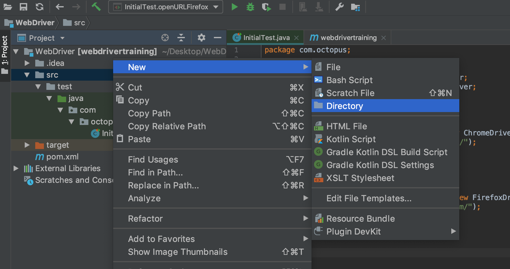

Enter `main/java/com/octopus` as the directory name and click `OK`.


As before, the new directory structure is created, but it is not yet recognized by IntelliJ as a directory that holds Java classes.

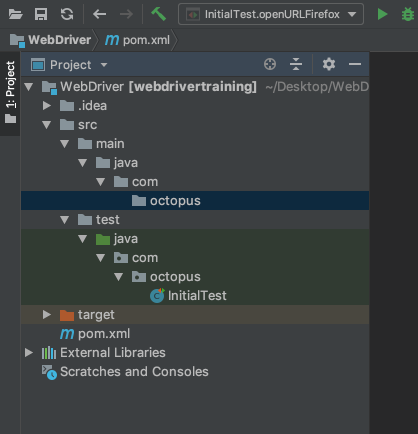

To fix this, open the `Maven Projects` tool window and click the `Reimport All Maven Projects` button.

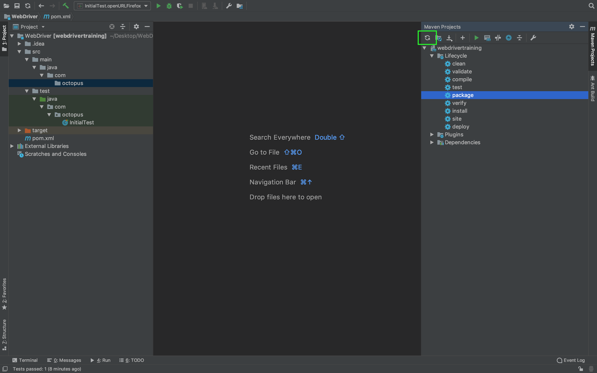

The `java` directory is now shown with a blue icon, which indicates that it will hold Java classes.

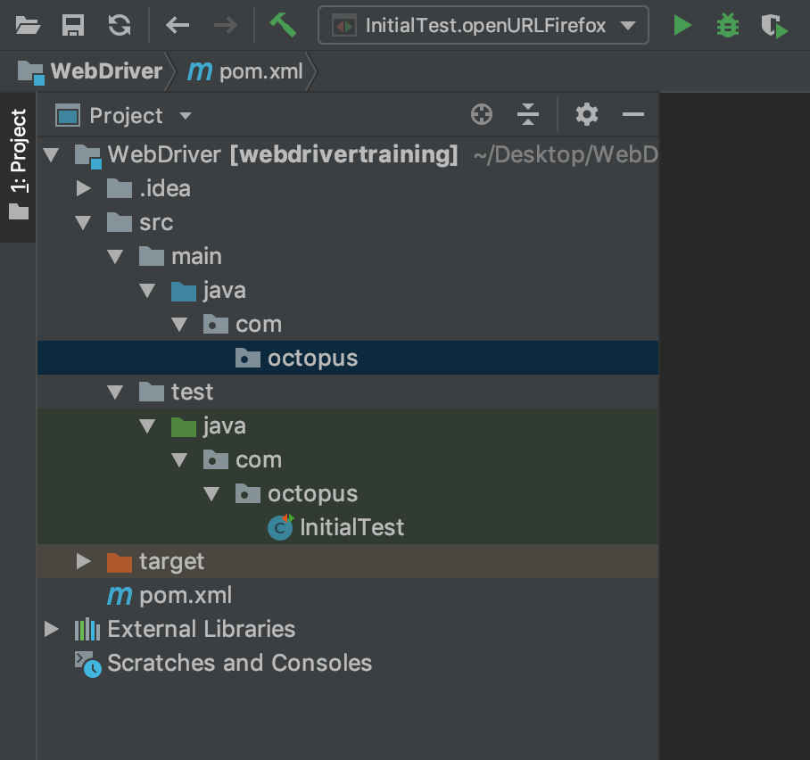

We can now create the class `AutomatedBrowserFactory` in the `src/main/java/com/octopus` directory. To create the new class right click on the `octopus` folder and select {{New,Java Class}}.

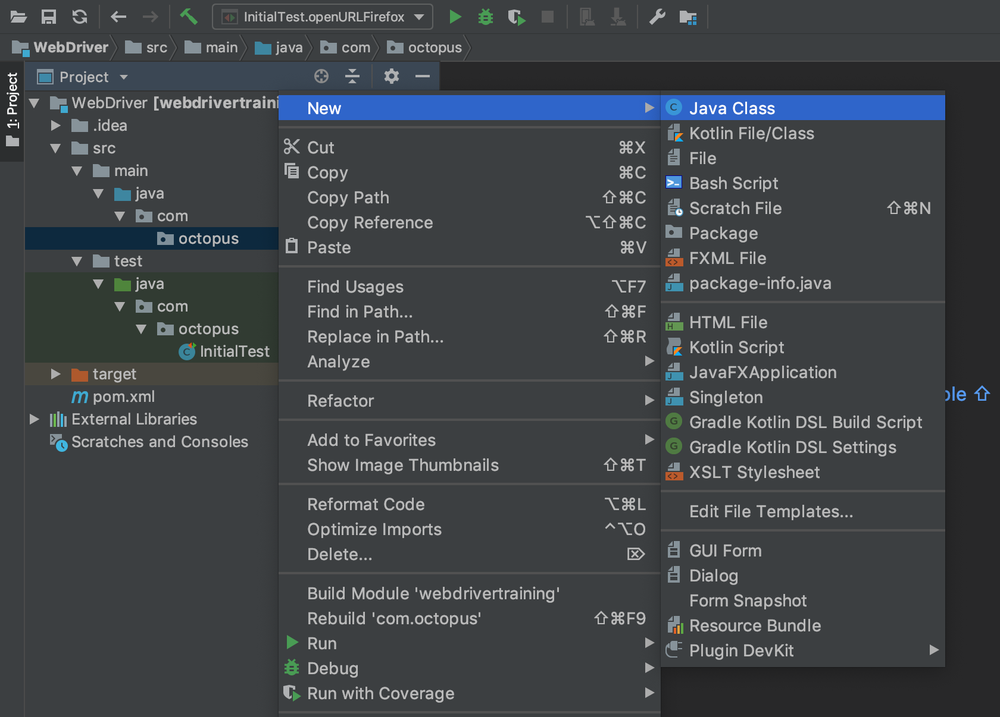

Enter `AutomatedBrowserFactory` in the `Name` field and click the `OK` button.

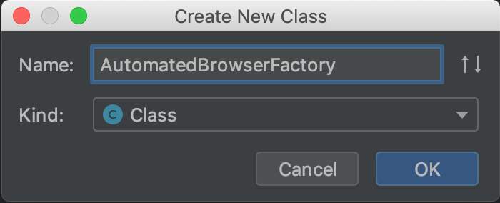

In the snippet below, we have a factory skeleton with a method called `getAutomatedBrowser()` that accepts the name of the browser that we wish to test against. This method returns an instance of the `AutomatedBrowser` interface:

```java
package com.octopus;

public class AutomatedBrowserFactory {

  public AutomatedBrowser getAutomatedBrowser(final String browser) {

    if ("Chrome".equalsIgnoreCase(browser)) {
      return getChromeBrowser();
    }

    if ("Firefox".equalsIgnoreCase(browser)) {
      return getFirefoxBrowser();
    }

    throw new IllegalArgumentException("Unknown browser " + browser);

  }

  private AutomatedBrowser getChromeBrowser() {
    return null;
  }

  private AutomatedBrowser getFirefoxBrowser() {
    return null;
  }
}
```

The `AutomatedBrowser` interface will expose all the interactions we will perform against a browser. As a starting point we'll define some methods for initializing the WebDriver instance, opening a URL, and interacting with elements located by their ID.

To create the `AutomatedBrowser` interface right click on the `octopus` directory and select {{New,Java Class}}.

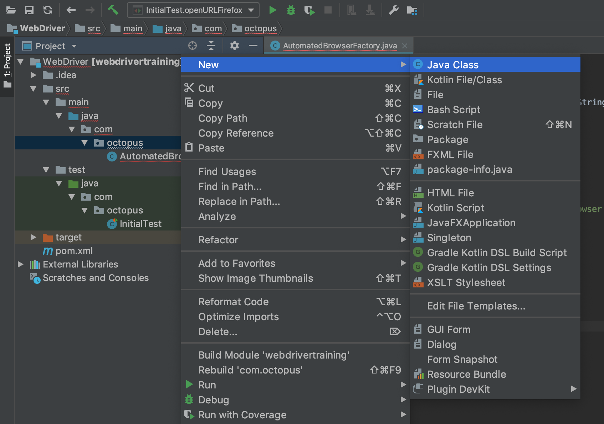

Enter `AutomatedBrowser` in the `Name` field, select the `Interface` option from the `Kind` field, and click the `OK` button.

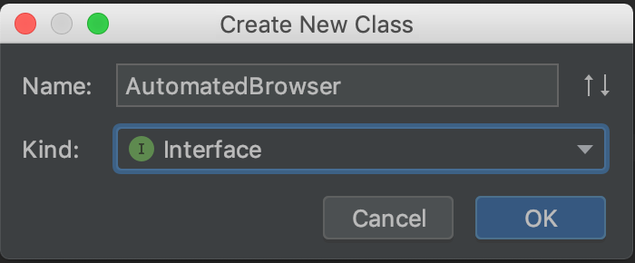

Then paste the following code into the new file:

```java
package com.octopus;

import org.openqa.selenium.WebDriver;

public interface AutomatedBrowser {

  WebDriver getWebDriver();

  void setWebDriver(WebDriver webDriver);

  void init();

  void destroy();

  void goTo(String url);

  void clickElementWithId(String id);

  void selectOptionByTextFromSelectWithId(String optionText, String id);

  void populateElementWithId(String id, String text);

  String getTextFromElementWithId(String id);

}
```

We'll make use of the decorator pattern to build up instances of the `AutomatedBrowser` interface that we will ultimately be calling to interact with a browser.

So why use the decorator pattern instead of a class hierarchy implementing `AutomatedBrowser` directly?

In implementing the decorator pattern we give ourselves the ability to create a whole range of independent implementations with features that enhance and customize how we interact with the browser, without trying to represent these implementations with a deep class hierarchy.

Two obvious implementations are those that configure instances of the `ChromeDriver` or the `FirefoxDriver` classes, allowing us to open either the Chrome or Firefox browsers. But as we move through this blog series we'll introduce a whole range of decorators that implement features such as proxies, stub methods for functionality not supported by mobile browsers, remote browsers and much more.

The framework for all this flexibility starts here.

To make it easier for us to create decorator classes, we'll create a class called `AutomatedBrowserBase`, which will implement `AutomatedBrowser`, and pass through all method calls to a parent instance of `AutomatedBrowser`.

Because the `AutomatedBrowserBase` class provides an implementation of every method in the `AutomatedBrowser` interface, decorator classes extending `AutomatedBrowserBase` can override only the methods that are specific to them. This significantly cuts down on the amount of boiler plate code that is required to create a decorator.

Note that `AutomatedBrowserBase` class is created in the `com.octopus.decoratorbase` package. Having this class in its own package will be an important design decision for features that we'll look at later on in the course.

To create the new package, right click on the `octopus` directory and select {{New,Package}}.

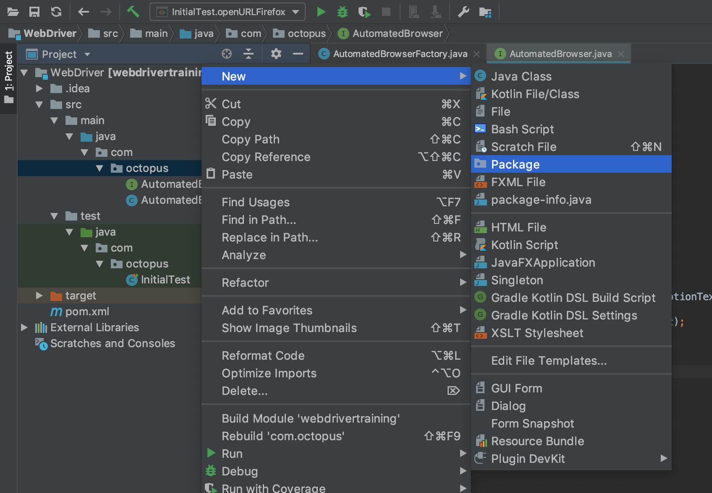

Enter the name `decoratorbase`, and click the `OK` button.


The new package is then added to the directory structure.

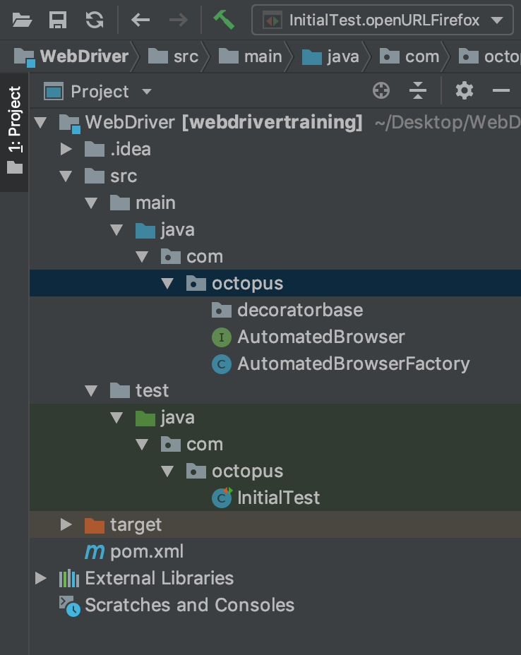

Inside the `com.octopus.decoratorbase` package create a new class called `AutomatedBrowserBase` with the following code. Each method defined in the `AutomatedBrowser` interface is implemented by passing it through to the `automatedBrowser` instance variable (if it is not `null`):

```java
package com.octopus.decoratorbase;

import com.octopus.AutomatedBrowser;
import org.openqa.selenium.WebDriver;

public class AutomatedBrowserBase implements AutomatedBrowser {

  private AutomatedBrowser automatedBrowser;

  public AutomatedBrowserBase() {

  }

  public AutomatedBrowserBase(AutomatedBrowser automatedBrowser) {
    this.automatedBrowser = automatedBrowser;
  }

  public AutomatedBrowser getAutomatedBrowser() {
    return automatedBrowser;
  }

  @Override
  public WebDriver getWebDriver() {
    if (getAutomatedBrowser() != null) {
      return getAutomatedBrowser().getWebDriver();
    }
    return null;
  }

  @Override
  public void setWebDriver(WebDriver webDriver) {
    if (getAutomatedBrowser() != null) {
      getAutomatedBrowser().setWebDriver(webDriver);
    }

  }

  @Override
  public void init() {
    if (getAutomatedBrowser() != null) {
      getAutomatedBrowser().init();
    }
  }

  @Override
  public void destroy() {
    if (getAutomatedBrowser() != null) {
      getAutomatedBrowser().destroy();
    }
  }

  @Override
  public void goTo(String url) {
    if (getAutomatedBrowser() != null) {
      getAutomatedBrowser().goTo(url);
    }
  }

  @Override
  public void clickElementWithId(String id) {
    if (getAutomatedBrowser() != null) {
      getAutomatedBrowser().clickElementWithId(id);
    }
  }

  @Override
  public void selectOptionByTextFromSelectWithId(String optionText, String id) {
    if (getAutomatedBrowser() != null) {
      getAutomatedBrowser().selectOptionByTextFromSelectWithId(optionText, id);
    }
  }

  @Override
  public void populateElementWithId(String id, String text) {
    if (getAutomatedBrowser() != null) {
      getAutomatedBrowser().populateElementWithId(id, text);
    }
  }

  @Override
  public String getTextFromElementWithId(String id) {
    if (getAutomatedBrowser() != null) {
      return getAutomatedBrowser().getTextFromElementWithId(id);
    }

    return null;
  }
}
```

Now let's extend the `AutomatedBrowserBase` class to create the `ChromeDecorator` class. `ChromeDecorator` will override the `init()` method to create an instance of the `ChromeDriver` class.

The `ChromeDecorator` class will be placed in the `com.octopus.decorators` package, so create the new `decorators` package just like you did with the `decoratorbase` package.

Inside the `com.octopus.decorators` package create a class called `ChromeDecorator` with the following code.

Notice that the `ChromeDecorator` class implements only one method. This is the benefit of extending the `AutomatedBrowserBase` class instead of the `AutomatedBrowser` interface:

```java
package com.octopus.decorators;

import com.octopus.AutomatedBrowser;
import com.octopus.decoratorbase.AutomatedBrowserBase;
import org.openqa.selenium.WebDriver;
import org.openqa.selenium.chrome.ChromeDriver;

public class ChromeDecorator extends AutomatedBrowserBase {
    public ChromeDecorator(final AutomatedBrowser automatedBrowser) {
        super(automatedBrowser);
    }

    @Override
    public void init() {
        final WebDriver webDriver = new ChromeDriver();
        getAutomatedBrowser().setWebDriver(webDriver);
        getAutomatedBrowser().init();
    }
}
```

And we follow the same process to create the `FirefoxDecorator` class, which creates an instance of the `FirefoxDriver` class:

```java
package com.octopus.decorators;

import com.octopus.AutomatedBrowser;
import com.octopus.decoratorbase.AutomatedBrowserBase;
import org.openqa.selenium.WebDriver;
import org.openqa.selenium.firefox.FirefoxDriver;

public class FirefoxDecorator extends AutomatedBrowserBase {

    public FirefoxDecorator(final AutomatedBrowser automatedBrowser) {
        super(automatedBrowser);
    }

    @Override
    public void init() {
        final WebDriver webDriver = new FirefoxDriver();
        getAutomatedBrowser().setWebDriver(webDriver);
        getAutomatedBrowser().init();
    }
}
```

The `ChromeDecorator` and `FirefoxDecorator` classes contain the logic we need to open either the Chrome or Firefox browsers, and they achieve this by creating instances of either the `ChromeDriver` or `FirefoxDriver` classes. These driver classes are then passed to the  `AutomatedBrowser` instance that the `ChromeDecorator` and `FirefoxDecorator` classes "wrap up" by calling `getAutomatedBrowser().setWebDriver(webDriver)`.

The last step is to initialize the drivers by calling `getAutomatedBrowser().init()`. Calling the `init()` method does nothing right now, but we'll use this method later on to configure some advanced features of the drivers.

The final decorator we need is one that uses the WebDriver API to perform actions against the browsers initialized by either the `ChromeDecorator` or `FirefoxDecorator` classes. For this we'll create the `WebDriverDecorator` class.

The `WebDriverDecorator` class will host a `WebDriver` instance, and expose it through the `getWebDriver()` and `setWebDriver()` methods. The `destroy()` method will close the web browser, and the `goTo()` method opens up the supplied URL.

Notice that `WebDriverDecorator` has a default constructor. This is unlike `ChromeDecorator` and `FirefoxDecorator`, which both provide a single constructor that takes a `AutomatedBrowser`. This difference exists because `WebDriverDecorator` is intended to be the base `AutomatedBrowser` that other decorators wrap up. We'll see this in action when we update the `AutomatedBrowserFactory` class.

We've already seen a lot of the code that goes into the `WebDriverDecorator` class in the last post, with the `webDriver.get()` method opening a URL, and the `webDriver.quit()` method closing the browser:

```java
package com.octopus.decorators;

import com.octopus.AutomatedBrowser;
import com.octopus.decoratorbase.AutomatedBrowserBase;
import org.openqa.selenium.WebDriver;

public class WebDriverDecorator extends AutomatedBrowserBase {

  private WebDriver webDriver;

  public WebDriverDecorator() {

  }

  public WebDriverDecorator(final AutomatedBrowser automatedBrowser) {
    super(automatedBrowser);
  }

  @Override
  public WebDriver getWebDriver() {
    return webDriver;
  }

  @Override
  public void setWebDriver(final WebDriver webDriver) {
    this.webDriver = webDriver;
  }

  @Override
  public void destroy() {
    if (webDriver != null) {
      webDriver.quit();
    }
  }

  @Override
  public void goTo(final String url) {
    webDriver.get(url);
  }
}
```

With the decorators done we need to update the `AutomatedBrowserFactory` to make use of them.

Previously the `getChromeBrowser()` and `getFirefoxBrowser()` methods returned `null`. Now we can create instances of our decorator classes to build up customized instances of the `AutomatedBrowser` interface to open either Chrome or Firefox.

Note how the decorator constructors wrap each other up. This is key to the decorator pattern, and means we can mix and match decorator classes to construct a wide range of objects, all without having to create deep class hierarchies with inheritance:

```java
private AutomatedBrowser getChromeBrowser() {
  return new ChromeDecorator(
    new WebDriverDecorator()
  );
}

private AutomatedBrowser getFirefoxBrowser() {
  return new FirefoxDecorator(
    new WebDriverDecorator()
  );
}
```

The image below shows how decorators wrap each other up, and pass method calls to the instances that they decorate.

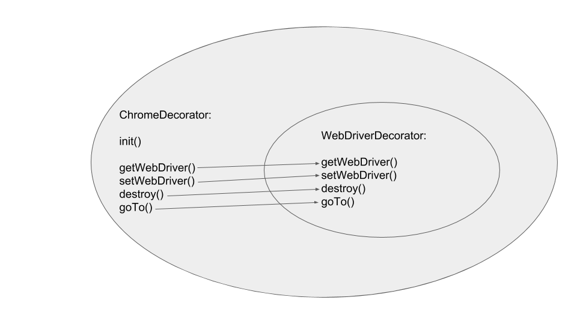

Let's create a test that makes use of our factory and the instances of `AutomatedBrowser` that it creates.

Because this is a test class, it will be created in the
`src/test/java/com/octopus` directory:

```java
package com.octopus;

import org.junit.Test;
import org.junit.runner.RunWith;
import org.junit.runners.Parameterized;
import java.util.Arrays;

@RunWith(Parameterized.class)
public class FactoryTest {

  private static final AutomatedBrowserFactory AUTOMATED_BROWSER_FACTORY
    = new AutomatedBrowserFactory();

  private String browser;

  public FactoryTest(final String browser) {
    this.browser = browser;
  }

  @Parameterized.Parameters
  public static Iterable data() {
    return Arrays.asList(
      "Chrome",
      "Firefox"
    );
  }

  @Test
  public void openURL() {
    final AutomatedBrowser automatedBrowser =
      AUTOMATED_BROWSER_FACTORY.getAutomatedBrowser(browser);
    automatedBrowser.init();
    automatedBrowser.goTo("https://octopus.com/");
    automatedBrowser.destroy();
  }
}
```

The `FactoryTest` class makes use of JUnit parameterization to run the test method multiple times with different inputs. We'll use this functionality to run the test against both the Chrome and Firefox browsers with a single test method.

To enable parameterization, the test class require the annotation `@RunWith(Parameterized.class)`:

```java
@RunWith(Parameterized.class)
public class FactoryTest {

}
```

It then needs a static method to return the values that will be passed to the `FactoryTest` constructor. In our case, these values are strings for the name of the browsers that we will test against:

```java
@Parameterized.Parameters
public static Iterable data() {
  return Arrays.asList(
    "Chrome",
    "Firefox"
  );
}
```

Finally the `FactoryTest()` constructor is configured to accept a parameter, which will be set to one of the values returned by the `data()` method. In this case, we save the parameter to the `browser` instance variable:

```java
private String browser;

public FactoryTest(final String browser) {
  this.browser = browser;
}
```

The test method can then make use of the `browser` instance variable to launch either the Chrome or Firefox browser as part of the test.

This ability to select a browser at run time through the
`AutomatedBrowserFactory` will provide us with a great deal of flexibility in our testing later on:

```java
@Test

public void openURL() {
  final AutomatedBrowser automatedBrowser =
    AUTOMATED_BROWSER_FACTORY.getAutomatedBrowser(browser);

  automatedBrowser.init();
  automatedBrowser.goTo("https://octopus.com/");
  automatedBrowser.destroy();
}
```

We have created a number of new classes as part of this blog, and you should end up with a directory structure that looks like this.

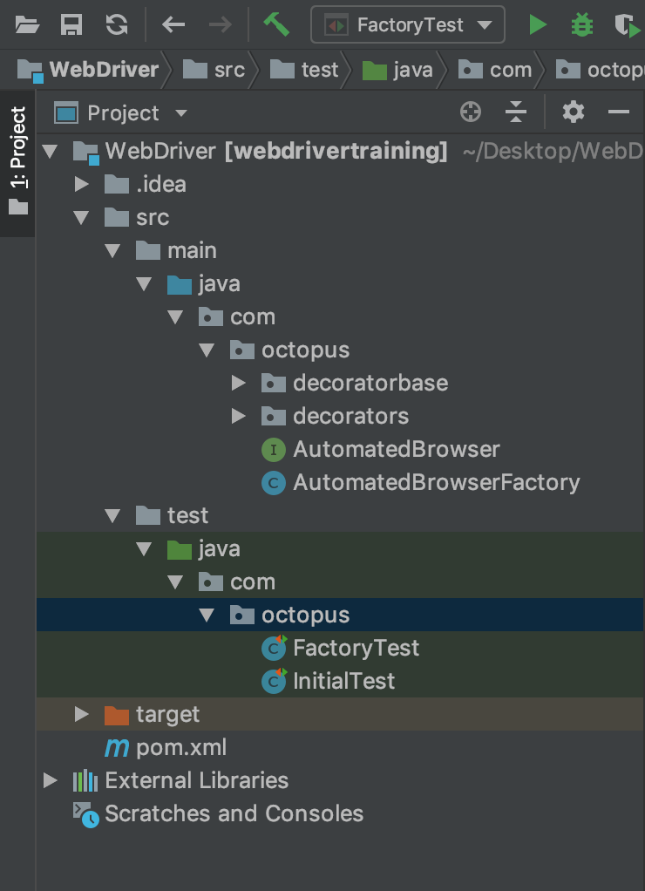

To run the tests, click the green arrow next to the `FactoryTest` class and select the `Run 'FactoryTest'` option.

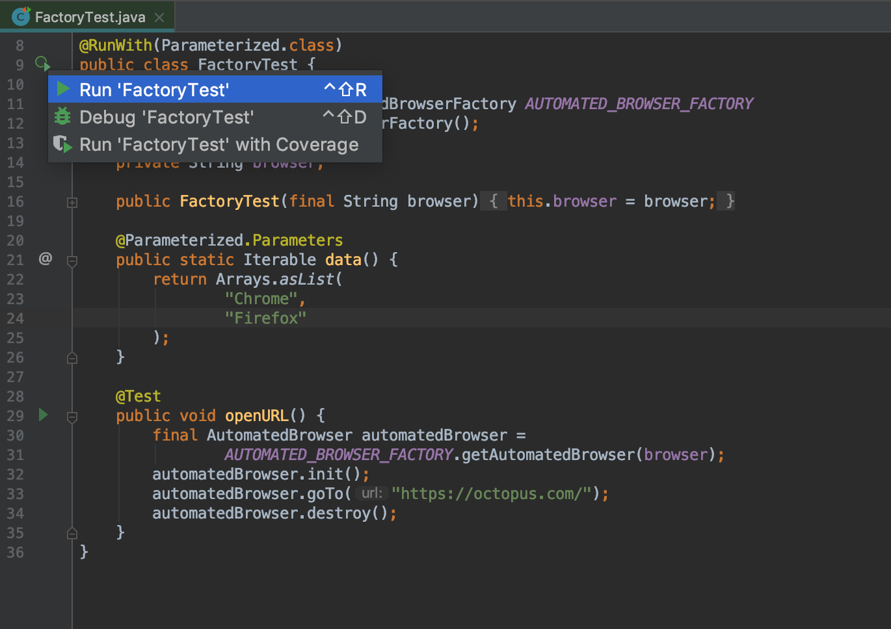

You will see both Chrome and Firefox open, display [https://octopus.com](https://octopus.com), and close again.

Now that we have a simple framework to run tests against multiple browsers, we need to have a web page that we can interact with, which we will create in the next post.

Return to the [table of contents](../0-toc/webdriver-toc.md).
