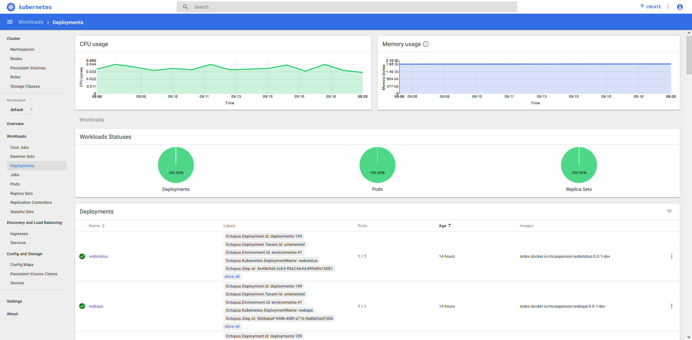
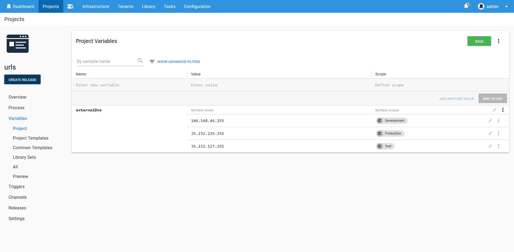
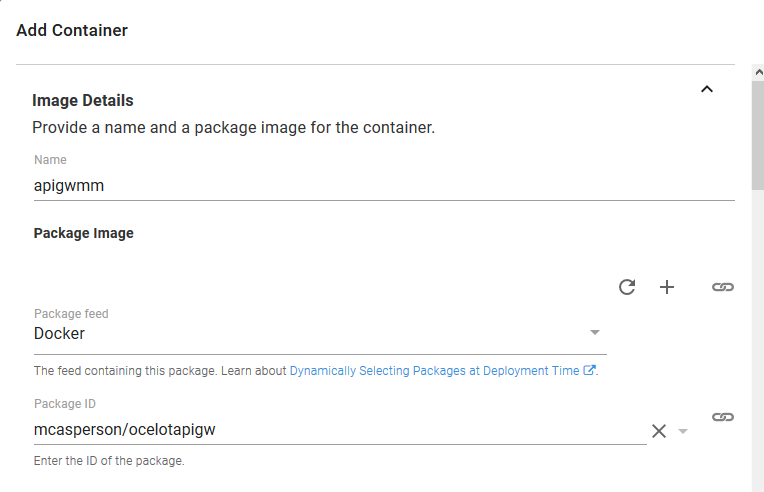
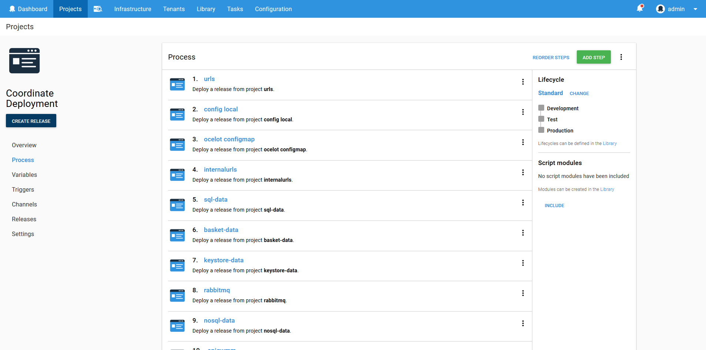
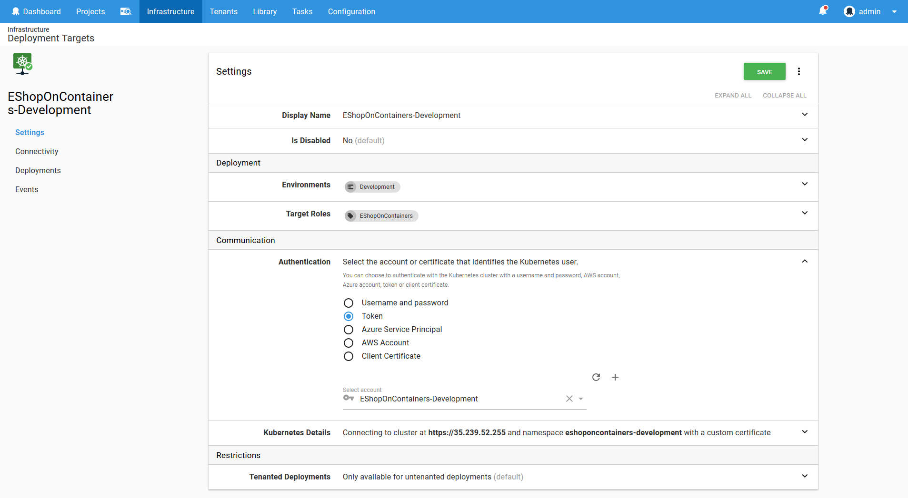
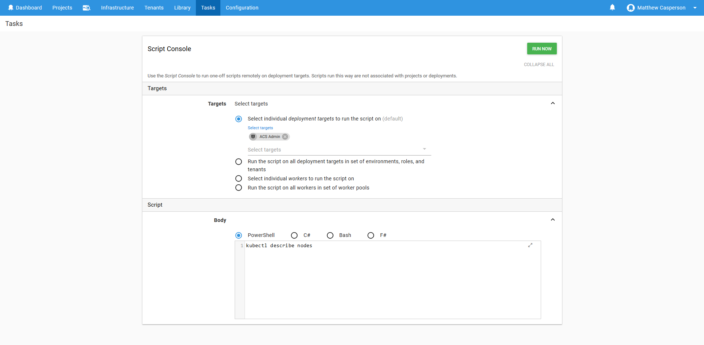
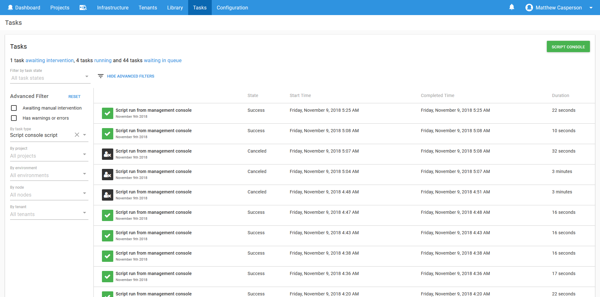

With the release of 2018.9, Kubernetes is now a first class citizen in Octopus. But you may be asking why you would use Octopus to manage your Kubernetes deployments. Kubernetes already has a rich declarative model for all of its resources, a fully functional command line tool, and more dashboards than you can poke a stick at.

So what advantages does Octopus bring to your Kubernetes deployments?

## Modelling your Environments

A common practice in most development teams is to progress code through different environments. Although no two teams are the same, every team I have ever worked with has adopted some variation of the Development -> Test -> Production environment lifecycle.

And it is no coincidence that environmental progression is a core concept in Octopus. Environments are first class entities in Octopus, and managing deployments through to the production environment is baked into every part of the product. From lifecycles to channels to the dashboards, Octopus makes it easy to model how your teams work and to promote releases in a reliable and visible manner.

Take this overview of an Octopus project as an example. The table clearly shows what release was make to which environment and at what time. And with a few clicks you can get more detailed information such as who performed the deployment and what versions of the packages were included.

The Kubernetes dashboard on the other hand is concerned with displaying information about the Kubernetes resources such as pods, services and deployments. This is a low level view of your cluster that can be used for debugging and monitoring.

The Octopus allows you to model the environments your team are already using, while the Kubernetes dashboard provides a low level resource view for debugging and other administration tasks. Combining Octopus and Kubernetes gives you a top to bottom view of your infrastructure.

## Managing your Variables

Helm provides an expressive templating language and allows variables to be supplied from multiple sources including a variables YAML file or from the command line. This functionality allows complex and customizable deployments to be defined, making Helm the defacto Kubernetes package manager.

But a templating language is only half the story. The other half of the story is  managing the variables that define a particular deployment.

Octopus provides a solution with comprehensive variable management features that includes secret storage and scoping rules. These variables can then be passed into Helm, used in the Kubernetes steps or consumed in custom steps. You can see an example of scoped variables on our [demo server](https://demo.octopus.com/app#/projects/urls/variables).

By taking advantage of Octopus to manage variables, complex Helm and Kubernetes deployments can be coordinated across multiple environments and clusters with ease.

## Versioning your Containers

Once a deployment process has been created, it will not typically change all that much. What will change between deployments are container versions.

Octopus separates the design time process of building a deployment from the deploy time process of selecting package versions. What this means is that as you roll out new versions of your containers, Octopus will select those versions during deployment and incorporate them into the generated YAML file.

As you can see in the screenshot below, when designing a Kubernetes deployment, you specify the container ID, but not the version.

Then during the deployment you can select a specific container version, or simply let Octopus select the latest version for you.

Octopus makes it easy to manage repeatable deployments by separating design and deploy time concerns, meaning you only need to worry about what version of a container you wish to deploy when rolling out a new deployment.

## Iterate Individually or Progress Collectively

Microservices are an increasingly popular development strategy that allows focused teams to deliver small changes quickly within larger ecosystem.

However it is not an uncommon requirement to progress a set of individual microservices with known versions to the next environment. While such dependencies are discouraged in microservice architectures, company testing or external regulations may  demand that your environments be in a well known state at any point in time.

Octopus can model these development strategies, whether your teams will promote individual microservices through environments independently, or sets of microservices are promoted together.

For teams that promote their own individual microservices independently, individual Octopus deployment projects can be used. You can see this project configured on our [demo server](https://demo.octopus.com/app#/projects/identity/overview).

To promote a set of microservices with known versions and in a predictable order, a project taking advantage of the [Deploy a release step](https://octopus.com/blog/deploy-release-step/deploy-release-step) is used. By treating the deployments of other projects as deployable resources, the `Deploy a release` step allows teams to capture the state of an environment at a given point in time, and deploy that state to the next environment.

In the screenshot below you can see an example of an Octopus project that includes a sequence of `Deploy a release` steps. The order of these steps ensures that the microservices are deployed in a fixed order, and the set of `Deploy a release` steps represents a complete microservice ecosystem that is deployed as a single unit to new environments. You can see this project configured on our [demo server](https://demo.octopus.com/app#/projects/coordinate-deployment/process).

Using Octopus to manage your Kubernetes deployments gives you the freedom to iterate quickly during development while promoting between environments in a predictable manner.

## Managing the Cloud and Migrating From On-Premises

Kubernetes is an excellent tool to have in your toolbox, but it is likely not the only tool you will choose to use. Is Kubernetes really the best choice for hosting static files, or is S3 or Azure Storage more suitable? Do you still have to work with your on premises database? Is RDS a better option that a containerized database?

Incremental migrations, legacy systems and robust PaaS offerings often mean your deployment strategy won't be limited to your Kubernetes cluster. Because Octopus already supports a wide range of cloud and on premises platforms, you can seamlessly integrate deployment processes across Kubernetes and existing services.

And if your deployments do span multiple technology stacks, you can be assured that all of the benefits above apply equally to your on premises and cloud deployments to create a cohesive deployment process.

## Model Deployments With Best Practice

The [Center for Internet Security](https://www.cisecurity.org/benchmark/kubernetes/) offers guideless on how to secure your Kubernetes infrastructure. In particular, two recommendations are particularly relevant to your deployment strategy:

* 1.6.1 Ensure that the cluster-admin role is only used where required
* 1.6.2 Create administrative boundaries between resources using namespaces

Octopus encourages deployments to individual namespaces using credentials with limited permissions by way of targets. A Kubernetes target in Octopus captures the cluster URL, and account and a namespace, and are scoped to roles and environments.

Typically a Kubernetes target will have a unique namespace for each environment and role. The associated account is encouraged to have only the permissions it needs to deploy within that namespace. The result is that a Kubernetes target represents a permission boundary within the cluster. Following this pattern ensures that your deployments do not rely on a single admin account, and segregates resources within namespaces.

Through the use of targets, Octopus encourages you to model your Kubernetes deployments in a way that is secure and manageable.

## Centralized and Audited Cluster Administration

Have you ever sent a config file via email or Slack? Have you ever been asked to report on a production outage only to have no idea what changed because undocumented modifications were made from people's desktops?

These scenarios are unfortunately quite common. As your Kubernetes cluster grows in complexity, it can become increasingly difficult to manage credentials and understand the impact of changes.

Octopus offers a solution through the Script Console. By using the Script Console, developers and administrators can interact with the Kubernetes cluster without having to share credentials. Ad-hoc commands can be run against one or more Kubernetes targets, and the command that was run, who ran it and the result are all saved in an audit log that can be reviewed at a later time.

Through the Script Console, Octopus gives teams the ability to debug and manage their Kubernetes clusters, without needing to distribute credentials, and with an audit log recording each change.

## Conclusion

Octopus has a long history of delivering repeatable and reliable deployments, and has evolved to support the deployment patterns found in thousands of developments teams. By using Octopus to manage your Kubernetes deployments you get all the benefits of what is fast becoming the standard platform for managing high density infrastructure with the battle tested deployment strategies baked into Octopus.
