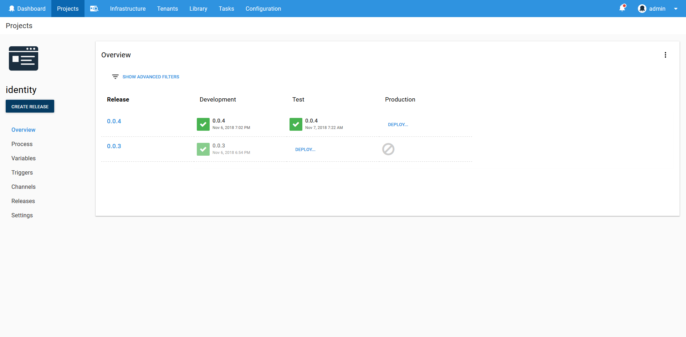
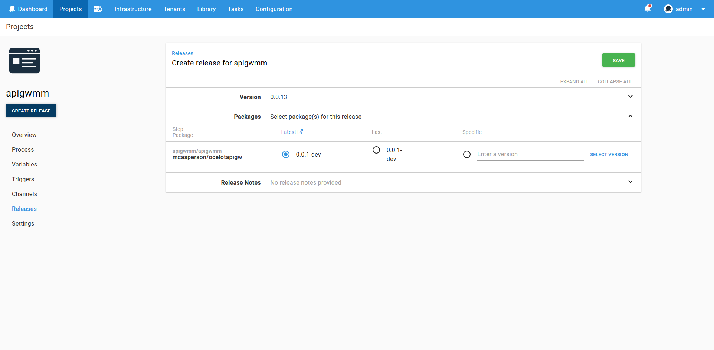

## Modelling your Environments

A common practice in most development teams is to progress code through different environments. Although no two teams are the same, every team I have ever worked with has adopted some variation of the Development -> Test -> Production environment lifecycle.

And it is no coincidence that environmental progression is a core concept in Octopus. Environments are first class entities in Octopus, and managing deployments through to the production environment is baked into every part of the product. From lifecycles to channels to the dashboards, Octopus makes it easy to model how your teams work and to promote releases in a reliable and visible manner.

Take this overview of an Octopus project as an example. The table clearly shows what release was make to which environment and at what time. And with a few clicks you can get more detailed information such as who performed the deployment and what versions of the packages were included.

The Kubernetes dashboard on the other hand has no concept of environments. It is concerned with displaying information about the Kubernetes resources such as pods, services and deployments. Although such information is valuable, using the Kubernetes dashboard to understand the state of your environments requires a great deal of investigation.

The combination of Octopus and Kubernetes allows you to model the environments your team are already using while providing a low level resource view for debugging and other administration tasks.

## Managing your Variables

Helm provides an expressive templating language and allows variables to be supplied from multiple sources including a variables yaml file or from the command line.

But a templating language is only half the story. The other half of the story is defining and managing the variables that will be used.

Octopus provides a solution with comprehensive variable management functionality that includes secret storage and scoping rules. These variables can then be passed into Helm, used in the Kubernetes steps or consumed in custom steps.

The combination of Octopus and Helm allows you to securely define, store and scope variables, and then apply them across environments.

## Versioning your Containers

Once a deployment process has been created and refined, it will not typically change all that much. What will change are variables and container versions.

Octopus separates the process of building a deployment with the selection of package versions during deployment. What this means is that as you roll out new versions of your containers, Octopus will select those versions and incorporate them into the generated YAML file.

What this means is you specify the container ID as part of the deployment, but not the version.

Then during the deployment you can select a specific container version, or simply let Octopus select the latest version for you.

Octopus allows you to separate deploy time concerns such as container versions from the Kubernetes resource descriptions that make up the deployment.

## Managing the Cloud

Kubernetes is an excellent tool to have in your toolbox, but it is not the only tool you will have or choose to use. Is Kubernetes really the best choice for hosting static files, or is S3 or Azure Storage more suitable? Do you still have to work with your on prem database, or is RDS a better option that a containerized database?

Incremental migrations, legacy systems and robust PaaS offerings often mean your deployment strategy is not limited to your Kubernetes cluster. Because Octopus already supports a wide range of cloud and on premises platforms, you can seamlessly integrate deployment processes across Kubernetes and existing services.
