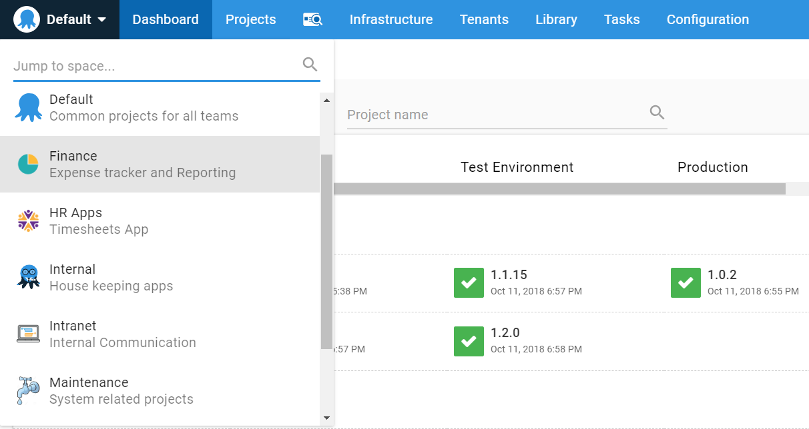
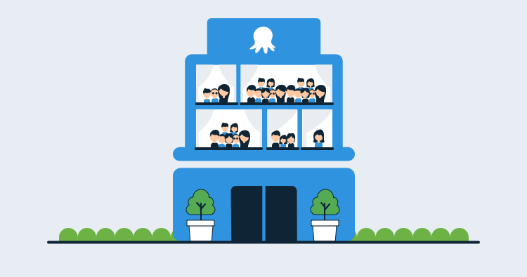

If you've ever found yourself scrolling through a long list of projects to find the one you're working on or you see drop-downs with hundreds of items and you struggle to find the one you're looking for, then a new feature is coming your way...

Spaces are a new way to organize your Octopus Server. Spaces make it easy to group the things your teams care about into Spaces just for them. It's like moving all of your teams from a large open plan office to private offices for each team.

Octopus is an amazing tool for making complex deployments easy. As customers scale, they often come to us asking for guidance on managing a large set of Projects, Environments, Lifecycles, Variable Sets, you name it. We want to make managing your deployment resources as easy and intuitive as managing tasks in a single project. To achieve this we've been working on a way to give you the option to partition and isolate everything in Octopus.

Spaces is our answer, and they're coming in January 2019.

## Give Teams Their Own Space

Give each team their own Space, with their own projects, environments, tenants, step templates and more. The navigation bar lets you easily jump between Spaces, so instead of seeing dozens or hundreds of unrelated projects and other Octopus resources, you'll just see the resources for that Space.

## Put Team Leads in Control

You don't want the wrong people to deploy to production, but you also don't want there to be a bottleneck every time a new team member is added or a new project is created.

One of the key driving factors for Spaces is the ability to delegate a set of responsibilities. This lets the Octopus administrator hand over full access to any given Space and be completely hands off if they choose.

This allows the system administrator to focus on system concerns like adding new users, managing any system teams, and the configuration of the installation. For the administrator who wants or needs to be directly involved they can include themselves in the list of owners for any or all Spaces.

## Space, When You Need It

Spaces is entirely opt-in. We have done extensive work and testing to ensure the feature is as backwards compatible as it can be. We've introduced the concept of a "Default Space" which allows us to support the majority of the API as it is today. Spaces will be there when you need it, and moving to Spaces can be a gradual transition.

The way you use Octopus today for the most part will not change, we will have specific details closer to release. In summary, Octopus will enforce permissions more consistently and some API endpoints around managing the installation have changed, e.g. [Teams/Permissions](/blog/2018-05/team-configuration-improvements.md).

## Licensing

After talking with our existing customers, their ideas and desires for segregation of business units and various teams and infrastructure drove the design of Spaces.

Deployment Targets that exist in each Space that represent the same physical hardware will each be counted towards your machine limit.

 #### Self-hosted

 - Customers using a grandfathered Community (free), Professional, Team, or Enterprise license are limited to one Space. You can upgrade to a newer license to split your Octopus into multiple Spaces.
 - Customers using a grandfathered High Availability license get unlimited Spaces.
 - Customers with a Standard license will get three Spaces. You can upgrade to Data Center to get more Spaces.
 - Customers with a Standard Unlimited or Data Center license will get unlimited Spaces.

 #### Octopus Cloud

 - New and existing Standard edition customers will get unlimited Spaces.
 - Existing customers on the old Starter edition will get 1 Space.

## Conclusion

We can't wait for you to try Spaces and we're working hard to get it shipped as soon as possible. Stay tuned for another post coming soon with some further details.

In the mean time if you haven't already have a look at our [recent webinar where we discussed spaces alongside workers](https://hello.octopus.com/webinar-spaces-workers/on-demand)
