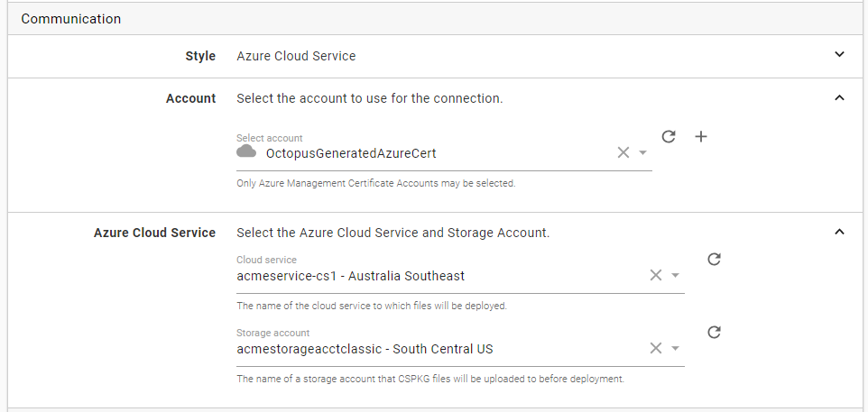
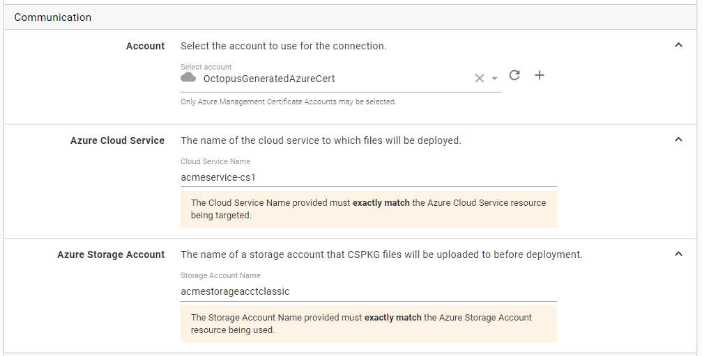
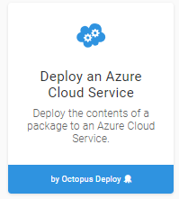
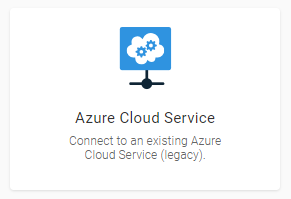

## tl;dr;

Azure have deprecated the Azure Service Management APIs and in order to make better use of the new tooling, from version `2018.12.0` Octopus will no longer proactively retrieve Cloud Service or Storage Account details in the portal from  when using Azure Certificate Accounts. Despite these UI changes, deployments will continue to work and new steps using them can still be created.

## The longer story
The Azure Service Management (ASM) API is the original mechanism for programmatically interacting with your Azure resources until the Azure Resource Manager (ARM) API became available in [2014](https://channel9.msdn.com/Events/Build/2014/2-607). 

The ARM API is the new(er) API used to interact with Azure and introduces concepts like Resource Groups to better model interrelated resources as well as providing support for some of the newer services not available in the older API. As such they have begun to deprecate the older ASM. To quote [Naveed Aziz on an Azure Team Blog](https://blogs.msdn.microsoft.com/appserviceteam/2018/03/12/deprecating-service-management-apis-support-for-azure-app-services/)

>  ... The Service Management APIs are archaic and not well suited for the modern cloud. 

That's fine right? Deprecating an older API in favour of a newer API would typically be not a big problem, just change a couple lines of code and hey presto, you are hitting some new endpoints and your XML payloads become JSON... The catch is that Azure isn't moving _all_ of the available features from ASM to ARM. 

### Management Certificates
First and foremost, authenticating with Management Certificates are not supported with ARM and instead users are directed to use the Azure Active Directory and create Service Principals. This authentication mechanism has been available in Octopus for some time and we would recommend anyone still using Azure Certificates to [upgrade to Service Principals today](https://octopus.com/docs/infrastructure/accounts/azure#azure-service-principal). The one caveat to this change is due to a feature which only works with Management Certificates since it is _only_ supported in ASM.

### Azure Cloud Services
 [Azure Cloud Services](https://azure.microsoft.com/en-au/services/cloud-services/) were one of Azure's first attempts to provide a simple PaaS model for hosting customer websites. When the retirement of ASM was outlined by Azure last year what was less obvious, is that this also has an impact on the ability to use Azure Cloud Services itself since there are no way to manage these using the new ARM APIs. After some further discussions with the Azure team it appears that the actual HTTP API endpoints will still be available since Visual Studio itself actually needs to make use of them. Since the only tooling available to make use of them being deprecated however, I think it is safe to assume that Azure are keen for people to move off Cloud Services.

## How will these changes affect my deployments?
The short answer is it wont affect _deployments_ at all. :) What the above changes to the available API's mean for Octopus users, is that in order to use the _newer_ libraries, we will no longer be able to use the older ones in the portal. As a result **if you are using Azure Management Certificates, the Octopus Server will no longer auto-populate any Azure Cloud Services or Storage Accounts when configuring targets or the Cloud Service deployment step. Deployments will however continue to work and new targets & steps can still be created**. 

Instead of selecting your cloud service like this:

you will be provided with a set of text fields.

(Incidently, this is actually not much different to how we originally exposed these features.)

This change will be both on the [Azure Cloud Service Target](https://octopus.com/docs/infrastructure/deployment-targets/azure/cloud-service-targets) and Azure Cloud Service deployment step (if "legacy" mode is selected)

These changes will be present from Octopus Server version `2018.12.0`.

### Onwards and upwards
In order to continue to make it easier to integrate your deployments with more and more of what Azure have to offer, we need to take a page out of their book when [they say](https://azure.microsoft.com/en-au/updates/deprecating-service-management-apis-support-for-azure-app-service/):

> Supporting Service Management APIs any longer will hold us back from delivering a premium developer experience and control at planet scale.

Although behind the scenes we will continue to provide the ability to perform deployments using Management Certificates to Cloud Services, the removal of these libraries from the Octopus Portal means that we have had to remove some functionality that was previously available. Despite striving to keep backwards compatibility a key part of our decision making, sometimes older functionality just has to be dropped.