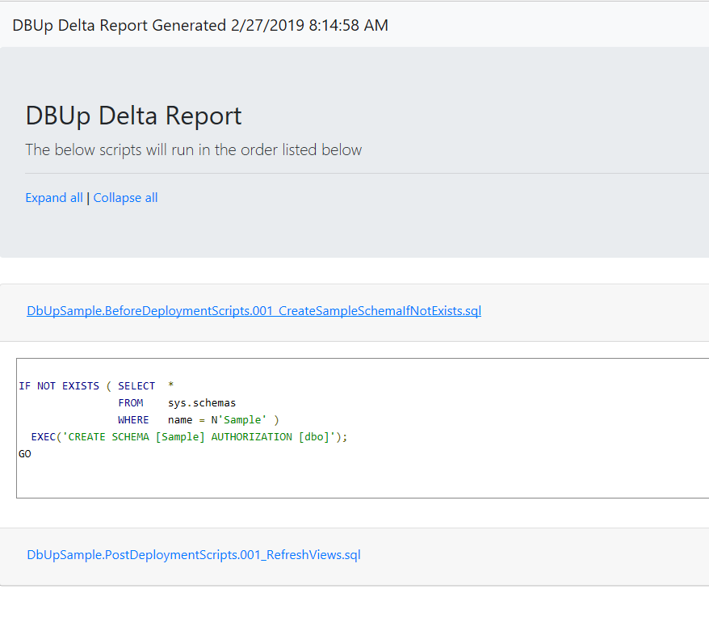
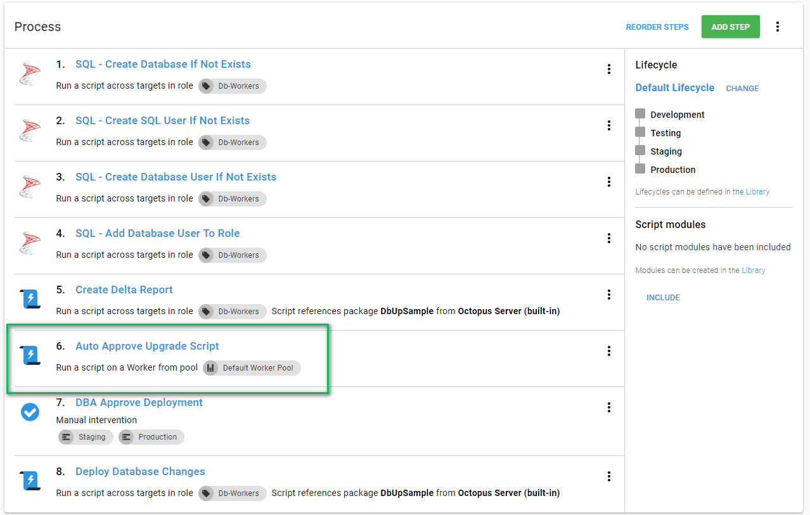
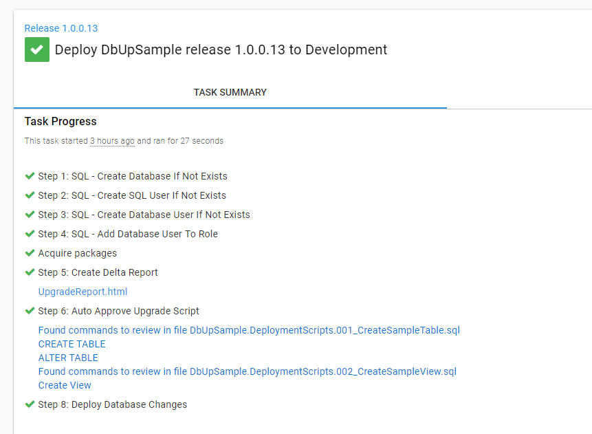
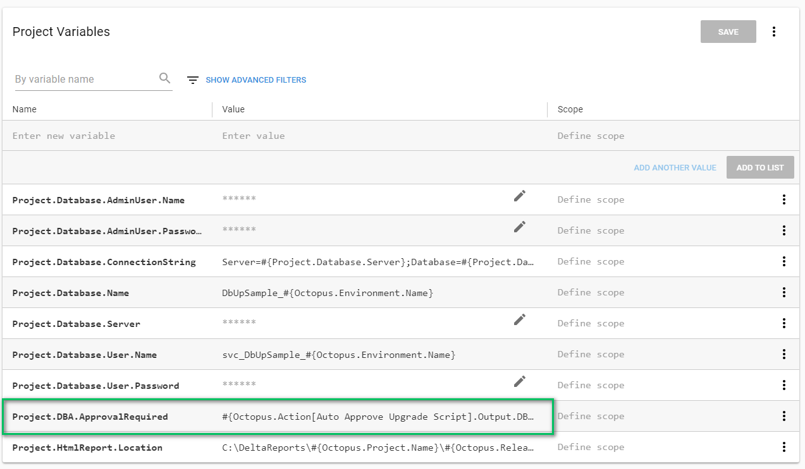
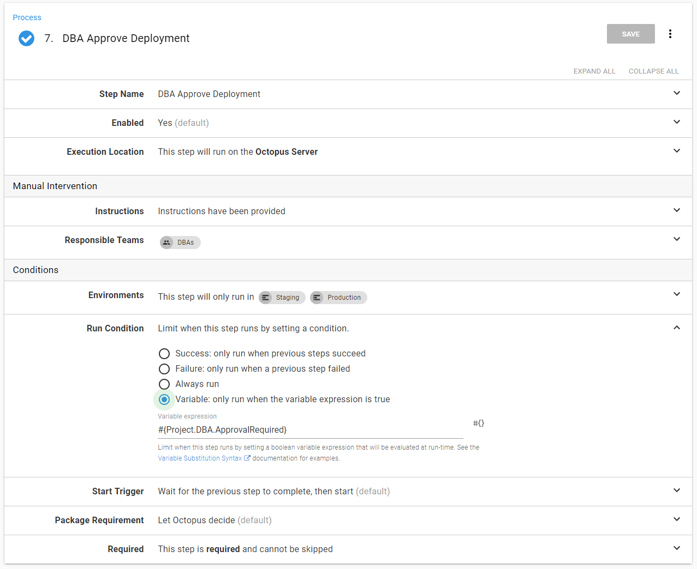
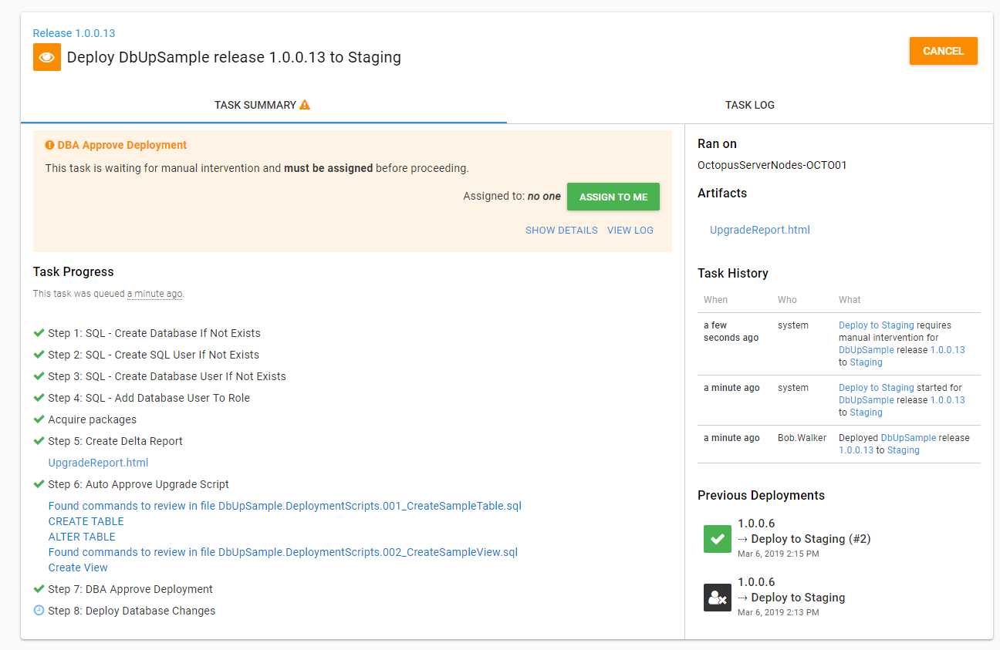

A really excellent question was posted within a few hours of my blog post [Using DbUp and Workers to Automate Database Deployments](https://octopus.com/blog/dbup-database-deployments) going live.  

*How easy would it be to only require manual intervention if there is an actual migration?*

The funny thing was I had answered a similar question in [Episode 7 of Ask Octopus](https://www.youtube.com/watch?v=W0DafJBBuDw&t=1128s).  With Ask Octopus, the question was "how do I skip manual intervention when I'm automatically redeploying a database change?"  The answer to both of these questions is the same, use the `Run a Script` step which runs through some business logic and sets an [output variable](https://octopus.com/docs/deployment-process/variables/output-variables).  That output variable is used in a [run condition](https://octopus.com/docs/deployment-process/conditions#run-condition) on the `Manual Intervention` step.

What does that look like?  In the video, I glossed over the PowerShell doing the auto approval.  In this blog post, I will flesh that out a bit more by generating a providing a sample PowerShell script.  While I hope the PowerShell script is useful, please use it as a starting point only.  Work with your friendly neighborhood DBA on what they want to auto approve and what they want to review.

## The DBA Scalability Problem

Before diving into the scripts and process, I want to take a step back and look at the specific problem we are trying to solve.  

When I helped implement automated database deployments at previous companies, the DBAs are nervous.  The nervousness comes from a lack of trust in the process.  For so long a DBA would look over change scripts before going to Production.  More often than not, that policy came about after one too many late night pages woke up the on-call DBA in the middle of the night.  Some developer (sometimes me) wrote a bad database change which caused the CPU to spike to 100% when a specific job would run.    

Manually reviewing all changes is possible when each application is deployed once a quarter.  At the start of the Automated Database Deployment process that policy is continued.  That policy works during the pilot phase, as a pilot might involve a few applications.  Even after the pilot, that policy still works.  But then something happens.  The time between deployments drops.  Once a quarter becomes once a month which then becomes once a fortnight before it settles on once a week.  The DBAs are inundated with requests to approve their changes.  

Hiring more DBAs will not solve this problem.  It isn't something you can answer with a [human wave approach](https://youtu.be/EF3g4Ua5e7k?t=12).  The process should be smart enough to have DBAs review changes when they need to.  

## When should a DBA get involved?

It sounds so simple, have the DBAs review changes when they need to.  Simple to say, much harder to execute.  When working with DBAs in the past they said something along the lines of, "I want any standards violations to cause a failure, I shouldn't even see those.  They shouldn't even be deployed. On the other hand, I want to see scripts which make specific schema changes where I could get paged at two in the morning."

Okay, that gives us something to work with.  Knowing that we can implement a multi-layer approach.  The first layer will occur on the build server; it will run the tooling necessary to check for standard violations.  The tooling can check for naming conventions, every table has a primary key, no cursors are being used in a stored procedure, and so on.  There are many tools out there to help enforce SQL standards.  This includes static analysis tools such as [SQL Enlight](https://ubitsoft.com/) as well as writing database unit tests using tSQLt.  There are pros and cons to each tool.  Doing a deep dive into those tools is out of scope for this article.  The important thing is by the time a package gets to Octopus Deploy we will know the scripts meet our standards.

The second layer will occur in Octopus Deploy.  Automated tooling can only catch so much. It is possible to write a SQL script which meets all the standards and requirements but is still poorly written enough to cause significant problems.  For example, dropping a table.  You can't have a rule in place to fail any build when a drop table command is found in a script.  You'd never be able to clean up old or unused tables.  

The final piece of the puzzle is determining which environment should a DBA perform the manual intervention.  Production is too late.  By that time commitments have been made.  Expectations have been set with users.  Stopping a deployment to production so a DBA can review a script doesn't make sense.  What happens they find an issue?  

Having a DBA approve deployments to a lower environment, such as Development doesn't make sense either.  That would generate too much noise for the DBAs.  Especially when build occurs after each check-in.  One team I worked on we did 20-30 deployments a day.  On a slow day.  

My recommendation is to have a manual intervention in a QA, Testing, Staging, or UAT environment.  Pick an environment low enough where a DBA can offer suggestions or reject a deployment.  But high enough where they aren't always sent requests and the noise level is off the charts.  It may take a while to dial-in to the right environment. 

## Auto Approval Process in Octopus Deploy

For the automated approval process, we are going to be leveraging [output variables](https://octopus.com/docs/deployment-process/variables/output-variables) and [run conditions](https://octopus.com/docs/deployment-process/conditions#run-condition).  The process will have a PowerShell script (or a series of PowerShell scripts) which will inspect the delta report.  If the PowerShell script or scripts notice something interesting in the delta report, then a manual intervention will be triggered.

For this article I want my script to look for:

- No Changes -> Auto Approve
- Add Table, Drop Table, Drop Column, Drop View, Drop User, Add User, Alter User, Add User to Role, Create View, Create Select Stored Procedure, Merge Statements -> Require review
- Everything Else -> Auto Approve

The nice thing about SQL is there are only so many schema alteration statements.  This will allow us to use a regular expression (NO!!!!!!!!!) to parse the delta report.  

When I started going down this path, I forgot something key in my previous article.  Pre-Deployment and Post-Deployment scripts.  They would always be there.



This leads to an interesting decision.  When checking for no changes, what exactly should it be looking for?  You will notice the full name of the file is included in the report.  For example, `DbUpSample.BeforeDeploymentScripts.001_CreateSampleSchemaIfNotExists.sql` and `DbUpSample.PostDeploymentScripts.001_RefreshViews.sql.`  That leads to a couple of options.  I can modify the code to exclude PreDeployment and PostDeployment scripts.  Or, I can write my check for changes to look for files which match `DbUpSample.DeploymentScripts.*.sql.`  Personally, I like the idea of including all the scripts for a DBA to review.  Not just the deployment scripts.  In my experience, complete visibility builds trust in the deployment process.  Hiding scripts, or not including them, is a good way to destroy that trust.  That being said, that is my personal preference, it is up to you and your DBAs as to how you want to accomplish this.

### Updated Database Deployment Process

As I stated earlier, I want this to be a PowerShell script which will leverage output variables.  I added that script to the process to run right after the upgrade report is generated.



I opted to have the upgrade script and auto-approval step run in all environments.  The upgrade script will generate an artifact.  The auto approval step will be using the [Write-Highlight](https://octopus.com/docs/deployment-examples/custom-scripts#Customscripts-Logging) functionality provided by Octopus Deploy.  By doing that, every environment will have an upgrade report and a list of changes in the deployment summary.



The PowerShell script includes this line at the very end to set an output variable.

```PS
Set-OctopusVariable -name "DBAApprovalRequired" -value $approvalRequired
```

The syntax to access that output variable is a little much, `Octopus.Action[Auto Approve Upgrade Script].Output.DBAApprovalRequired.`  I added a variable to my project to make that a little easier to find.  Also, if I decide to change the name, I only have to change it in one spot.



The final piece will be changing the run condition on the manual intervention step to only run when that value is true.



The release has changes which need to be reviewed.  The manual intervention step only runs in staging and production.  The process skipped the manual intervention step when it deployed to Development and Testing.  When the release is deployed to staging the manual intervention step will be triggered.



On the next deployment to staging, there are no changes which require a DBA to review.  The manual intervention step is skipped.


As much as I would love to generate a community step template for everyone to use, the fact of the matter is every company will be different.  I'd rather show you the script I put together.  My hope is you can take something from it, modify it for your own usage, and add that to your step template library.

```PS
$OctopusURL = # YOUR OCTOPUS BASE URL
$APIKey = # YOUR API KEY
$SpaceId = $OctopusParameters["Octopus.Space.Id"]
$DeploymentId = $OctopusParameters["Octopus.Deployment.Id"]
$CommandsToLookFor = "Create Table,Alter Table,Drop Table,Drop View,Create View,Create Function,Drop Function,sp_addrolemember,sp_droprolemember,alter role,Merge"
$FilePrefixToLookFor = "DbUpSample.DeploymentScripts."
$ArtifactFileName = "UpgradeReport.html"
$sqlFile = ".+\.sql"

$header = @{ "X-Octopus-ApiKey" = $APIKey }

$artifactUrl = "$OctopusUrl/api/$SpaceId/artifacts?take=2147483647&regarding=$DeploymentId&order=asc"
Write-Host "Getting the artifacts for this deployment from $artifactUrl"
$artifactResponse = (Invoke-WebRequest $artifactUrl -Headers $header).content | ConvertFrom-Json
$artifactList = $artifactResponse.Items
$fileToCheck = $null

foreach ($artifact in $artifactList)
{
    # The name of the file is UpgradeReport.html, look for that
    $fileName = $artifact.Filename

    if ($fileName -eq $ArtifactFileName)
    {
        Write-Host "Artifact containing the upgrade report found, downloading"
        $artifactId = $artifact.Id
        $artifactContentUrl = "$OctopusUrl/api/$SpaceId/artifacts/$artifactId/content"
        Write-Host "Pulling the content from $artifactContentUrl"
        $fileToCheck = Invoke-WebRequest $artifactContentUrl -Headers $header
        Write-Host "Finished downloading the file $fileName"
        break;
    }    
}

if ($fileToCheck -eq $null)
{    
    Write-Host "No file found, there should be a file, requiring approval"
    Set-OctopusVariable -name "DBAApprovalRequired" -value $true   
    Exit 0

    # No file, no checking
}
else
{
    Write-Host "File has been found, going to look through it now"
}
if ($filetocheck.rawcontent -like "$fileprefixtolookfor")
{
   Write-Highlight "No deployment scripts found, auto approving"
   Set-OctopusVariable -name "DBAApprovalRequired" -value $false
   Exit 0
}

Write-Host "Pulling all scripts from the report to check"
$scriptList = $fileToCheck.ParsedHtml.getElementsByTagName("div") | where {$_.className -eq "card"}
$commandsToCheck = $CommandsToLookFor -split ","
$approvalRequired = $false

foreach ($item in $scriptList)
{
    $rawHtml = $item.innerText
    $foundFileName = $rawHtml -match "$sqlFile"
    $fileName = $Matches[0]
    $foundCommandWarnings = $false

    foreach ($command in $commandsToCheck)
    {
        $foundCommand = $rawHtml -match "$command"

        if ($foundCommand)
        {
            $approvalRequired = $true

            if ($foundCommandWarnings -eq $false)
            {
                Write-Highlight "Found commands to review in file $fileName"
                $foundCommandWarnings = $true
            }

            foreach ($h in $Matches.Keys) {
                Write-Highlight "$($Matches.Item($h))"
            }
        }
    }    
}

if ($approvalRequired -eq $false){
    Write-Highlight "All scripts look good, auto approving"
}
Set-OctopusVariable -name "DBAApprovalRequired" -value $approvalRequired
```

One caveat to my script.  I am parsing the HTML using PowerShell.  Behind the scenes, PowerShell is using Internet Explorer.  I got errors informing me that wasn't available because the initial setup hadn't been run for the user.  I got around it by running the initial setup.  It was annoying.  

## Conclusion

[Output variables](https://octopus.com/docs/deployment-process/variables/output-variables) and [run conditions](https://octopus.com/docs/deployment-process/conditions#run-condition) are a powerful feature in Octopus Deploy.  They allow you to add in logic to your deployment process.  Auto approving database deployments is one example.  I'm excited to see how you can use it!  