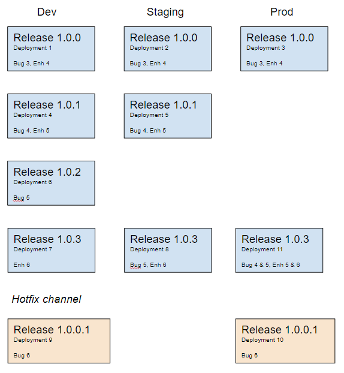
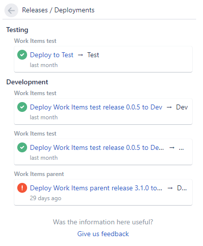

In this post we're excited to announce some new features in Octopus that are focused on enhancing the feedback loop in your CI/CD pipeline. These features strengthen the integration between the build servers and Octopus by passing more information about the build down the line.

These features can also provide feedback on release and deployment progress and dovetail into the new release/deployment functionality Atlassian are introducing in Jira. This gives those creating issues/bugs etc in Jira more timely information on how the implementation is progressing. It also gives those doing the implementation more timely information on where their code is at in the deployment pipeline.

Let's have a closer look at what's now in the box.

## Custom Metadata and Work Items

Inherent in building software is the idea that over time the product is the accumulation of the features/issues/bugs that have been built/released/deployed.

It follows then that we commonly want to track which features/issues/bugs are being built into each release of the software, and then which ones are being deployed. For our purposes, we're using the generalized term _work-item_ to refer to a feature, issue or bug. So what we're saying is, Octopus will now be able to track work-items from code to build to deployment.

The value of the work-items for the consumer is understanding what is included in any given version of the software. The common way to communicate this is using Release Notes. 

The introduction of work items hasn't changed the way Octopus handles release notes on a release itself, but we've added the work-items as separate information. What we've changed is that deployments now have release notes too, or rather Release Changes as we're calling them. These aren't something you can manually enter, they are automatically aggregated based on the releases in the deployment. 

Wait, "release**s** in the deployment", don't we deploy **a** release? Yes we do, but remember building software is a cumulative process, so what we're deploying to an environment/tenant is the aggregate of any releases that have occurred since the last deployment to that environment/tenant.

Ok that was a mouthful, let's have a look at an example.

This diagram depicts a number of releases and deployments that have occurred over time, along with which work-item details accumulated for each deployment. In this scenario each release was immediately deployed to the Dev environment, which results in the simplest accumulation because there was only a single release involved.

The deployments for `1.0.3` illustrate a more complex accumulation of work items. When `1.0.3` was deployed to the Staging environment, it accumulated work items from releases `1.0.2` and `1.0.3`. Similarly, when it was deployed to the Prod environment the accumulation also included the work items from `1.0.1`.

## How does it work?

To make this work we have updated our build server plugins to include a new `Octopus Metadata` step. This step gather metadata about the build, including parsing the commit messages looking for work-item references, and includes all of this in a call to Octopus. It's similar to pushing a package, and requires the packageId and version of the package that the metadata relates to.

The package doesn't have to be one you are pushing to Octopus though! This is an important part, Octopus is receiving the metadata for a given packageId and version, and it stores that away for use when creating releases and deployments. The package itself can of **any format and be coming from any feed**, including being a container image in a container repository.

For package that do get pushed to Octopus, you will see the metadata when you view them in the library.

This metadata then also appears on the Release, Deployment Preview, and Task pages. Links to the build that created the package are included, as are the work-items.

## ReleaseChanges and Deployment Variables

As we mentioned above, the deployments have been extended to include "ReleaseChanges". An important point about this is that the **deployments will always aggregate release notes from the release(s)**, and the work items are also aggregated if they are in use.

The ReleaseChanges contains, for each release related to the deployment, a Version (Release Version), Release Notes, and a list of Work-items.

We wanted to call this out explicitly, because the new variable data we provide for deployments is a little different to what we provide for release notes on the release.

On a release you can enter release notes and we accept them in markdown format. This works fine if you know how you are wanting to consume them, you actually use markdown syntax if it suits and plain text if it doesn't. A common use of this information is on something like our Email step, and for it you want Html not straight Markdown.

So we started down the path of generating a formatted notes field on the deployment and thought, "Wait, customers are going to want to consume this in different ways. If we make it Markdown that won't work for anyone trying to use it for emails, if we make it Html that won't work for other scenarios". So what we settled on was providing the raw Json data in the variable and then you have complete control over how you want to format it. Our documentation **TODO!** has a sample of how to consume the data in the email step to format a message however you want it to look.

## Deploy a release step

When's a package not a package? When it's a child project in a _Deploy a Release_ step. That scenario is covered too. The metadata and work-items will not only be calculated on the releases/deployments in the child projects, they get aggregated into the releases/deployments on the "parent" project.

Again, release notes will always be aggregated and work-items will too if they are in use.

## Build servers

In the initial release our Bamboo and TeamCity plugins will be updated to include the new Metadata step. 

TODO: the following may or may not be true by the time we publish!!!!

We are still looking at/working on how this integration fits in with Azure DevOps. 

## Jira

So far everything we've talked about is actually build server and Octopus centric, and holds for anyone using Octopus. Let's have a look now at what you get extra if you're using hosted Jira.

The new Jira Issue Tracker extension in Octopus ties in with the [deployment dashboard](https://confluence.atlassian.com/bamboo/viewing-bamboo-activity-in-jira-applications-399377384.html) functionality in Jira, so you can get deployment feedback the same as you would if you were using BitBucket Pipelines.

As you do the deployments in Octopus, it is feeding information back to Jira in real-time and you will see something like the following in Jira.

For more information on how to configure the integration with Jira, see our documentation. TODO Url

## Wrap up

And that's it! Well for now anyway. As the CI/CD world continues to mature and evolve we're expecting to see more and more examples of this richer integration and feedback throughout the pipeline, so watch this space. As always, please leave us feedback below and Happy Deployments!