Recently I had a chance to meet with a customer to talk about their development and deployment process.  Full disclosure: I'm going to paraphrase the meeting a bit, so my apologies to them if I grossly simplify their concerns.  The customer had a common scenario.  They have three teams of developers and four "main" applications.  There is some dependencies between the four main applications.  Application A might call Application B which calls Application C and so on.  There isn't a clear "line in the sand" on which team can work on which application.  At any given point, two teams might be working on the same application.  For example:

- Team A is adding a new feature to Application A
- Team B is making some bug fixes to Application A
- Team C is adding a new feature to Application B

Their concern was how can Team A push up changes to Application A for their QA engineers to test and business owners to verify without stepping all over Team B's work.  In addition, how can Team C make changes which doesn't stop Team B from pushing a set of bug fixes through.

I ran into this scenario multiple times at different jobs prior to working at Octopus Deploy.  The tooling, and the collective lack of knowledge, at the time led to some, let's say, interesting solutions.  Team C was told that whatever changes they made had to be backwards compatible from the start.  Hide it behind a feature flag if you must.  You cannot stop work for Teams A and B.  Team A was told to hold off pushing their changes until Team B had finished their work.  That is just three teams.  I've worked for companies with 10+ development teams.  Imagine trying to juggle all that!

The final kicker is sometimes a developer will be working on a spike or another change and they want to get feedback from someone.  This feedback could come from another developer or it could come from a business owner.  In the past when I did this I had the developer and/or business owner connect directly to my machine.  This was a major pain on my end as I could be in the middle of tweaking something else and the code might not be in a usable state.  It would've been nice to have someplace I could push the change without breaking everyone.

A much more ideal solution is each team as well as developer gets their own "sandbox" hosting all of the applications.  That way Team A can push a new feature to their sandbox for testing without stepping all over Team B.  Team C can push changes to their sandbox for testing and not break Teams A and B.  Team A and B are not aware of Team C's changes because they are pointing to their own copy of Application B.  Once Team C's changes have been verified then Teams A and B will need to update their sandbox to get the latest and greatest changes.

In this article I am going to walk you through how to configure that using the multi-tenancy feature in Octopus Deploy.

**Please Note:** You have to have your entire deployment process automated for this to work.  You can't have your code (C#/JS/TS/PHP/etc) being deployed through Octopus Deploy while your databases are deployed manually.  

## Configuring Octopus Deploy

Before diving into the configuration, let's take a step back and look at some use cases.  Hopefully at the end of the article we meet all of them.  

- As a developer I want to be able to make and push changes to Application B without affecting the work of other teams working on Application A.
- As a developer working on Application A I want to be able to pull changes made to Application B in once they are completed and verified.
- As a developer I always want to be able to test what is currently in production in a non-production environment.
- As a developer I want to be able to make changes and push them up for verification from a business owner without affecting my team.
- As a developer on Application A, I want to know what version of Application B I am connecting to and testing against.
- As a developer I want to be able to push a hotfix directly to staging without having to go through development or testing first.
- As a developer I want to be able to push my teams changes to a testing area where customers can provide feedback.  This won't happen all the time, but I would like that opportunity.

## Tenant Tags

I am going to create a tenant tag set called `Tenant Type` for grouping and organizational purposes.  Based on my use cases, I am going to need three tags in the `Tenant Type` tag set.

- Release (main or master and hotfix)
- Teams (for the team to test with)
- Person (each developer)

## Global Variables

For my instance I have two variable sets.  `Global` is to be used across all the projects.  `OctoFx` is to be used for any OctoFx projects.  

I am going to host all my tenants on the same SQL Server and Web Server used in each environment.  I have one web server for `Development` and two web servers in the `Testing` environments.  That single `Development` web server will host not only the main website but also all my tenant websites.  Each tenant will get their own subdomain.  The naming convention I am going to use for tenants assigned to the Teams or Person `Tenant Type` will be [EnvironmentShortName][TenantShortName][ApplicationName].OctopusDemos.com.  For Bob's copy of the OctoFx application in Development the name will be DevBobOctoFx.OctopusDemos.com.  For release `Tenant Type` the naming convention will be [EnvironmentShortName][ApplicationName].OctopusDemos.com.  The master version of OctoFx in Development will be DevOctoFx.OctopusDemos.com.

I am using the same SQL for both Dev and Testing, so my database names will be rather odd looking at first.  [EnvironmentPrefix]-[TenantShortName]-[ApplicationName] for tenants assigned to the Teams or Person `Tenant Type`.  Bob's copy of the OctoFx database in `Development` would be `d-Bob-OctoFx`.  Tenants assigned to the Release `Tenant Type` will be [EnvironmentPrefix]-[ApplicationName].  The master version of OctoFx in `Development` will be `d-octofx`.

First I am going to create a variable in Global to store the environment short name as well as the environment prefix variable.  

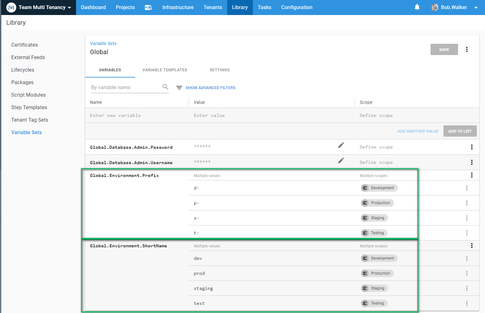

**Please Note:** I like to use the naming scheme [VariableSet].[Component].[Name] to name my variables.  This makes them easier to find when trying to reference them.  And when looking at the all variables for a project they group together a lot better.

Then I am going to jump over to the `Variable Templates` tab and add new new template.  I will need to populate this when I create my tenants and assign them to the projects.

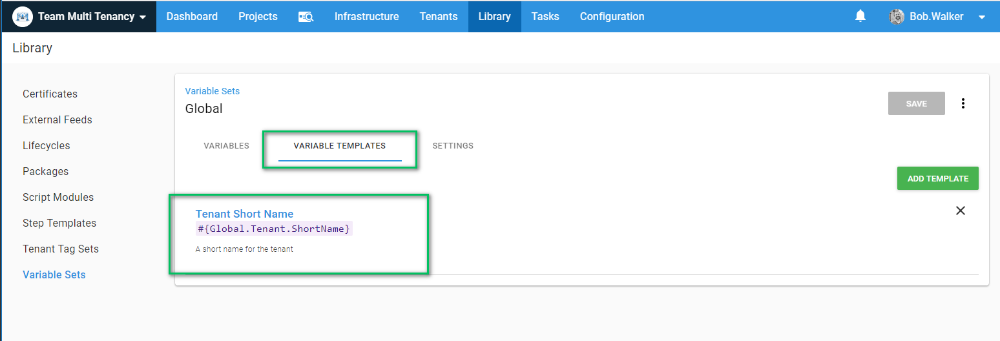

Now I can jump back over variables tab and add two variables, one for the subdomain name and another for the database name.  You can scope variables to tenant tags.

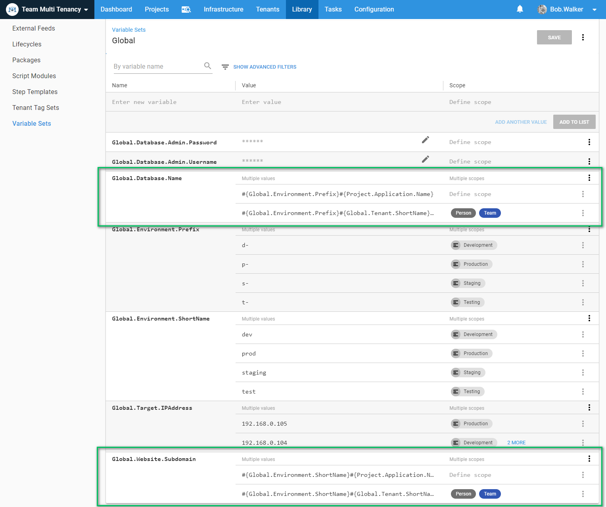

You will notice I am referencing a variable in there called `Project.Application.Name`.  That variable will be set at the project level.  Variable replacement is done at runtime.  This is because quite often we don't know the value until the step is actually being run on the machine (machine name, output variables, etc).  

The `OctoFx` variable set is nothing super complex.  It stores some database values so it can build up a connection string.  

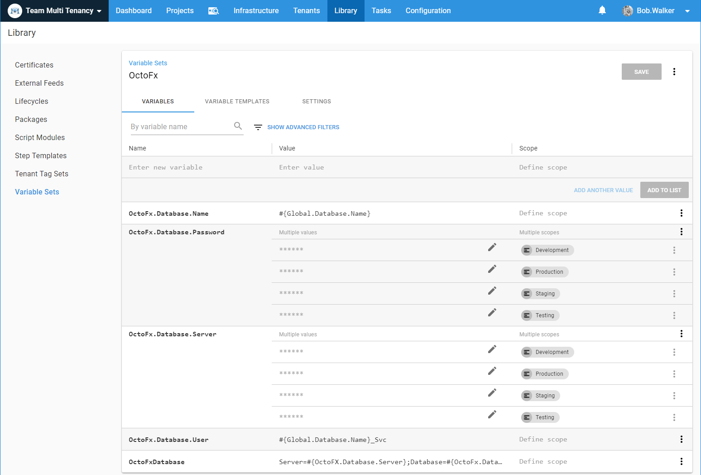

## Infrastructure

As I stated in an earlier section, I am going to be deploying to a SQL Server and multiple web servers.  I will be using a worker to deploy to SQL Server.  Only the web servers will have tentacles on them.  I need to update the tentacle registration to allow for multi-tenant deployments.  First we need to tell Octopus Deploy to allow for both tenant and multi-tenant deployments to each web server.

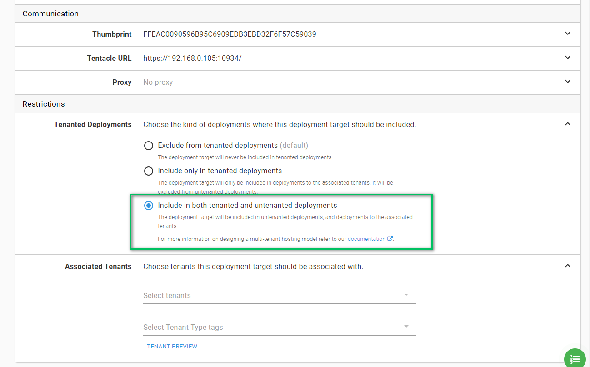

When we do that a new section appears on the screen allowing us to select which tenants to allow.  My thinking is:

- Production: Release `Tenant Type`
- Staging: Teams and Release `Tenant Type`
- Testing: All `Tenant Type`
- Development: All `Tenant Type`

Production only accepts releases or hotfixes.  Staging will accept the same as Production, as well as teams because of the above use case "As a developer I want to be able to push my teams changes to a testing area where customers can provide feedback."  Quite often I see setups where `Development` and `Testing` are only available to internal users.  But `Staging` needs to match production.  Typically that includes external access.  

I will add the appropriate `Tenant Type` tenant tags to the machine registration.

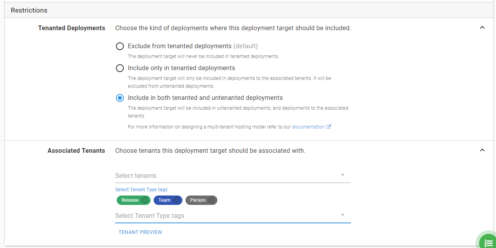

When I am finished updating my machines the overview screen will look like this:

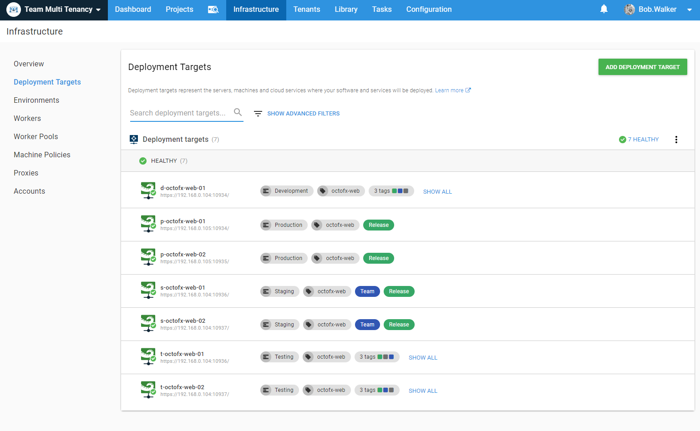

## Projects

Before configuring the tenants I want to take a look at the `OctoFx` application I will be using as my example.  OctoFx consists of two component, a database and a web interface.  Each component has its own deployment project in Octopus Deploy.  Not every change made to OctoFx requires the full application to be deployed.  

Adding an index to the database shouldn't require the website to be deployed.  Updating the CSS shouldn't require the database to be deployed.  Separating them helps save time.  And that really comes in handy when you have to deploy a hotfix.  Having to wait on a database deployment to finish when you really need to fix the website is maddening.  

Each project only has to focus on one thing.  The database project only worries about database deployments.  Make note, this project was created with the assumption the database did not exist in that particular environment.  It will create a fresh database and run the necessary scripts to add the schema, data and users.  

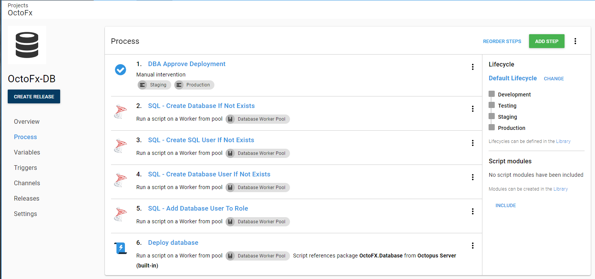

Whereas the web deployment only has to worry about steps for web deployments.  Just like the database project, it was written with the assumption the website didn't already exist.  The deploy to IIS will create the website on the server.  It then has a step to add the website to DNS.  

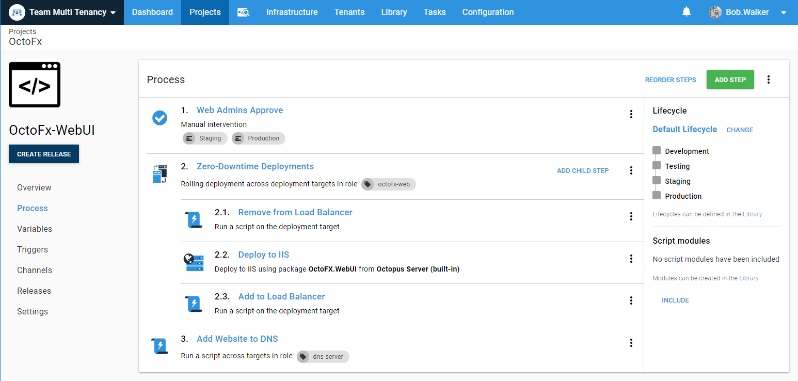

There are cases when you want to deploy the entire stack.  That is where the "Traffic Cop" project comes in.  It uses the deploy a release step to deploy the components in the correct order.

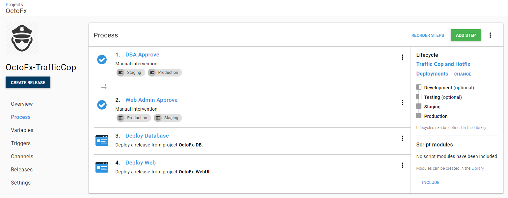

The build server is responsible for creating the releases for each component.  A person will come in and create the release for the traffic cop project.  Make note that the lifecycle allows you to deploy straight to staging, skipping `Development` and `Testing`.  This is to handle those cases when individual components are pushed to `Testing` manually.

**Please note:** The projects on my example instance were created with the assumption the database and/or website didn't exist.  Each projects performs the necessary steps to get the component up and running.  In order for this sandbox approach to work your projects will need to be created with a similar concept.  You don't have to repeat the exact process I used in my projects.  

The only other major adjustment you will need to make is configuring your projects to allow for multi-tenancy deployments.  This is done by going to the settings section on the project and changing the multi-tenant setting.  In my example I am choosing to require a tenant for deployments.  If you were transitioning a project over to multi-tenancy the first time it would make more sense to allow for deployments with and without a tenant.  

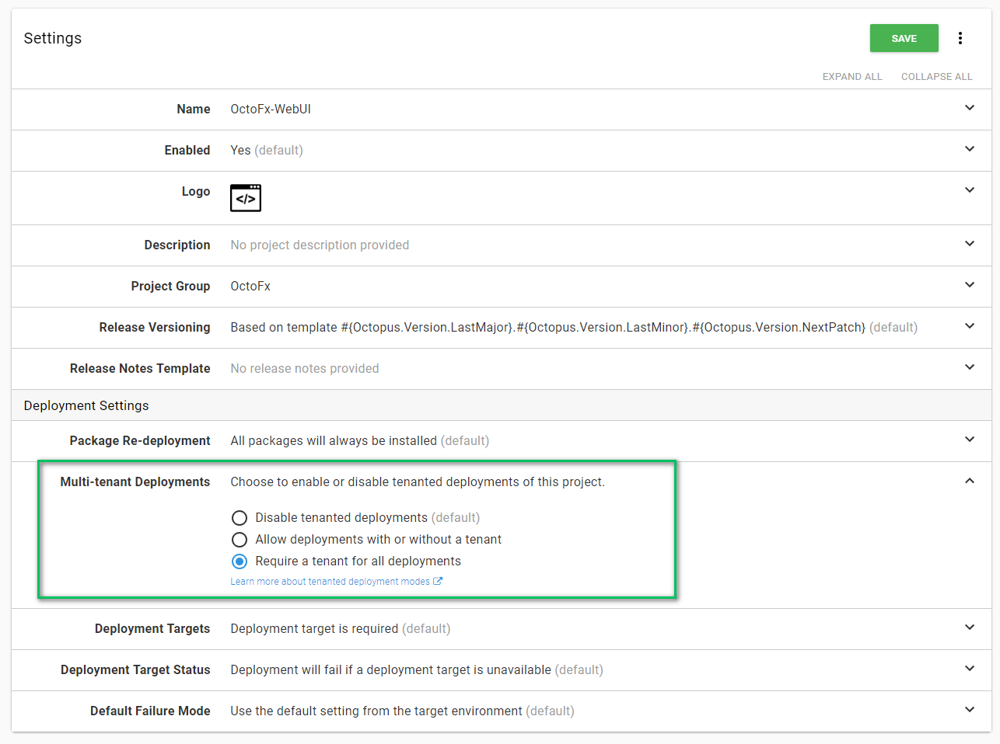

## Tenants

The tenant tags are in place.  The projects have been configured.  The necessary infrastructure changes have been made.  It is finally time to create some tenants.  

For each tenant I am going to assign a tenant tag.

Then I am going to make the connect my projects.  Because this is a Person `Tenant Type` I am only allowing deployments to the `Development` and `Testing` environments.

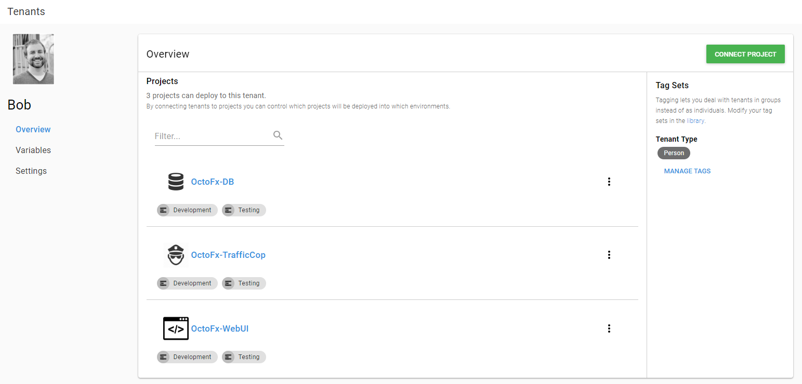

If you recall, the `Global` variable set has a variable template.  Now that the projects are connected I will need to populate that variable template by going to variables and then selecting `Common Templates`.

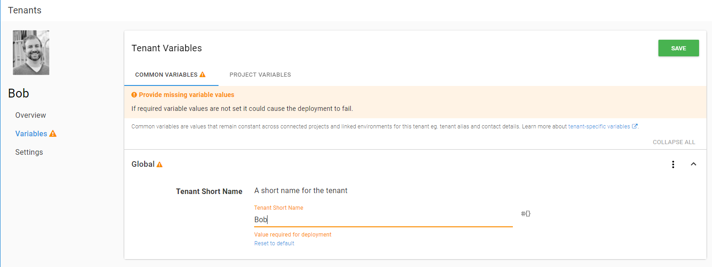

When it is all said and done, I created two tenants for the release `Tenant Type`.

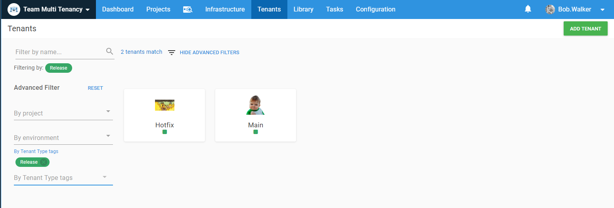

Three tenants for the team `Tenant Type`.  We name our teams pod-[Octopus Type].

And finally, several tenants assigned the person `Tenant Type`.

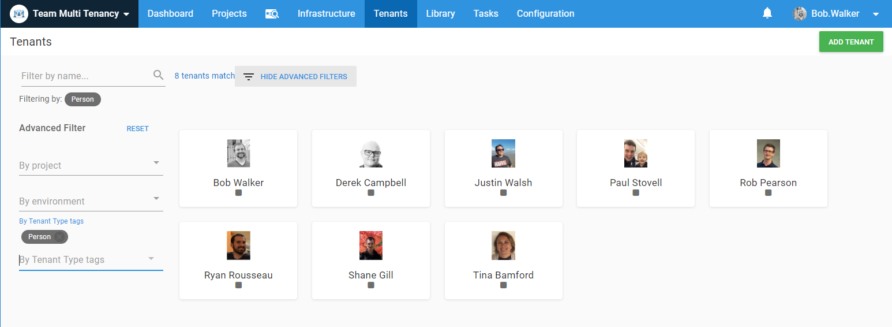

The tenant screen has the ability to filter by `Tenant Type`.  This makes it easier to find a specific tenant.  As well as take screenshots after the fact.  Which I totally did.

Now the project overview screen will show all the tenants.  

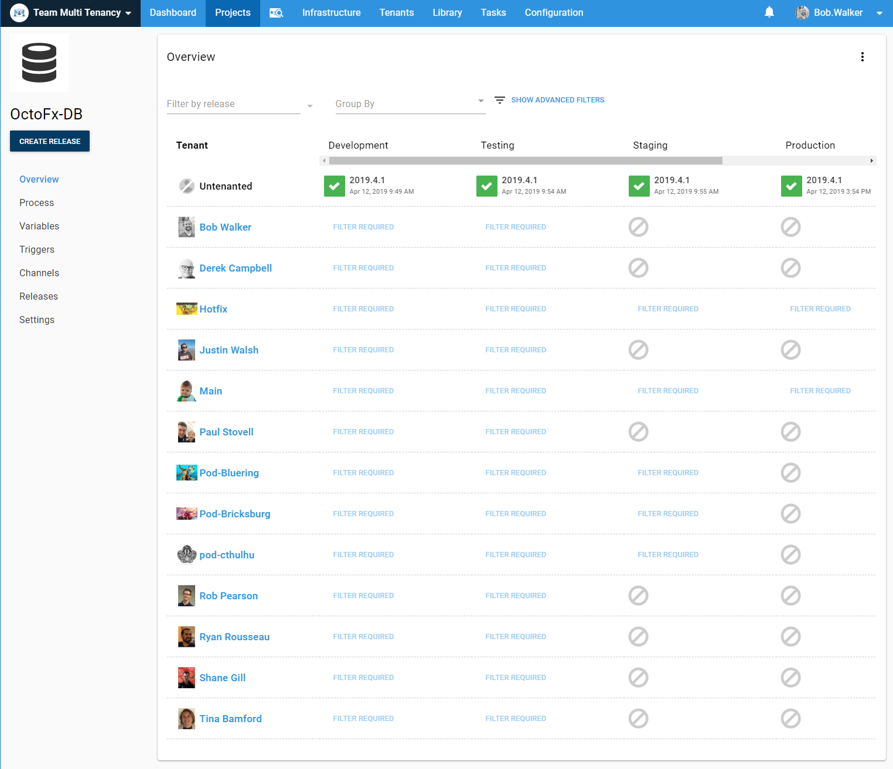

I can deploy to a specific tenant by selecting a release.

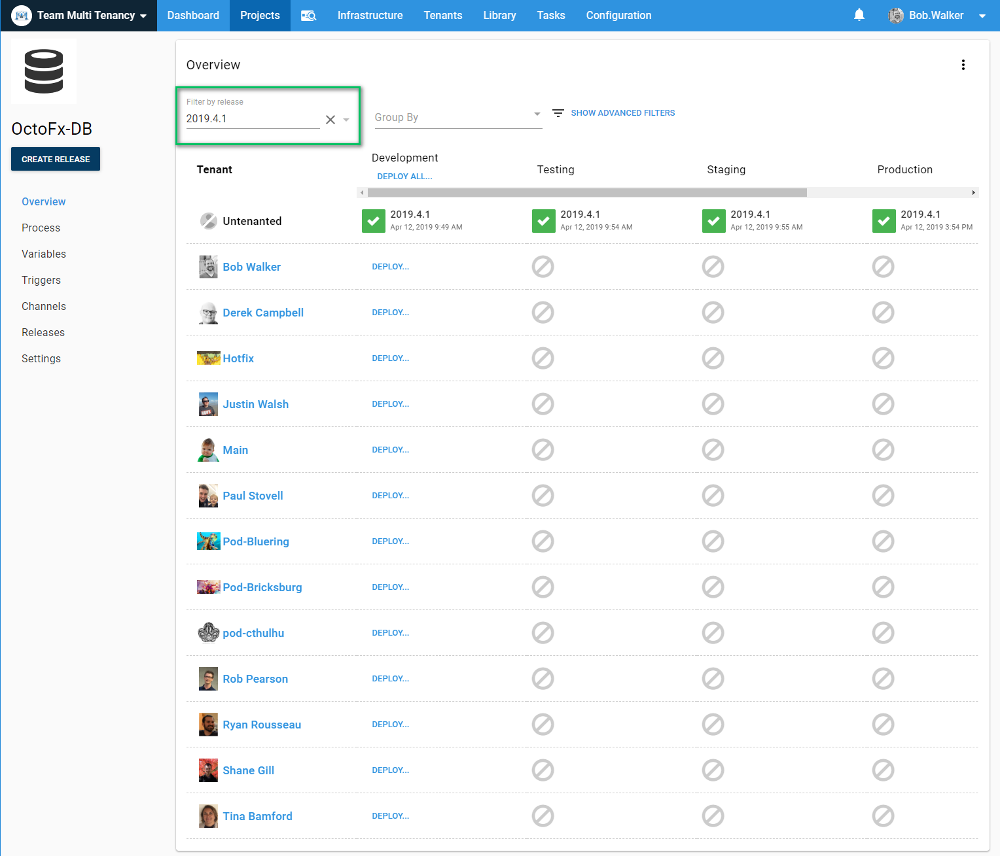

When you get to the deploy screen you can choose to deploy to a specific tenant or tenants by tenant tag.  If you look at the bottom of the screenshot it will show you all the tenants which will be deployed to.

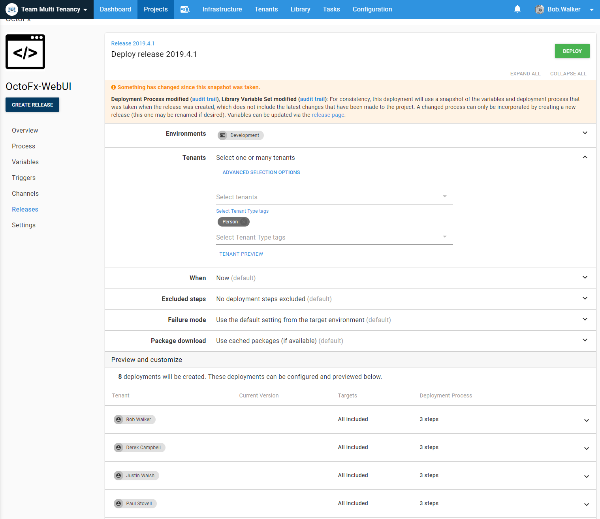