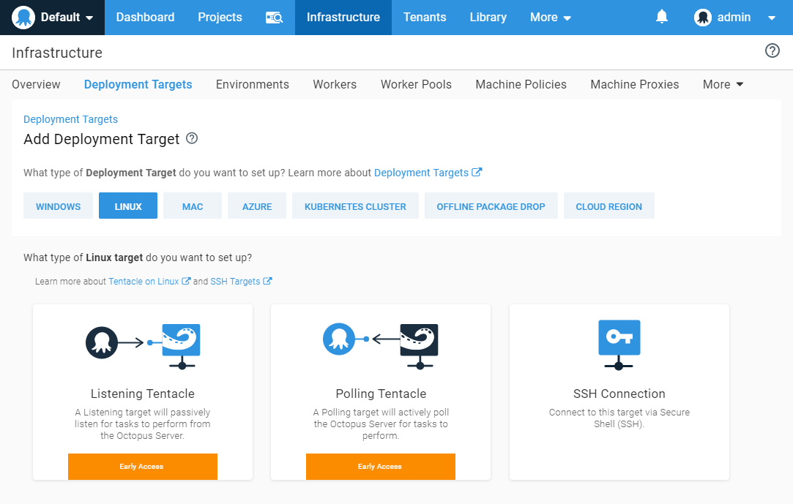

## Intro

Octopus is expanding our list of supported deployment targets (the servers and cloud services that you can deploy to) by introducing a native Linux Tentacle. Tentacles have always been our most popular deployment targets. The way they can be configured to communicate with the Octopus Server provides the most flexibility, but the downside is they were exclusive to Windows.

We have been working hard to bring first-class support to Linux deployment targets, and we're happy to announce **[early access to Linux Tentacle](/blog/2019-07/tentacle-on-linux/index.md#linux-tentacle-early-access)**. If you prefer to wait until the official release, you can keep an eye on this feature and others on our [roadmap](https://octopus.com/company/roadmap) page, you can even register for updates.

The existing approach for deploying to a Linux server is to configure them as SSH targets in Octopus, and while this approach works well for most applications, it does require the target machine to have an open SSH connection. Unfortunately, some companies operate in highly secure environments where it's not possible to open port 22 on production servers.

So how does a native Linux Tentacle solve this problem? Tentacles support a polling mode, and with this configuration, Tentacle polls the Octopus Server to periodically check if there are any tasks for it to perform. The biggest advantage is that the target server doesn't require any firewall changes, it only requires a single open port on the Octopus Server. This functionality removes the need to run the SSH server on your Linux machines, which addresses the security concerns for many teams.

## Example 1: Octopus Cloud Deploying to Linux Servers

Suppose your team is using Octopus Cloud to deploy several microservices to multiple Linux servers. With the current version of Octopus, your Linux targets need to be running an SSH server that is publicly accessible over the internet. While SSH is considered to be one of the more secure remote access methods, some companies operate in highly secure environments where it's not possible to open port 22 on production servers.

In this scenario, configuring your Linux targets as SSH targets is the only option and due to security concerns, might not be possible.

Solution: Linux Tentacles! We can now set up the Linux targets to run the Tentacle service and configure it to communicate to the Octopus Server in polling mode. Using this method we don't require any inbound ports to be open, the Linux machine just needs to communicate on outbound port (default 10943) and port 80 or 443 to access the Octopus Server web portal.

## Example 2: Servers in a DMZ with HTTPS Only

Suppose your team is trying to deploy to highly secured Linux servers running in a DMZ with no incoming connections permitted other than HTTPS for web traffic. Security and compliance restrictions in our industry make it impossible to grant access for SSH.

Solution: This is where Tentacle polling mode really shines, it allows your Tentacles to actively poll the Octopus Server without the Octopus Server having to know anything about the IP addresses of the Linux targets.

## Linux Tentacle Early Access

We are currently providing early access for Linux Tentacle to get feedback and validate its design. [Our docs](https://octopus.com/docs/infrastructure/deployment-targets/linux/tentacle) cover all the details on how to get started.
We're building both DEB (Ubuntu/Debian) and RPM (CentOS/Fedora) packages, as well as .tar.gz archive for manual installations. Tentacle is built with .NET Core 2.x, so if your version of Linux is [supported](https://docs.microsoft.com/en-us/dotnet/core/linux-prerequisites?tabs=netcore2x) you should be able to run Tentacle.
We'd love feedback so join the discussion on our [community slack](https://octopus.com/slack) in the `#linux-tentacle` channel.

## Wrapping up

Linux Tentacle provides greater flexibility for teams deploying to Linux in highly secured environments and complements our existing SSH deployment target support. Our goal is to bring all the same features to the Linux ecosystem that we already provide for Windows.
Don't forget to register for updates on our [public roadmap](https://octopus.com/company/roadmap) page.
