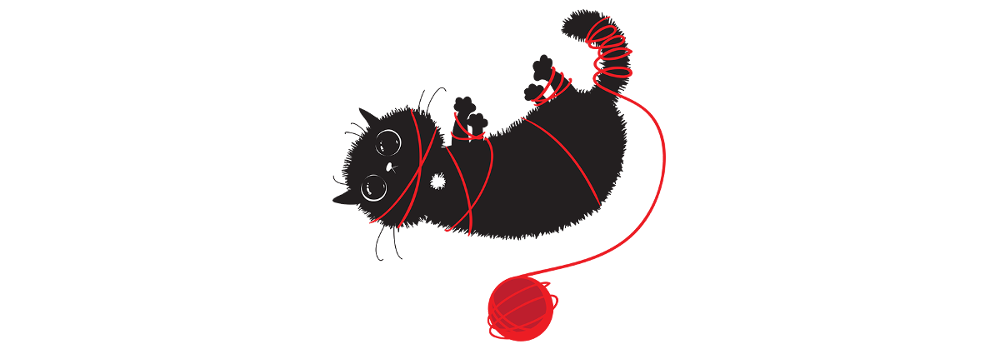
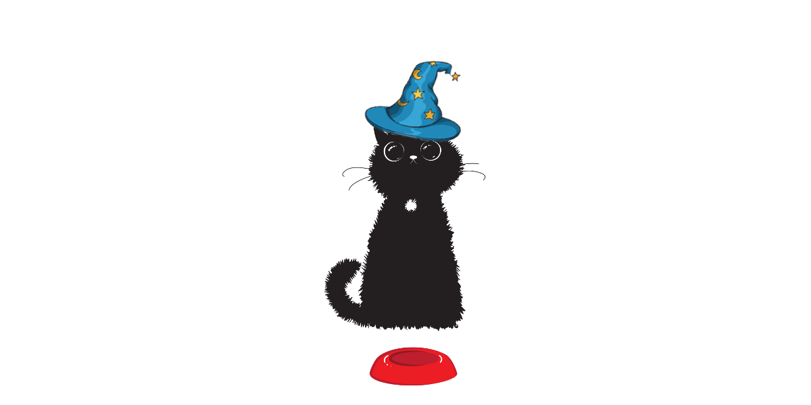
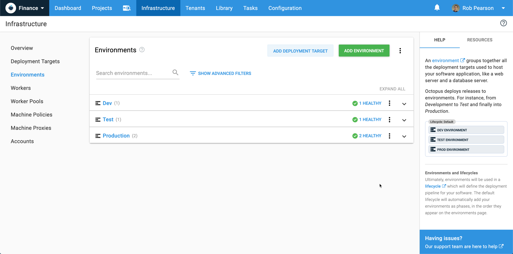

_"I feel good, I feel great, I feel wonderful"_

[Proceeds to see several tables that are not vertically aligned, inconsistent font sizes, some animations missing]

_"I feel GOOD, I feel GREAT, I feel WONDERFUL"_

[Sees missing help options, too much information making a screen very distracting and _more_ styling issues]

**_(now loudly sobbing) "I FEEL GOOD, I FEEL GREAT, I FEEL WONDERFUL!"_**

Hi. My name's Mark, and I'm a <a href="https://www.youtube.com/watch?v=1bYO-mm_MvM" target="_blank">Bob</a> (Or am I the therapist? Sometimes I'm not sure). You've heard from me before. I'm one of the UX folks here at Octopus currently leading our onboarding efforts. We want new customers to be successful, so we want to get out of their way as much as possible and present them with something simple, free of distractions. Today I wanted to share some of the things we've been working on this last quarter and why we think they'll make your life easier.

Approaching UX from a customer's point of view is something we greatly value, and as your app grows in features, it's important to take a step back every now and then and think about new users who will be experiencing your interface for the first time.

Do the concepts make sense? Are there any distractions that take them away from where their attention should be? Are they able to connect-the-dots and understand things so they could teach others?

## Minimising Distractions



Alignment matters (equally in our code, design and implementation) because, as consumers, it reduces the cognitive load on our brains, which makes it easier for us to onboard new information.

Take this code sample:

```
var body: some View {
    VerticalStack(alignment: .leading) {
        Text(self.categoryName)
            .font(.headline)
            .padding(.leading, 15)
            .padding(.top, 5)

        ScrollView(showsHorizontalIndicator: false) {
            HorizontalStack(alignment: .top, spacing: 0) {
                ForEach(self.items) { landmark in
                    CategoryItem(landmark: landmark)
                }
            }
        }
        .frame(height: 185)
    }
}
```

Just by glancing at this code, you can easily reason about what's happening because everything is aligned correctly and consistently. If there was a bug in this code, I'd be confident any engineer could find it quickly and easily.

Now let's take that same code sample, but this time, write it in that special way that makes our eyes twitch:

```
var body: some View {
VerticalStack(alignment: .leading) {
     Text(self.categoryName).font(.headline).padding(.leading, 15)
       .padding(.top, 5)
    ScrollView(showsHorizontalIndicator: false) {


      HorizontalStack(alignment: .top, spacing: 0) {
        ForEach(self.items) { landmark in
                CategoryItem(landmark: landmark)
                 }
        }
    }

 .frame(height: 185)
 }
}
```


I feel most engineers write code like the first example, but at times (and often only in small ways) implement and introduce their design to customers like the second example.

Why?

Because the engineering is what's important to them. They care about the code. And that's good. They're engineers after all.

But the customer cares about the user-experience, because that's what they interact with; that's what inspires them; that's what holds their hand and takes them on this magical journey.



<small>_"Yer a Wizard, Harry"_</small>

A customer's journey is only made possible by the underlying engineering. But if it's not presented in an intuitive way, free of noise and distraction, then they won't connect with the beauty of the engineering and we'll have failed in our delivery.

:::hint
**Think of it this way**
If the code is of _great_ quality, then it allows for the _potential_ of great UX, but it's by no means guaranteed. The same careful thought that went into the engineering and design needs to go into the UX for the full potential of your software to be understood and appreciated by your customers.
:::

This leads me to something the onboarding team have been focusing on this last quarter: Reducing noise.

### Reducing Noise

Previously, when a new feature needed to be introduced into Octopus, there's the feature screens themselves, plus a docs page, plus usually some supporting text in the app to give you the gist of things, including a link to the docs.

As a new user, that format can be very helpful initially, but after you've used that feature and understand it, you don't really need to see that supporting text anymore. It now permanently takes up vertical space on your screen and your brain has to glance over it *every time* you load that screen, creating a little extra cognitive load for your brain to say _"meh, just skip over that"_ on the way to where it's going.

Over time, these little bits of noise start to add up. They become unnecessary distractions and take power away from areas of the UI that are of real value to your users.

At Octopus, we want to make it easy for new customers to connect-the-dots and find their way, which often requires supporting text to explain what's going on. But for more advanced users who've been using Octopus for many years, we don't want to create noise for them unnecessarily.

With this in mind, we came up with a small addition recently to help us achieve just that...

### The Help Sidebar

We want new users to be successful, and as a part of that goal, we looked at how we could make it easier to get started and grok Octopus concepts.

We decided on a sidebar of helpful information that is both readily available and easily dismissible. This sidebar provides a quick summary of concepts related to the page you're viewing, as well as links to our documentation and additional helpful resources for people beginning their journey with Octopus.



Having the supporting text contained to the sidebar also meant we could remove it from the top of many screens, freeing up valuable screen real estate.

This feature provides you with a little extra help if you need it, but also gets out of your way. That's usually the balance we look for on any screen.

So on these little journeys of discovery, we keep poking things from different directions, with different combinations and considering different perspectives until we feel a certain balance is achieved.

This can often be frustrating for your team, because you'll find yourself saying things like:

> _"It's good, but something's still not right, I don't know what it is, but it's not ready yet"_

You have to trust your feelings when it comes to UX, because when it _is_ right, you'll know it. All the weight on your shoulders will suddenly disappear and you'll smile.

## Closing Thoughts for UX Teams

In my experience, this process requires a lot of trust within your team. You have to be prepared to give and get hard feedback if you really want to grow, which means preparing your team for this style of respectful but open feedback. You have to be considerate of how much work has gone into something, but also make hard decisions about whether a design's even moving in the right direction.

Talking about this up-front can help ease people into the process and avoid some more difficult conversations later. I generally approach it this way:

> _"We ask and encourage everyone to be open about how a design makes them feel and to trust their instincts. You cannot get too attached to any one piece of work, because you may have to throw away days of progress and pivot in a different direction. It may hurt, but know that it's never a step backwards. We're always moving forward because we learn from all these iterations and ultimately get to somewhere great together."_

There _will_ be times when you have to walk away from some design/code that you worked _really_ hard on because something's just not feeling right, or you've shown it to people and they're not reacting or connecting with it in the way you'd hoped.

On reflection, it's these moments that teach you a lot about yourself (and who you're working with).

The good news is that you can care deeply about your code/design without attaching yourself to it. The trick seems to be:

- keep team-communication open _(express those feels)_
- keep reviews and feedback regular _(don't let pieces of work reach boiling point)_
- keep meetings short and to-the-point _(have an agenda, get in, get out, get it done)_
- regularly see things through the customer's eyes _(not literally, that's just weird)_

Start doing these things and I believe you'll be heading in the right direction. Know that small UX changes can make a big difference in people's lives, opportunities will present themselves to improve a customer's experience and good things will happen.

And with everything going on in our hectic little worlds, always try to maintain perspective. I.e. What is the _primary value_ you're wanting the customer to experience? Everything else might just be noise :)

Keep smiling and happy deployments.

