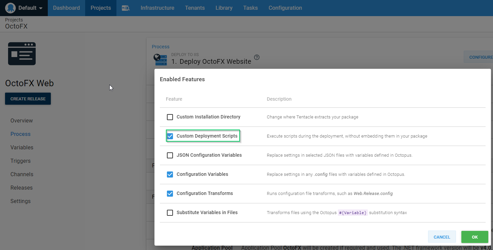

## Introduction
There is nothing worse than having uncertainty in a deployment process, heck that's one of the reasons Octopus Deploy exists!  To combat uncertainty, Octopus Deploy offers both consistency and reliability in that the process for deployment will always be the same from environment to environment.  However, there is one thing that can change when deploying to the next environment, Variables.  It is often the case that values within a .config file need to be different based on the environment being deployed to such as connection strings or app settings.  It is also often the case that these .config files are maintanied by the developers who may not have access to Octopus Deploy.  In those cases, the communication to have the variable added to the Octopus Deploy project may get lost in the shuffle and may go undetected until the application is deployed to Production where the developer known value doesn't work.  This post aims to show you a method to detect missing project variables.

## Deploy to IIS
Any step template that offers the feature of Pre-Deployment scripts will work with this solution.  For this example, we're going to be using the Deploy to IIS step template.  Once you've added a Deploy to IIS step to your process, click on the Configure Features button


Next, enable the Custom Deployment Scripts feature



Expand the Custom Deployment Scripts section of the step template


Enter the following code into the Pre-deployment script window

```PS
# Get the config file
$configFile = Get-ChildItem -Path $OctopusParameters['Octopus.Action.Package.InstallationDirectoryPath'] | Where-Object {$_.Name -eq "web.config"}

# Create FileMap object
$fileMap = New-Object System.Configuration.ExeConfigurationFileMap

# Set location of exe config file
$fileMap.ExeConfigFilename = $configFile

# Create Configuration Manager object
$configManager = [System.Configuration.ConfigurationManager]::OpenMappedExeConfiguration($fileMap, [System.Configuration.ConfigurationUserLevel]::None)

# Iterate through appSettings collection
foreach($appSetting in $configManager.AppSettings.Settings)
{
	# Check to see if key is present
    if (!$OctopusParameters.ContainsKey($appSetting.Key))
    {
    	# Fail the deployment
        throw "Octopus Parameter collection does not contain a value for $($appSetting.Key)"
    }
}
```

And that's it!  Now, before a deployment starts, we check to make sure that all app settings keys are present in the Octopus Parameters collection and fail the deployment if it's not found!

## Conclusion
This post demonstrated a method to detect missing Octopus Deploy variables that are present in the app settings of a .config file.  You could apply a similar idea to 'Substitue variables in files' looking for any #{} placeholders, however, you would need to place the code in either Deployment or Post-deployment script windows as the substitution occurs after the Pre-deployment script executes.