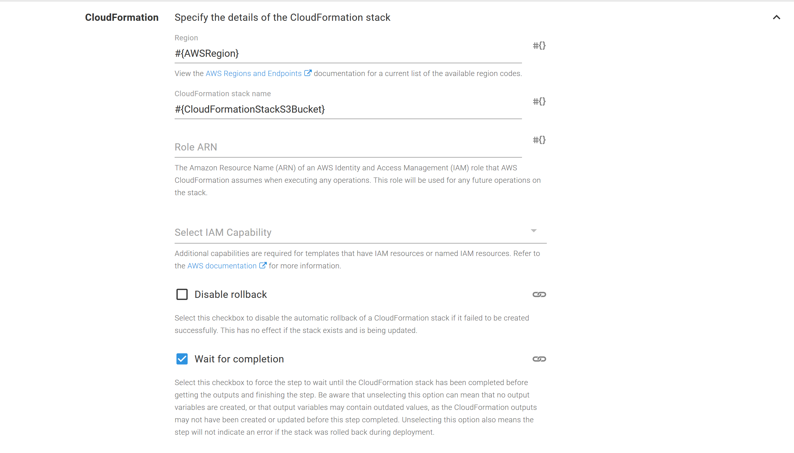
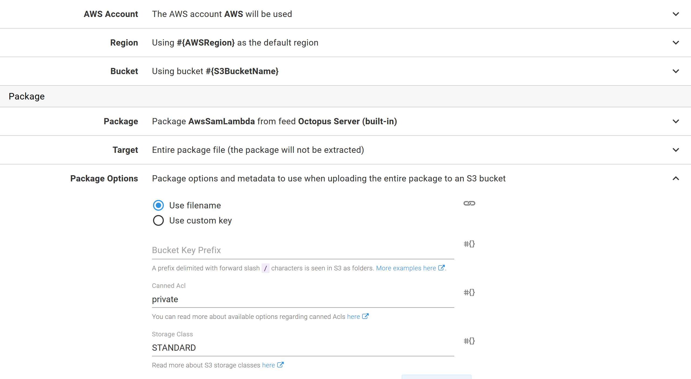
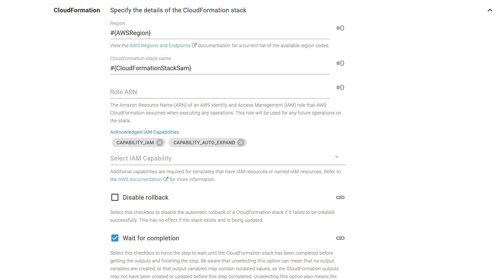
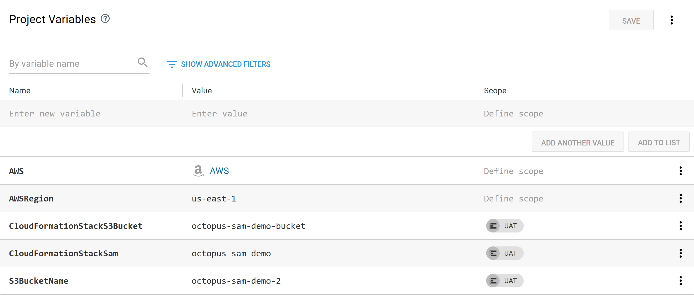
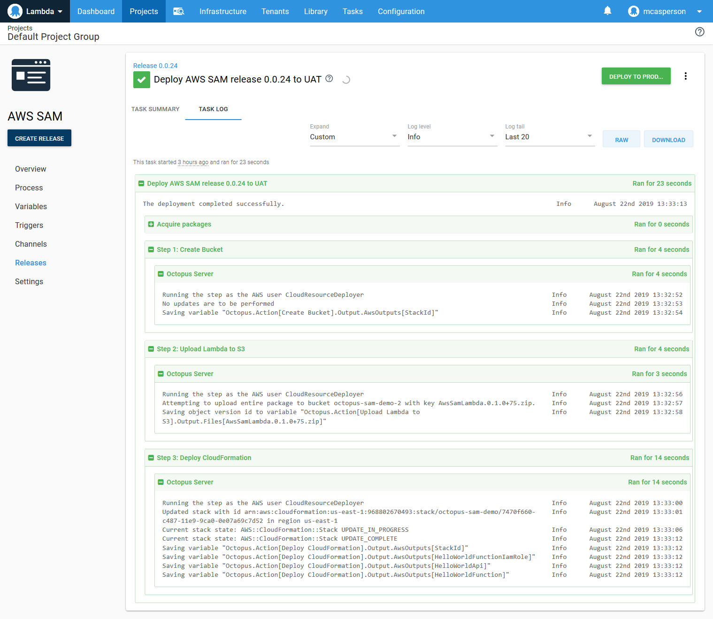
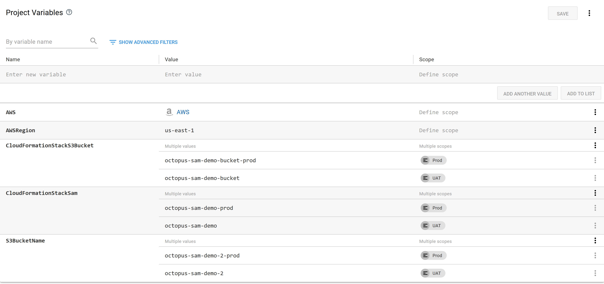
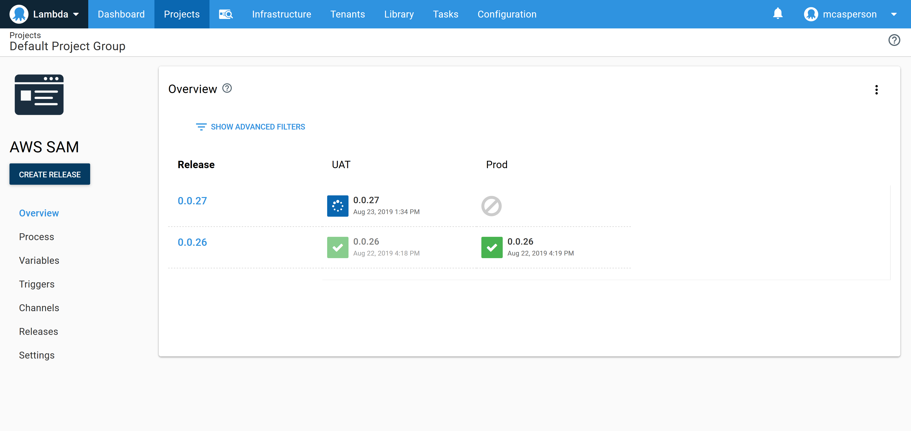

As development patterns like microservices become increasingly popular, cloud providers are investing heavily in serverless computing platforms as a way of managing and executing many small and independent applications.

The AWS Serverless Application Model (AWS SAM) ties together the AWS services commonly used when deploying serverless applications. AWS SAM builds on CloudFormation, and removes much of the common boiler plate code, making serverless application deployments quick and easy.

In this blog post we'll look at how you can move from the simple deployment processes provided by AWS SAM to repeatable deployments across multiple environments in Octopus.

The source code for this blog post can be found [here](https://github.com/OctopusDeploy/AWSSamExample).

## The Hello World App

We'll start with the Python Hello World application created with the SAM CLI tool. The process of creating this application is documented [here](https://docs.aws.amazon.com/serverless-application-model/latest/developerguide/serverless-getting-started-hello-world.html#serverless-getting-started-hello-world-initialize).

The sample code that is generated by the SAM CLI commands `sam init --runtime python3.7` and `sam build` has been committed to a [GitHub repo](https://github.com/OctopusDeploy/AWSSamExample), and we'll use this repo as the starting point for our deployment process.

## Building the Application with Github Actions

If you follow the typical AWS SAM workflow, after running `sam init` and `sam build`, you will run a command like `sam package --s3-bucket <yourbucket>`, which will:

* Bundle up your source code with any dependencies.
* Upload the bundle to S3.
* Replace the `CoreUri` field in the SAM template with the location of the file in S3.

It is important to note that CloudFormation, and therefor SAM, does not deploy code from your local PC - everything has to be uploaded to S3. The benefit of the `sam package` command is that it automates the work for you, resulting in a processed template that you can then deploy with CloudFormation.

However the `sam package` command can be a little clunky when you need to implement repeatable deployments across multiple environments. The S3 file that is uploaded has a randomly generated name like `fecddec7c6c40bd9de28f1775cd11e0e`, which makes it nearly impossible to work out what code bundle was deployed for a given version. You are also responsible for keeping a copy of the processed template file (i.e. the one with the updated `CoreUri` field) around so you can track what template was associated with what code.

Or to [quote the SAM developers themselves](https://github.com/awslabs/aws-sam-cli/issues/648#issuecomment-419538378):

> Yes, "sam package" is rudimentary. Real solution is to create a better package command that will do content addressing better (may be using git sha, or content sha, or customer-provided naming function).

So we'll take a slightly different approach by managing the packaging, uploading and template file updating ourselves. This will provide us with sane file names, and create reusable templates.

We'll implement this with GitHub Actions, and the workflow YAML is shown below.

```yaml
name: Python package

on: [push]

jobs:
  build:
    runs-on: ubuntu-latest
    steps:
    - uses: actions/checkout@v1
    - name: Get Git Version
      uses: docker://mcasperson/gitversion:5.0.2-linux-centos-7-netcoreapp2.2
      with:
        args: /github/workspace /nofetch /exec /bin/sh /execargs "-c \"echo $GitVersion_FullSemVer > /github/workspace/version.txt\""
    - name: Set up Python 3.7
      uses: actions/setup-python@v1
      with:
        python-version: 3.7
    - name: Package dependencies
      # Permissions are documented at
      # https://docs.aws.amazon.com/lambda/latest/dg/deployment-package-v2.html
      run: |
        python -m pip install --upgrade pip
        cd hello_world
        pip download -r requirements.txt
        unzip \*.whl
        rm *.whl
        chmod 644 $(find . -type f)
        chmod 755 $(find . -type d)
    - name: Extract Octopus Tools
      run: |
        mkdir /opt/octo
        cd /opt/octo
        wget -O /opt/octo/octopus.zip https://download.octopusdeploy.com/octopus-tools/6.12.0/OctopusTools.6.12.0.portable.zip
        unzip /opt/octo/octopus.zip
        chmod +x /opt/octo/Octo
    - name: Pack Application
      run: |
        cd /home/runner/work/AWSSamExample/AWSSamExample/hello_world
        zip -r /home/runner/work/AWSSamExample/AWSSamExample/AwsSamLambda.$(cat /home/runner/work/AWSSamExample/AWSSamExample/version.txt).zip *
    - name: Push to Octopus
      run: >-
        /opt/octo/Octo push
        --server ${{ secrets.MATTC_URL }}
        --apiKey ${{ secrets.MATTC_API_KEY }}
        --package /home/runner/work/AWSSamExample/AWSSamExample/AwsSamLambda.$(cat /home/runner/work/AWSSamExample/AWSSamExample/version.txt).zip
        --overwrite-mode IgnoreIfExists
        --space Lambda
    - name: Pack Templates
      run: >-
        /opt/octo/Octo pack
        --outFolder /home/runner/work/AWSSamExample/AWSSamExample
        --basePath /home/runner/work/AWSSamExample/AWSSamExample
        --id AwsSamLambdaTemplates
        --version $(cat /home/runner/work/AWSSamExample/AWSSamExample/version.txt)
        --include s3bucket.yaml
        --include template.yaml
        --format zip
    - name: Push to Octopus
      run: >-
        /opt/octo/Octo push
        --server ${{ secrets.MATTC_URL }}
        --apiKey ${{ secrets.MATTC_API_KEY }}
        --package /home/runner/work/AWSSamExample/AWSSamExample/AwsSamLambdaTemplates.$(cat /home/runner/work/AWSSamExample/AWSSamExample/version.txt).zip
        --overwrite-mode IgnoreIfExists
        --space Lambda
```

There are two parts to this workflow that allow us to replicate the functionality provided the `sam package` command.

The first part is where we download the Python dependencies, extract them, and set the [permissions on the files](https://docs.aws.amazon.com/lambda/latest/dg/deployment-package-v2.html). We achieve this with the `pip` command to download the dependencies, and extracting the downloaded wheel files (or `whl` files, which are ZIP files with a different extension), which contain the dependency code.

```
- name: Package dependencies
  # Permissions are documented at
  # https://docs.aws.amazon.com/lambda/latest/dg/deployment-package-v2.html
  run: |
    python -m pip install --upgrade pip
    cd hello_world
    pip download -r requirements.txt
    unzip \*.whl
    rm *.whl
    chmod 644 $(find . -type f)
    chmod 755 $(find . -type d)
```

The second part is where we create the zip file with a meaningful version number. If you look back at the workflow YAML you will see that we have generated this version number using GitVersion. The blog post [Adding versions to your GitHub Actions](https://octopus.com/blog/versioning-with-github-actions) goes into more detail about how this versioning works.

::hint
We use the `zip` tool to package up the Python code instead of the `octo` cli because AWS is very particular about the [permissions](https://docs.aws.amazon.com/lambda/latest/dg/deployment-package-v2.html) of files inside the zip file. The `zip` tool creates the correct permissions, whereas the `octo pack` command would result in a ZIP file that could not be deployed.

```yaml
- name: Pack Application
  run: |
    cd /home/runner/work/AWSSamExample/AWSSamExample/hello_world
    zip -r /home/runner/work/AWSSamExample/AWSSamExample/AwsSamLambda.$(cat /home/runner/work/AWSSamExample/AWSSamExample/version.txt).zip *
```

We create a second package to hold the templates. We have two templates here (`s3bucket.yaml` and `template.yaml`). These templates will be covered in more detail later on.

```yaml
- name: Pack Templates
  run: >-
    /opt/octo/Octo pack
    --outFolder /home/runner/work/AWSSamExample/AWSSamExample
    --basePath /home/runner/work/AWSSamExample/AWSSamExample
    --id AwsSamLambdaTemplates
    --version $(cat /home/runner/work/AWSSamExample/AWSSamExample/version.txt)
    --include s3bucket.yaml
    --include template.yaml
    --format zip
```

These packages are then pushed to the Octopus server with jobs calling `octo push`.

At this point we have the application code and the templates uploaded to the Octopus server, ready to be deployed. We have replicated the bundling functionality of the `sam package` command, and the next step is to replicate the push to S3.

## Uploading the Package with Octopus

Before we push to S3, we will first create the S3 bucket. This will be achieved with a standard CloudFormation template. In this template we will specify that files in this S3 bucket are removed after a certain amount of time.

Normally, the `sam package` command will push a file to S3 and leave it there for eternity. However once the file has been used to complete the deployment it is no required, and since these files cost us money it makes sense to clean them up after a period of time.

If we ever need to redeploy a version of an application, Octopus will reupload the file.

```yaml
AWSTemplateFormatVersion: 2010-09-09
Description: Creates an S3 bucket that cleans up old files
Resources:
  CodeBucket:
    Type: AWS::S3::Bucket
    Properties:
      BucketName: "#{S3BucketName}"
      AccessControl: Private
      VersioningConfiguration:
        Status: Enabled
      LifecycleConfiguration:
        Rules:
          - NoncurrentVersionExpirationInDays: 3
            Status: Enabled
```

Note that the `BucketName` property has been defined as an Octopus variable. The marker `#{S3BucketName}` will be replaced with the value of the `S3BucketName` Octopus variable during deployment.

This template is deployed with the `Deploy an AWS CloudFormation template` step.

The CloudFormation settings define the region and stack name as variables. This will be important as we move to deployments across multiple environments.



The CloudFormation template is then sourced from the package called `AwsSamLambdaTemplates` which has the file called `s3bucket.yaml`.


With the bucket created, the application package is then uploaded with the `Upload a package to an AWS S3 bucket` step.

The only thing of note in this step is that we have again used a variables for the bucket name and AWS region.



At this point we have now replicated the functionality of the `sam package` command by bundling up a self contained application package using GitHub Actions, and pushing it to S3 using Octopus.

We have also ensured that the packages we upload have readable names like `AwsSamLambda.0.1.0+71.zip`, which clearly indicate the application and version that they contain. As you can see from the screenshot below, the packages uploaded by us (`AwsSamLambda.0.1.0+xx.zip`) offer a lot more context than the packages uploaded by `sam package` (`fecddec7c6c40bd9de28f1775cd11e0e`).


## Deploying the Template with Octopus

The final step is to deploy the SAM template as a CloudFormation template.

This template is almost a carbon copy of the one the generated by the `sam init --runtime python3.7` command.

The first difference is that we set the `OpenApiVersion` value to `2.0`. This fixes up the issue described [here](https://github.com/awslabs/serverless-application-model/issues/191) where SAM creates a second, and unwanted, API Gateway stage called `Staging`.

The second difference is that we have set the `CodeUri` property to `"s3://#{Octopus.Action[Upload Lambda to S3].Aws.S3.BucketName}/#{Octopus.Action[Upload Lambda to S3].Output.Package.FileName}"`. These variable replacements combine to give us the name of the file that was uploaded to S3 in the previous `Upload Lambda to S3` step.

```yaml
AWSTemplateFormatVersion: '2010-09-09'
Transform: AWS::Serverless-2016-10-31
Description: Example SAM application

# More info about Globals: https://github.com/awslabs/serverless-application-model/blob/master/docs/globals.rst
Globals:
  Api:
    OpenApiVersion: '2.0'
  Function:
    Timeout: 3

Resources:
  HelloWorldFunction:
    Type: AWS::Serverless::Function # More info about Function Resource: https://github.com/awslabs/serverless-application-model/blob/master/versions/2016-10-31.md#awsserverlessfunction
    Properties:
      CodeUri: "s3://#{Octopus.Action[Upload Lambda to S3].Aws.S3.BucketName}/#{Octopus.Action[Upload Lambda to S3].Output.Package.FileName}"
      Handler: app.lambda_handler
      Runtime: python3.7
      Events:
        HelloWorld:
          Type: Api # More info about API Event Source: https://github.com/awslabs/serverless-application-model/blob/master/versions/2016-10-31.md#api
          Properties:
            Path: /hello
            Method: get

Outputs:
  # ServerlessRestApi is an implicit API created out of Events key under Serverless::Function
  # Find out more about other implicit resources you can reference within SAM
  # https://github.com/awslabs/serverless-application-model/blob/master/docs/internals/generated_resources.rst#api
  HelloWorldApi:
    Description: "API Gateway endpoint URL for Prod stage for Hello World function"
    Value: !Sub "https://${ServerlessRestApi}.execute-api.${AWS::Region}.amazonaws.com/Prod/hello/"
  HelloWorldFunction:
    Description: "Hello World Lambda Function ARN"
    Value: !GetAtt HelloWorldFunction.Arn
  HelloWorldFunctionIamRole:
    Description: "Implicit IAM Role created for Hello World function"
    Value: !GetAtt HelloWorldFunctionRole.Arn

```

As before this template is deployed with the `Deploy an AWS CloudFormation template` step. However, we need to enable the additional capabilities of `CAPABILITY_IAM`, because this template creates IAM resources, and `CAPABILITY_AUTO_EXPAND`, because CloudFormation needs to transform the SAM template into a standard CloudFormation template.

Because we have used variables for the `CodeUri` field, Octopus will take care of pointing the template to the correct S3 file. In this way we have replicated the second piece of functionality provided by the `sam package` command which would normally generate a processed YAML file with the updated S3 location.

::hint
SAM templates don't need any special tools to be deployed. The standard CloudFormation tools can deploy SAM templates, as long as the `CAPABILITY_AUTO_EXPAND` capability is defined.
::



Like we did before, the CloudFormation template will be deployed from a file. Again we use the `AwsSamLambdaTemplates` package, but this time we deploy the `template.yaml` file.


## Octopus Variables

Throughout the templates and steps we have used variables to define the AWS region, the S3 bucket names and the CloudFormation stack names. Here is a screenshot of those variables.



The variables are described in the table below.

| Name | Descrption |
|-|-|
|AWSRegion| The AWS region |
|CloudFormationStackS3Bucket| The name of the CloudFormation stack that is used to create the S3 Bucket |
|CloudFormationStackSam | The name of the CloudFormation stack that will deploy the SAM application |
|S3BucketName | The name of the S3 bucket that the application will be uploaded to|

## Deploying to a Single Environment

At this point we have everything we need to deploy our SAM application to a single environment (called `UAT`) using Octopus.



We have successfully created a deployment process in Octopus that replicates the functionality of the SAM CLI tools.

Having the ability to perform repeatable deployments to a single environment is great, but the real power of Octopus is scaling up to multiple environments.

## Deploying to a Second Environment

Because we have moved all the environment specific configuration into Octopus variables, updating our project to deploy to a second environment is as simple as scoping variable values to the new environments.

In this case we add a new values for the `CloudFormationStackS3Bucket`, `CloudFormationStackSam` and `S3BucketName` variables, scoped to the next environment called `Prod`.

This means the new `Prod` environment will create its own specific CloudFormation stack to create a new S3 bucket, and create a second environment specific Cloudformation stack for the SAM application.



And with those few changes, we have the ability to deploy independent copies of our application into two different environments.



## Conclusion

The SAM CLI tools are a convenient way to get a serverless application stack bootstraped and deployed. By streamlining the common tasks involved in deploying serverless apps, you can deploy a "hello world" application with the commands:

* `sam init --runtime python3.7`
* `sam build`
* `sam package --output-template packaged.yaml --s3-bucket bucketname`
* `sam deploy --template-file packaged.yaml --region region --capabilities CAPABILITY_IAM --stack-name aws-sam-getting-started`

In this blog post we have seen how to take the code and templates generated by `sam init` and `sam build`, and replace the `sam package` and `sam deploy` commands with GitHub Actions and Octopus Deploy.

The end result is a CI/CD pipeline that creates versioned, repeatable deployments across multiple environments. This pipeline can then be easily scaled up to meet the demands of a production environment.
