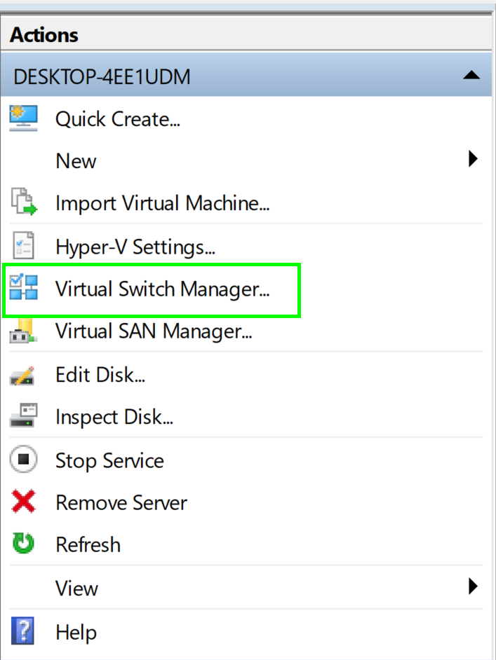
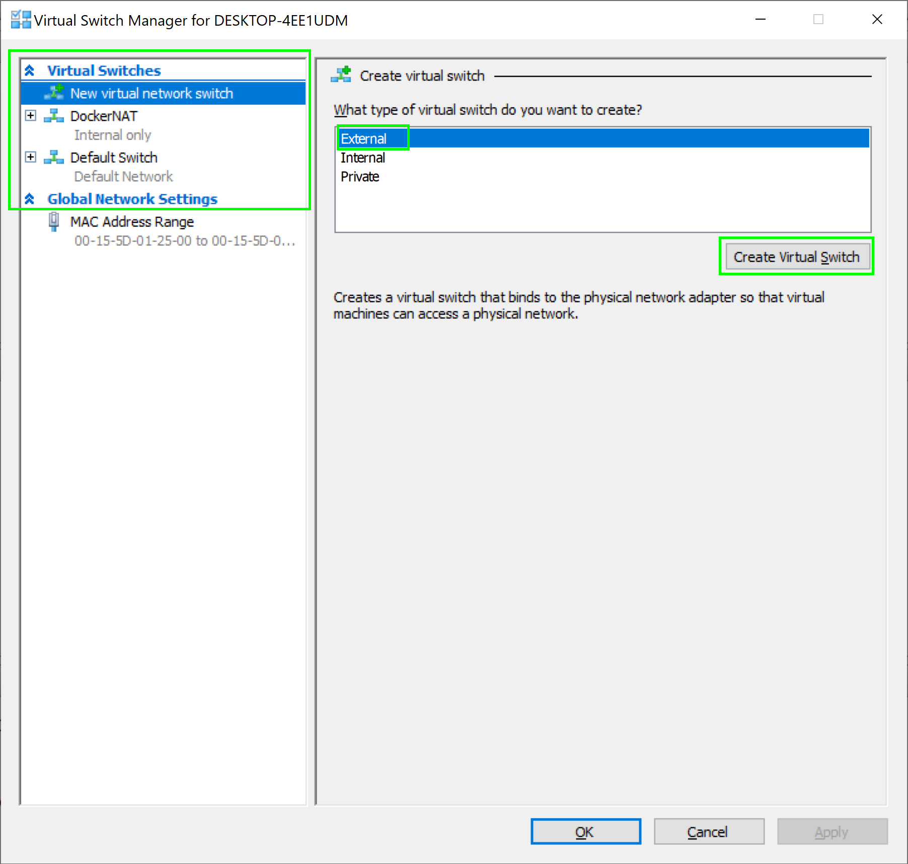
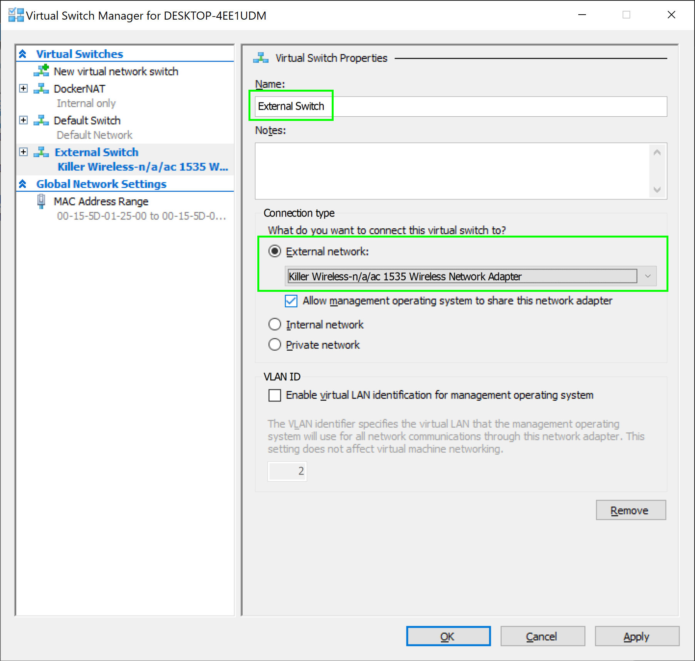
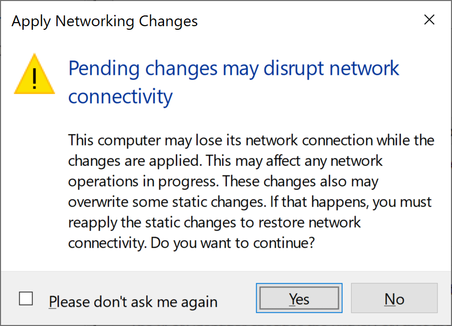
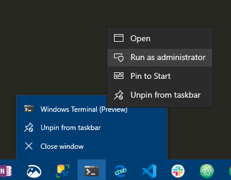
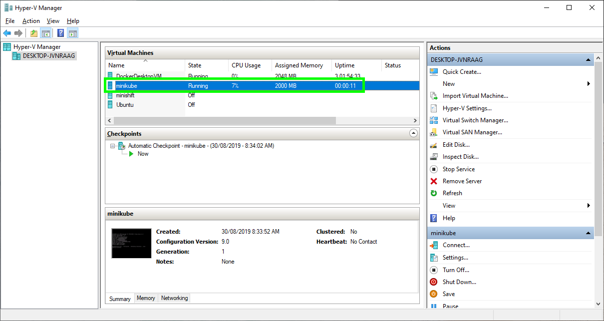
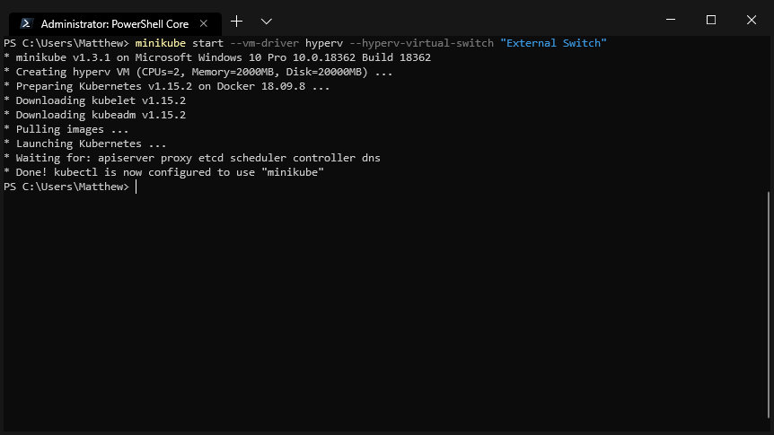

Getting started with a test Kubernetes cluster has been made simple thanks to the [Minikube project](https://kubernetes.io/docs/tasks/tools/install-minikube/). By using the HyperV functionality in Windows 10, a test Kubernetes cluster can be created in just a few minutes.

In this blog post we’ll run through the process of configuring HyperV, installing `kubectl` and Minikube, and interacting with the test Kubernetes cluster.

## Create an external switch

Minikube requires an external HyperV switch to operate, and you may find that you don’t have one by default.

To view the list of switches, open the `HyperV Manager` and select `Virtual Switch Manager...` from the list of actions.



*The HyperV actions menu.*

In the screenshot below you can see that there are no existing external switches, so we need to create one by selecting the `External` option and clicking the `Create Virtual Switch` button.



*The list of existing switches.*

Connect the virtual switch to the PCs local network adapter (in this example, the wireless network adapter). Click the `OK` button to create the switch.



*Creating a new HyperV external switch.*

You will receive a warning that the network connection will de disrupted. Click `Yes` to continue.



*A warning about network interruption as a result of creating a new switch.*

## Install kubectl

The command line tool used to interact with Kubernetes is called `kubectl`, which we will install before we configure Minikube. `kubectl` can be installed 2 ways:

* With [Chocolatey](https://chocolatey.org/packages/kubernetes-cli) using the command `choco install kubernetes-cli`.
* Manually downloaded from [https://storage.googleapis.com/kubernetes-release/release/v1.15.0/bin/windows/amd64/kubectl.exe](https://storage.googleapis.com/kubernetes-release/release/v1.15.0/bin/windows/amd64/kubectl.exe).

::hint
Note that the version of the latest download can be found at [https://storage.googleapis.com/kubernetes-release/release/stable.txt](https://storage.googleapis.com/kubernetes-release/release/stable.txt). Simply replace the `v1.15.0` in the first URL with the version returned by the second URL.
::

## Install Minikube

We are now ready to install Minikube. You can install Minikube 2 ways:

* With [Chocolatey](https://chocolatey.org/packages/Minikube) using the command `choco install minikube`.
* Downloading and installing the executable from [GitHub](https://github.com/kubernetes/minikube/releases/latest/download/minikube-installer.exe).

With Minikube installed, open up a Powershell terminal as an Administrator.



*Launching the terminal as administrator.*

Minikube can then be started with the command:

```PowerShell
minikube start `
--vm-driver hyperv `
--hyperv-virtual-switch "External Switch"
```

A new virtual machine called `minikube` will be created.



*The minikube VM created as a result of running minikube start.*

Once the installation has completed, we can interact with the Minikube cluster via `kubectl`.



*The minikube clutser has been started successfully.*

## Running some commands

The minikube installation will update the file at `~/.kube/config`, the configuration file used by `kubectl`, with the details of the test cluster:

```PowerShell
PS C:\Users\Matthew> cat ~/.kube/config
apiVersion: v1
clusters:
- cluster:
    certificate-authority: C:\Users\Matthew\.minikube\ca.crt
    server: https://10.1.1.122:8443
  name: minikube
contexts:
- context:
    cluster: minikube
    user: minikube
  name: minikube
current-context: minikube
kind: Config
preferences: {}
users:
- name: minikube
  user:
    client-certificate: C:\Users\Matthew\.minikube\client.crt
    client-key: C:\Users\Matthew\.minikube\client.key
```

We can test that the installation is working by listing the nodes:

```PowerShell
PS C:\Users\Matthew> kubectl get nodes
NAME       STATUS   ROLES    AGE     VERSION
minikube   Ready    master   6m47s   v1.15.2
```

## Connecting Octopus to Minikube

To use Minikube from Octopus, we need to upload the client certificate. Minikube splits the certificate and key into two files (referenced by the `client-certificate` and `client-key` properties in the `~/.kube/config` file), so we use [OpenSSL](https://slproweb.com/products/Win32OpenSSL.html) to merge them into a single PFX file.

```PowerShell
& "C:\Program Files\OpenSSL-Win64\bin\openssl.exe" pkcs12 `
  -passout pass: `
  -export `
  -out certificateandkey.pfx `
  -in C:\Users\Matthew\.minikube\client.crt `
  -inkey C:\Users\Matthew\.minikube\client.key
```

The resulting file `certificateandkey.pfx` can then be uploaded to Octopus.


*The certificate and key that was created by minikube and combined by OpenSSL.*

To allow Octopus to communicate with the local virtual machine, we need to create a [worker tentacle](https://octopus.com/docs/infrastructure/workers) on our local PC.


*A polling worker tentacle running on the same mahcine as the minikube cluster.*

We can now create a Kubernetes target pointing to the local URL of the Minikube cluster, which can be found from this line in the `~/.kube/config` file:

```YAML
server: https://10.1.1.122:8443
```

The Kubernetes target will use the certificate we uploaded earlier for authentication, skip TLS verification for convenience, and use the local tentacle worker by default.

::hint
You could upload the certificate reference by the `certificate-authority` property in the `~/.kube/config` file and set that as the server certificate if you wanted to.
::


*A Kubernetes target, configured to use the local worker tentacle, talking to the internal minikube IP address.*

With the target defined, we can use the [Octopus Script Console](https://octopus.com/docs/administration/managing-infrastructure/script-console) to interact with it.


*The script console is a handy way to run ad-hoc scripts.*

The command will be executed via the worker tentacle to interact with the local minikube cluster.


*The script result, which mirrors the result when running kubectl locally.*

## Conclusion

Minikube is an easy way to get a test Kubernetes cluster up and running. In Windows Minikube utilizes HyperV, and requires an external switch to operate. Once started, Minikube configures `kubectl` and we can start running commands against the test cluster.

It is also possible to interact with the Minikube cluster from Octopus. By using a worker tentacle on the same PC as the Minikube VM, a Kubernetes target can issue commands to the private IP of the cluster.

For more information on deploying to Kubernetes, please see [our documentation](https://octopus.com/docs/deployment-examples/kubernetes-deployments).
