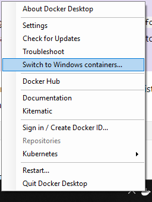
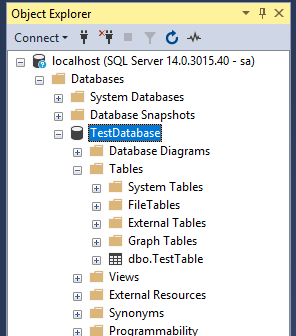
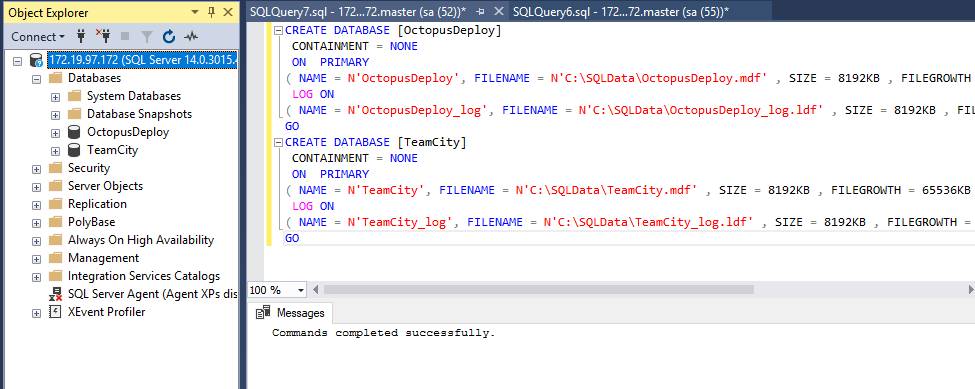

Running SQL Server on a development machine is a [key part in automating database deployments](https://octopus.com/blog/automated-database-deployments-iteration-zero#moving-to-dedicated-databases).  Typically, running SQL Server locally is accomplished by [installing SQL Server Developer edition](https://octopus.com/blog/automate-sql-server-install).  The downside to doing that is the SQL Server Windows Service needs to run all the time, which consumes resources, the installer adds a bunch of extra applications, and the developer is responsible for upgrading it.  

Is it possible to get the best of both worlds?  Run SQL Server locally, but only when it is needed, and make it easy to upgrade?  For quite some time, SQL Server has been a Docker image, which looks like it can solve these headaches.  The real question is, how hard is it to set up?  In this article, I aim to answer that question and help you get SQL Server running in a Docker container.

!toc

## Windows based containers

I have been developing on Windows since I was in university.  I know the core concepts of Linux, but I am by no means an expert.  Learning Linux AND learning Docker at the same time is quite a bit to take on.  Docker provides the ability to run both Linux and Windows based containers.  Microsoft provides a [Windows based container for SQL Server Developer Edition](https://hub.docker.com/r/microsoft/mssql-server-windows-developer), so to make things easier to learn, I am going to use that container for this article.  

## Prep work

This article assumes you have a passing familiarity with Docker.  If you are not familiar with the core concepts of Docker, I encourage you to read the [Docker overview page](https://docs.docker.com/engine/docker-overview/).  

My laptop is running Windows 10 professional.  I will be using [Docker Desktop](https://docs.docker.com/docker-for-windows/), which is sometimes known as Docker for Windows.  Some prep-work will be needed before I can jump in and start using Docker.

### Enable CPU virtualization

When it comes down to it, Docker is a virtualization host.  Just like any other virtualization host, the CPU has to support virtualization, and that feature has to be enabled.  Typically virtualization is enabled in the BIOS, which means you’ll have to search Google for how to enable it in your computer manufacturer’s BIOS.  Intel calls their virtualization technology [Intel VT](https://www.intel.com/content/www/us/en/virtualization/virtualization-technology/intel-virtualization-technology.html), along with Intel VTx.  AMD calls their virtualization technology [AMD V](https://www.amd.com/en/technologies/virtualization), sometimes you’ll see it called VDI or SVM.  

### Installing Docker for Windows

After the quick BIOS update, it‘s time to install Docker Desktop, which includes Docker Compose and the Docker CLI.  The whole process to install Docker for Windows is [nicely documented](https://docs.docker.com/docker-for-windows/install/).  No need to repeat that here.

One thing to note, if you don’t have Hyper-V enabled, the installer will enable it for you.  That will require a restart of the computer.

As I stated earlier, I am going to be using Windows based containers.  After Docker Desktop has been installed, I need to switch over to Windows containers.  That is done by right-clicking on the Docker Desktop icon in the taskbar and selecting `Switch to Windows containers...`.  



### Setting up folders to share with Docker containers

By default, Docker treats all containers as stateless.  Expect any changes made to the container, such as creating a database, to be destroyed.  This problem can be solved by making use of volumes in Docker.  I set up a folder on my hard drive, C:\Docker\Volumes, to store those volumes.


It’s important to note that if I were running these as Linux based containers, I‘d need to follow the steps listed in the [Docker documentation on sharing drives](https://docs.docker.com/docker-for-windows/#shared-drives).

### Anti-Virus configuration

One downside of running a Windows container (aside from the space overhead), is that anti-virus software can and will block them from downloading.  That blocking occurs because of how Docker stores images on the Windows file system.  Essentially, another folder called Windows will appear in what appears to be a random location.  When anti-virus scanners see that they freak out.  Make sure you are using the latest version of your anti-virus of choice.  Don't be surprised if you have to exclude `C:\ProgramData\Docker` from scanning.


## Configuring the SQL Server Developer container

It’s easy to get a container, even SQL Server, up and running.  I want to use this for actual development work, which means I need to solve the following:

1. Get the container up and running with no extra configuration.
2. Connect to it via SSMS.
3. Persist databases created in a container.
4. Have a static IP or hostname to keep configuration easy.

### Running SQL Server Developer Container for the first time

That list can seem quite daunting, especially if you are new to Docker.  I want to take it one step at a time.  First, let’s run a simple command to pull down the SQL Server Windows Developer image from Docker Hub:

```PowerShell
docker pull microsoft/mssql-server-windows-developer
```

If you are following along step by step, brew up some tea or coffee and sit back, because this might take a while to complete.  Not only is it downloading that image, but it is also downloading all the dependencies as well.    


Now that the image is downloaded, it’s time to get it fired up and run some SQL scripts.  Thankfully, the documentation [Microsoft added to Docker Hub](https://hub.docker.com/r/microsoft/mssql-server-windows-developer) makes this easy.  Please make a note of the `--name` parameter being sent in.  That parameter will make it easier later when we need to figure out how to connect to it.  Along with naming the instance, I will set the port to the default SQL Server port, `1433`:

```PowerShell
docker run --name SQLServer -d -p 1433:1433 -e sa_password=Password_01 -e ACCEPT_EULA=Y microsoft/mssql-server-windows-developer
```


### Connecting to the container from SSMS on the host

The SQL Server container is running, but what is the IP Address to connect to it via SSMS from the host?  The container is assigned a dynamic IP Address, such as `172.19.1.0`.  This is different than running SQL Server as a Windows Service where it is possible to connect to it via `.` or `127.0.0.1`.  The below command will get the IP address of that instance:

```PowerShell
$docker = docker inspect SQLServer | convertfrom-json
$docker[0].NetworkSettings.Networks.nat.IpAddress
```

In this example, the IP Address is `172.19.98.212`.


Now it‘s just a matter entering that IP Address, along with `sa` as the username/password defined above, to connect SQL Server Management Studio(SSMS) to that database.  


Just like regular SQL Server, everything works as expected.  I can create a database and tables without any issue.



### Persisting databases created in a container

What happens if the container needs to be restarted?

```PowerShell
docker stop SQLServer
docker start SQLServer
```

The IP Address changes when the container is restarted.


But, the database still exists after the restart.  


What if the container needs to be recreated?  Typically, that would be done when the container configuration changes or a new version is released.  In addition to the `stop` command, I’ll need to run the `rm` command, which removes the container:

```PowerShell
docker stop SQLServer
docker rm SQLServer
docker run --name SQLServer -d -p 1433:1433 -e sa_password=Password_01 -e ACCEPT_EULA=Y microsoft/mssql-server-windows-developer
```


In this case, the databases were all deleted.  


What we need is a way to persist data to handle both restarting the container and the recreation of the container.

The database files need to be persisted.  That’s accomplished using a volume will be pointed at `C:\Docker \Volumes\SQLServer`. There are [many](https://blog.sixeyed.com/docker-volumes-on-windows-the-case-of-the-g-drive/), [many articles](https://github.com/docker/labs/blob/master/windows/sql-server/part-3.md) about [Docker Volumes](https://docs.docker.com/storage/volumes/).  The TL;DR; is add the `--volume` switch to `docker run` to add a volume.  If the container is already running, it needs to be destroyed before adding a volume:

```PowerShell
docker stop SQLServer
docker rm SQLServer
docker run --name SQLServer -d -p 1433:1433 --volume c:\Docker\Volumes\SQLServer:c:\SQLData -e sa_password=Password_01 -e ACCEPT_EULA=Y microsoft/mssql-server-windows-developer
```

All the database create commands need to specify `C:\SQLData\` as the directory for the data.  Let’s say I want this SQL Server container to host the databases for Octopus Deploy and TeamCity.  The commands is:

```SQL
CREATE DATABASE [OctopusDeploy]
 CONTAINMENT = NONE
 ON  PRIMARY 
( NAME = N'OctopusDeploy', FILENAME = N'C:\SQLData\OctopusDeploy.mdf' , SIZE = 8192KB , FILEGROWTH = 65536KB )
 LOG ON 
( NAME = N'OctopusDeploy_log', FILENAME = N'C:\SQLData\OctopusDeploy_log.ldf' , SIZE = 8192KB , FILEGROWTH = 65536KB )
GO
CREATE DATABASE [TeamCity]
 CONTAINMENT = NONE
 ON  PRIMARY 
( NAME = N'TeamCity', FILENAME = N'C:\SQLData\TeamCity.mdf' , SIZE = 8192KB , FILEGROWTH = 65536KB )
 LOG ON 
( NAME = N'TeamCity_log', FILENAME = N'C:\SQLData\TeamCity_log.ldf' , SIZE = 8192KB , FILEGROWTH = 65536KB )
GO
```

No big surprise, the databases were created successfully.



And they now show up in the directory on the host system.


Those databases names and paths can be passed to the container using the `attach_dbs` environment variable.  It is possible to bootstrap all of this using a PowerShell script.  I didn’t do that for this article because I only need to create the databases once.  I didn’t see the point of spending the effort to write a script to solve a problem I only need to do once.  

```PowerShell
docker stop SQLServer
docker rm SQLServer
$attachDbs = "[{'dbName':'OctopusDeploy','dbFiles':['C:\\SQLData\\OctopusDeploy.mdf','C:\\SQLData\\OctopusDeploy_log.ldf']},{'dbName':'TeamCity','dbFiles':['C:\\SQLData\\TeamCity.mdf','C:\\SQLData\\TeamCity_log.ldf']}]"
docker run --name SQLServer -d -p 1433:1433 --volume c:\Docker\Volumes\SQLServer:c:\SQLData -e sa_password=Password_01 -e ACCEPT_EULA=Y -e attach_dbs=$attachDbs microsoft/mssql-server-windows-developer
```

Those databases are now mounted when the container is recreated.  


### Setting the IP Address and Host Name

Up until this point I have been using this command to get the IP Address for the SQL Server container:

```PowerShell
$docker = docker inspect SQLServer | convertfrom-json
$docker[0].NetworkSettings.Networks.nat.IpAddress
```

What would be even better is not having to worry about IP Addresses at all.  This is where [Docker Compose](https://docs.docker.com/compose/) enters the picture.  Docker Compose handles a lot of the behind the scenes work for us.  All it takes is converting the existing commands we have been using to a YAML file:

```YAML
version: '3.7'
services:
  SQLServer:
   image: microsoft/mssql-server-windows-developer
   environment:
     - ACCEPT_EULA=Y
     - SA_PASSWORD=Password_01   
     - attach_dbs=[{'dbName':'OctopusDeploy','dbFiles':['C:\\SQLData\\OctopusDeploy.mdf','C:\\SQLData\\OctopusDeploy_log.ldf']},{'dbName':'TeamCity','dbFiles':['C:\\SQLData\\TeamCity.mdf','C:\\SQLData\\TeamCity_log.ldf']}]
   ports:
     - '1433:1433'
   volumes:
     - c:\Docker\Volumes\SQLServer:c:\SQLData
```

I saved that docker-compose file in the C:\Docker folder on my hard drive:


Then I ran this command in PowerShell:

```PowerShell
Set-Location C:\Docker
docker-compose up -d
```

Now I can access my SQL Server, which is running in Docker, by connecting to localhost instead of an IP address:


## Conclusion 

Getting SQL Server running in Docker turned out to be a lot easier than I thought it would be.  I was expecting hours upon hours of work, but in the end, I had something up and running within an hour.  To be fair, that didn't include research into how Docker works.  My hope is this article gave you enough direction for you to take the dive yourself into Docker and realize it is not so big and scary.  And maybe, just maybe, you’ll use Docker to host SQL Server on your development machine instead of installing SQL Server Developer.

Until next time, Happy Deployments!