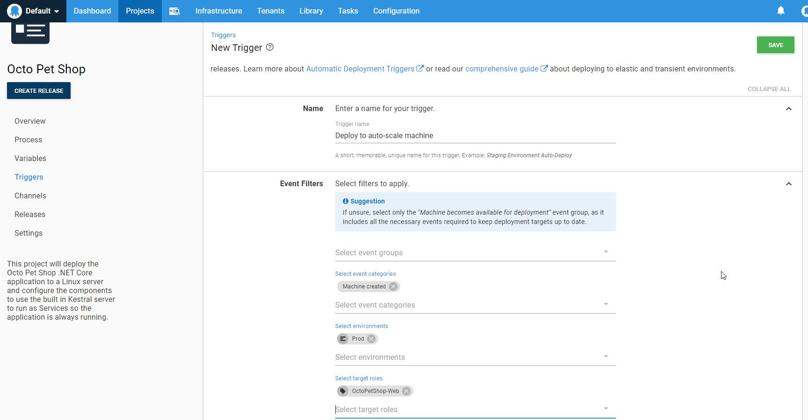

## Introduction
In a world of cloud-based applications with scaling capabilities, it's essential that you have infrastructure automation in place.  Amazon Web Services (AWS) has taken out the heavy lifting by providing CloudFormation templates for automatic provisioning of cloud-based resources.  While this takes care of provisioning of resources, you still need a method for automatically attaching your newly created EC2 instance with Octopus Deploy so your applications and services can be deployed.  In this post, I will demonstrate how to install and configure a Tentacle for Linux when using a Linux-based EC2 instance.

## Sample CloudFormation template
:::warning
The following is an excerpt from the CloudFormation template, click [here](SampleCloudFormation.yaml) for the entire template.
:::

AWS provides a section within the CloudFormation template where we can include script called UserData.  Using the code provided on our [Linux tentacle](https://octopus.com/docs/infrastructure/deployment-targets/linux/tentacle) documentation page, we can include a series of statements that will execute once the EC2 instance has been provisioned.  In this example, I am creating an EC2 Linux instance to host [OctoPetShop](https://github.com/OctopusSamples/OctoPetShop), a .NET core application.  To accomplish this, I'll need to

- Install Linux Tentacle
- Configuring the Tentacle
- Register the Tentacle with my Octopus Server
- Create the Unit file
- Configure the Tentacle to run as a Linux Service
- Install .NET core

```
Resources:
  EC2Instance:
    Type: 'AWS::EC2::Instance'
    Properties:
      InstanceType: !Ref InstanceType
      SecurityGroups:
        - !Ref InstanceSecurityGroup
      KeyName: !Ref KeyName
      ImageId: ami-06f2f779464715dc5
      UserData:
        Fn::Base64: 
          !Sub |
            #!/bin/bash -xe
            serverUrl="https://YourOctopusServer"
            serverCommsPort=10943
            apiKey="API-XXXXXXXXXXXXXXXXXXXXXXXXXXX"
            name=$HOSTNAME
            environment="Dev"
            role="AWS-MyApplication"
            configFilePath="/etc/octopus/default/tentacle-default.config"
            applicationPath="/home/Octopus/Applications/"

            sudo apt-key adv --fetch-keys https://apt.octopus.com/public.key
            sudo add-apt-repository "deb https://apt.octopus.com/ stretch main"
            sudo apt-get update
            sudo apt-get install tentacle

            /opt/octopus/tentacle/Tentacle create-instance --config "$configFilePath" --instance "$name"
            /opt/octopus/tentacle/Tentacle new-certificate --if-blank
            /opt/octopus/tentacle/Tentacle configure --noListen True --reset-trust --app "$applicationPath"
            echo "Registering the Tentacle $name with server $serverUrl in environment $environment with role $role"
            /opt/octopus/tentacle/Tentacle register-with --server "$serverUrl" --apiKey "$apiKey" --name "$name" --env "$environment" --env "TearDown" --role "$role" --role "OctoPetShop-Web" --role "OctoPetShop-ProductService" --role "OctoPetShop-ShoppingCartService" --comms-style "TentacleActive" --server-comms-port $serverCommsPort
            
            cat >> /opt/octopus/tentacle/tentacle.service <<EOL
            [Unit]
            Description=Octopus Tentacle
            After=network.target

            [Service]
            Type=simple
            User=root
            WorkingDirectory=/etc/octopus/Tentacle/
            ExecStart=/opt/octopus/tentacle/Tentacle run --instance $name --noninteractive
            Restart=always

            [Install]
            WantedBy=multi-user.target

            EOL
            
            sudo cp /opt/octopus/tentacle/tentacle.service /etc/systemd/system/tentacle.service
            sudo chmod 644 /etc/systemd/system/tentacle.service
            sudo systemctl start tentacle
            sudo systemctl enable tentacle
            
            wget -q https://packages.microsoft.com/config/ubuntu/18.04/packages-microsoft-prod.deb -O packages-microsoft-prod.deb
            sudo dpkg -i packages-microsoft-prod.deb
            
            sudo add-apt-repository universe
            sudo apt-get install apt-transport-https --assume-yes
            sudo apt-get update
            sudo apt-get install dotnet-sdk-2.2 --assume-yes
```

And there you have it!  Anytime this CloudFormation template is used to create new EC2 instance, it will automatically download, install, and configure the Linux Tentacle, attach it to our Octopus Server, set up the Tentacle to be a Linux Service, and install .NET core making our new instance ready to host our OctoPetShop application!  Using a [Project Trigger](https://octopus.com/docs/deployment-process/project-triggers), we can configure out OctoPetShop application to automatically deploy whenever a new machine becomes available.  Now, when our application scales up, it will automatically deploy OctoPetShop to the newly created machine.



## Summary
Combining the power of automatic provisioning with automating Tentacle installations is an absolute necessity when implementing applications with scaling capabilties.  In this post, I demonstrated using an AWS CloudFormation template to provision a Linux-based EC2 instance, install a Linux tentacle and run as a service, register with an Octopus server, and configure your project to automatically deploy when a machine is created.
