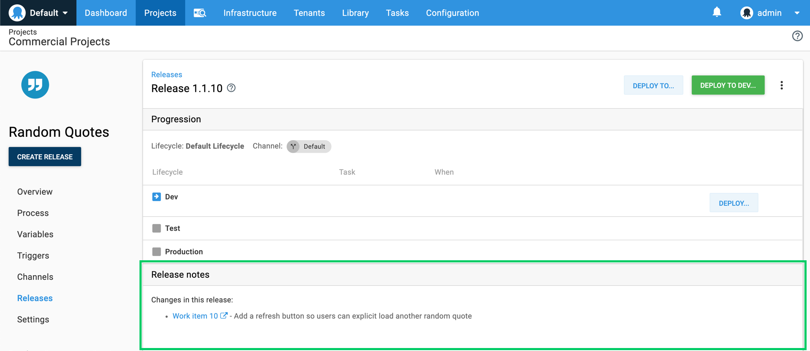
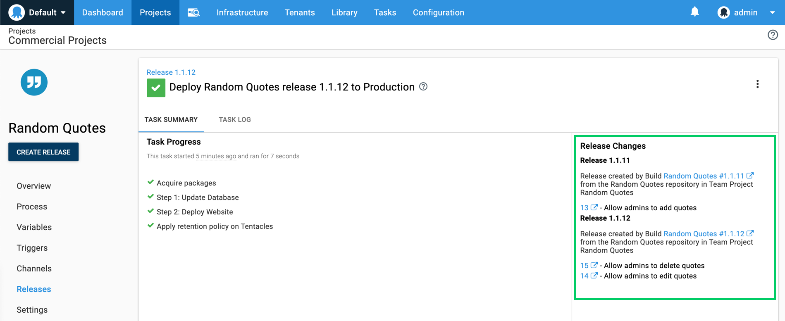
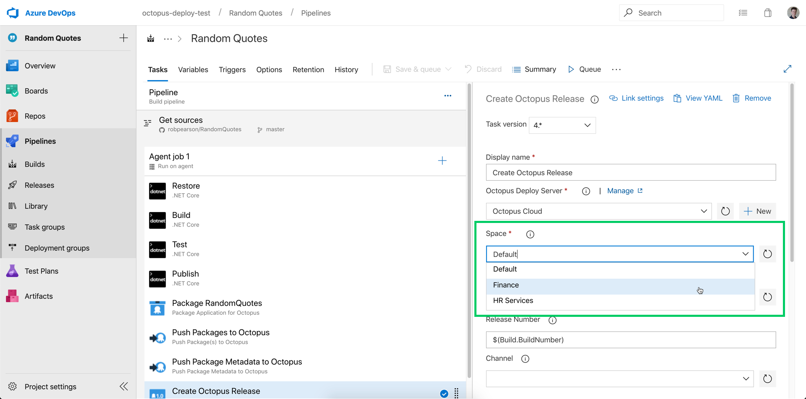

We recently shipped an update to our [Octopus Deploy integration for Azure DevOps](https://marketplace.visualstudio.com/items?itemName=octopusdeploy.octopus-deploy-build-release-tasks) that improves the day-to-day lives of developers using Azure DevOps and Octopus Deploy.

Octopus complements the Azure DevOps suite of services.  It's very common for teams to use Azure Pipelines to build their apps and use Octopus to deploy them. This approach takes advantage of the strengths of both tools and together, they enable teams to get better end-to-end visibility into their software pipelines from idea to production.

This release brings our Azure DevOps extension to parity with our TeamCity and Bamboo plugins. We've added support for our build information and work item tracking, and this opens up some fantastic new scenarios: 

* **[See release details including new features and fixes](/blog/2019-08/azure-devops-extension-v4/index.md#see-release-details-including-new-features-and-fixes)**. Our work item tracking enables you to see which features, bug fixes and updates an Octopus release contains.
* **[See What's New in Production](/blog/2019-08/azure-devops-extension-v4/index.md#see-whats-new-in-production)** Octopus can intelligently calculate what has changed since your last deployment. This functionality gives you the power to see 'What's New' in production or any other environment.
* **[Share release notes with your team and managers](/blog/2019-08/azure-devops-extension-v4/index.md#share-release-notes-with-your-team-and-managers)**. Octopus can now generate release notes when deploying to your environments like dev, test or production. Share them with your team, managers, or executives via email, Slack, and more.

This release also includes **[improved Space's support]**(/blog/2019-08/azure-devops-extension-v4/index.md#improved-spaces-support) so teams can select their team's Space more easily.

Learn how to [install or update our extension](/blog/2019-08/azure-devops-extension-v4/index.md#how-to-install-or-update-your-azure-devops extension).

## See release details including new features and fixes

It's common for teams using Azure DevOps to use its work item tracking, including Kanban boards and backlogs to plan and organize their projects. This update brings support to identify work items associated with Azure DevOps builds and Octopus releases giving end-to-end traceability from work item to deployment. You can also click through to Azure DevOps for more information. This can aid in identifying changes that introduce bugs into releases.

NOTE: Octopus also supports [GitHub issues](https://octopus.com/docs/deployment-process/issue-tracking/github) and [Jira issues](https://octopus.com/docs/deployment-process/issue-tracking/jira). [Read our docs](https://octopus.com/docs/deployment-process/issue-tracking) for more information.

## See What's New in Production

Figuring out what has changed since you last deployed to an environment can sometimes be a bit of guesswork. This is no longer the case as Octopus can intelligently determine which work items have changed since your last deployment. This feature gives you the power to see 'What's New' in production or any other environment, and it rolls up the release notes and all relevant changes. 

This is useful to see at a glance what has changed during deployments and very handy when working on large projects and seeing the changes other teams are contributing.

## Share Release Notes with your team and managers

Writing release notes is generally a manual task, and while this is easier using tools like [Azure Boards](https://azure.microsoft.com/en-us/services/devops/boards/) or [Jira](https://www.atlassian.com/software/jira), it's still time-consuming. Integrating Octopus and Azure DevOps enables this process to be fully automated. Octopus knows which issues have already been deployed to an environment so it can quickly generate release notes showing what's new in test or production environments.

Reading release notes in Octopus is handy but sharing them via email, Slack, or other mediums is even better. Using our email step, Slack or Microsoft Teams step templates, you can send release notes to your team or managers after every successful deployment to production. This feature makes it straightforward to keep everyone in the loop.

## Improved Spaces Support

Our updated extension includes full support to retrieve all the [Spaces](https://octopus.com/spaces) from your Octopus server, so it's now easy to select the one for your team. 

## How to install or update your Azure DevOps extension

If you're using Azure DevOps but haven't installed the Octopus Deploy extension, it's available for free on the Visual Studio Marketplace: **[Octopus Deploy integration for Azure DevOps](https://marketplace.visualstudio.com/items?itemName=octopusdeploy.octopus-deploy-build-release-tasks)**.

If your team is already using Azure DevOps and Octopus Deploy, I highly recommend upgrading to the latest version of our extension. This release bumps the version of the extension from v3 to v4 so you'll need to select the newer version of each task. [Read our docs](https://octopus.com/docs/packaging-applications/build-servers/tfs-azure-devops) for more information.

If you're using Azure DevOps and looking to mature your deployments, you can install [our extension](https://marketplace.visualstudio.com/items?itemName=octopusdeploy.octopus-deploy-build-release-tasks) and [try Octopus Deploy for free](https://octopus.com/trial).

## Wrap-up

In summary, [Azure DevOps](https://dev.azure.com) and [Octopus Deploy](https://octopus.com) work together to give you better end-to-end visibility into your software pipelines from idea to production.

Happy deployments!