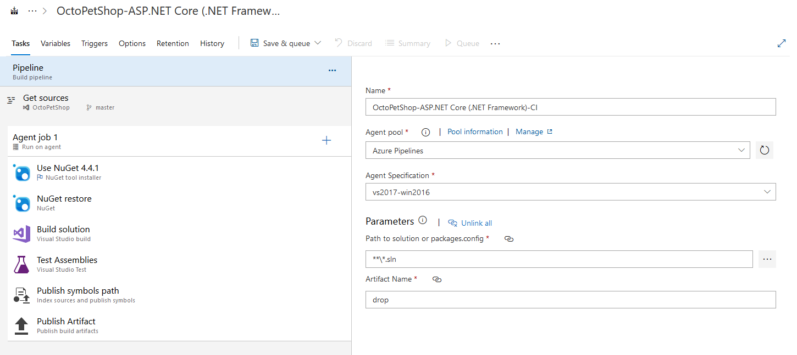
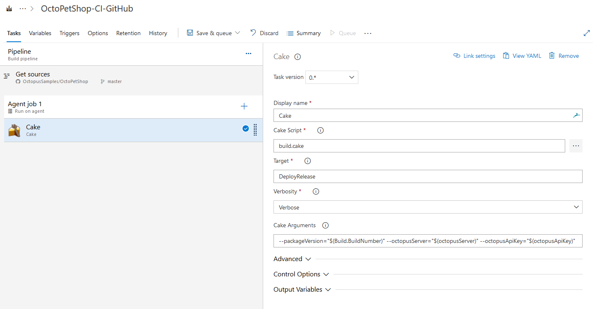

Cake is a build automation system for .NET Developers to script their build processes using a C# Domain Specific Language (DSL). In this post, we’ll explore the benefits of Cake and its major features with a concrete working example to achieve a flexible, maintainable, automated build process.

You might have heard about Make and makefiles in the past, but don’t worry if you haven’t because you are about to. Make is a build automation tool, and a makefile is a file that contains the instructions Make needs to build an application. It can also be used to run related tasks like cleaning the build directory.

Many variants of Make have appeared over the years as developers want to use their preferred languages to define their build processes. Rake (Ruby Make) became very popular alongside Ruby on Rails.

In the .NET world, you have a few options based on your language of choice. There’s [PSake](https://github.com/psake/psake) (PowerShell), [FAKE](https://fake.build/) (F#), and [Cake](https://cakebuild.net/) (C#). We’re focusing on Cake today, but check out the others if you’d rather script with PowerShell or F#.

## Benefits of Cake

One of the main benefits of using Cake is that your build scripts will be written in a C# DSL. Your team can use the language they’re most familiar with to automate their builds instead of using XML, JSON, or YAML.

Another benefit not to be overlooked is the ability to execute Cake scripts locally and from your CI server. Think about that for a second. Barring any environmental issues on your build agent, the same Cake script will run on your machine, your team member’s machine, and on your CI server. Your CI project configuration could be simplified to:

1. Check out from source control.
2. Run this Cake script.

Speaking of source control, your Cake script lives in your project repository. Your build process is versioned and can be changed and reviewed with the same code review process as your application code. Committing your script also couples your application code with the build process so you don’t have to change the build steps separately in your CI server. This linking of the application and build script is one of the reasons YAML is becoming a popular choice for modeling build pipelines. Cake has the added benefit of running those build steps right on your machine.

Cake has [built-in support for lots of tools](https://cakebuild.net/dsl/) (including Octopus Deploy) and many others through [community-contributed add-ins](https://cakebuild.net/addins/). There’s a good chance the tools you’re using for your build are supported and if not, you can create an add-in to use in your script.

## Example Cake script

Our sample project, OctoPetShop, has a [full example Cake script](https://github.com/OctopusSamples/OctoPetShop/blob/a9254521a67db6364ff4ac888fa56873ae07f7c8/build.cake) that we’ll explore in this post. That link is to the version used at time of writing. If you want to review the latest version you can check [this link](https://github.com/OctopusSamples/OctoPetShop/blob/master/build.cake).

### Tools, add-ins, and modules

The first section in your Cake script imports any external tools, add-ins, or modules you use in your build process. In our case, we’ve added a #tool directive and specified that we want OctopusTools version 6.13.1 from NuGet. Then we’ve add a `using` statement for the `Cake.Common.Tools.OctopusDeploy` namespace:

```cs
#tool "nuget:?package=OctopusTools&version=6.13.1"

using Cake.Common.Tools.OctopusDeploy;
```

We’re only using the Octopus Deploy tooling in this script so far, but Cake has built-in support for many tools including NuGet, testing frameworks, and more.

### Arguments and global variables

In the next section, we set up some arguments and variables to use during the script execution.

With the argument alias, Cake will give you the value of an argument that was provided from the command line or a default value that you specify. We have arguments for the target task to run, what build configuration to use, which version and prerelease tag to use for versioning, and information for integrating with our Octopus server.

After that, we have a simple class for collecting information on our projects and a few variables that we’ll populate in `Setup`:

```cs
var target = Argument("target", "Default");
var configuration = Argument("configuration", "Release");
var version = Argument("packageVersion", "0.0.1");
var prerelease = Argument("prerelease", "");
var databaseRuntime = Argument("databaseRuntime", "win-x64");
var octopusServer = Argument("octopusServer", "https://your.octopus.server");
var octopusApiKey = Argument("octopusApiKey", "hey, don't commit your API key");

class ProjectInformation
{
    public string Name { get; set; }
    public string FullPath { get; set; }
    public string Runtime { get; set; }
    public bool IsTestProject { get; set; }
}

string packageVersion;
List<ProjectInformation> projects;
```

### Setup

Let’s take a look at that `Setup` method.

We check if we’re running the build locally, if we are and no prerelease tag was provided, we set the prerelease tag to "-local."

Then we set our global variables `packageVersion` and `projects`:

```cs
Setup(context =>
{
    if (BuildSystem.IsLocalBuild && string.IsNullOrEmpty(prerelease))
    {
        prerelease = "-local";
    }

    packageVersion = $"{version}{prerelease}";

    projects = GetFiles("./**/*.csproj").Select(p => new ProjectInformation
    {
        Name = p.GetFilenameWithoutExtension().ToString(),
        FullPath = p.GetDirectory().FullPath,
        Runtime = p.GetFilenameWithoutExtension().ToString() == "OctopusSamples.OctoPetShop.Database" ? databaseRuntime : null,
        IsTestProject = p.GetFilenameWithoutExtension().ToString().EndsWith(".Tests")
    }).ToList();

    Information("Building OctoPetShop v{0}", packageVersion);
});
```

### Tasks

Tasks define your build process. They are analogous to build steps in your traditional Continuous Integration (CI) project or pipeline.

Let’s take a look at our first task, `Clean`. We define it with the `Task` method and provide a name. Then we use the `Does` method to define what this task does. In this case, we’re cleaning our publish and package directories and then calling `DotNetCoreClean` for our projects:

```cs
Task("Clean")
    .Does(() =>
        {
            CleanDirectory("publish");
            CleanDirectory("package");

            var cleanSettings = new DotNetCoreCleanSettings { Configuration = configuration };

            foreach(var project in projects)
            {
                DotNetCoreClean(project.FullPath, cleanSettings);
            }
        });
```

### Dependencies

Let’s skip down to the `Build` task. It looks similar to `Clean`, but it has a new piece: `IsDependentOn`. This method lets us create a dependency chain between our tasks. When we call the `Build` task, Cake will make sure that both `Clean` and `Restore` have been called first:

```cs
Task("Build")
    .IsDependentOn("Clean")
    .IsDependentOn("Restore")
    .Does(() =>
    {
        foreach(var project in projects)
        {
            var buildSettings = new DotNetCoreBuildSettings()
                {
                    Configuration = configuration,
                    NoRestore = true
                };

            if (!string.IsNullOrEmpty(project.Runtime))
            {
                buildSettings.Runtime = project.Runtime;
            }

            DotNetCoreBuild(project.FullPath, buildSettings);
        }
    });
```

We have another task named `RunUnitTests` that depends on `Build`. Running the `RunUnitTests` task will trigger `Clean`, `Restore`, and `Build`:

```CSU’s
Task("RunUnitTests")
    .IsDependentOn("Build")
    .Does(() =>
    {
        foreach(var project in projects.Where(p => p.IsTestProject))
        {
            DotNetCoreTest(project.FullPath, new DotNetCoreTestSettings { Configuration = configuration });
        }
    });
```

If you continue reading through the script, you’ll see tasks for publishing the apps, packaging them using the Octopus tools, pushing the packages to Octopus, and creating and deploying a release with Octopus.

Finally, we have these lines at the end of our script. This creates a default task that will run the `RunUnitTests` task and its dependencies.

The last line calling the `RunTarget` method kicks off the build process. Here we pass in the global variable `target` which is provided by the user, CI server, or defaults to the task named `Default`:

```cs
Task("Default")
    .IsDependentOn("RunUnitTests");

RunTarget(target);
```

## Executing Cake locally

Cake provides a [PowerShell or shell bootstrap script](https://cakebuild.net/docs/tutorials/setting-up-a-new-project) that you can use to execute your Cake script:

```ps
.\build.ps1 -Target Pack -ScriptArgs '--packageVersion=1.2.3 --prerelease=-dev'
```

That’s it! The script starts up, and after a short wait, we have our NuGet packages built locally and this handy report:

```
Task                          Duration
--------------------------------------------------
Setup                         00:00:00.1432566
Clean                         00:00:05.4768163
Restore                       00:00:06.1162465
Build                         00:00:09.6114684
RunUnitTests                  00:00:04.3110846
Publish                       00:00:06.9924016
Pack                          00:00:12.7274733
--------------------------------------------------
Total:                        00:00:45.3787473
```

We can upload those packages to our Octopus server directly or commit our changes, knowing that our build works.

There are also extensions for Visual Studio and Visual Studio Code that provide IntelliSense, syntax highlighting, and the ability to run your script from the IDE.

## Executing Cake from a CI server

Now that we have our Cake script running locally, we can take it to our CI server. In this example, we are using Azure DevOps, which has an extension to run Cake scripts.

Here’s a snippet of the steps generated when you create a new ASP.NET Core build pipeline. It’s very similar to the steps we created in our Cake script.



After installing the Cake extension, we can add a Cake step to our build, and in this case, it’s the only step that we need. We provide the path to the cake script, the target we want to run, and some additional arguments for the version number and Octopus server information.



After running a build, not only do we get the full output of the Cake script in the logs, we also get our task summary just as we did when running locally:

```
Task                          Duration
--------------------------------------------------
Setup                         00:00:00.0434025
Clean                         00:00:18.1795863
Restore                       00:01:07.9769173
Build                         00:00:36.6475174
RunUnitTests                  00:00:21.3958462
Publish                       00:00:06.2555954
Pack                          00:00:12.0804766
PushPackages                  00:00:16.0161892
CreateRelease                 00:00:05.4893287
DeployRelease                 00:02:09.6799635
--------------------------------------------------
Total:                        00:05:13.7648231
```

## Conclusion

Build automation frameworks like Cake offer many benefits to you and your team. With Cake, you can script your builds using a familiar C# DSL. It enables you to apply your development process to your build. You can run the same steps locally and from your CI server. And Cake’s extensive built-in tooling support and community add-ins should cover most, if not all, of your scripting needs.
