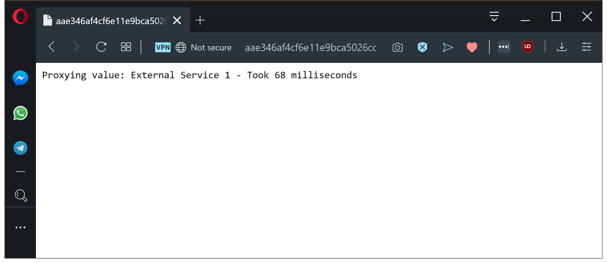
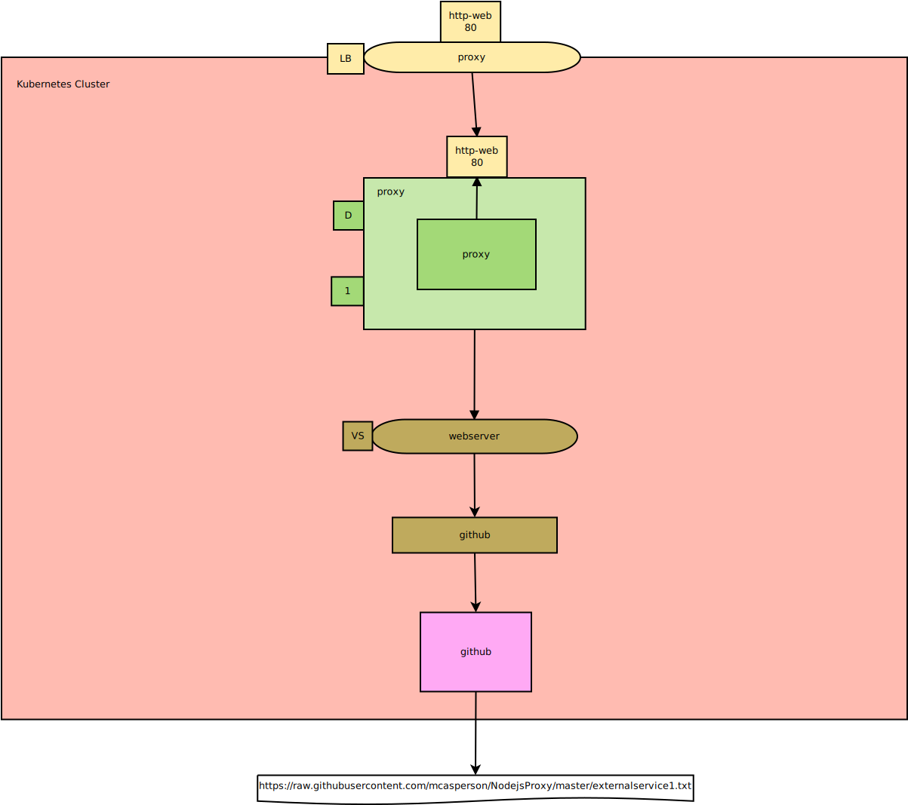

In order to make a network request, the destination host must be part of the Istio service registry. By default, any Service resource in a Kubernetes cluster is part of the service registry, but external URLs are not. To expose external network applications to Istio, we use the [ServiceEntry](https://istio.io/docs/reference/config/networking/v1alpha3/service-entry/) resource.

In this post, we’ll add a ServiceEntry resource to the Kubernetes cluster in order to direct our `proxy` application to an external resource.

## Redirecting internal requests to external resources

To demonstrate the ServiceEntry resource, we’ll direct the requests to `http://webserver` from the `proxy` to https://raw.githubusercontent.com/mcasperson/NodejsProxy/master/externalservice1.txt. This is a plain text file containing the text `External Service 1` that is hosted by GitHub. We’re using this text file to simulate an external API endpoint.

The first step is to expose the host `raw.githubusercontent.com` to the Istio service registry, which is achieved with a ServiceEntry resource.

In the YAML below we expose the host `raw.githubusercontent.com`, identified as being external to the Istio mesh via the `MESH_EXTERNAL` property, accepting HTTPS traffic on the standard port of 443, and resolved to an IP address using the DNS server available inside the Kubernetes cluster with the `DNS` property:

```Yaml
apiVersion: networking.istio.io/v1alpha3
kind: ServiceEntry
metadata:
  name: github
spec:
  hosts:
  - "raw.githubusercontent.com"
  location: MESH_EXTERNAL
  ports:
  - number: 443
    name: https
    protocol: TLS
  resolution: DNS
```

With the external service now part of the Istio service registry, we need to direct traffic to it. This is achieved with the VirtualService resource.

[As before](/blog/2019-09/istio/istio-virtualservice/index.md), we are matching requests to the `webserver` host and using the rewriting functionality to route the request to another location. However, unlike the previous blogs, we are rewriting the traffic to point to an external location.

:::hint
It is important to set the `authority` to the same value as the `destination.host`, because a large number of external services expect the HOST header in the HTTP request to be defined correctly. Failure to set the `authority` field can lead to odd 404 errors.
:::

```YAML
apiVersion: networking.istio.io/v1alpha3
kind: VirtualService
metadata:
  name: webserver
spec:
  hosts:
  - webserver
  http:
  - match:
    - uri:
        regex: ".*"
    rewrite:
      uri: "/mcasperson/NodejsProxy/master/externalservice1.txt"
      authority: raw.githubusercontent.com
    route:
    - destination:
        host: raw.githubusercontent.com
        port:
          number: 443
```

Because we have redirected a HTTP call to an internal Service resource to a HTTPS external location, we need to configure a DestinationRule resource to act as a TLS client. In the YAML below, we have configured the DestinationRule resource to `SIMPLE` TLS mode, which indicates that requests to the host should be conducted over a TLS connection:

```YAML
apiVersion: networking.istio.io/v1alpha3
kind: DestinationRule
metadata:
  name: github
spec:
  host: "raw.githubusercontent.com"
  trafficPolicy:
    tls:
      mode: SIMPLE
```

With this combination of ServiceEntry, VirtualService, and DestinationRule resources, we have pointed our `proxy` application out to the text file hosted by GitHub:



*Internal requests are now directed to an external host.*

Here is the architecture diagram showing the ExternalService resource and the new flow of requests to the external resources.



*The architecture diagram with the ServiceEntry resource (in purple).*

## Conclusion

Istio requires that any external resources contacted by internal applications be exposed as part of the service registry. In this post, we exposed a text file hosted by GitHub via a ServiceEntry resource, directed traffic to it via a VirtualService resource, and configured the TLS settings required to access the HTTPS site via a DestinationRule resource. The end result is that our sample application made requests to the external location without having to modify any code.

In the [next post](/blog/2019-09/istio/istio-gateway/index.md) we will look at the Gateway resource, and how it is used to direct external traffic into the cluster.
