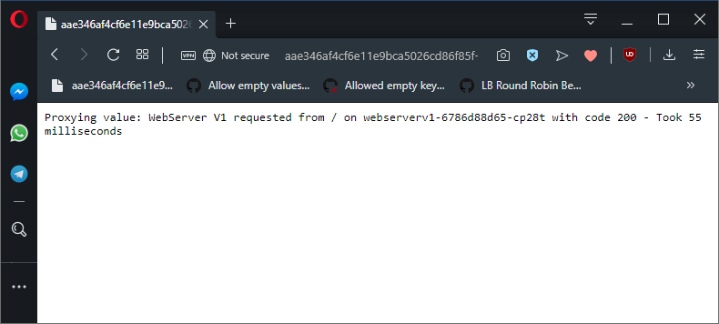
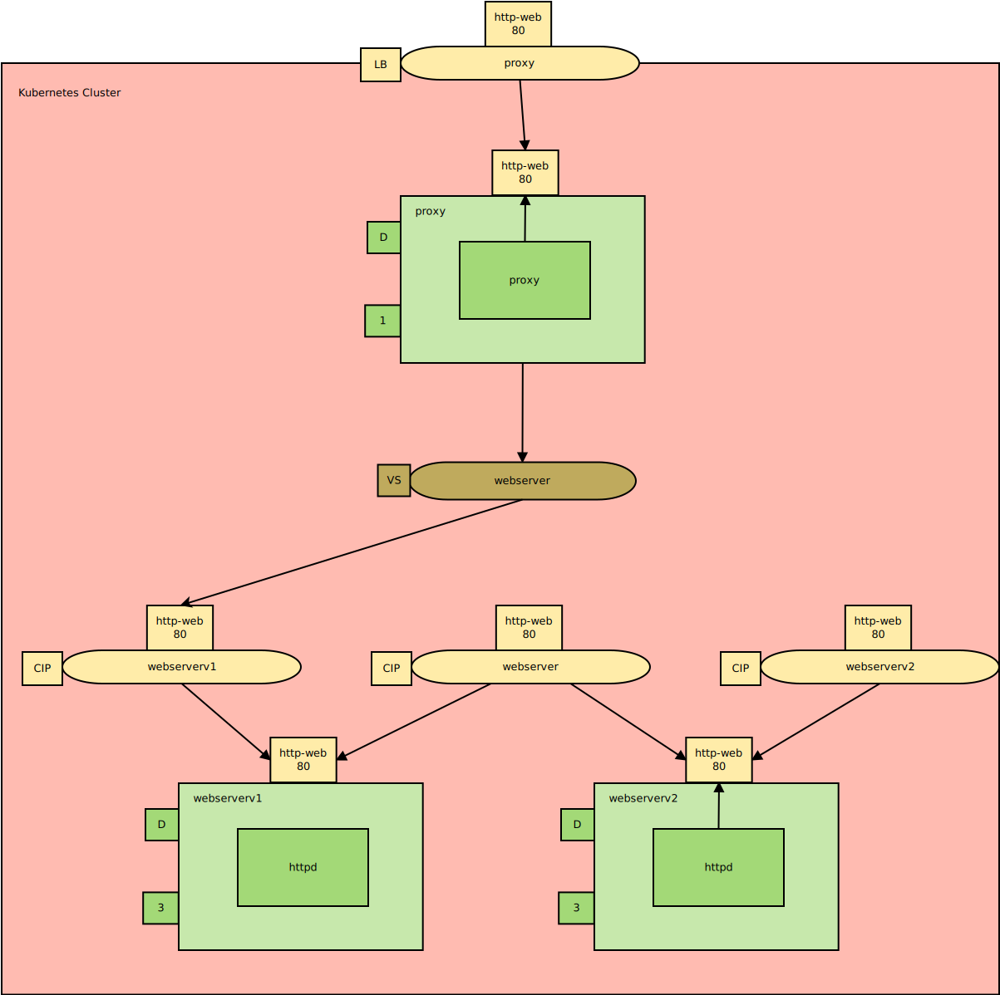
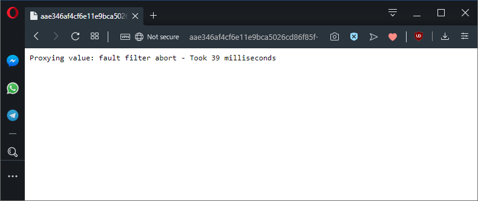
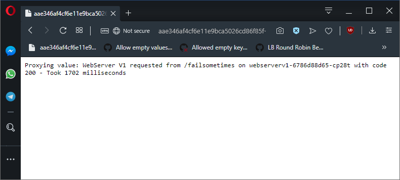

In the [previous blog](/blog/2019-09/istio/the-sample-application/index.md) post, we deployed two simple Node.js web applications into a Kubernetes cluster as Deployment resources and linked everything up with standard Service resources.

The networking so far has only used standard Kubernetes resources to configure it. This works, but falls a little short when it comes to directing traffic between different versions of upstream APIs. You will have noticed that the `proxy` application is returning content from the Pod resources created by both the `webserverv1` and `webserverv2` Deployment resources, which is unlikely to be the desired result had this been a real world deployment. Istio can address this limitation with the [VirtualService resource](https://istio.io/docs/reference/config/networking/v1alpha3/virtual-service/).

In this post, we’ll look at what a VirtualService resource is, how it relates to a standard Ingress resource, and add a VirtualService resource to the cluster to route and modify the requests made by the `proxy` Pod to the `webserver` Service.

## An overview of the VirtualService resource

A VirtualService is a Custom Resource Definition (CRD) provided by Istio. A VirtualService resource acts in much the same capacity as a traditional Kubernetes Ingress resource, in that a VirtualService resource matches traffic and directs it to a Service resource.

However, a VirtualService resource can be much more specific in the traffic it matches and where that traffic is sent, it will operate on internal as well as external traffic, and offers a lot of additional functionality to manipulate traffic along the way.

For comparison, an Ingress resource can match external traffic based on the HTTP host and path. Depending on the Ingress Controller that is installed in the cluster, the path can match wildcard values or even accept regular expressions. But such advanced features are not universal among Ingress Controllers; for example, the [Nginx Ingress Controller supports regex paths](https://kubernetes.github.io/ingress-nginx/user-guide/ingress-path-matching/), while the Google Kubernetes Engine Ingress Controller only supports very [selective uses of the asterisk as a wildcard](https://cloud.google.com/kubernetes-engine/docs/concepts/ingress#multiple_backend_services).

A VirtualService resource on the other hand can match traffic based on HTTP host, path (with full regular expression support), method, headers, ports, query parameters, and more.

Once an Ingress resource has matched the incoming traffic, it is then directed to a Service resource. This is also true of a VirtualService resource, however when combined with a DestinationRule resource, a VirtualService resource can direct traffic to specific subsets of Pod resources referenced by a Service resource. For example, you may want to direct traffic only to pods that have the `version: v2` label applied. We’ll see this in the [next blog post](/blog/2019-09/istio/istio-destinationrule/index.md).

Perhaps the biggest difference between an Ingress resource and a VirtualService resource is that a VirtualService resource can intelligently manage the traffic it matches by allowing requests to be retried, injecting faults or delays for testing, and rewriting or redirecting requests. Implementing this functionality in the infrastructure layer removes the need for each individual application to implement and manage it themselves, providing for a much more consistent networking experience.

Now that we know what a VirtualService resource can do, let’s add some to the network to see the effects that they have.

## A minimal example

Let’s start with one of the simplest examples of a VirtualService. The YAML for this example is shown below:

```YAML
apiVersion: networking.istio.io/v1alpha3
kind: VirtualService
metadata:
  name: webserver
spec:
  hosts:
  - webserver
  http:
  - route:
    - destination:
        host: webserverv1
```

We start with the hostname of a request that this VirtualService resource will match. Here we have matched any call to the `webserver` Service, which if you recall from the [architecture diagram](/blog/2019-09/istio/the-sample-application/index.md) is the Service resource that our `proxy` application calls:

```YAML
hosts:
- webserver
```

We then create rules to direct any HTTP traffic that matches the specified hostname by configuring the `http` property. Under that property we define the `route` which sets the `destination` to another Service resource called `webserverv1`:

```YAML
http:
- route:
  - destination:
      host: webserverv1
```

When this VirtualService resource is created in the cluster, we will see that requests made by the `proxy` application are now routed to the `webserverv1` Service instead of the original `webserver` Service. The end result is that our proxy will only request content from the Pod resources created by the `webserverv1` Deployment resource, meaning we will only see messages like `Proxying value: WebServer V1 from ...` when the `proxy` application is called.



*This VirtualService directs all traffic to the webserverv1 Service.*

Here is the new network diagram showing the VirtualService resource.



*The architecture diagram with the new VirtualService resource (brown oval).*

## Observations from the minimal example

The typical flow of traffic through standard Kubernetes Ingress and Service resources is easy to understand:

1. External traffic hits an external load balancer.
2. The traffic is directed to an ingress controller.
3. The ingress controller directs traffic to Service resources based on the rules defined in Ingress resources, and modifies the traffic based on timeout, security, redirection, and other rules.
4. Once external traffic has been routed internally, the ingress controller no longer plays a role.

What stands out initially when working with service mesh technologies like Istio is that internal requests, such as the request made by the `proxy` application to its downstream services via the `webserver` Service, are no longer direct. As we can see with the minimal example above, a previously direct internal request to http://webserver can be rerouted to http://webserverv1 using a VirtualService resource.

Realizing that service meshes take the kind of routing and configuration provided by an ingress controller and applies those to all traffic (external to internal, internal to internal, and internal to external) is fundamental to understanding the benefits of a service mesh.

## Injecting network faults

[Injecting faults](https://istio.io/docs/reference/config/networking/v1alpha3/virtual-service/#HTTPFaultInjection) into requests is a great way to test how your applications respond to failed requests. Here is the YAML of a VirtualService resource that has been configured to inject random network faults:

```YAML
apiVersion: networking.istio.io/v1alpha3
kind: VirtualService
metadata:
  name: webserver
spec:
  hosts:
  - "webserver"
  http:
  - route:
    - destination:
        host: webserverv1
    fault:
      abort:
        percentage:
          value: 50
        httpStatus: 400          
```

The `fault` property has been configured to abort 50% of requests with a HTTP response code of 400:

```YAML
fault:
  abort:
    percentage:
      value: 50
    httpStatus: 400
```

We can see these failed requests printed by the proxy as the network request is aborted by Istio:



*50% of requests will now fail like this.*

## Injecting network delays

The response from a network call can be [artificially delayed](https://istio.io/docs/reference/config/networking/v1alpha3/virtual-service/#HTTPFaultInjection-Delay), giving you a chance to test how poor networking or unresponsive applications can affect your code. The VirtualService resource below has been configured to add random delays to network requests:

```YAML
apiVersion: networking.istio.io/v1alpha3
kind: VirtualService
metadata:
  name: webserver
spec:
  hosts:
  - webserver
  http:
  - route:
    - destination:
        host: webserverv1
    fault:
      delay:
        percentage:
          value: 50
        fixedDelay: 5s  
```

The `fault` property has been configured to add a delay of 5 seconds to 50% of network requests:

```YAML
fault:
  delay:
    percentage:
      value: 50
    fixedDelay: 5s  
```

We can see these delays in the timing information presented by the `proxy` application:


*50% of network calls from the proxy application will now take 5 seconds to complete.*

## Redirecting requests

HTTP requests can be [redirected](https://istio.io/docs/reference/config/networking/v1alpha3/virtual-service/#HTTPRedirect) (i.e. by returning a HTTP 301 response code) to direct the client to a new location. The VirtualService resource below redirects requests made to the root path of one Service resource to a new path on a new Service resource:

```YAML
apiVersion: networking.istio.io/v1alpha3
kind: VirtualService
metadata:
  name: webserver
spec:
  hosts:
  - webserver
  http:
  - match:
    - uri:
        exact: "/"
    redirect:
      uri: /redirected
      authority: webserverv1
```

We have used an exact match to the root path to redirect the request to http://webserverv1/redirected:

```YAML
- match:
  - uri:
      exact: "/"
  redirect:
    uri: /redirected
    authority: webserverv1
```

The `proxy` shows the details of the redirected call:


*The proxied application is now called on the path /redirected.*

## Rewriting requests

[Rewriting requests](https://istio.io/docs/reference/config/networking/v1alpha3/virtual-service/#HTTPRewrite) is much like redirecting them, only the routing is all done server side and the client does not know that the request was changed to a new path. The VirtualService resource below rewrites requests made to the root path of one Service resource and routes them to a new path on a new Service resource:

```Yaml
apiVersion: networking.istio.io/v1alpha3
kind: VirtualService
metadata:
  name: webserver
spec:
  hosts:
  - webserver
  http:
  - route:
    - destination:
        host: webserverv1  
    match:
    - uri:
        exact: "/"
    rewrite:
      uri: /rewritten
```

We have used an exact match to the root path to rewrite the request to http://webserverv1/rewritten:

```
match:
- uri:
    exact: "/"
rewrite:
  uri: /rewritten
```


*The proxied application is now called on the path /rewritten.*

## Retrying requests

[Retrying failed requests](https://istio.io/docs/reference/config/networking/v1alpha3/virtual-service/#HTTPRetry) is a common strategy for dealing with network errors or unresponsive applications. The VirtualService resource below will retry failed requests:

```YAML
apiVersion: networking.istio.io/v1alpha3
kind: VirtualService
metadata:
  name: webserver
spec:
  hosts:
  - webserver
  http:
  - route:
    - destination:
        host: webserver
        subset: v1    
    retries:
      attempts: 3
      perTryTimeout: "2s"
      retryOn: "5xx"      
    timeout: "10s"         
```

Here we configure the VirtualService resource to retry any request that resulted in any 500 error code, up to 3 times, and with a delay:

```YAML
retries:
  attempts: 3
  perTryTimeout: 2s
  retryOn: "5xx"
```

The timeout was set to work around a [bug in Istio](https://github.com/kubernetes/ingress-gce/issues/181) that sets `perTryTimeout` to `0` if the `timeout` is not set:

```YAML
timeout: "10s"
```

We can see that proxied requests to an endpoint that will fail 25% of the time only now rarely respond with a 500 code, but the requests can take seconds as the retries are delayed:



*The /failssometimes path will return a 500 code 25% of the time. With retries we rarely see a failure, but do see delays.*

## Conclusion

In this blog post, we have seen the major features of the Istio VirtualService resource. The networking in our sample application has been redirected, retried, and artificially slowed down or failed all from the VirtualService resource, and without modifying the code from the original applications.

This shows the power of lifting this kind of networking responsibility from the application code to the infrastructure layer.

In the [next post](/blog/2019-09/istio/istio-destinationrule/index.md), we’ll see how to further customize network properties through the DestinationRule resource.
