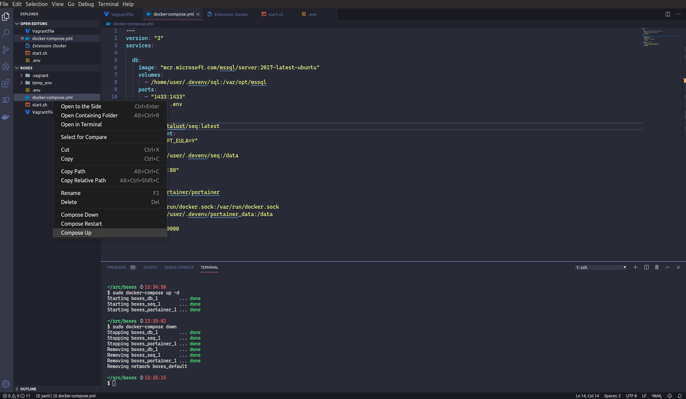
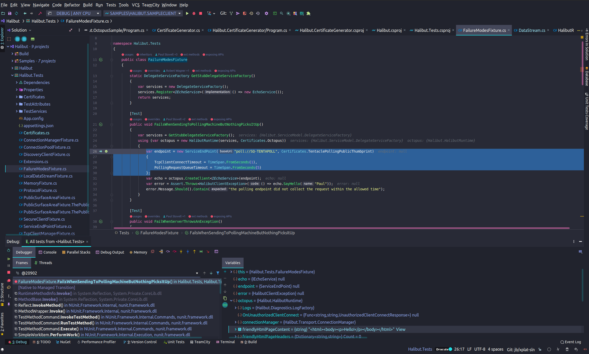
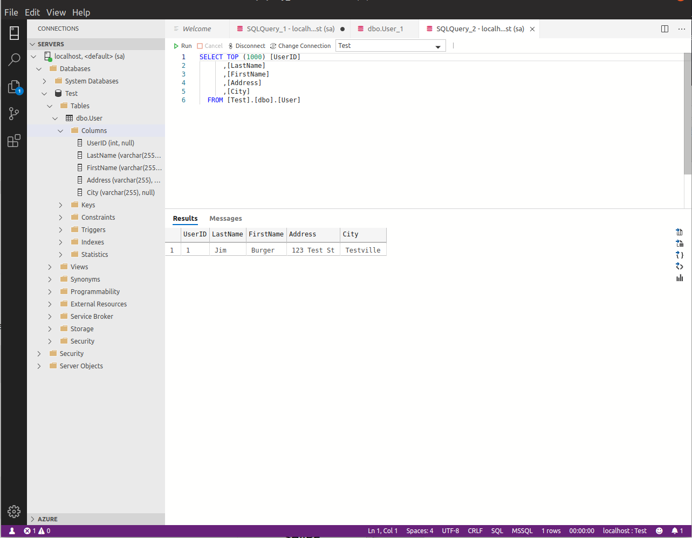

# Bootstrap a .NET Core development environment for Linux

One of the things I truly appreciate about working at Octopus Deploy, is that I'm encouraged to work in the way that I choose, that maximizes my happiness and my productivity.

Earlier this year I decided to make the switch to Linux for my day to day working environment - and I haven't regretted it. *nix operating systems have always been something that I preferred, but have never been able to settle on it at work for development.

Microsoft .NET now has great cross platform support and .NET developers have the ability to do much of their development on Linux distributions or macOS. How can we get started? 

I'll discuss some of the options for .NET developers on Linux and show you how I get my stack together with some scripts that I use regularly.

## Starting Database & Logging servers with containers

Much like my colleague [Bob Walker](https://octopus.com/blog/automate-sql-server-install-using-linux-docker#docker-compose), I personally like to use `docker-compose` to speed up the process of dealing with dependencies like my SQL & Logging servers. What do I like the most about it? The setup for a database and log server is only around 20 lines of YAML!

For example, this lets me quickly spin up a SQL server, a great logging tool called [Seq](https://datalust.co/seq).

```yaml
---
version: "3"
services:
  # this is my database, there are many others like it, but this one is mine
  db:
    image: "mcr.microsoft.com/mssql/server:2017-latest-ubuntu"
    volumes: # Mount volumes like this: host/dir:container/dir
      - /home/user/.devenv/sql:/var/opt/mssql
    ports:   # Expose ports like this: host_port:container_port
      - "1433:1433"
    env_file: .env  # more on this later ;)

  # seq is an easy to use log server - how simple is this?
  seq:
    image: datalust/seq:latest
    environment: # declare environment variabels inline
      - "ACCEPT_EULA=Y"
    volumes:
      - /home/user/.devenv/seq:/data
    ports:
      - "5341:80"
```

You might also notice that there are no database passwords or API keys in this file. That's because I can keep those sensitive things out of sight using an `.env` file. Environment files are something that `docker-compose` supports so that you can declare your environment variables all in the one place. 

.env files are key value pairs delimited by newlines:

```
SA_PASSWORD=ForYourEyesOnly007#
ACCEPT_EULA=true
MSSQL_PID=Developer
```

To bring up the environment use `docker-compose up`, but you can leave your shell available afterwards with `-d`.

```bash
docker-compose up -d
docker stats        # show how the containers are operating (CTRL+C to exit)
docker-compose down # stop the stack you've created
```
Microsoft has a rather nice [VS Code extension](https://github.com/microsoft/vscode-docker) to give you that right click menu feeling!



Personally, I tend to stay on the command line a lot, and I create temporary virtual environments from time to time, so I created a collection of [automation and init scripts here](https://github.com/jburger/devenv) to make this nice and easy to setup and manage. Here's a screen cast on how to use it.

[](https://asciinema.org/a/AUXSaRj6hfqQS1QQqflrITrX0)

## Linux friendly development tools

There are a tonne of options for development tooling, but here are the ones I like to use for .NET engineering at Octopus Deploy.

### IDEs

There are a few great IDE options out there for .NET developers now!

I personally love the `Jetbrains` [toolbox](https://www.jetbrains.com/toolbox-app/) for IDE and database tools. `Rider`, `Datagrip` and `Webstorm` are 'go to' tools for me on a daily basis. I also use `Clion` for learning about rust development in my spare time. One of the benefits I find is that they are each tailored to the style of development they represent, while maintaining a consistent keyboard shortcut scheme. 

If I do need to use windows I can install them there too, and not have to re-learn any keystrokes.



_Rider has a great visual debugger and many comparable features to visual studio_

I also love `VS Code` for tasks that don't need a debugger, like parsing logs, and writing blogs or documentation. 

#### No. Vim or bust.

Ok so, if you're in this camp, then you probably already know what you're doing! That said, I can confirm .NET productivity is possible (depending on the task) with a lofi toolbox. If you're interested in exploring this as an option, here are some tools to get you started.

- [ranger - a neat little file browser that works like vim](https://wiki.archlinux.org/index.php/Ranger)
- [vim (and whatever plugins make you a happy person)](https://wiki.archlinux.org/index.php/vim)
- [omnisharp for vim for](https://github.com/OmniSharp/omnisharp-vim)
- [if you don't like the built-in terminal for vim - can use tmux or similar](https://wiki.archlinux.org/index.php/tmux)
- dotnet watch build


### Source control
For simple things I still stick to the command line, `zsh`  has a sweet plugin for just about everything, git included. 

For dealing with complex trees [Gitkraken](https://www.gitkraken.com/) is a pretty slick option, it looks great, performs well and integrates with Github.

### Installing stuff from the command line
I know many windows developers who swear by things like boxcutter and chocolatey to install their favorite tools. You can do the same on Linux.

Most distributions come with their own package manager for installing tools, each with unique command interface. There is an (almost) 'cross-distribution' option though, and that is [snapd](https://snapcraft.io)

On Ubuntu and other distributions that support it, you can use `snapd` to try these tools out, and if you don't like them, they'll uninstall cleanly.

```bash
sudo snap install --classic code
sudo snap install gitkraken

# optional non-free IDE options
sudo snap install --classic rider
sudo snap install --classic datagrip
sudo snap install --classic webstorm
```

To remove things
```bash
sudo snap remove dont_want_this
```

Snap is pretty neat, it comes with some [interesting security features](https://snapcraft.io/docs/snap-confinement), is unique to the linux ecosystem, and you can [learn more about it here!](https://snapcraft.io/docs/getting-started)

## Database Management

Of course, MS SQL is not the only game in town on linux, far from it. However if you're like me and your 'hometown' is MSSQL, then you'll be happy to know there are some industrial strength options for working with it. 

I mentioned [Datagrip](https://www.jetbrains.com/datagrip/) and it is an awesome tool for working with a wide variety of databases, but I'm lucky in that Octopus pays the license for me.

An alternative from Microsoft for working with MS SQL is the `Azure Data Studio`, and you can [find that here](https://docs.microsoft.com/en-us/sql/azure-data-studio/download?view=sql-server-ver15#get-azure-data-studio-for-linux). It provides a nice and simple experience for those not wanting to outlay money on heavier tools.



# Vagrant boxes for isolated environments

Containers are great, but they [aren't quite as isolated](https://docs.microsoft.com/en-us/virtualization/windowscontainers/about/containers-vs-vm) as a virtual machine. For example, when I'm dealing with some un-trusted binaries during a security exercise I'll use a machine separate from my main development environment. I like to use [vagrant](https://www.vagrantup.com/) so that I manage temporary VM lifetimes, almost as easily as you can with docker.

Here is a boilerplate lightweight arch linux environment. Its got the bare basics, ready for tweaking and then destroying later.

* i3 window manager (_really_ basic)
* firefox
* sakura - lightweight terminal emulator
* git
* dotnet sdk
* dotnet runtime
* vim (swap this out for `code` if thats getting _too_ basic!)

Just adjust the provisioning block to your liking and run `vagrant up` to build it.

```ruby
Vagrant.configure("2") do |config|
  config.vm.box = "archlinux/archlinux" # from their official repository

  config.vm.provider "virtualbox" do |vb|
    # show console
    vb.gui = true
    # RAM
    vb.memory = 4096
    # CPU
    vb.cpus = 2
  end
  
  # Hook the provision event and run an inline shell script install your favourite tools here
  config.vm.provision "shell", inline: <<-SHELL
    echo "installing tools"
    pacman -Syu \
      xorg-xinit \
      i3 \
      firefox \
      sakura \
      git \
      vim \
      open-vm-tools \
      dotnet-runtime \
      dotnet-sdk \
      --noconfirm

     # this block automatically starts i3
     echo "if systemctl -q is-active graphical.target && [[ ! $DISPLAY && $XDG_VTNR -eq 1 ]]; then
            exec startx
          fi" >> /home/vagrant/.bash_profile
  SHELL
end
```
The vagrant CLI has all the tools you need to quickly automate various operations for your VM from scripts or the command line.

```bash
# change into a directory with a Vagrantfile
cd /my/box/
# bring it up
vagrant up
# push a new snapshot onto the stack
vagrant snapshot push
# Tweak a vagrant file and re-provision while a VM is running
vagrant provision
# easy login via ssh
vagrant ssh
# rollback to the previous snapshot
vagrant snapshot pop
# bring it down
vagrant down
# save a named snapshot 
vagrant snapshot save [vm_name] [snapshot-name]
# rollback to a named snapshot
vagrant snapshot restore [vm_name] [snapshot-name]
```

## A word on using non-official vagrant boxes

It is preferable to use official boxes if you can. While it is super convenient to use somebody elses box from the library, it also comes with an element of risk. What if they installed some crypto miner on it? 

If you're stuck because of this risk, for a bit of extra work you can author your own images. I highly recommend taking a look [this great post by Matt Hodgkins](https://hodgkins.io/best-practices-with-packer-and-windows#best-practices) on using Hashicorp `packer` well to build your own images that you can then use in vagrant, without going crazy.

## Wrapping up

Thanks for reading, I hope that if you are interested in making Linux your home OS, or even automating your windows environment with `docker` and `vagrant`, that this post helped in some way to get you started. Let us know in the comments how you go!


