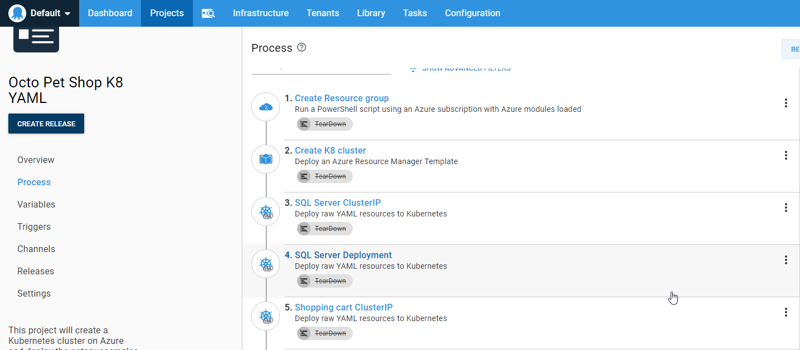
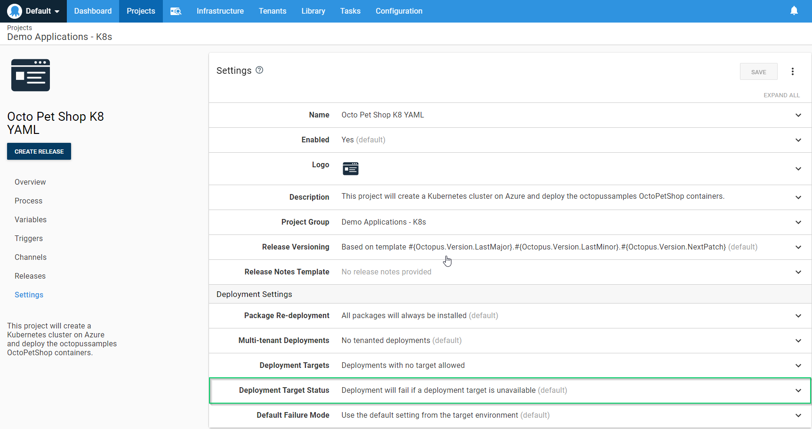
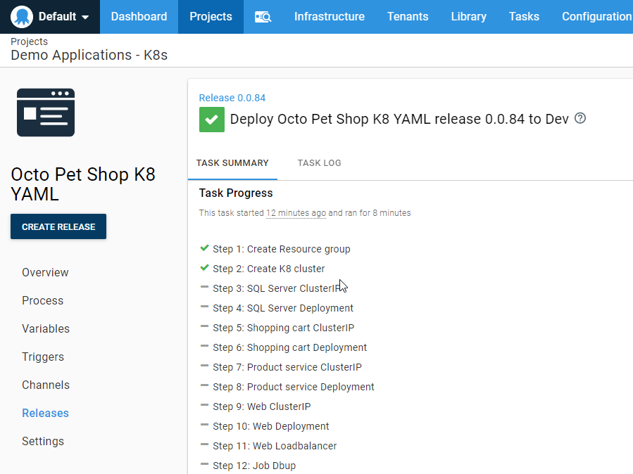
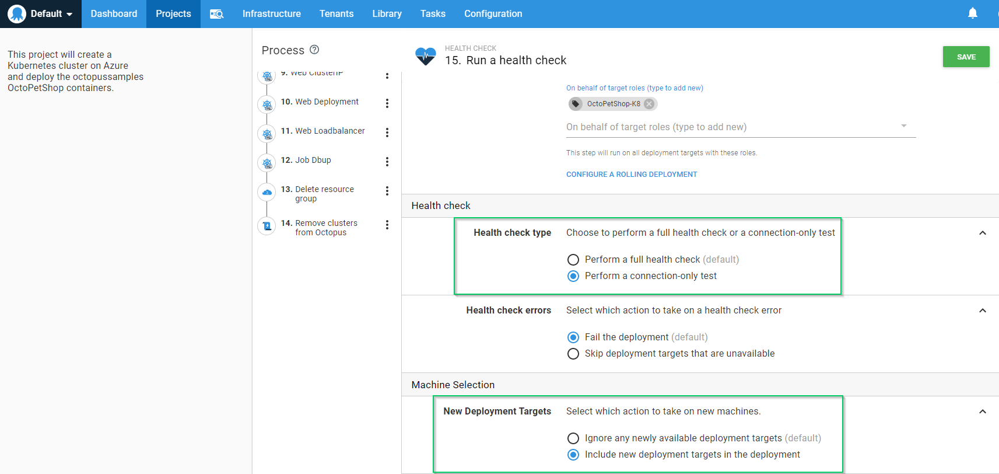
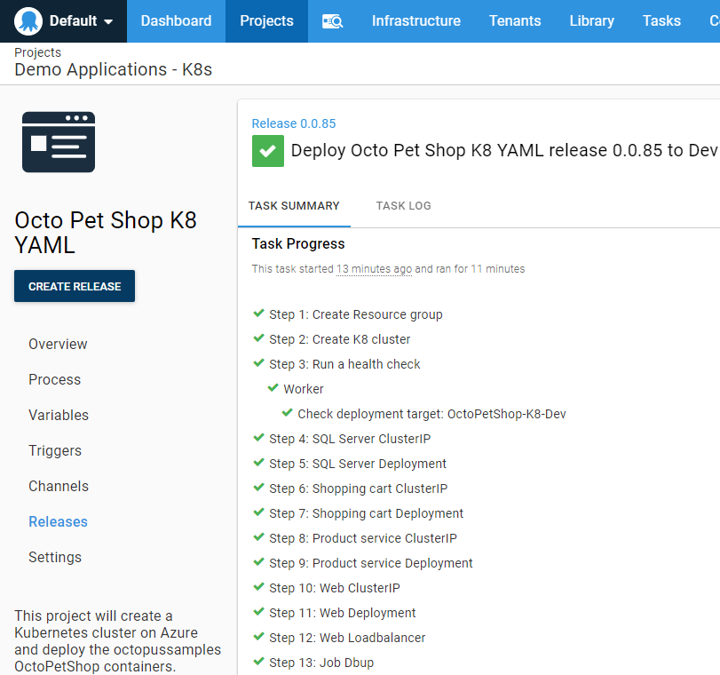

Using project triggers, it’s possible to have your application deployed to dynamically created deployment targets.  This works especially well when you have an application that is configured with scaling capabilities.  As more servers are added to handle the load, your application is automatically deployed.  That being said, there are situations where the creation of your deployment target is part of your deployment process, and this can get a bit tricky as Octopus Deploy chooses the targets to deploy to when the deployment starts.  In this post, I show you how to include a dynamically added target as part of the deployment process.

## Example scenario

Let’s say we have an application that uses Kubernetes on Azure. We use an Azure Resource Manager (ARM) template to create our Kubernetes cluster, and then deploy our application to it.  Once the cluster is no longer needed, we tear it down to conserve cost.  This approach is useful when the type of cloud resource we need is expensive, and we only want it for a limited time. Our process looks something like this:

We dynamically create a resource group, a Kubernetes cluster, then start deploying to it.

We then update the project settings to allow deployments to be created, even when targets do not exist:

Now we schedule our deployment and watch it go!

## Why are steps being skipped?

The result of your deployment will look like all of your steps for deploying to the Kubernetes cluster were skipped, despite successfully creating the Kubernetes cluster and registering it with Octopus Deploy. Deployment targets are chosen at the beginning of a deployment, and since the cluster hadn’t been registered to Octopus Deploy yet, Octopus determined there were no available targets to deploy to, and so all deployment steps were skipped.

## Including new targets

Adding a Health Check step to your process and configuring it to include new targets gets around this issue.

When configuring the Health Check, choose `connection-only test` for the Health Check Type and `Include new deployment targets` in the New Deployment Targets section.

After you have done this, the newly provisioned Kubernetes cluster will be included in the deployment, and the rest of our steps will deploy successfully!

## Summary

While not a common scenario, this post demonstrated how you can include targets that were created during the deployment process in your deployment.
