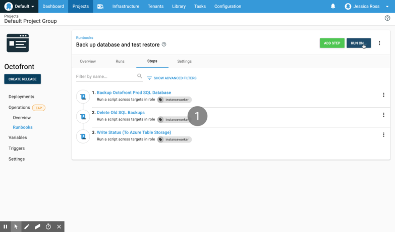

Deployments are only one stage in the life of an application. There are many other common tasks that need to be performed to keep applications operating smoothly. A big part of DevOps is development and operations teams working together, and Octopus seems like the perfect tool to use, given it already knows about your infrastructure, accounts, and project configuration.

If we take the Octopus Deploy website, Octopus.com, as an example, we use Octopus to deploy our website and manage our infrastructure, variables, certificate, and accounts. But we also have some routine and emergency tasks we do as part of *operating* the website. For instance, backing up the database, restoring it, testing the restore, removing PII from the database, and restoring the sanitized database to a test environment as well as failing over to a disaster recovery site.

Currently, these tasks are in one project’s deployment process, or they’re executed as separate scripts. Performing all these steps for a deployment doesn’t make sense, and doing a deployment just to backup a database doesn’t make sense either.

Operations Runbooks allows us to simplify the deployment process and enable the operational tasks to be run at different intervals to the deployment. Our list of runbooks is:

1. Failover to the disaster recovery site.
2. Switch back to the primary production site.
3. Back up the database (and test the restore worked).
4. Refresh the test database with (sanitized) production data.

With runbooks, the overview and task lists show us the exact operations and their runs performed separately, giving us a true picture of the state of our website.

## Operations Runbooks in Octopus Deploy

Operations Runbooks can be accessed from within a project. This means you can keep everything related to running an application together. If you have operational tasks that apply to your infrastructure only and are not necessarily related to an application, like cleaning up files on machines, we suggest you create a separate project for these types of operations.

In the project menu, everything related to deployments is under a new **Deployments** menu-item. Runbooks are under the **Operations** menu, and you can expect to see this section grow as we add new operations in the future. Resources that can be shared between deployments and operations are outside of these areas.

## Creating and running a runbook

Adding a runbook can be done from the {{Operations>Runbooks}} section, and adding steps to a Runbook works the same as adding steps to a deployment process.

If you have operational steps within a deployment process, these can be cloned into a Runbook.

When runbooks run, a snapshot is created at the time of the run, making it quicker to perform operations. We didn’t design runbooks to rely on lifecycles, so you can run a runbook on any environment as long as you have the permission.

## Cloning steps

If you have steps in your deployment process that are more suited to a Runbook, you can clone the step to your Runbook.

## New permissions

You can enable or restrict users from running runbooks with the new permissions `RunbookView` and `RunbookEdit` (for creating, editing, and deleting). Runbooks re-uses the existing `ProcessEdit`, `Deployment`, and `Release` permissions for runs and snapshots.

## Operations Runbooks early access

We’ve shipped runbooks as an early access feature in [Octopus 2019.10](/blog/2019-10/octopus-release-2019.10/index.md), and we encourage you to try runbooks for any processes that aren’t application specific.

Our goal with the early access program is to get feedback and validate its design. There are some limitations with Variables, Triggers, and other areas within the EAP, but the [runbooks documentation](https://octopus.com/docs/deployment-process/operations-runbooks#current-limitations) provides all the details you need to get started as well as the current limitations.

We’d love feedback, so join the discussion on our [community slack](https://octopus.com/slack) in the `#runbooks` channel. You can also register for updates on our [public roadmap](https://octopus.com/company/roadmap) page.

## Conclusion

We’re excited to share this first release of Operations Runbooks and to see how teams use it in their projects.
