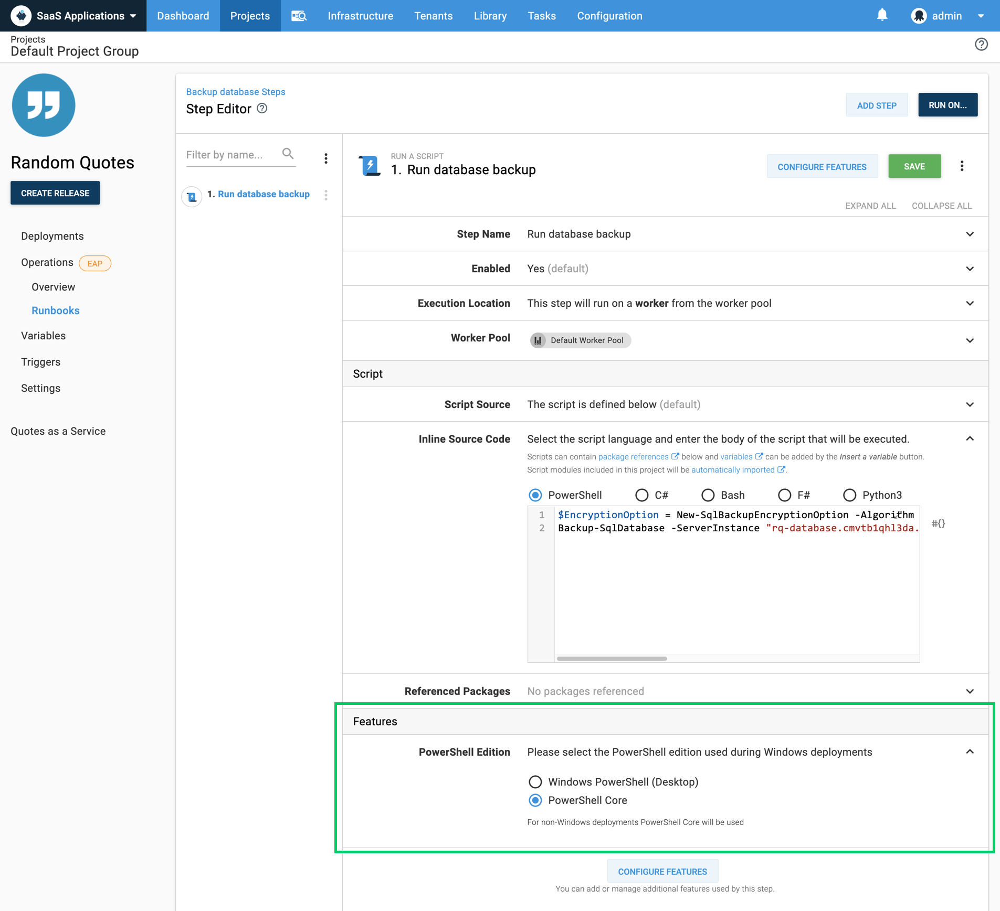
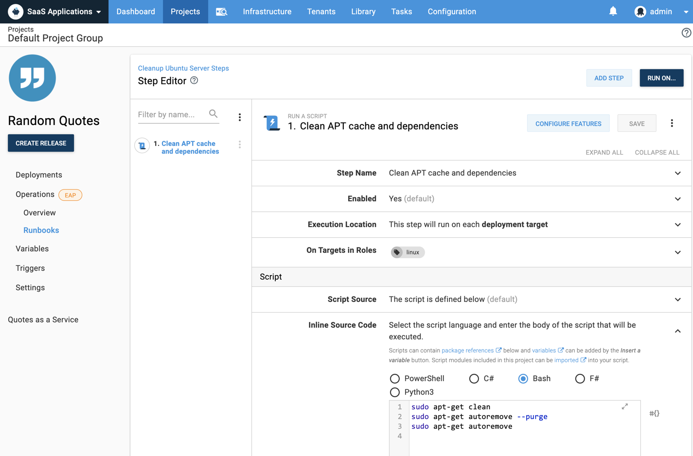

We’re excited to launch **Octopus Deploy 2019.10** as this is a feature packed release with some great benefits. Our headline feature is Tentacle for Linux which provides greater flexibility for teams deploying to Linux and unlocks the ability to deploy to highly secured servers without opening port 22. Tentacle for Linux and Linux deployments over SSH combined with Bash, PowerShell Core, Python scripting, and a first-class step to deploy your web apps and services to NGINX, make Octopus a great option for Linux deployments. 

This release also includes:

* Built-in support for PowerShell Core.
* Improved build information and work item tracking.
* Simpler package-based step templates.
* Early access to our Operations Runbooks feature-set.

<h2>In this post</h2>

!toc

## Tentacle for Linux

Octopus first introduced support for Linux deployments over secure shell (SSH) in version 3.0 and it’s a popular option for deployments. However, some companies operate in highly secure environments where it’s not possible to open port 22 on production servers, for instance, when web applications operate in their own DMZs with no incoming connections permitted other than HTTPS for web traffic. 

Thankfully, this scenario is now possible with Tentacle for Linux. Our Tentacle agent is a lightweight service that enables secure communication between the Octopus Server and deployment targets in both listening and polling modes. In polling mode, the targets themselves phone home and contact the Octopus Server to see if there is any deployment work to do and if there is, they execute it. 

Tentacle for Linux provides greater flexibility for teams deploying to Linux in highly secured environments.

## PowerShell Core support

This release adds built-in PowerShell Core support enabling teams to write cross-platform scripts using Microsoft’s actively maintained automation framework. Our PowerShell Core support **just works**, and it pairs very well with our expanded support for Linux deloyments. Many development and operations teams are comfortable writing PowerShell scripts, and PowerShell Core enables people with PowerShell skills to write rich scripts for Linux platforms.

**Windows platforms**

Octopus will use Windows PowerShell by default and provides the option to use PowerShell Core if desired. You can customize this by configuring the PowerShell edition for steps that support custom scripts.

**Linux platforms**

Octopus will automatically execute scripts with PowerShell Core if it’s installed. 

[Learn More](http://octopus.com/docs/deployment-examples/custom-scripts/powershell-core)

## Improved build information and work item tracking

**Octopus 2019.4** introduced build information and work item tracking. This is a popular feature, but we received feedback from teams that the package metadata functionality, which underpins the build information links, were hard to find because they were buried under package details in the Octopus Library and tricky to understand. We’ve listened to this feedback and we promoted this functionality to a top-level feature called **Build Information** to the Octopus Library making it more accessible and much easier to understand. We’ve also updated our suite of build server plugins to reflect the name change.

This feature-set enable teams to get better end-to-end visibility into their CI/CD pipelines and unlocks quick access to build and commit details. This is visible in a number of ways:

- Release notes
- Deployment changes

We shipped support to customize your release notes templates in your project settings. In this release, we’re introducing deployment change templates so you can get the same control over the structure of your deployment changes. This gives teams with specific needs the ability to customize the display to suit their needs. 

[Learn more](https://octopus.com/docs/packaging-applications/build-servers#build-information)

## Simpler package-based step templates

Step templates are a popular way for teams to create reusable steps for use across multiple projects. We’ve made a small but significant update to make it easier to share package-based step templates across projects with the introduction of Package Parameters. Previously, you needed to create parameters to expose package-based properties. With Package Parameters, this is no longer needed as we now automatically show our package selector when the step template is added to a project. This makes it easier to create package-based step templates and lets teams bind against these parameters in a much simpler way.

[Learn more](https://octopus.com/docs/deployment-process/steps/custom-step-templates)

## Introducing Runbooks for Operations teams

This release also includes early access to our new Operations Runbooks feature. Until now Octopus has been a deployment automation tool, enabling teams to deploy new releases of their software, but once the software is deployed, there are many other processes that teams need to automate. These can include file cleanup, nightly backups, data masking, and restore to test environments, disaster recovery, and any other scripts and manual processes. 

**With Runbooks, teams can use Octopus to automate everything involved in keeping modern software running in production.**

We’d love feedback on this feature so join the discussion on our [community slack](https://octopus.com/slack) in the `#runbooks` channel. Our docs cover all the details on how to get started.

[Learn more](/blog/2019-10/operations-runbooks/index.md)

## Breaking Changes

This release includes two minor breaking changes. 

**PowerShell Core**

PowerShell Core support introduced a change where running PowerShell scripts against non-Windows targets would silently ignore the .ps1 files. This includes `Deploy.ps1` files used when deploying packages. 

After this change, Octopus will attempt to execute those .ps1 files on those targets. If PowerShell Core is installed on those targets, this may change the behaviour of your deployments. If PowerShell Core is not installed on those targets, the deployment will fail.

**Build Information** 

This change involved renaming resources from the API through to the database. This is generally backwards compatible, however anyone using our GitHub issue tracker will need to make sure they upgrade their Octopus Server if they upgrade their [Azure DevOps extension](https://marketplace.visualstudio.com/items?itemName=octopusdeploy.octopus-deploy-build-release-tasks), [TeamCity plugin](https://plugins.jetbrains.com/plugin/9038-octopus-deploy-integration) or [Bamboo plugin](https://marketplace.atlassian.com/apps/1217235/octopus-deploy-bamboo-add-on).

## Upgrading

As usual [steps for upgrading Octopus Deploy](https://octopus.com/docs/administration/upgrading) apply. Please see the [release notes](https://octopus.com/downloads/compare?to=2018.9.0) for further information. Self-Hosted Octopus customers can [download](https://octopus.com/downloads/2018.10.0) the latest release now. For Octopus Cloud, you will start receiving the latest bits next week during your maintenance window. 

## Wrap up

That’s it for this release. Feel free to leave us a comment, and let us know what you think! Happy deployments!