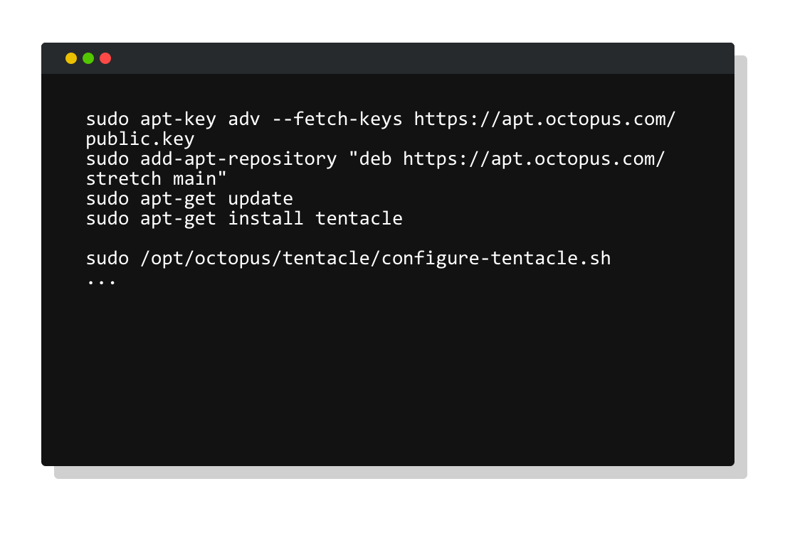
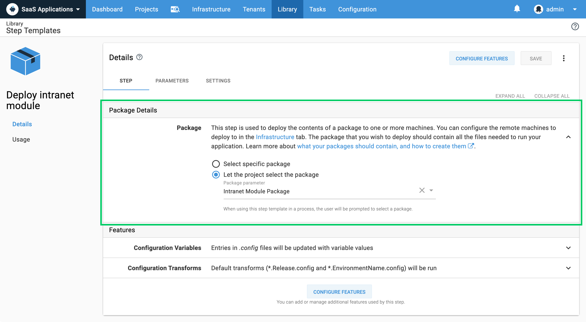

We're excited to launch Octopus Deploy 2019.10 as this a feature packed release with some great benefits. Our headline feature is Tentacle for Linux which provides greater flexibility for teams deploying to Linux and unlocks the ability to deploy to highly secured servers without the need to open port 22. Tentacle for Linux and Linux deployments over SSH combined with Bash, PowerShell Core and Python scripting, and a first-class step to deploy your web apps and services to NGINX make Octopus a great option for Linux deployments. 

This release also includes:
* Built-in support for PowerShell Core.
* Improved build information and work item tracking.
* Simpler package-based step templates.
* Early access to our Operations Runbooks featureset.

<h2>In this post</h2>

!toc

## Tentacle for Linux

Octopus first introduced support for Linux deployments over secure shell (SSH) in version 3.0 and it's a popular option for teams. However, some companies operate in highly secure environments where it's not possible to open port 22 on production servers. An example of this is where web applications operate  in their own DMZs with no incoming connections permitted other than HTTPS for web traffic. 

Thankfully, this scenario is now possible with Tentacle for Linux. Our Tentacle agent is a lightweight service that enables secure communication between the Octopus Server and deployment targets in listening and polling modes. In polling mode, the targets themselves phone home and contact the Octopus Server to see if there is any deployment work to do and if there is, they execute it. 

Tentacle for Linux provides greater flexibility for teams deploying to Linux in highly secured environments.

## PowerShell Core support

This release adds built-in PowerShell Core support enabling teams to write cross-platform scripts using Microsoft's actively maintained automation framework. Our PowerShell Core support 'just works' and it pairs very well with our expanded support for Linux deloyments. Many development and operations teams are comfortable writing PowerShell scripts and PowerShell Core enables people with PowerShell skills to leverage those skills to write rich scripts for Linux platforms.

**Windows platforms**

Octopus will use PowerShell Core if it's available otherwise, it will use PowerShell (full framework) as this is bundled with all supported Windows Servers. 

NOTE: Octopus allows you to specify which framework you wish to use as well. 

**Linux platforms**

Octopus will automatically execute scripts with PowerShell Core if it's installed. 

[Learn More](http://octopus.com/docs/deployment-examples/custom-scripts/powershell-core)

## Improved build information and work item tracking

TODO: Screenshot

Octopus 2019.4 introduced build information and work item tracking. This is a popular feature but we've received feedback from teams that the package metadata functionality that underpins the build information linkages were hard to find. buried under package details in the Octopus Library and tricky to understand. We've listened to this feedback and we promoted this functinoality to a top-level feature called 'Build Information' within the Octopus Library making it more accessible and much easier to understand. We've also updated our suite of build server plugins to reflect the name change.

This feature-set enable teams to get better end-to-end visibility into their CI/CD pipelines and unlocks quick access to build and commit details. This is visible in a number of ways:

- Release notes
- Deployment changes

TODO: Screenshot

We shipped support to customise your release notes templates in your project settings. In this release, we're introducing deployment change templates so you can get the same control over the structure of your deployment changes. This provides teams with specific needs the ability to customise the display to suit their needs. 

[Learn more](https://octopus.com/docs/packaging-applications/build-servers#build-information)

## Simpler package-based step templates

Step templates are a popular way for teams to create reusable steps for use across multiple projects. We've made a small but significant update to make it easier to share package-based step templates across projects with the introduction of Package Parameters. Previously, you needed to create parameters to expose package-based properties. With Package Parameters, this is no longer needed as we now automatically show our package selector when the step template is added to a project. This makes it easier to create package-based step templates and allows teams to bind against these parameters in a much simple*r* way.

[Learn more](https://octopus.com/docs/deployment-process/steps/custom-step-templates)

## Introducing Runbooks for Operations teams

TODO: Screenshot w/ EAP Stamp

This release also includes early access to our new Operations Runbooks feature. Octopus until now has been a deployment automation tool, giving teams a big green button to deploy new releases of their software. But once the software is deployed, there are many different processes that teams need to automate. These can include file cleanup, nightly backups, data masking and restore to test environments, disaster recovery, and any other scripts and manual processes. 

**With Runbooks, teams can use Octopus to automate everything involved in keeping modern software running in production.**

Our goal with our early access to Operations Runbooks is to get feedback and validate its design. 

**We'd love feedback so join the discussion on our [community slack](https://octopus.com/slack) in the `#runbooks` channel.**

Our docs cover all the details on how to get started. We

[Learn more](Add link to docs/)

## Breaking Changes

This release includes a major bump of Azure PowerShell  modules to `6.8.1` to fix a [known issue](https://github.com/OctopusDeploy/Issues/issues/4574) with the previous `5.7.0` bundled version. Please see [Azure PowerShell release notes](https://docs.microsoft.com/en-us/powershell/azure/release-notes-azureps?view=azurermps-6.11.0) for more information.

## Upgrading

As usual [steps for upgrading Octopus Deploy](https://octopus.com/docs/administration/upgrading) apply. Please see the [release notes](https://octopus.com/downloads/compare?to=2018.9.0) for further information. Self-Hosted Octopus customers can [download](https://octopus.com/downloads/2018.9.0) the latest release now. For Octopus Cloud, you will start receiving the latest bits next week during their maintenance window.

## Wrap up

That's it for this release. Feel free to leave us a comment and let us know what you think! Happy deployments!