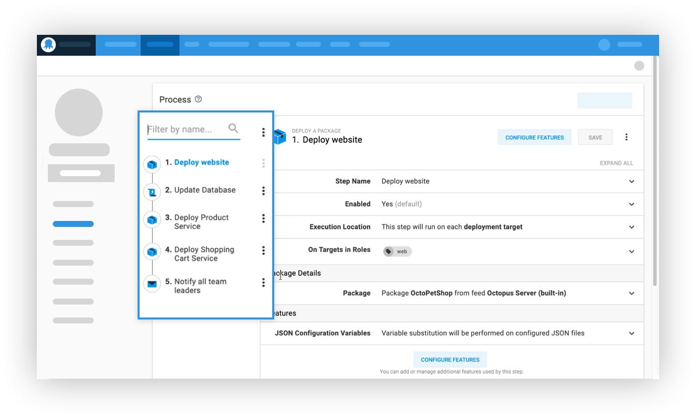
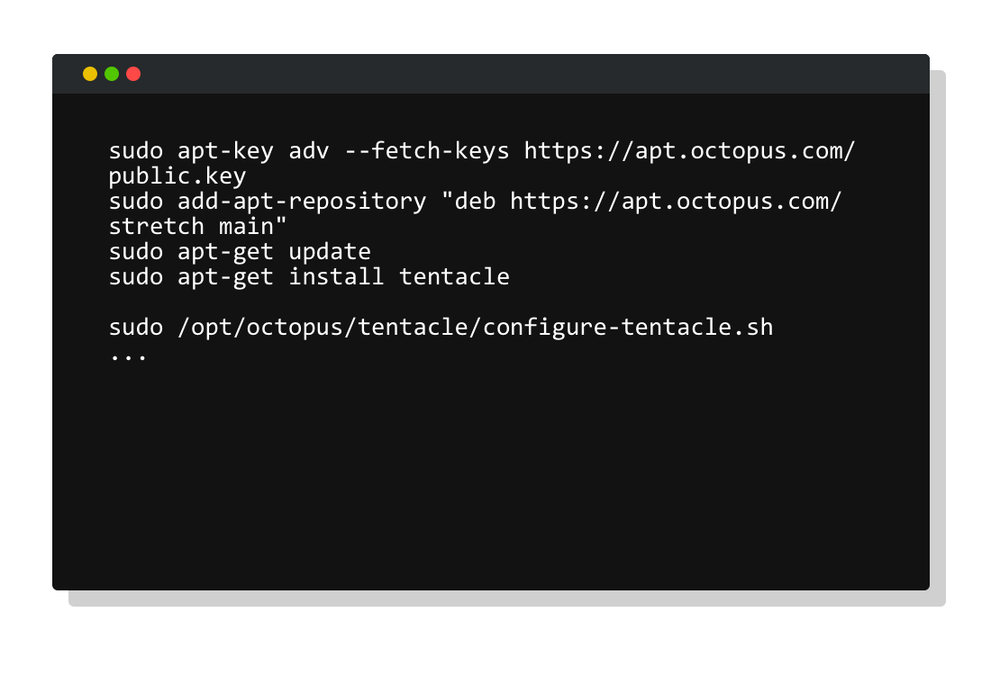

<h2>Octopus Deploy 2019.9 LTS</h2>

Octopus Deploy `2019.9 LTS` is now available for teams running Octopus Deploy self-hosted, and we recommend this release for our these customers. Our [long-term support (LTS) program](https://octopus.com/docs/administration/upgrading/long-term-support) includes releases with six months of support, including critical bug fixes and security patches. They do not include new features, minor enhancements, or minor bug fixes; these are rolled up into the next LTS release.

<a href="https://octopus.com/downloads" class="btn btn-primary btn-lg">Download now</a>

This is our third release with six months of long term support, and the following table shows our current LTS releases.

| Release               | Long term support           |
| --------------------- | --------------------------- |
| Octopus 2019.9        | Yes                         |
| Octopus 2019.6        | Yes                         |
| Octopus 2019.3        | Expired                     |

Keep reading to learn about what's in this release and any breaking changes.

<h2>In this post </h2>

!toc

## Streamlined deployment process editor

We've improved our deployment process editor to streamline the editing process with better visibility and fewer clicks. You can now see the entire deployment process, which is useful when referencing other step names in scripts and variables. This should also make navigating between steps faster with fewer clicks, and less scrolling.

[Learn more](https://github.com/OctopusDeploy/Issues/issues/5804)

## Tentacle for Linux

This release includes our native Tentacle agent for Linux. This update enables teams to deploy to their servers in secure environments where it's not possible to open port 22 in production environments. Tentacle is a lightweight service that enables secure communication between the Octopus Server and deployment targets in a listening and polling modes. In polling mode, it contacts the Octopus Server and executes deployment work as required including retrieving application packages and deployment scripts.

Tentacle for Linux provides greater flexibility for teams deploying to Linux in highly secured environments.

[Learn more](https://octopus.com/docs/infrastructure/deployment-targets/linux/tentacle)

## Tenant Cloning

It's now possible to clone Tenants. It can be time consuming to create new tenants and configure all of their settings. This is now far simpler as you can simply clone a Tenant instead of manually creating a tenant, linking it to the appropriate projects and environments, adding tags and entering in numerous variable values. 

[Learn more](https://octopus.com/docs/infrastructure/deployment-targets/linux/tentacle)

## Other improvements

* Added **More health check scheduling options**: Health checks can be configured to run on a cron expression, or to never run
* Added support to **override namespace in Kubernetes steps**
* **New Variable Filter expressions**: Trim, Substring, Truncate, UriEscape, UriDataEscape
* **Copy and paste to add certificates**: Certificates can now be pasted as text directly into the portal

## Breaking changes

This release includes a single breaking change as [Octopus Server no longer supports for Windows Server 2008 SP2](https://octopus.com/blog/windows-server-2008-eol-hello-linux). 

## Wrapping up

Octopus Server 2019.9 is now available and you can depend on it. Happy long-term deployments!
