It took several iterations to implement the ideal automated database deployment process using TeamCity, Redgate, and Octopus Deploy.  The iterations were a result of learning the tooling and listening to feedback.  In this article, I walk you through a couple of those iterations of the automated database deployment process.

This article is the final in a series.  Here are the links to the other articles, in case you missed them.  

- [How to design an automated database deployment process](/blog/2019-11/designing-db-deployment-process/index.md).
- [Automated database deployment process: case study](/blog/2019-11/use-case-for-designing-db-deployment-process/index.md).

All of our database deployment articles can be found [here.](https://octopus.com/database-deployments)

!toc

## General overview

All this work was done at a company I previously worked for.  That company had four environments.

- Development
- Test
- Staging
- Production

Developers, database developers, and lead developers all had sysadmin rights for `development` and `test`.  They had read-only rights for `staging` and `production`.  Only the DBAs had sysadmin rights to all environments.

Prior to automated database deployments, a our process was:

1. A developer makes a change in `test`.  All developers have sysadmin rights in `test`.  They should make the change in `development` but `test` has all the data to verify the change with.  That is the server their code is pointed to.
2. The developer changes the connection in SSMS and makes a change to `development`.  All developers have sysadmin rights in `development`.
3. The database developer or lead developer runs [Redgate SQL Compare](https://www.red-gate.com/products/sql-development/sql-compare/) to generate a delta script between `test` and `staging`.  Any complex database changes (move columns, combine columns, etc.) are removed and manually scripted.  Scripts are saved to a shared folder.  Everyone except DBAs have read-only rights for `staging`.  The DBAs have to run the scripts.
4. DBAs are notified via email to run scripts in the shared folder on `staging`.  They run the scripts and send the output to the requester.
5. Multiple changes can be pushed to `staging` prior to going to `production`.  Because of that, a new Redgate SQL Compare delta script between `staging` and `production` is generated by the database developer or lead developer.  Just like before, any complex database changes (move columns, combine columns, etc.) are removed and manually scripted.  Scripts are saved to a shared folder.  Everyone except DBAs have read-only rights for `production`.
6. DBAs are notified via a change request to run a set of scripts in `production`.  They run the scripts, save the results to the change request system, which emails the requester.

There were several flaws in this process.
- Multiple deployment processes, how changes were deployed to `development` and `test` was different to `staging` and `production`.
- Manual generation of scripts.
- Manually running each script in each environment.
- Unique delta scripts per environment.
- Unique delta scripts meant it was difficult or nearly impossible to test.
- No mention of keeping track of changes and what needed to be deployed.
- Shared development environment.
- Reviews didn’t happen until it was time to go to `staging`.
- As a result, “All hands on deck” during `production` deployments.

At this point, the tooling we used was:
- [Git](https://git-scm.com/) was being piloted as a replacement for TFS Version Control.
- [TeamCity](https://www.jetbrains.com/teamcity/) was being piloted as a replacement to TFS 2012.
- No deployment server.
- No database deployment tools (this is where [Redgate’s tooling](https://www.red-gate.com/products/sql-development/sql-toolbelt/) came in).

## Automated database deployments v1

When you have a hammer, everything looks like a nail.  As detailed in my [previous article](/blog/2019-11/use-case-for-designing-db-deployment-process/index.md), I first set about automating within the existing process.  That above process, or some form of it, was all I knew up until that point.

My focus was:
- Force everyone to make changes in `development` and automatically deploy to `test`.
- Automatically generating the delta script for `staging` and `production`.

Ideally we would automatically deploy to `staging` and `production`.  That would require the build server, in this case TeamCity, run an agent with permissions in those environments.  The DBAs made made it very clear, TeamCity would not have permission to deploy to `staging` or `production`.

I already had TeamCity building the code.  I needed to inject the database into that existing build process.  Redgate provides a plug-in for TeamCity.  Looking at the documentation for [Redgate’s TeamCity Plug-in](https://documentation.red-gate.com/display/SCA3/Use+the+TeamCity+plugin+with+a+SQL+Change+Automation+Project) shows it supports three functions:

- Build a package.
- Sync that package with a database.
- Test that package.

For the build a package process to work, the database has to be placed into source control using [Redgate’s SQL Source Control](https://documentation.red-gate.com/soc).  Prior to putting the database into source control I should have resolved the deltas between each environment.  Different users and role membership are expected.  Missing tables, different stored procedures, and other schema changes, not so much.

The deltas need to be resolved one of three ways:
- If the change was simply missed, go ahead and apply it.
- If the change is intentional and should never be included in source control (backup table or testing table), you can [leverage filters](https://www.codeaperture.io/2016/10/14/using-sql-source-control-to-filter-out-unwanted-items/) to exclude those items.
- If the difference is environmental, such as users and role membership, you will need to look at [the documentation](https://documentation.red-gate.com/sc13/using-the-command-line/options-used-in-the-command-line#Optionsusedinthecommandline-IgnorePermissions) to see which switches you need to include.  

The final piece of the puzzle is auto generating the delta script.  Thankfully, Redgate has a [CLI version](https://documentation.red-gate.com/sc14/using-the-command-line) of their schema compare tool.  

Knowing that, my plan of attack was:

0. Resolve all the deltas.
1. Put what is in `development` into source control.  Going forward, all changes must be made in `development` and checked into source control.
2. Have TeamCity build the package from source control.
3. Have TeamCity sync that package with `development`.
4. Have TeamCity sync that package with `test`.
5. Have TeamCity run the schema compare CLI to generate delta scripts for `staging` and `production`.

Steps 1 and 3 conflict with each other.  So let’s skip that step.

0. Resolve all the deltas.
1. Put what is in `development` into source control.  Going forward, all changes must be made in `development` and checked into source control.
2. Have TeamCity build the package from source control.
3. ~~Have TeamCity sync that package with `development`.~~
4. Have TeamCity sync that package with `test`.
5. Have TeamCity run the schema compare CLI to generate delta scripts for `staging` and `production`.

I’m not going to walk through how to put a database into source control.  I wrote [that article already](https://www.red-gate.com/hub/product-learning/sql-source-control/database-version-control-2).

I ended up with four TeamCity projects.

The `00_Build` project takes what is in source control and packages it.  

I am making use of TeamCity’s [snapshot dependencies](https://www.jetbrains.com/help/TeamCity/snapshot-dependencies.html) and artifact dependencies.  To leverage that, I need to mark the package created as an artifact.

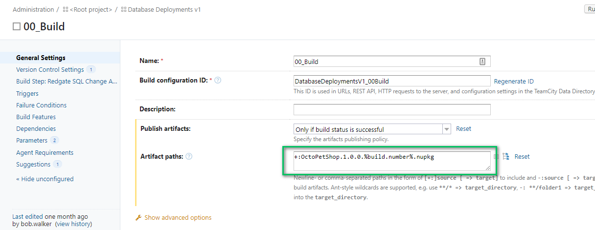

`10_Dev` and `20_Test` follow the same process.  First, I needed to configure the dependencies on the build.  The dependencies include the snapshot dependencies and artifact dependencies.

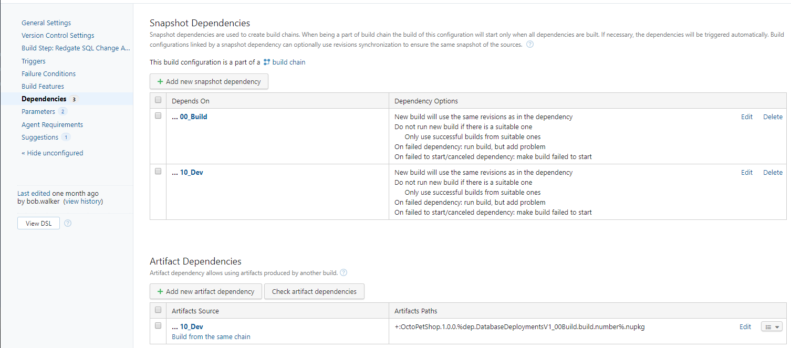

Now that I have the package and the dependency configured, I can add the step to sync the `test` database with the package.  Please note, to deploy the latest package, I am overriding the build number using the value from the `00_Build` project.  

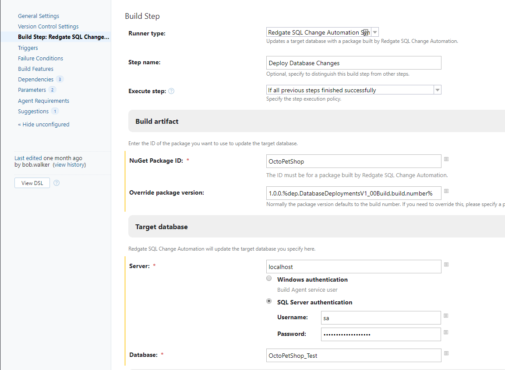

The `30_Staging` build is very different.  First, I configure the dependencies just like before.

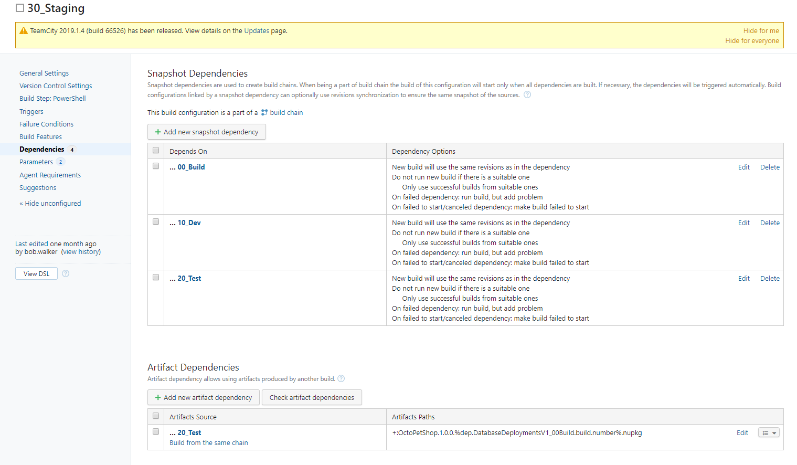

Instead of running the sync step, it runs a PowerShell script to generate the delta scripts for staging and production.

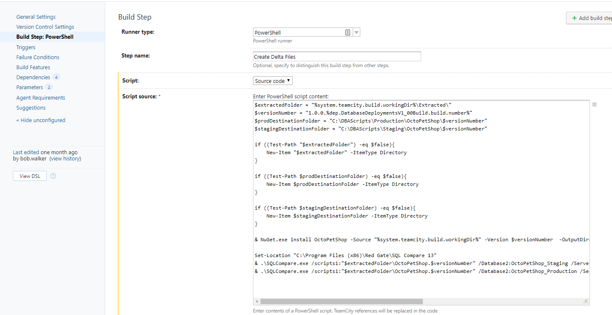

## Flaws with automated database deployments v1

Let’s revisit the flaws with the existing process and see how we are doing after this effort.

There were several flaws in this process.
- Two different processes, one for `development` and `test`, and another with slight differences for `staging` and `production`. This is still happening.
- Manual generation of scripts. **Solved.**
- Manual running of each script in each environment. This is solved for `test` only.
- Unique delta scripts per environment. This is still happening
- Unique delta scripts meant it was difficult or nearly impossible to test. This is still happening
- No mention of keeping track of changes and what needed to be deployed. **Solved.**
- Shared development environment. This is still happening
- Reviews didn’t happen until it was time to go to `staging`. This is still happening
- As a result, “All hands on deck” during `production` deployments. This is less of a problem, but is still happening

Also, I introduced a couple of new problems.

- Hours or days between when a script is generated by `30_Staging` and when it was run in `staging` or `production`.
- Hard to know what version is going to be used to generate the delta scripts when `30_Staging` ran.
- The latest changes only, you can’t pick an older version.

## New process

In my previous article, I discussed how Redgate helped a work group at the company I was working for.  Let’s review the process we came up with.

1. A developer/database developer/lead developer creates a branch.
2. All database changes and code changes are made on that branch.
3. Changes are completed and checked into the branch.
4. A merge request is created, which kicks off a build. The build verifies the changes are valid SQL.
5. The database developer or lead developer reviews database changes in the merge request and provides feedback for fixes.
6. The branch is approved and merged.
7. The build server kicks off a build, verifies the changes are valid SQL, and if they are, packages them and pushes to the deployment server. The build server tells the deployment server to deploy to `development`.
8. The deployment server deploys to `development`.
9. A developer/database developer/lead developer tells the deployment server to deploy to `test`.
10. The deployment server deploys to `test`.
11. Changes are verified in `test`.
12. A developer/database developer/lead developer tells the deployment server to deploy to `staging`. The deployment server uses database tooling to generate the review script.
13. The deployment server notifies the DBA of the deployment request to `staging`.  They review the changes and provide feedback for fixes.
14. DBAs approve changes to `staging`.
15. The deployment server finishes deployment to `staging`.
16. Changes are verified in `staging`.  
17. A change request is submitted to the DBAs to promote a specific package in the deployment server to `production`.
18. After hours, DBAs tell the deployment server to deploy to `production`.  The deployment server uses database tooling to generate the review script.
19. DBAs review the script as a final sanity check.
20. The deployment server finishes deployment to `production`.

The next iteration of the automated database deployment process would implement that.

## Automated database deployments v2

Octopus Deploy was added to v2 of automated database deployments.  This was the deployment server we didn’t know we needed.  Having a deployment server enabled us to:

- Simplify TeamCity, it only had to build and push a package to Octopus Deploy.
- Use the same process and tooling in all environments.
- Have an audit history of when a database change went out.  Not only that, it provides the ability to know who deployed the change.

TeamCity was simplified to two projects.

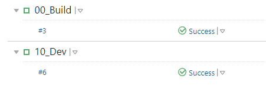

`00_Build` would build the package just like before.  `10_Dev` pushes that package and triggers a deployment in Octopus Deploy to `development`.  [Our documentation](https://octopus.com/docs/packaging-applications/build-servers/TeamCity#teamcity-CreateAndPushPackageToOctopusCreatingandpushingpackagesfromTeamCitytoOctopus) does an excellent job of showing you how to do that.

After a bit of trial and error, the deployment process in Octopus Deploy became this:

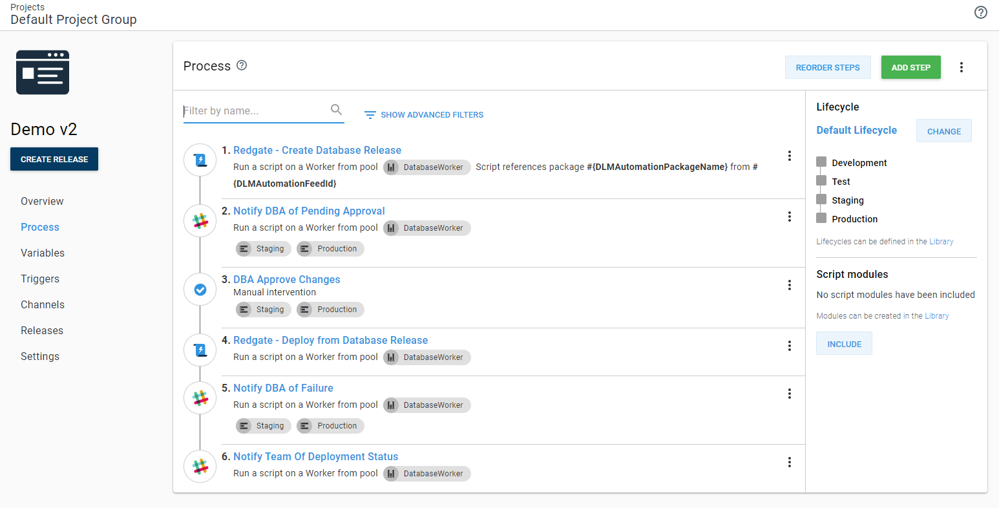

The trial and error was around steps 1 and 4 in that process.  At first, I ran the same CLI script from TeamCity to generate the delta script to review.  That wasn’t the same as what was being deployed.  Eventually, I learned about the [Create Database Release](https://library.octopus.com/step-templates/c20b70dc-69aa-42a1-85db-6d37341b63e3/actiontemplate-redgate-create-database-release) and [Deploy from Database Release](https://library.octopus.com/step-templates/7d18aeb8-5e69-4c91-aca4-0d71022944e8/actiontemplate-redgate-deploy-from-database-release) step templates provided by Redgate.  

Using the Redgate provided step templates automatically generated and uploaded the delta scripts as [Octopus Artifacts](https://octopus.com/docs/deployment-process/artifacts).  DBAs could then download those files and review them when they were approving the deployment to `staging` or `production`.

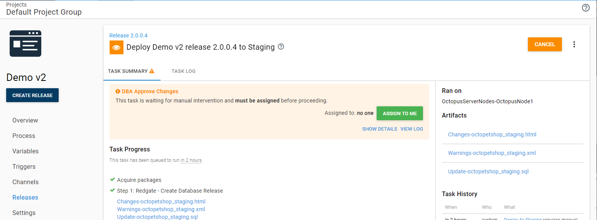

Following this process, the DBAs were more than happy to let Octopus deploy to `staging` and `production`.  They could review the scripts during the deployment, and who reviewed the scripts was audited.  Besides, they were happy to see all it took was pushing a button.  As one DBA put it, “this is all stupid simple.”

What sealed the deal was the ability to control who could push the deployment button.  All developers (including database developers and lead developers) could deploy to `development`, `test`, and `staging`.

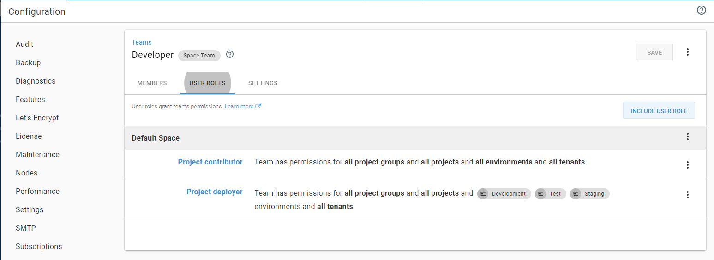

While the DBAs could deploy to `production`, they didn’t have the right to change the deployment process, only developers could do that.

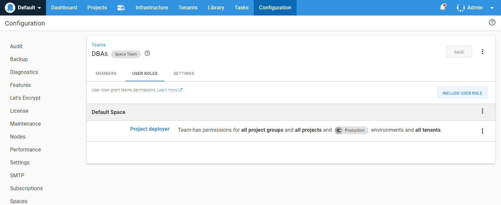

While developers could deploy to `staging`, the DBAs were the ones who approved the changes.

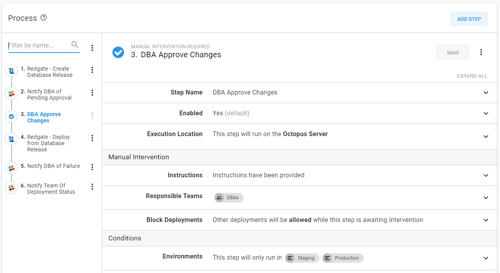

These security policies and manual interventions built a lot of trust in the process.

## Flaws with automated database deployments v2

Let’s check back in with our issue list.

- Two different processes, one for `development` and `test`, and another with slight differences for `staging` and `production`. **Solved.**
- Manual generation of scripts. **Solved.**
- Manual running of each script in each environment. **Solved.**
- Unique delta scripts per environment. **Mitigated**, this is how the tool works.
- Unique delta scripts meant it was difficult or nearly impossible to test. **Mitigated** but much less chance of causing errors since the same process is used.
- No mention of keeping track of changes and what needed to be deployed. **Solved.**
- Shared development environment. **Solved.**
- Reviews didn’t happen until it was time to go to `staging`. **Solved.**, database developers reviewed feature branch changes, and DBAs reviewed in `staging`. As a result, “All hands on deck” during `production` deployments. **Solved.**
- Hours or days between when a script is generated by `30_Staging` and when it was run in `staging` or `production`. **Solved.**
- Hard to know what version is going to be used to generate the delta scripts when `30_Staging` ran. **Solved.**
- The latest changes only, you can’t pick an older version. **Solved.**

Fantastic, all the original problems, plus the problems with v1, were solved or mitigated.  But something interesting happened.  The process worked, and as the weeks went by, we started doing more and more deployments to `production` and `staging`.  

- As the process was written, the DBAs had to be online during each `production` deployment.  
- Developers had to wait until the DBAs finished reviewing their scripts in `staging` prior to deployment.  The DBAs couldn’t keep up.
- There was no test data in the developer’s local databases; this resulted in them pushing unfinished changes to `test`.  They’d then point their code to `test` so they had data to test with.

## Automated database deployments v2.1

The work group met, and we agreed to make the following changes to the process:

- DBAs will only approve changes in `staging`.
- Approval in `staging` will occur after the deployment occurs.
- DBAs only want to be notified if deployment to `production` fails.
- DBAs want to see the delta script for `production` during the staging deployment.  It won’t be 100% the same, but it will be close enough for them to review.  The actual `production` deployment script will be created during the `production` deployment and saved as an artifact.
- Generate a backup of `test` after each deployment.  Developers could then restore the backup on their instance to get the testing data.

The resulting process looked like this:

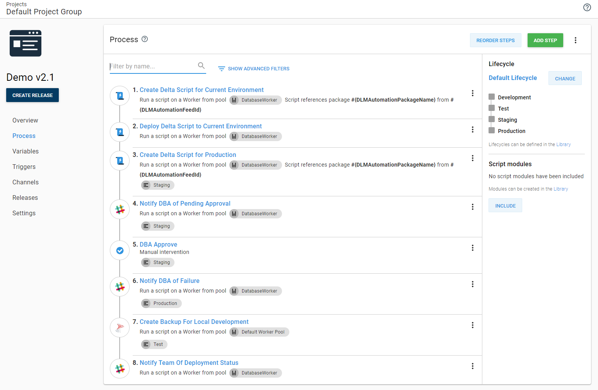

After those changes were in place, DBAs could leverage the `Deploy Later` functionality in Octopus Deploy.  They no longer had to be online for each deployment to `production`.  

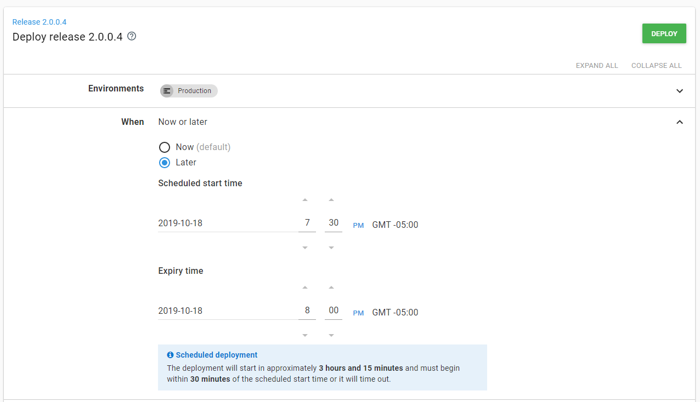

## Conclusion

After going through this process, deployments to `production` became a non-event.  The DBAs only had to jump online during `production` deployments when something failed, which became rarer and rarer, but it took several iterations to get there.

What surprised me the most was how much everything changed from start to finish.  I’ll be honest; if I came across a customer with that final database deployment process, I’d have a lot of questions.  But it makes sense in the context of the company that implemented it.  It meets their requirements.  Don’t be surprised by the number of iterations you make and where you will eventually end up.  Every company is different.

Happy Deployments!

If you enjoyed this article, great news, we have a whole series on [automated database deployments](https://octopus.com/database-deployments).
