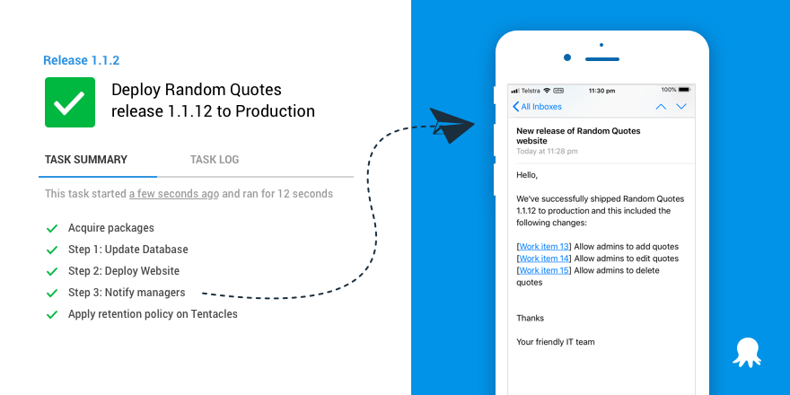

We’re excited to launch our official Octopus Deploy [Jenkins plugin](https://plugins.jenkins.io/octopusdeploy) to make it painless to integrate Jenkins builds with Octopus deployments. Octopus has had a Jenkins community plugin for many years maintained by [Brian Adriance](https://github.com/badriance) and other contributors, and Octopus has worked with Brian to take over the plugin and provide official support from our team. We’re indebted to Brian and other contributors for their efforts since the project started in 2015.   Making this an official plugin brings significant advantages, as can keep the plugin up-to-date and add great new features.

This release brings the Jenkins plugin to feature parity with our [TeamCity](https://plugins.jetbrains.com/plugin/9038-octopus-deploy-integration/), [Azure DevOps](https://marketplace.visualstudio.com/items?itemName=octopusdeploy.octopus-deploy-build-release-tasks), and [Bamboo Server](https://marketplace.atlassian.com/apps/1217235/octopus-deploy-bamboo-add-on?hosting=server&tab=overview) plugins. It brings integration capabilities, including our work item and build information feature set.

* **[Painless integration of your Jenkins builds and Octopus deployments](/blog/2019-12/octopus-jenkins-plugin/index.md#painless-integration-of-your-jenkins-builds-and-octopus-deployments)**. Configure Jenkins to build and test your application and Octopus to manage your releases and deployments.
* **[Better visibility: See what’s new in production](/blog/2019-12/octopus-jenkins-plugin/index.md#better-visibility-see-whats-new-in-production)**. Octopus can surface the changes included in a release and calculate what has changed since your last deployment. This functionality gives you the power to see “What’s New” in production or any other environment.
* **[Better communication: Generate and share releases notes automatically](/blog/2019-12/octopus-jenkins-plugin/index.md#better-communication-generate-and-share-releases-notes-automatically)**. Octopus can generate release notes when deploying to your environments like dev, test, or production. Share them with your team, managers, or executives via email, Slack, and more.

[Learn how to install or update the extension](/blog/2019-12/octopus-jenkins-plugin/index.md#how-to-install-or-update-the-octopus-deploy-jenkins-plugin)

## Painless integration of your Jenkins builds and Octopus deployments

Integrating your Jenkins builds with Octopus deployments is now possible without scripting it yourself or relying on the community-supported plugin. Our official plugin provides the build and post-build actions similar to our other build server plugins.

This update lets you configure an ideal CI/CD pipeline:

**Jenkins**:

* Build your front-end codebase (bundling, linting, etc.).
* Build any microservices or web services.
* Run unit/integration tests.
* Run static analysis.

**Octopus Deploy**:

* Package your build output (i.e., ZIP it up).
* Push your zipped packages to Octopus or another artifact repository.
* Push build information to Octopus to provide linkages to the code, build, and any work items related to the build.
* Create releases to snapshot your deployment process and dependencies.
* Deploy releases to your environments like dev, test, and production.

NOTE: This release of our plugin does not support Jenkins Pipelines, but it is on our radar.

[Learn more](https://octopus.com/docs/packaging-applications/build-servers/jenkins)

## Better visibility: See what’s new in production

Octopus deployments complement Jenkins builds by giving you better visibility and insight into your CI/CD pipeline. Pushing build information to Octopus as a part of your build process enables Octopus to surface your commits, build details, and any work items, for instance, GitHub or Jira issues, are associated with a specific build. This functionality unlocks the ability to see what features, bug fixes, and enhancements contributed to a release, and Octopus can also determine which work items have changed since your last deployment. This means you can clearly see **What’s New** in production or any other environment.

This feature set gives teams confidence and visibility into the changes included when deploying releases to production.

[Learn more](https://octopus.com/docs/deployment-process/releases/deployment-notes)

## Better communication: Generate and share releases notes automatically

Another benefit of our build information and work item integration is unlocking the ability for teams to improve their communication with other teams and managers. Leveraging release details, including associated issues, Octopus enables teams to generate customized release notes and share them as per their needs. This could be a slack message to an operations teams to keep them in the loop or an email to customers sharing the latest features included a new release.

This functionality eliminates manual collection and sharing of release notes.

[Learn more](https://octopus.com/docs/deployment-process/releases/release-notes)

## How to install or update the Octopus Deploy Jenkins plugin

The Octopus Deploy [Jenkins plugin](https://plugins.jenkins.io/octopusdeploy) is a new release of the existing Jenkins plugin in the [Jenkins plugin repository](https://plugins.jenkins.io/). This means that you can [install or upgrade it](https://jenkins.io/doc/book/managing/plugins/) in the same way as any other Jenkins plugin.

Read our [Jenkins Build Server integration](https://octopus.com/docs/packaging-applications/build-servers/jenkins) for more information.

## Summary

[Jenkins](https://jenkins.io) and [Octopus Deploy](https://octopus.com) work better together to give you better end-to-end visibility into your CI/CD pipelines.

Feel free to leave us a comment, and let us know what you think! Happy deployments!
