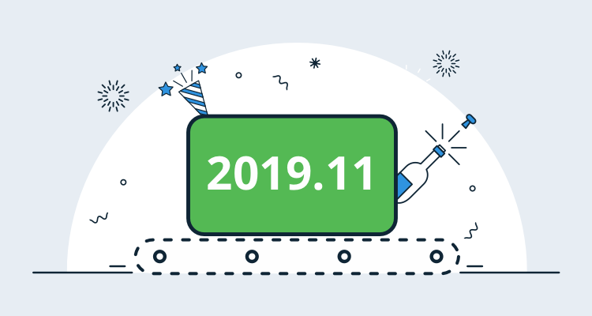
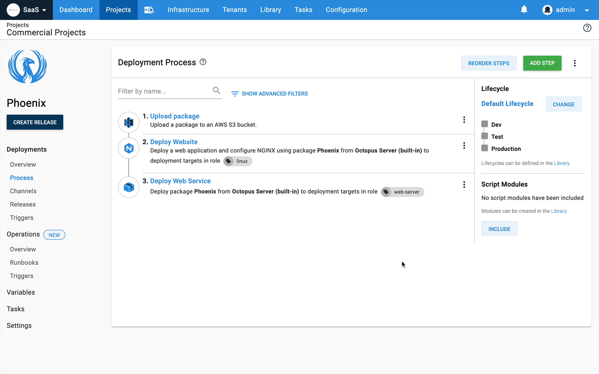

**Octopus Deploy 2019.11** is now available and it introduces our Operations Runbooks feature and numerous small improvements driven by customer feedback. We're excited to share that our Runbooks has reached release to web (RTW) status. This means we've removed the early access feature toggle and we're proud to ship a complete solution to help teams automate their operations tasks. 

<h2>In this post</h2>

!toc

## Operations Runbooks RTW

This release introduces our first-class runbook platform for automating routine maintenance and emergency operations tasks. Runbook examples include infrastructure provisioning, database management, and website failover and restoration. 

This feature was designed to make modelling and executing operations tasks feel as natural as deploying applications does today. It brings support to execute runbooks directly against infrastructure with strong scheduling support. 

Runbooks are executed and managed by Octopus, so teams can run them even if they don’t have permission to the infrastructure the runbook will be executed on. This also means there’s a complete audit trail that can be reviewed at a later date, making it easy to see what happened, when and why, and if anything needs to be changed.

[Learn more](https://octopus.com/docs/deployment-process/operations-runbooks)

## Improvements driven by customer feedback

Our team continually adds updates and bug fixes driven by customer feedback and support tickets. We want to highlight some of these changes in this release. 

* **Simpler Octopus dashboard configuration**, so it's clearer to understand what is filtered.
* **Added support to test Azure DevOps issue tracker connectivity**. This changes can help when configuring build server integration and work item tracking.
* **Space selection is no longer visible** if a user only has 1 space and they don't have permission to add more.
* **Added support to upgrade a subset of Tentacles**. This applies to groups of Tentacle/Workers in an environment or worker pool rather than all deployment targets.
* Added support to **Redeploy previous deployments** so it's easier to redeploy/rollback successful release.
* **Swagger API documentation** is far more accurate making it easier for teams to integrate with the Octopus API. 
* **Improved performance to the Tenants page** - It's now much faster to render for customers with hundreds and thousands of tenants. 
* **Improved supportability** We've improved logging for automatic deploys and dynamic infrastructure provisioning to help teams understand what happens if things go wrong.

## Breaking Changes

The [Octopus API has changed](https://github.com/OctopusDeploy/Issues/issues/4925) as a part of this release, versions of Octopus.Client before 8.0.0 will not be able to create scheduled triggers on an Octopus Server where the version is older than 2019.11.0.

## Upgrading

As usual, the [steps for upgrading Octopus Deploy](https://octopus.com/docs/administration/upgrading) apply. Please see the [release notes](https://octopus.com/downloads/compare?to=2019.11.0) for further information. Self-Hosted Octopus customers can [download](https://octopus.com/downloads/2019.11.0) the latest release now. For Octopus Cloud, you will start receiving the latest bits next week during your maintenance window. 

## Wrap up

This release is our final one of 2019 and we're looking forward to 2020. Keep an eye on our [roadmap](https://octopus.com/roadmap) as we're updating it regularly. 

Happy deployments!