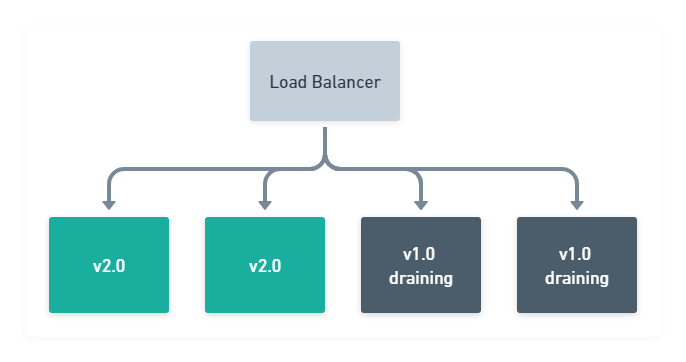
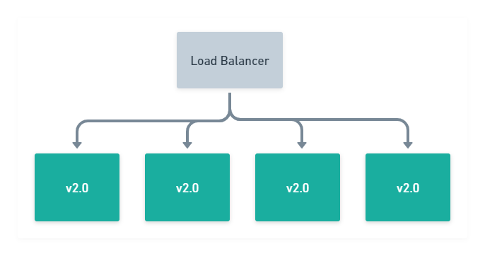
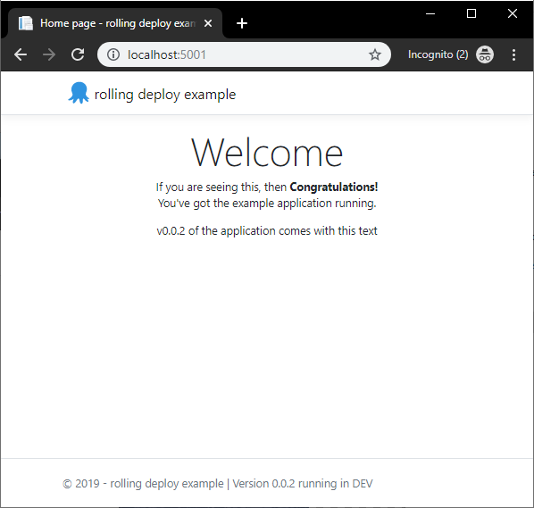

When tasked with deploying a new version of your application, such as a web site, I've often seen the approach where the entire site has been taken offline to accommodate the update. 
If the majority of your customers are asleep, then that's probably acceptable. But what happens if your customers are using your applications 24-7? 

Today, users expect applications to be available all of the time and there are a few deployment patterns you can use to achieve zero-downtime. In this post, I'll discuss one of these patterns in more depth; Rolling deployments, and provide you with some practical examples of how to do this using a number of different tools.

!toc

## What are rolling deployments?

A rolling deployment is a deployment pattern (also known as an incremental, batched or ramped deployment) where new software is delivered, usually to a small subset of deployment targets at a time, until all of the targets have the updated version of software rolled out.

A typical process looks something like this:

 1. With 4 nodes running `v1.0` of your application, drain the first 2 nodes to be updated, and take them out of the load-balancer pool. Leave the remaining 2 nodes online to serve traffic.


 2. Stop the `v1.0` application from running, then deploy the new `v2.0` version of the application. Optionally, also verify that the deployment was successful by running tests on your newly deployed application. All the while, still maintaining 2 nodes running `v1.0` of your appplication.

 

3. Once the first 2 nodes have updated successfully, proceed with draining any additional nodes still running `v1.0` of your application, whilst your new `v2.0` version is now online serving traffic.

 

 4. Stop the `v1.0` application on the remaining nodes from running, deploy the new `v2.0` version. Again, optionally verify the deployment was successful.

 
 
 5. Finally, once `v2.0` of your application has been deployed successfully to all 4 of your nodes, your rolling deployment is complete!



This incremental approach is often favoured in web applications which sit behind a load balancer, as most load balancers support a concept known as `Connection draining`. This is simply allowing connections to a service to finish naturally, as well as preventing any new connections to be established. 

By performing this action, instances which are selected to be updated, can be removed from the available pool after they have finished their work, whilst a number remain online serving traffic.

:::hint Although the scenario above describes a web application rolling deployment, it's possible to achieve rolling deployments for other types of application, providing they are built in a way which supports ending their process safely.
:::

For example, Octopus Deploy's [High Availability](https://octopus.com/docs/administration/high-availability) configuration also has a [drain](https://octopus.com/docs/administration/high-availability/managing-high-availability-nodes#ManagingHighAvailabilityNodes-Drain) option, which prevents any new tasks from executing, and finishes up any tasks it's currently executing until idle. Features like draining allow for the safe termination of a process, which can then be updated and brought back online. 

## Why are they useful?

So why use rolling deployments over other patterns (canary, blue/green)? Well, rolling deployments offer the following benefits:

### Incremental update
 
New versions of your application are rolled-out incrementally. This allows you to verify that it's working, for example, by running health checks or tests before moving on to the next batch of updates.

In the event that you need to initiate a rollback, you can also do this in a safe, controlled manner.

### Keeping the lights on

Whilst you go about updating a small number of your application instances, the rest continue to serve requests. This means there is no downtime for your application, as it's available for your users throughout the deployment.

### Parallelism

You can usually control the number of concurrent instances that are deployed to at any one time. Further deployments won't start until a previous deployment has finished.

:::hint
You can use the `Window size` option within an Octopus rolling deployment to control how many deployment targets can be deployed to at once.
:::

## Rolling deployment patterns in Practise

To demonstrate the different approaches for rolling deployments, we have a very simple .NET Core 3.1 application which will display a web page. 

The HTML for the section I'm interested in is shown below

```html
<div class="text-center">
    <h1 class="display-4">Welcome</h1>
    <p>If you are seeing this, then <strong>Congratulations!</strong> <br/> You've got the example application running. </p>
    
    @if(Settings.Value.AppVersion == "0.0.2") {
        <p>v0.0.2 of the application comes with this text </p>
    }
    @if(Settings.Value.AppVersion == "0.0.3") {
        <p>But don't miss out on v0.0.3 of the application which comes with this text! </p>
    }
</div>
```

We'll make changes to the ``AppVersion`` and roll this out using different tools. The code for the application is available on [GitHub](https://github.com/OctopusSamples/rolling-deploy-sampleapp) and has been published as the image [harrisonmeister/rolling-deploy-example](https://hub.docker.com/r/harrisonmeister/rolling-deploy-example).

### Docker rolling application updates

:::success
For the sake of simplicity, I am doing this exercise in Docker from the command line. But there are production-ready setups to automate this, which feature the definition of your services in either a `Docker Compose` or `Stack` files. 
If you are new to Docker, my colleague Shawn has written an excellent series on [containers](https://octopus.com/blog/containerize-a-real-world-web-app).
:::

Firstly, to see the Docker image of this running standalone, we'll run it locally with the following command:

```
docker run -p 5001:5001 harrisonmeister/rolling-deploy-example:0.0.1
```

Unsurprisingly, running this Docker image locally displays the web page:


To deploy more than one instance of our container, we have to create a Docker [service](https://docs.docker.com/engine/reference/commandline/service) which uses [Docker Swarm](https://docs.docker.com/engine/swarm) as its orchestrator.

```
docker service create 
 --name rolling-deploy-svc 
 --replicas 3
 --publish published=5001,target=5001
 --update-delay 10s
 --update-parallelism 1 
 harrisonmeister/rolling-deploy-example:0.0.1
```
:::hint
**Hint**
When running the command for the first time, you may receive a warning of `This node is not a swarm manager` (just as I did!). To fix this, either run `docker swarm init` or `docker swarm join` to connect your local node to swarm.
:::

Let's unpick what we are asking of Docker here:
- The `--name` is pretty self explanatory. 
- The `--replicas` flag controls the number of containers we want (3).
- The `--publish published=5001,target=5001` specifies we want the service to be accessed on port 5001 using Swarm's [routing mesh](https://docs.docker.com/engine/swarm/ingress/#publish-a-port-for-a-service).
- The `--update-delay` configures the time delay (10s) between updates to a service task.
- The `--update-parallelism` controls the maximum number of service tasks that Docker will schedule simultaneously (1).
- Lastly, we specify the image to use `harrisonmeister/rolling-deploy-example:0.0.1`

:::hint
You can also specify the attributes for a service in a `docker-compose` file. 
:::

Executing this results in our service being deployed to Docker Swarm with 3 instances.


We can also check our service has the correct update configuration by running the command:

```
docker service inspect rolling-deploy-svc --pretty
```

The result of this shows we have our desired `UpdateConfig` 


Now we can update the container image for `harrisonmeister/rolling-deploy-example` to `v0.0.2` by running the following command:

```
docker service update rolling-deploy-svc --image harrisonmeister/rolling-deploy-example:0.0.2
```

Docker runs the update to each container, 1 task at a time just as we have configured it to:


Once the first task is complete, it moves onto task 2:


Until all of the tasks to update the containers to `v0.0.2` is complete.


Then browsing to the website shows the text which applies for `v0.0.2`



As you can see, it doesn't take much setup to get rolling deployments working in Docker!

### Kubernetes Rolling updates

Rolling deployments in Kubernetes is done with `Rolling Updates`. A Pods instances will be updated incrementally with new ones. It supports both a max number (or percentage) of pods to be unavailable during an update, as well as a max number of new Pods that can be created. In addition to this Kubernetes has a handy built-in feature to allow updates to be reverted to a previous version. 

_TODO_

### Jenkins?

_TODO?_

### Azure DevOps?

_TODO?_

### Octopus Rolling deploy

_TODO_

## A word on the database

The elephant in the room I haven't discussed yet, is the database. Performing rolling deployments which involve some persistent storage such as a database can sometimes be tricky, though not impossible. The devil is in the detail.
If you want to perform rolling deployments with database changes involved, then I'd recommend deploying the database first. You'd also want to ensure any changes you make to your database are backwards compatible with previous versions of code you have deployed.

We have a series of posts on [database deployments](http://octopus.com/database-deployments) that go into more detail on this.

## Wrapping up

No matter which tool you are using, rolling deployments is just one pattern available in your toolset to optimise deployment of your software. But with an incremental approach, it allows you to keep your applications online whilst slowly rolling out newer versions of your software, making it a favourite of mine for minimal disruption.

Feel free to leave a comment, and let us know what you think about rolling deployments!
