The advent of Infrastructure as Code (IaC) has been a tremendous leap forward, especially within the cloud space.  The ability to programatically define how the Infrastructure should look has led to environmental consistency and more predictable application behavior.  Cloud providers have embraced IaC, providing customized IaC implementations to provision and configure resources on their offering.  Unfortunately, this means that you have to learn multiple tools to work with the different providers; for example Amazon Web Services (AWS) CloudFormation or Microsoft Azure Resource Manager (ARM) templates.  HashiCorp created Terraform to solve this very problem, a single tool to work with multiple providers.  In this post, I will show you how to dynamically create Workers for Octopus Deploy using Terraform and AWS Auto-Scaling.

## Auto-Scaling
Auto-Scaling is the ability to spin up or tear down resources based on specified criteria.  A common use-case for auto-scaling is an eCommerce web site.  As demand increases, more servers are created to handle the load.  Once load subsides, the additional resources can be deprovisioned automatically.  This allows eCommerce to keep a minimal amount of servers in operation, keeping hosting costs down.

## Terraform
With Terraform, we have the ability to define all of our resources within a single file, or logically separate them.  For this post, we'll separate our files so that they're easy to work with.  This demonstration makes use of 8 files:

- autoscaling.tf
- autoscalingpolicy.tf
- backend.tf
- installTentacle.sh
- provider.tf
- securitygroup.tf
- vars.tf
- vpc.tf

### autoscaling.tf
This file contains the resource declarations for creating the AWS auto scaling groups and the launch configurations for our workers.  I've created two launch configurations, one for Windows and one for Linux.  Each launch configuration will execute a script that will automatically install and configure the Octopus Deploy Tentacle software, then connect it as a worker to our Octopus Deploy server.  To illustrate how scripts can be connected to launch configurations, the Linux launch configuration reads a file (installTentacle.sh) which contains the commands whereas the Windows launch configuration has the script inline.  For both Windows and Linux, we are configuring Polling tentacles.

:::hint
The .tf files in this demonstration uses Terraform v0.11 syntax.  At the time of this writing, Octopus Deploy does not support use of Terraform v0.12 without explicitely setting the [`Octopus.Action.Terraform.CustomTerraformExecutable`](https://octopus.com/docs/deployment-examples/terraform-deployments/apply-terraform#special-variables) variable.
:::

```terraform

resource "aws_launch_configuration" "dynamic-linux-worker-launchconfig" {
    name_prefix = "dynamic-linux-worker-launchconfig"
    image_id = "${var.LINUX_AMIS}"
    instance_type = "t2.micro"
    
    security_groups = ["${aws_security_group.allow-octopusserver.id}"]
  
    # script to run when created
user_data = "${file("installTentacle.sh")}"

}

resource "aws_launch_configuration" "dynamic-windows-worker-launchconfig" {
    name_prefix = "dynamic-windows-worker-launchconfig"
    image_id = "${var.WINDOWS_AMIS}"
    instance_type = "t2.micro"
    
    security_groups = ["${aws_security_group.allow-octopusserver.id}"]

    user_data = <<-EOT
<script>
@"%SystemRoot%\System32\WindowsPowerShell\v1.0\powershell.exe" -NoProfile -InputFormat None -ExecutionPolicy Bypass -Command "iex ((New-Object System.Net.WebClient).DownloadString('https://chocolatey.org/install.ps1'))" && SET "PATH=%PATH%;%ALLUSERSPROFILE%\chocolatey\bin"            

choco install octopusdeploy.tentacle -y

@"C:\Program Files\Octopus Deploy\Tentacle\Tentacle.exe" create-instance --config "c:\octopus\home"

@"C:\Program Files\Octopus Deploy\Tentacle\Tentacle.exe" new-certificate --if-blank

@"C:\Program Files\Octopus Deploy\Tentacle\Tentacle.exe" configure --noListen True --reset-trust --app "c:\octopus\applications"

@"C:\Program Files\Octopus Deploy\Tentacle\Tentacle.exe" register-worker --server "#{Project.Octopus.Server.Url}" --apiKey "#{Project.Octopus.Server.ApiKey}"  --comms-style "TentacleActive" --server-comms-port "#{Project.Octopus.Server.PollingPort}" --workerPool "#{Project.Octopus.Server.WorkerPool}" --policy "#{Project.Octopus.Server.MachinePolicy}" --space "#{Project.Octopus.Server.Space}"

@"C:\Program Files\Octopus Deploy\Tentacle\Tentacle.exe" service --install

@"C:\Program Files\Octopus Deploy\Tentacle\Tentacle.exe" service --start


</script>

  EOT
}

resource "aws_autoscaling_group" "dynamic-linux-worker-autoscaling" {
    name = "dynamic-linux-worker-autoscaling"
    vpc_zone_identifier = ["${aws_subnet.worker-public-1.id}", "${aws_subnet.worker-public-2.id}", "${aws_subnet.worker-public-3.id}"]
    launch_configuration = "${aws_launch_configuration.dynamic-linux-worker-launchconfig.name}"
    min_size = 2
    max_size = 3
    health_check_grace_period = 300
    health_check_type = "EC2"
    force_delete = true

    tag {
        key = "Name"
        value = "Octopus Deploy Linux Worker"
        propagate_at_launch = true
    }
}

resource "aws_autoscaling_group" "dynamic-windows-worker-autoscaling" {
    name = "dynamic-windows-worker-autoscaling"
    vpc_zone_identifier = ["${aws_subnet.worker-public-1.id}", "${aws_subnet.worker-public-2.id}", "${aws_subnet.worker-public-3.id}"]
    launch_configuration = "${aws_launch_configuration.dynamic-windows-worker-launchconfig.name}"
    min_size = 2
    max_size = 3
    health_check_grace_period = 300
    health_check_type = "EC2"
    force_delete = true

    tag {
        key = "Name"
        value = "Octopus Deploy Windows Worker"
        propagate_at_launch = true
    }
}
```
### autoscalingpolicy.tf
This file contains the policy and trigger definitions to both scale up and down our EC2 instances

```terraform
# scale up alarm

resource "aws_autoscaling_policy" "linux-worker-cpu-policy" {
  name                   = "linux-worker-cpu-policy"
  autoscaling_group_name = "${aws_autoscaling_group.dynamic-linux-worker-autoscaling.name}"
  adjustment_type        = "ChangeInCapacity"
  scaling_adjustment     = "1"
  cooldown               = "300"
  policy_type            = "SimpleScaling"
}

resource "aws_cloudwatch_metric_alarm" "linux-worker-cpu-alarm" {
  alarm_name          = "linux-worker-cpu-alarm"
  alarm_description   = "linux-worker-cpu-alarm"
  comparison_operator = "GreaterThanOrEqualToThreshold"
  evaluation_periods  = "2"
  metric_name         = "CPUUtilization"
  namespace           = "AWS/EC2"
  period              = "120"
  statistic           = "Average"
  threshold           = "30"

  dimensions = {
    "AutoScalingGroupName" = "${aws_autoscaling_group.dynamic-linux-worker-autoscaling.name}"
  }

  actions_enabled = true
  alarm_actions   = ["${aws_autoscaling_policy.linux-worker-cpu-policy.arn}"]
}

# scale down alarm
resource "aws_autoscaling_policy" "linux-worker-cpu-policy-scaledown" {
  name                   = "linux-worker-cpu-policy-scaledown"
  autoscaling_group_name = "${aws_autoscaling_group.dynamic-linux-worker-autoscaling.name}"
  adjustment_type        = "ChangeInCapacity"
  scaling_adjustment     = "-1"
  cooldown               = "300"
  policy_type            = "SimpleScaling"
}

resource "aws_cloudwatch_metric_alarm" "linux-worker-cpu-alarm-scaledown" {
  alarm_name          = "linux-worker-cpu-alarm-scaledown"
  alarm_description   = "linux-worker-cpu-alarm-scaledown"
  comparison_operator = "LessThanOrEqualToThreshold"
  evaluation_periods  = "2"
  metric_name         = "CPUUtilization"
  namespace           = "AWS/EC2"
  period              = "120"
  statistic           = "Average"
  threshold           = "5"

  dimensions = {
    "AutoScalingGroupName" = "${aws_autoscaling_group.dynamic-linux-worker-autoscaling.name}"
  }

  actions_enabled = true
  alarm_actions   = ["${aws_autoscaling_policy.linux-worker-cpu-policy-scaledown.arn}"]
}

resource "aws_autoscaling_policy" "windows-worker-cpu-policy" {
  name                   = "windows-worker-cpu-policy"
  autoscaling_group_name = "${aws_autoscaling_group.dynamic-windows-worker-autoscaling.name}"
  adjustment_type        = "ChangeInCapacity"
  scaling_adjustment     = "1"
  cooldown               = "300"
  policy_type            = "SimpleScaling"
}

resource "aws_cloudwatch_metric_alarm" "windows-worker-cpu-alarm" {
  alarm_name          = "windows-worker-cpu-alarm"
  alarm_description   = "windows-worker-cpu-alarm"
  comparison_operator = "GreaterThanOrEqualToThreshold"
  evaluation_periods  = "2"
  metric_name         = "CPUUtilization"
  namespace           = "AWS/EC2"
  period              = "120"
  statistic           = "Average"
  threshold           = "30"

  dimensions = {
    "AutoScalingGroupName" = "${aws_autoscaling_group.dynamic-windows-worker-autoscaling.name}"
  }

  actions_enabled = true
  alarm_actions   = ["${aws_autoscaling_policy.windows-worker-cpu-policy.arn}"]
}

# scale down alarm
resource "aws_autoscaling_policy" "windows-worker-cpu-policy-scaledown" {
  name                   = "windows-worker-cpu-policy-scaledown"
  autoscaling_group_name = "${aws_autoscaling_group.dynamic-windows-worker-autoscaling.name}"
  adjustment_type        = "ChangeInCapacity"
  scaling_adjustment     = "-1"
  cooldown               = "300"
  policy_type            = "SimpleScaling"
}

resource "aws_cloudwatch_metric_alarm" "windows-worker-cpu-alarm-scaledown" {
  alarm_name          = "windows-worker-cpu-alarm-scaledown"
  alarm_description   = "windows-worker-cpu-alarm-scaledown"
  comparison_operator = "LessThanOrEqualToThreshold"
  evaluation_periods  = "2"
  metric_name         = "CPUUtilization"
  namespace           = "AWS/EC2"
  period              = "120"
  statistic           = "Average"
  threshold           = "5"

  dimensions = {
    "AutoScalingGroupName" = "${aws_autoscaling_group.dynamic-windows-worker-autoscaling.name}"
  }

  actions_enabled = true
  alarm_actions   = ["${aws_autoscaling_policy.windows-worker-cpu-policy-scaledown.arn}"]
}
```

### backend.tf
When executing Terraform from your local machine, the state files are stored locally.  Octopus Deploy will not keep the state files after the Apply has been performed so it's necessary to store our state files on an external storage location.  This file tells Terraform to use an AWS S3 bucket to store the state files

```terraform
terraform {
    backend "s3" {
        bucket = "#{Project.AWS.S3.Bucket}"
        key = "#{Project.AWS.S3.Key}"
        region = "#{Project.AWS.Region}"
    }
}
```

### installTentacle.sh
This is the bash script file referenced in the autoscaling.tf launch configuration for the Linux variant.  This contains the commands necessary to download, install, and configure the Octopus Deploy Tentacle software as well as connecting it to our Octopus Deploy server

```bash
#!/bin/bash
serverUrl="#{Project.Octopus.Server.Url}"
serverCommsPort="#{Project.Octopus.Server.PollingPort}"
apiKey="#{Project.Octopus.Server.ApiKey}"
name=$HOSTNAME
configFilePath="/etc/octopus/default/tentacle-default.config"
applicationPath="/home/Octopus/Applications/"
workerPool="#{Project.Octopus.Server.WorkerPool}"
machinePolicy="#{Project.Octopus.Server.MachinePolicy}"
space="#{Project.Octopus.Server.Space}"

sudo apt-key adv --fetch-keys "https://apt.octopus.com/public.key"
sudo add-apt-repository "deb https://apt.octopus.com/ stretch main"
sudo apt-get update
sudo apt-get install tentacle

sudo /opt/octopus/tentacle/Tentacle create-instance --config "$configFilePath" --instance "$name"
sudo /opt/octopus/tentacle/Tentacle new-certificate --if-blank
sudo /opt/octopus/tentacle/Tentacle configure --noListen True --reset-trust --app "$applicationPath"
echo "Registering the worker $name with server $serverUrl"
sudo /opt/octopus/tentacle/Tentacle register-worker --server "$serverUrl" --apiKey "$apiKey" --name "$name"  --comms-style "TentacleActive" --server-comms-port $serverCommsPort --workerPool "$workerPool" --policy "$machinePolicy" --space "$space"
sudo /opt/octopus/tentacle/Tentacle service --install --start
```

### provider.tf
The provider.tf informs Terraform which provider we are going to be using.  In our case, we're using AWS.

```terraform
provider "aws" {
  region     = "${var.AWS_REGION}"
}
```

### securitygroup.tf
The term security group can sometimes be misleading.  When dealing with cloud providers, security groups synonomous with firewall rules.  The securitygroup.tf file contains the ingress and egress rules for our EC2 instances.  In this case, ports 22 and 3389 are opened for debugging purposes and can be omitted.

```terraform
resource "aws_security_group" "allow-octopusserver" {
  vpc_id      = "${aws_vpc.worker_vpc.id}"
  name        = "allow-octopusserver"
  description = "Security group that allows traffic to the worker from the Octpus Server"
  egress {
    from_port   = 0
    to_port     = 0
    protocol    = "-1"
    cidr_blocks = ["0.0.0.0/0"]
  }

  ingress {
    from_port = 22
    to_port = 22
    protocol = "tcp"
    cidr_blocks = ["0.0.0.0/0"]
  }

  ingress {
    from_port = 3389
    to_port = 3389
    protocol = "tcp"
    cidr_blocks = ["0.0.0.0/0"]
  }

  tags = {
    Name = "allow-octopusserver"
  }
}
```

### vars.tfs
This file contains the different variables used within our Terraform scripts.  Within this file we've defined which Amazon Machine Image (AMI) to use for our EC2 instances.  The AMI values are hardcoded in this file, but could be easily replaced with variables from Octopus Deploy using the Octostache syntax like the AWS_REGION variable.  This file defines the following variables:

- AWS_REGION - the region of AWS we're using
- LINUX_AMIS - the AMI for our Linux EC2 instances
- WINDOWS_AMIS - the AMI for our Windows EC2 instances
- PATH_TO_PRIVATE_KEY - path to the private key associated with the AWS key pair used for logging into our instances (used for debugging, not included)
- PATH_TO_PUBLIC_KEY - path to the public key associated with the AWS key pair used for logging into our instances (used for debugging, not included)

```terraform
variable "AWS_REGION" {
  default = "#{Project.AWS.Region}"
}

variable "LINUX_AMIS" {
  default =  "ami-084a6c14d8630bb68"
}

variable "WINDOWS_AMIS"{
  default = "ami-087ee25b86edaf4b1"
}

variable "PATH_TO_PRIVATE_KEY" {
  default = "mykey"
}

variable "PATH_TO_PUBLIC_KEY" {
  default = "mykey.pub"
}
```

### vpc.tf
This file contains the necessary resources for creating a Virtual Private Cloud (VPC) in AWS.  It contains the definitions for the VPC, subnets, Internet Gateway, route table, and route table associations.

```terraform
# Internet VPC
resource "aws_vpc" "worker_vpc" {
  cidr_block           = "10.0.0.0/16"
  instance_tenancy     = "default"
  enable_dns_support   = "true"
  enable_dns_hostnames = "true"
  enable_classiclink   = "false"
  tags = {
    Name = "worker_vpc"
  }
}

# Subnets
resource "aws_subnet" "worker-public-1" {
  vpc_id                  = "${aws_vpc.worker_vpc.id}"
  cidr_block              = "10.0.1.0/24"
  map_public_ip_on_launch = "true"
  availability_zone       = "${var.AWS_REGION}a"

  tags = {
    Name = "worker-public-1"
  }
}

resource "aws_subnet" "worker-public-2" {
  vpc_id                  = "${aws_vpc.worker_vpc.id}"
  cidr_block              = "10.0.2.0/24"
  map_public_ip_on_launch = "true"
  availability_zone       = "${var.AWS_REGION}b"

  tags = {
    Name = "worker-public-2"
  }
}

resource "aws_subnet" "worker-public-3" {
  vpc_id                  = "${aws_vpc.worker_vpc.id}"
  cidr_block              = "10.0.3.0/24"
  map_public_ip_on_launch = "true"
  availability_zone       = "${var.AWS_REGION}c"

  tags = {
    Name = "worker-public-3"
  }
}

resource "aws_subnet" "worker-private-1" {
  vpc_id                  = "${aws_vpc.worker_vpc.id}"
  cidr_block              = "10.0.4.0/24"
  map_public_ip_on_launch = "false"
  availability_zone       = "${var.AWS_REGION}a"

  tags = {
    Name = "worker-private-1"
  }
}

resource "aws_subnet" "worker-private-2" {
  vpc_id                  = "${aws_vpc.worker_vpc.id}"
  cidr_block              = "10.0.5.0/24"
  map_public_ip_on_launch = "false"
  availability_zone       = "${var.AWS_REGION}b"

  tags = {
    Name = "worker-private-2"
  }
}

resource "aws_subnet" "worker-private-3" {
  vpc_id                  = "${aws_vpc.worker_vpc.id}"
  cidr_block              = "10.0.6.0/24"
  map_public_ip_on_launch = "false"
  availability_zone       = "${var.AWS_REGION}c"

  tags = {
    Name = "worker-private-3"
  }
}

# Internet GW
resource "aws_internet_gateway" "worker-gw" {
  vpc_id = "${aws_vpc.worker_vpc.id}"

  tags = {
    Name = "worker"
  }
}

# route tables
resource "aws_route_table" "worker-public" {
  vpc_id = "${aws_vpc.worker_vpc.id}"
  route {
    cidr_block = "0.0.0.0/0"
    gateway_id = "${aws_internet_gateway.worker-gw.id}"
  }

  tags = {
    Name = "worker-public-1"
  }
}

# route associations public
resource "aws_route_table_association" "worker-public-1-a" {
  subnet_id      = "${aws_subnet.worker-public-1.id}"
  route_table_id = "${aws_route_table.worker-public.id}"
}

resource "aws_route_table_association" "worker-public-2-a" {
  subnet_id      = "${aws_subnet.worker-public-2.id}"
  route_table_id = "${aws_route_table.worker-public.id}"
}

resource "aws_route_table_association" "worker-public-3-a" {
  subnet_id      = "${aws_subnet.worker-public-3.id}"
  route_table_id = "${aws_route_table.worker-public.id}"
}
```

And there you have it!  All of the Terraform script necessary to create our AWS Auto-Scaling worker army!  All that's left is to package these files up into either a .zip or a .nupkg using a build server or the Octopus Deploy CLI.  Once the package has been created, we can include it in our deployment process.

## Octopus Deploy
Setting up the Terraform files was by far the harest part of this entire process.  The steps for creating the deployment within Octopus Deploy are quite short.  For our purposes, we only need two environments, Spinup and Teardown.

### Environments
To create our environments, click on the Infrastructure tab -> Environments -> ADD ENVIRONMENT


Create the following:
- Spinup
- Teardown

For this demonstration, we're using the Default lifecycle.  It may be necessary to create a new lifecycle for this project if others already exist.

### AWS Account
To work with AWS, we're going to need an account with the necessary rights to create EC2 instances.  Once that has been created in AWS, we'll need to add this account to Octopus Deploy.  To do this, we'll click on Infrastructure -> Accounts -> ADD ACCOUNT


Choose AWS Account


Fill in the in the Access and Secret keys.  Be sure to click the Save and Test to make sure your account works correctly.

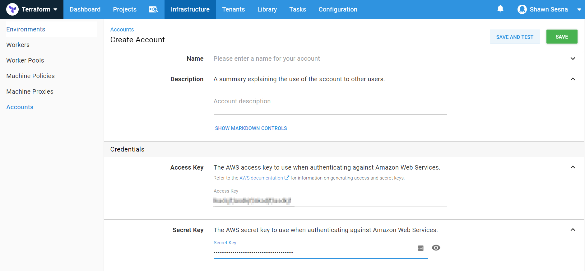

### Project
With the Environments created, we can now create our project to create our workers.

Click on Projects -> ADD PROJECT


#### Variables
The Terraform scripts that we created above had Octostache variables that need to be replaced at deploy-time.  To define our variables, click on the Variables tab

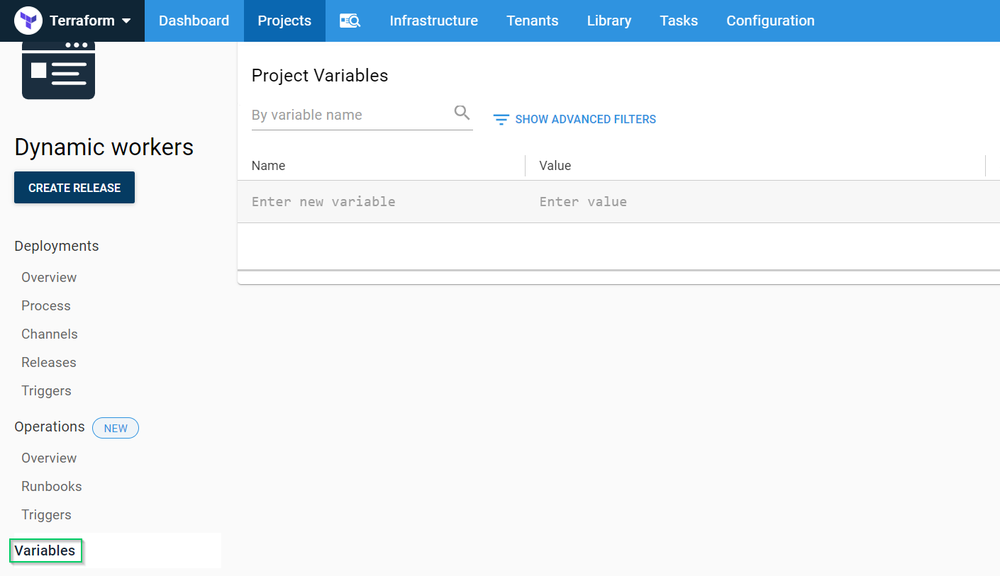

and create the following variables (I've namespaced my variables to more easily identify where they came from):

- Project.AWS.Account - the AWS Account we created above.
- Project.AWS.Region - The region in AWS we're using
- Project.AWS.S3.Bucket - The bucket that we're going to store our state files in
- Project.AWS.S3.Key - The key that will store our state
- Project.Octopus.Server.ApiKey - The API Key that will be used when connecting the Worker to the Octopus server (sensitive)
- Project.Octopus.Server.MachinePolicy - The name of the Machine Policy that the worker will be attached to
- Project.Octopus.Server.PollingPort - The port that the Octopus Server uses for Polling Tentacles
- Project.Octopus.Server.Space - Name of the space that the worker will be attached to (leave blank for default)
- Project.Octopus.Server.Url - The Octopus Server Url
- Project.Octopus.Server.WorkerPool - The name of the worker pool the worker will join

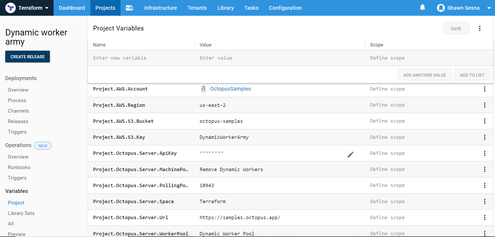

#### Steps
Our deployment process will consist of a total of two steps; a Terraform Apply step and a Terraform Destroy step.

##### Apply Terraform template

Click on Process -> ADD STEP


Click on the Terraform Category and choose the Apply a Terraform template

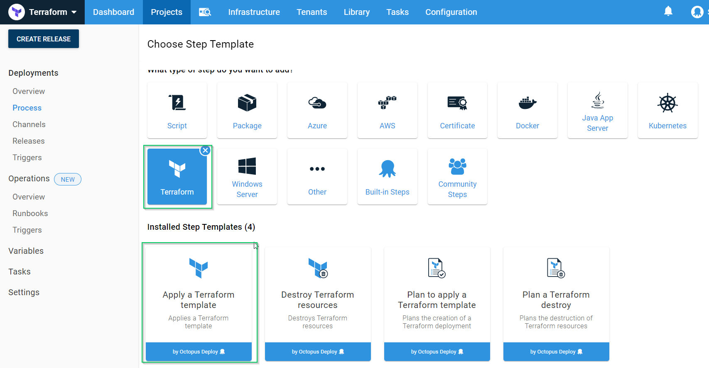

Give the step a name and have it execute on a worker in the Default pool

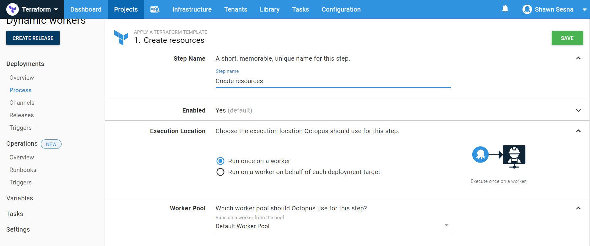

Enable Account Integration, choose our AWS account and specify the region

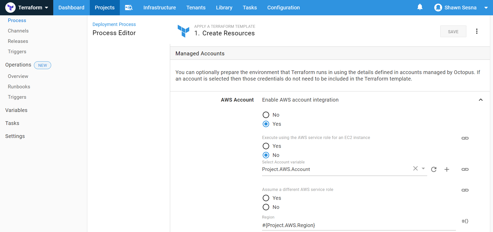

Select the package that contains our Terraform files.  Uncheck the Replace variables in default Terraform files.  In the Target files section, add two entries
- *.tf
- *.sh

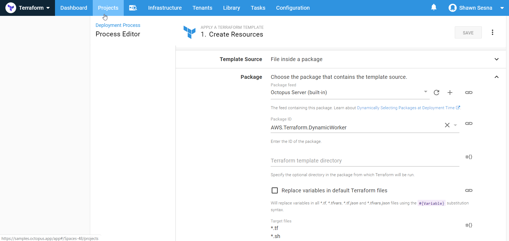

Under Conditions, have this step only execute in the Spinup environment

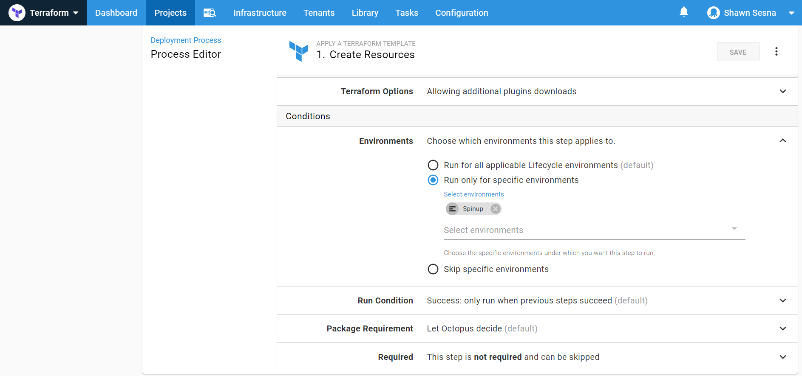

We're done with the Apply a Terraform template step.

##### Destroy Terraform resources
To help conserve costs, we can tear down the resources we've created when we know they will not be used, such as the end of the work day.  In this demonstration, we've chosen to have it be part of our deployment, however, we could easily implement this as a scheduled Runbook.

Click on ADD STEP, choose the Terraform category, then choose Destroy Terraform resources

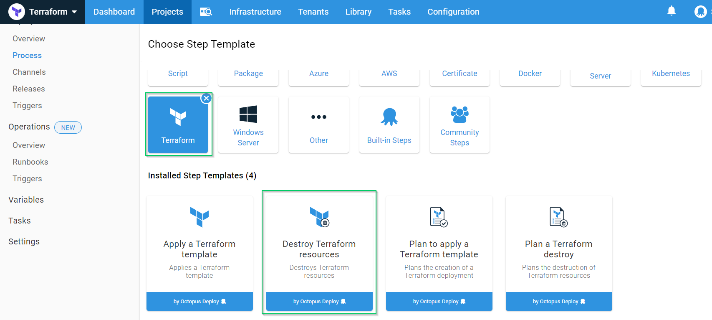

Fill in the same values for this as we did for the Apply Terraform template with the exception of which environment to run in.  For the Destroy step, we only want it to run in the Teardown environment.

That's all!  We're not ready to create our release and deploy our Terraform template!

### Applying the template
Click on the CREATE RELEASE button

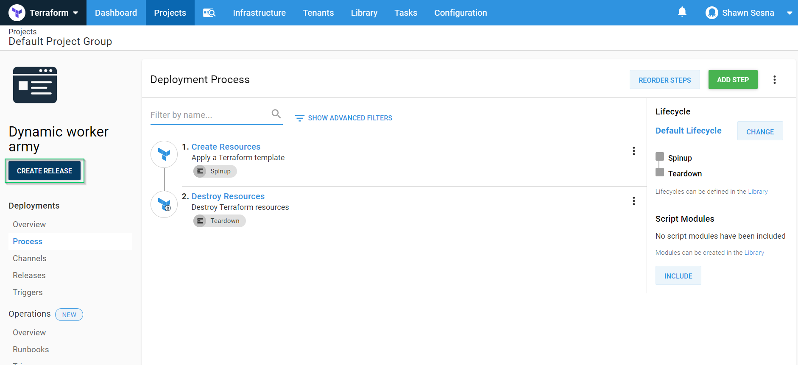

Click SAVE


Click on either DEPLOY TO SPINUP or the DEPLOY button on the line for the SpinUp environment

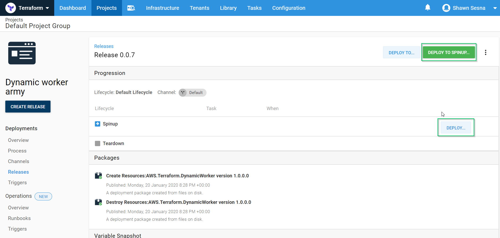

Finally, click DEPLOY!

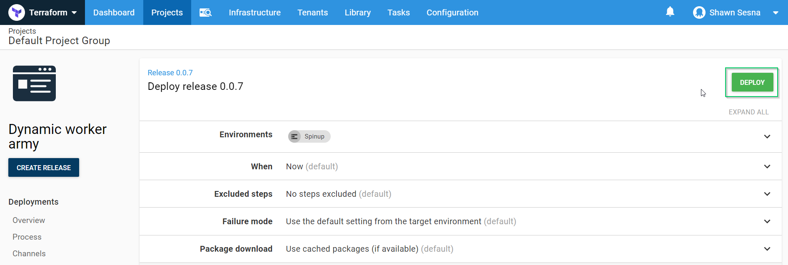

Once the deployment is complete, we should see four workers in our Dynamic Worker Pool!

:::hint
Linux workers will show up sooner than Windows workers.  If at first you don't see four workers, give it a little more time for the Windows workers to finish provisioning
:::

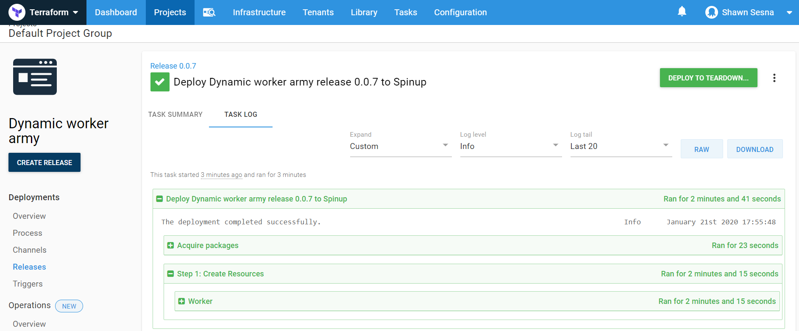

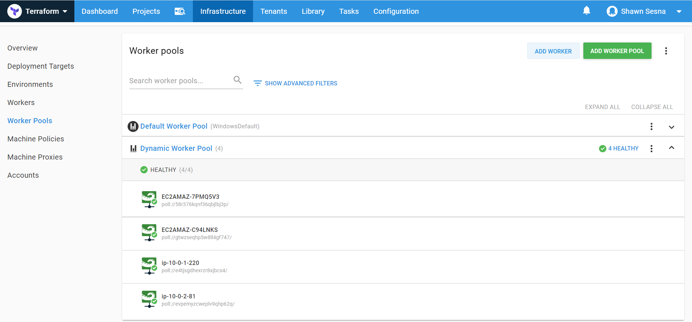

## Conclusion
In this post I walked you through creating some Terraform files that will create an AWS Auto-scaling group that will dynamically create Octopus Deploy worker infrastructure that will scale up and down based on demand.