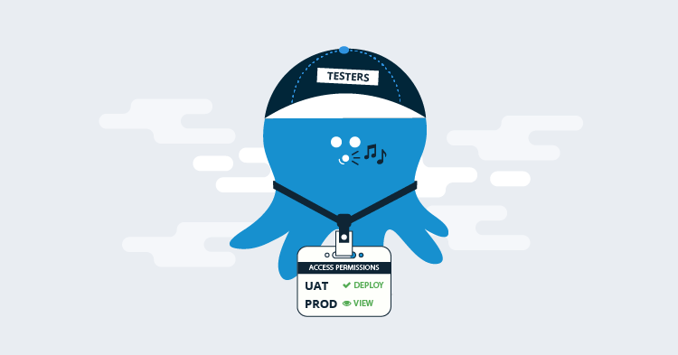
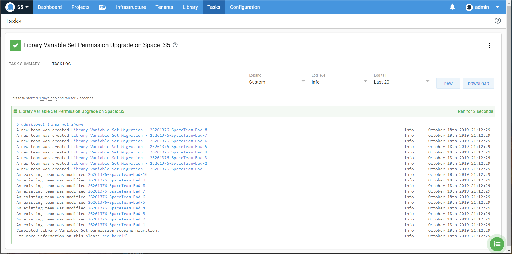

## Library Variable Set Permission Changes

Fixing or changing permissions has always been a challenge. Octopus cannot see how customers have configured their permissions. We also do our best not to make breaking changes in Octopus.

To be able to deliver a major step forward in consistent and configurable access to variables housed in Library Variable Sets. We need to make a breaking change to how 2 permissions `LibraryVariableSetView` and `LibraryVariableSetEdit` work and behave.

## Background

When Library Variable Sets were introduced along with the permissions `LibraryVariableSetView` and `LibraryVariableSetEdit` the Octopus world was simpler. The choice made at the time was to tightly couple the behavior of these two permissions to a third permission `EnvironmentView`.

This decision restricted the ability for consistent granular control of the these 2 permissions. We have long standing customer requests for Octopus to make improvements in this area.

## Improving Variable Set Access

We've been working on this change for a while, it's been a slow process as there was much to consider and test. This changes delivers a good step forward in proving Library Variable Sets. When you are on a version of Octopus with this change, you will be able to grant granular access to what users can view and edit in library variable sets, independent of the environments they can see.

The decoupling of `LibraryVariableSetView` and `LibraryVariableSetEdit` from `EnvironmentView` gives them the power similar to `VariableView` and `VariableEdit`.

The scoping that is now supported on `LibraryVariableSetView` and `LibraryVariableSetEdit` is Environments and Tenants. So now you can scope variables in a Library Variable Set to targets, and if those targets are Tenanted the access will also be enforced.

### Examples

`LibraryVariableSetView` and `LibraryVariableSetEdit` permissions are all grown up now, they respond to scoping. You can now more finely control variables within a Library Variable Set, independent to the environments a user can see.

In this example, we will give a user the ability to see all Environments. But only `LibraryVariableSetView` on a sub set.

With a full set of variables in a Library Variable Set like this for use across all the environments.

We can see the user who has access to an environment called production in other areas of the application, now cannot see the variables defined for it.

## Impact and Migration

In order to preserve the current access levels for such users, Octopus will need to adjust User Roles and introduce new Teams on your installation.

We believe most customers will not be negatively impacted by this. As part of developing and testing this, we have spoken to some customers with large instances.

This change highlighted an undesired misconfiguration for some. These customers have acted on the gap in their permissions and made a suitable change to their setup. This migration will not result in a change for them since they took an earlier adjusting step.

### Does this impact me?

If you have configured custom user roles, and those roles contain `LibraryVariableSetView` and `LibraryVariableSetEdit` but does not also contain `EnvironmentView` you may be affected.

Here are some example scenarios where this may or may not impact you.

#### Affected Examples

We will migrate user access in these cases:

  1. You have defined a `Custom User Role` it contains `LibraryVariableSetView` or `LibraryVariableSetEdit`, you have used this role to define the permissions for a set of users, and no other roles are granting those users access. In this scenario, prior to this upcoming change. `LibraryVariableSetView` did not work as expected, because the users lacked `EnvironmentView`.
  2. You are using a User Role that has `LibraryVariableSetView` or `LibraryVariableSetEdit` with different scoping to what the user is scoped to on the `EnvironmentView` permission, we must apply the same scoping they currently have on `EnvironmentView` to `LibraryVariableSetView` and `LibraryVariableSetEdit`.

#### Not Affected Examples

No permission migration changes will take place if the following is true:

  1. You have defined any number of custom users roles (or modified built-in roles), but everywhere you have selected `LibraryVariableSetView` or `LibraryVariableSetEdit` you also associate `EnvironmentView`.
  2. You have defined a custom user role (or modified a built-in role) with `LibraryVariableSetView` or `LibraryVariableSetEdit` and it lacks `EnvironmentView`, but you also combined the usage of these user roles with user roles that grant `EnvironmentView`.

### How can I check my instance?

If you suspect you may have users configured with access like this, use the Configuration > Test Permissions page to verify users have LibraryVariableSetView but lack EnvironmentView.

You can also run this [LinqPad](https://www.linqpad.net/) [script in our API repo](https://github.com/OctopusDeploy/OctopusDeploy-Api/blob/master/Octopus.Client/LINQPad/CheckMigratoinRequirementsForLvsChange.linq) to help determine the level of migration required.

### How will this migration work?

If you are familiar with Octopus data migrations, this one is a little different. This one is special because it needs to operate while Octopus is running.

To achieve this, it will run as a Task in every Space you have configured. This task will report what changes it made so it can be reviewed and acted on if need be.

## Breaking Change

This change is a breaking change.

If you relied on the existing behavior of how `LibraryVariableSetView` and `LibraryVariableSetEdit` worked it they will behave differently, and you'll need to modify any automation you have granting this kind of access.

## Contact Us

If you have questions about this, please contact Octopus Support we can help you with confidence work out if this will have any impact on you, and steps you can take to improve your permission configuration before you upgrade to this version.
