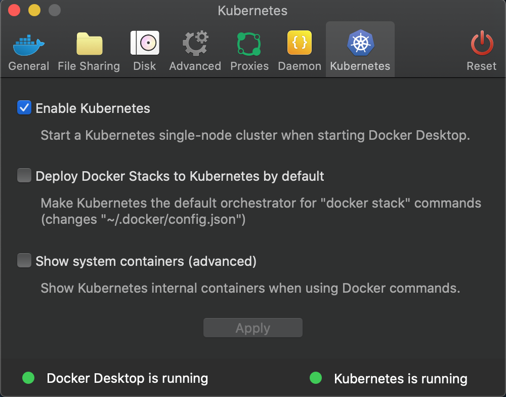

Kubernetes ingress resources provide a way of configuring incoming HTTP traffic, and make it easy to expose multiple services through a single public IP address.

NGINX has long provided one of the most popular ingress controllers, but anything more than a proof of concept application deployment inevitably meant customizing routing rules beyond the standard properties exposed by ingress resources.

Until recently the solution was to define these additional settings settings via annotations or providing configuration blocks in configmaps. But with version 1.5 the NGINX ingress controller provides two custom resource definitions (CRDs) defining more complex networking rules than the baseline ingress resources.

In this post we'll explore the new functionality provided by the `VirtualServer` and `VirtualServerRoute` CRDs.

## The sample cluster

For this blog I've used the Kubernetes distribution bundled with Docker Desktop.



 with the sample application created for the [Istio blog series](https://octopus.com/blog/istio/the-sample-application) which can be installed with:

```
kubectl apply -f https://raw.githubusercontent.com/mcasperson/NodejsProxy/master/kubernetes/example.yaml
```

I've used Helm to install NGINX, but it is not as easy as it could be. The [GitHub docs](https://github.com/nginxinc/kubernetes-ingress/tree/master/deployments/helm-chart#installing-via-helm-repository) point you to the Helm repo at https://helm.nginx.com/edge, which failed for me. The chart from the official Helm repoistory at https://kubernetes-charts.storage.googleapis.com/ did not include the CRDs.
s
The solution was to clone the NGINX Git repo and install the Helm chart from a local file. These commands worked with Helm 3:

```
git clone https://github.com/nginxinc/kubernetes-ingress/
cd kubernetes-ingress/deployments/helm-chart
helm install nginx-release .
```

## A basic VirtualServer

```YAML
apiVersion: k8s.nginx.org/v1
kind: VirtualServer
metadata:
  name: webserver
spec:
  host: localhost
  upstreams:
  - name: webserver
    service: webserver
    port: 80
  routes:
  - path: /
    action:
      pass: webserver
```
