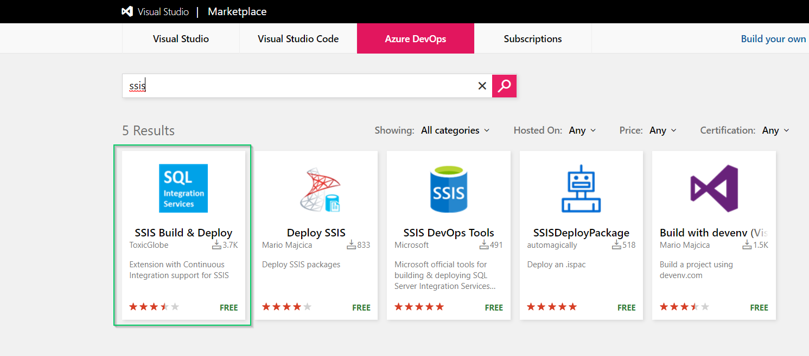
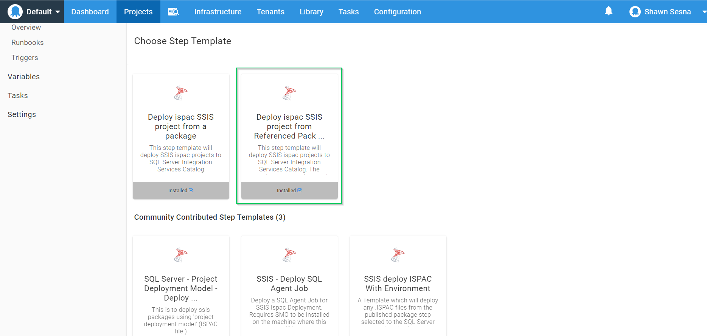

When you think of automating application deployments, what usually comes to mind is automating the deployment web code, containers, and or database.  In this series, I'll demonstrate how to automate supporiting components such as SQL Server Integration Services (SSIS) packages and SQL Server Reporting Services (SSRS) reports.

Extract Transform and Load (ETL) processes are typically deployed by a Database Administrator (DBA) or an Integrations specialist.  In lower level environments, it's not unusual to allow developers to deploy directly to the SSIS server, but when it comes to higher level, such as Production, they're usually done manually.  The DBAs sometimes have scripts they can run to deploy, but it's usually not included in the same tooling as automated application deployments.  With Octopus Deploy, it is possible to add your ETL deployments to your deployment stack!

## Building the SSIS package
To include our SSIS package in the deployment process, we first need to build the project to produce the artifact for deployment.  None of the popular build servers are able to build SSIS out of the box and will require some configuration.  The steps will be roughly the same.

:::hint
Your SSIS project **must** be in the Project Deployment Model, the Package Deployment Model will not work with this solution.
:::

### Configuring the build agent
MSBuild does not know how to build SSIS project types.  In order to perform a build, we'll need to do some configuration to the buil agent(s).

#### Visual Studio
To build SSIS projects, we will need to install Visual Studio on our build agent(s).  The Community edition of Visual Studio should be enough.

:::warning
Consult the EULA of the Community edition to make sure it is OK to use for you or your organization.
:::

#### SQL Server Data Tools
Once we have Visual Studio on our build agent(s), we need to install an extension called SQL Server Data Tools (SSDT).  When that has been installed, our build agent(s) should now have the ability to build .dtsproj projects!

### Build SSIS task
Out-of-the-box, most if not all build servers do not have a task to build SSIS by default.  This will require us to install or configure custom task to perform the build.

#### Azure Devops/Team Foundation Server
The Marketplace for Azure DevOps (ADO) or Team Foundation Server (TFS) has several tasks that the community has created.  If you're using ADO/TFS, I would suggest using this one:

#### TeamCity
TeamCity doesn't have a plugin available to perform the build.  Pavel Hofman has a great [blog post](https://blog.codetitans.pl/post/howto-setup-ssis-project-to-build-via-teamcity/) on how to configure building SSIS projects on TeamCity.

#### Jenkins
Similar to TeamCity, Jenkins does not have any plugins available to perform a Visual Studio build.  However, performing similar steps to the TeamCity solution should yield the same results.

### Packaging the artifact
Once the SSIS project has been built, it will produce an .ispac file, which contains the necessary components for deployent.  .ispac isn't a standard archive like .zip or .nupkg, so we'll need to have an additional step that packages it up to a supported format.  For ADO, TeamCity, and Jenkins, Octopus Deploy has plugins (extensions in the case of ADO), that contains steps that can do this.

### Pushing the artifact to a repository
Once the .ispac file has been created, we need to package it up and send it to a repository, such as:

- Octopus Deploy built-in repository
- Artifactory
- Nexus
- ADO/TFS repository

## Octopus Deploy
Now that we have the package ready, we can create and configure out Octopus Deploy project!

### Create the project
To create our project, click on Projects and **ADD PROJECT**

#### Add deployment step
The only step templates for deploying SSIS packages are in the Community Step Library.  Click on **ADD STEP**

Filtering by SSIS will show the available SSIS step templates available.  For this demonstration, I'll be using `Deploy ispac SSIS project from Referenced Package`.  This template will allow us to depoy using a Worker instead of having to install an agent on the SSIS server.

