Collecting and storing data are often the main functions of web applications.  The collected data needs to be analyzed and shown in graphical format to help make decisions.  This usually takes the form of a report.  In this part of my series, I will demonstrate how to include SQL Server Reporting Services (SSRS) reports using Octopus Deploy.

## Building the project
As of Visual Studio 2017, MSBuild can build .rtpproj files.  Projects that are created in older versions of Visual Studio will need to configure the build agents similar to my [SSIS post](the url) in order to build the project.

### Adding the build task
To build an SSRS project, simply add any MSBuild type task to your build definition.  For my build definition, I chose a Visual Studio build task, which invokes MSBuild.

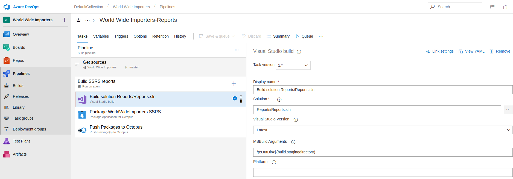

### Packing the artifacts
When the SSRS project is built, it places the built reports into the `bin` folder.  In this case, they are in `Reports/Reports/bin/release`  We'll need to package these reports into either a .zip or a .nupkg for deployment.  For this post, we'll choose the .nupkg format.

### Pushing the artifacts
Now that we have the artifacts all packaged up, we can push them to our Octopus Deploy server.

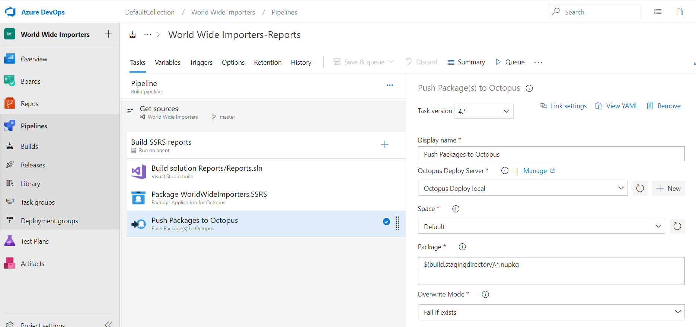

And that's all we need for our build definition!

## Octopus Deploy
Now that we have the our artifacts in Octopus Deploy, we can create our project for deployment

### Creating the project
Click on Projects, then **ADD PROJECT**

### Deploying the package
The first step in our process is to deploy the package to the SSRS server. Click **ADD STEP** 

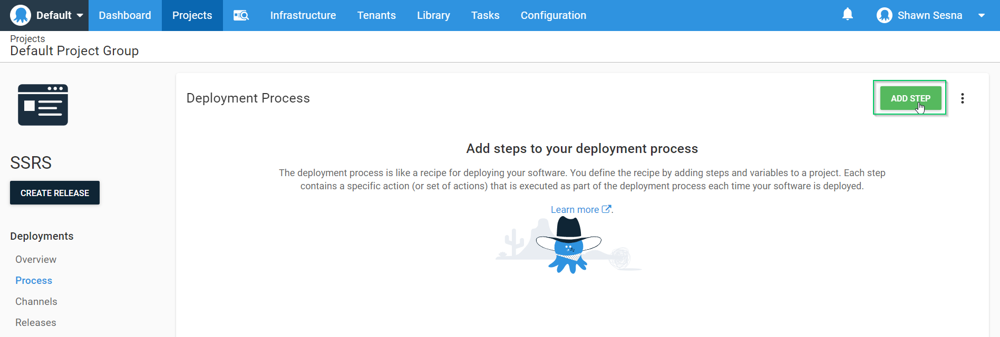

and add a Deploy a Package step and select the package we pushed to the Octopus Server.

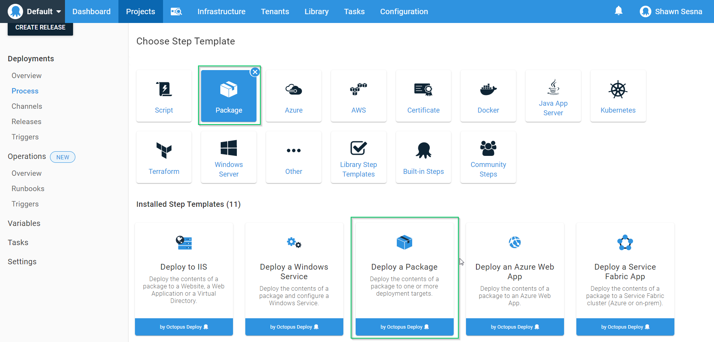

Once the step has been added, fill in the textboxes

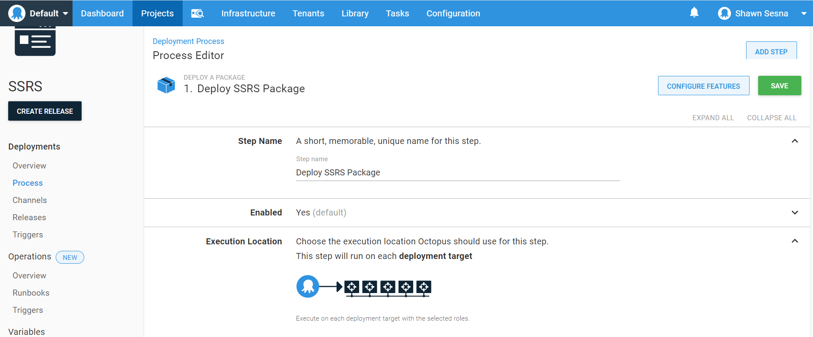
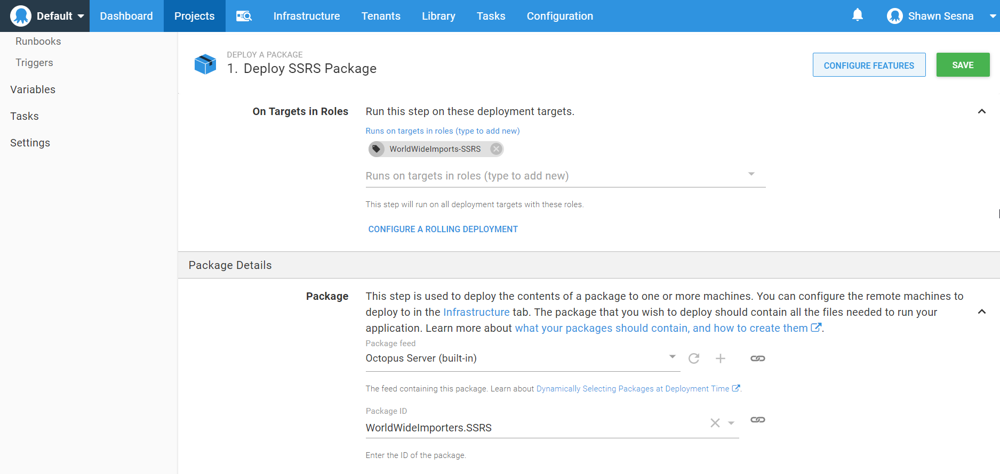

### Adding the SSRS step
To deploy SSRS reports, we'll be adding a Community Step template.  Filter steps by SSRS and select Deploy SSRS Reports from a package step

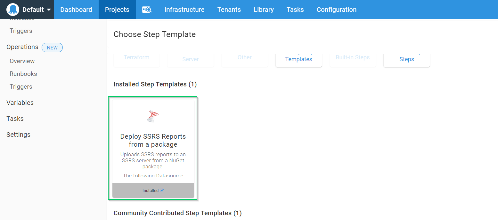

This step needs to execute on the same target that the package was deployed, for the Execution Location, choose Deployment Target and fill in the same role you chose for the Deploy a package step

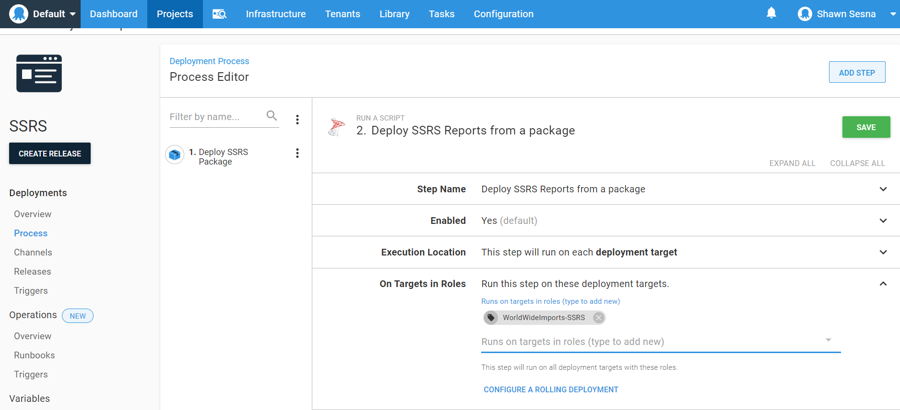

Fill in the values for the step

- SSRS Package Step: This is the Deploy a Package step we created previously.

- Url of SSRS Server service:  This is the Url of the Report Service web service.  For example, http://servername/ReportServer/reportservice2010.asmx?wsdl

- Report Execution Url:  This is the url of the Report Execution web service.  For example, http://servername/ReportServer/ReportExecution2005.asmx?wsdl

- Report Folder: Relative path to the folder where the reports will be deployed.  For example, /MyFolder

- Report data source folder: Relative path to the folder where the datasources will be deployed.  For example /MyFolder/MyDataSources

- Overwrite Datasources: Check this if you want to overwrite the datasources when deploying

:::hint
To specify the datasource details, you need to create Octopus Deploy variables that match the datasource to overwrite.  The following properties can be overridden:

- ConnectionString
- Username
- Password

For example, if the name of the datasource is MyDatasource, the variables would be:

- MyDatasource.ConnectionString
- MyDatasource.Username
- MyDatasource.Password

If the username and password are for a domain account, you'll need to create an additional variable called MyDatasource.WindowsCredentials with a value of True
:::

- Backup Location (optional):  Location on the Deployment Target to back up reports before overwriting them.

- DataSet Folder (optional):  Relative path to the folder where Shared DataSets will be deployed.  For example /MyFolder/MyDatasets

- Report Parts Folder (optional): Relative path to the folder where Report Parts will be deployed.  For example /MyFolder/MyReportParts

- Service Domain (optional):  Domain name of account to use when deploying.

- Service Username (optional):  Username of the account to use when deploying.

- Service Password (optional:)  Password for the user to use when deploying.

- Clear the report folder: Check this box if you want to delete reports from the target folder prior to deployment

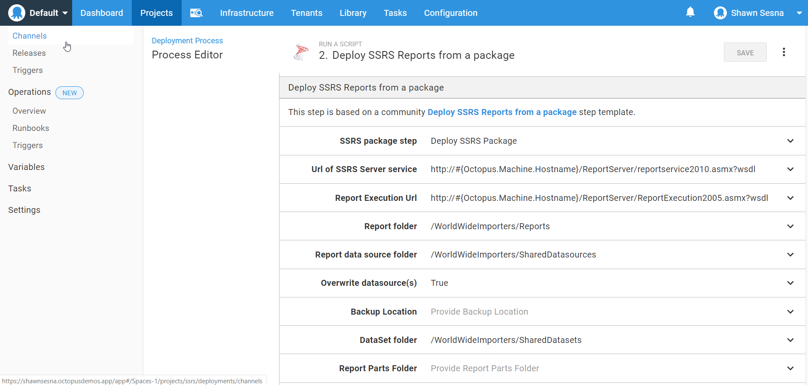

That's all for the steps!  We're now ready to deploy!

## Deploy the reports
With our process complete, let's deploy 'em!  Click **CREATE RELEASE**

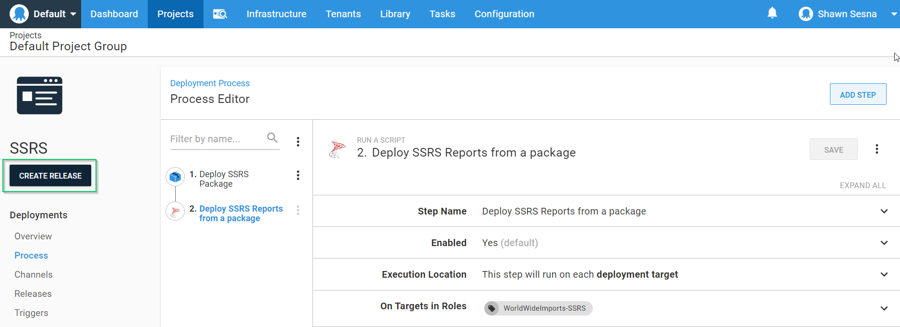

After you click **SAVE**, choose the deployment environment

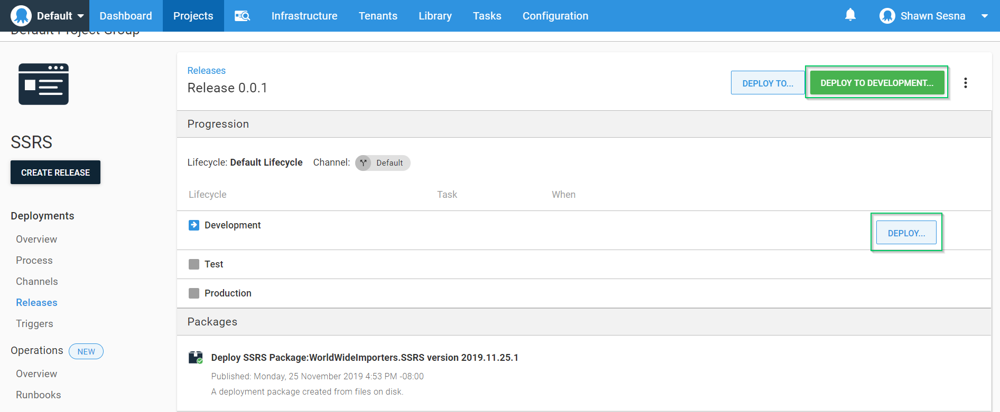

Click **DEPLOY** and let 'er rip!

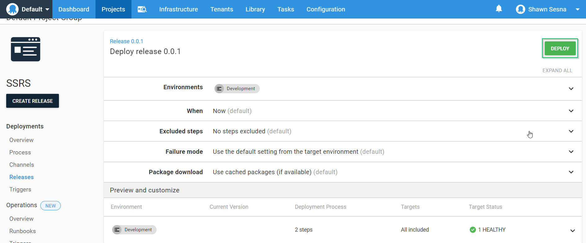

Once the deployment is complete, it should look like this

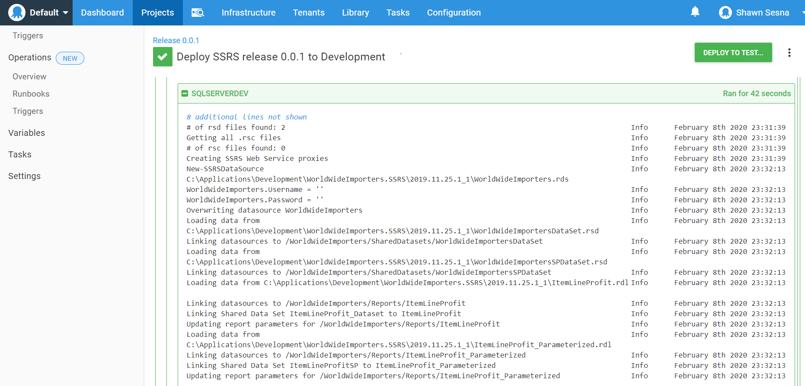

## Conclusion
In this post, I demonstrated how easy it is to deploy SSRS reports using Octopus Deploy :)  Happy Deployments!